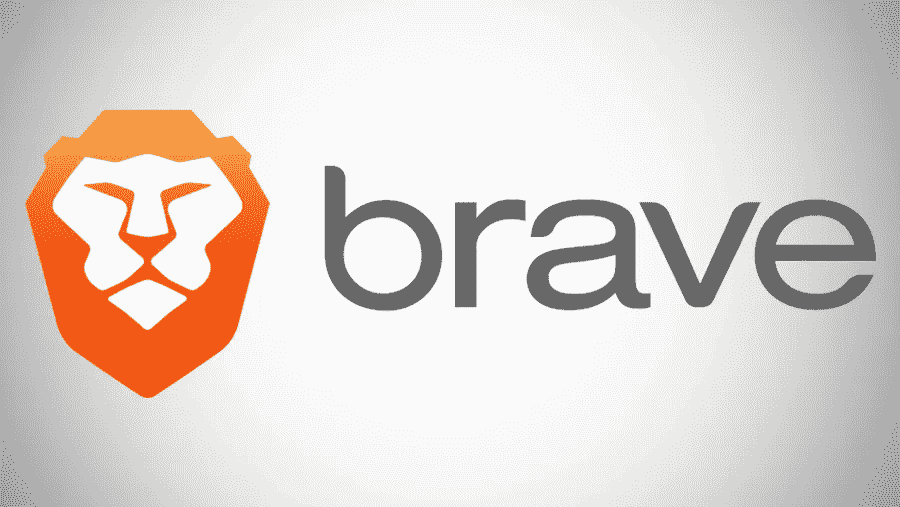
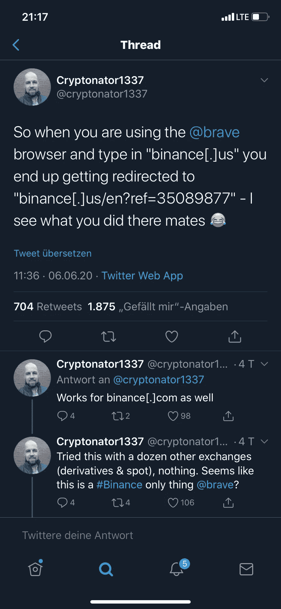
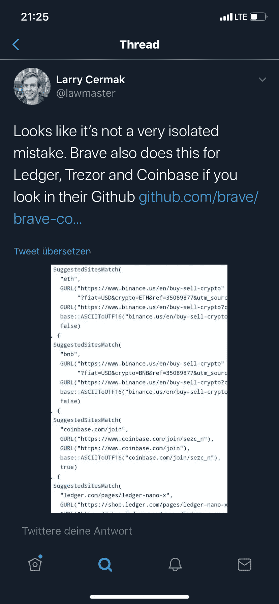

# Brave 从他的用户那里秘密获利——对 BAT 课程的影响？

> 原文：<https://medium.datadriveninvestor.com/brave-earns-secretly-from-his-users-impact-on-the-bat-course-e329f810c5ea?source=collection_archive---------3----------------------->

Brave (BAT)可能是浏览器最成功的新来者之一。该公司关注用户的隐私。几天前，突然发生了一个大丑闻，一些用户发现，Brave 在搜索已知的股票交易所和其他与密码相关的服务(例如，金融，账本等)时，会自动将链接添加到自己的合作伙伴链接中。).因此，Brave 为每个最终通过搜索平台注册并在那里兑换货币的用户收取佣金。

让我们快速看一下发生了什么，以及 Brave 如何回应来自社区的批评。

 [## 使用谷歌搜索趋势预测首次申请失业救济人数|数据驱动的投资者

### 几年来，我的重点一直是使用多种替代数据来预测宏观经济统计数据…

www.datadriveninvestor.com](https://www.datadriveninvestor.com/2020/03/25/using-google-search-trends-to-predict-initial-jobless-claims/) 

# 勇敢的浏览器从它的用户那里偷偷赚钱

这一丑闻第一次被一名 Twitter 用户引爆，他注意到 Brave 在搜索“Binance.us”时，在下拉菜单的第一个建议中添加了一个合作伙伴链接。

这条推文引发了一场真正的风暴，因为其他用户开始意识到并注意到，这种与 Brave 合作伙伴链接的自动完成不仅仅限于“binance.us”，还用于莱杰、特雷佐、比特币基地和 Co

# 勇敢的 CEO 回应批评

勇敢队当然已经对此作出反应，并为他们的行为向社区道歉。Brave 首席执行官 Brendan Eich 对这种情况评论如下:

> 我们犯了一个错误，我们正在纠正它:Brave 将合作伙伴代码添加到地址栏中“http://binance.us”的文字条目中。我们是币安的合作伙伴，我们通过可选的交易部件将用户重定向到一个新的标签页，但自动完成不应添加任何代码。

勇敢的道歉是必要的，但没有达到预期的效果。许多用户已经公开反对这款浏览器，并呼吁抵制。他们认为这是对诚实用户的系统性欺诈。该团队报告说，这个问题已经在 Github 及其所有版本的开源代码中得到修复，包括新的桌面版本 1.9.80。从字面上看，工具栏“在自动完成建议中显示行为良好的页面”现在默认设置为“关闭”。

Brave 团队强调，这种情况不会对用户的隐私构成威胁，因为没有向合作伙伴发送关于他们身份的信息。只有勇敢者本人被伙伴机制确认。

# 社区想要一把叉子

尽管如此，这个问题已经导致用户想要分叉更勇敢的浏览器，完全没有广告也没有 BAT 令牌。他们希望利用这个机会为用户提供一个真正的开源浏览器，而不是由任何盈利公司运营的。该项目由捐款资助，不会暗示任何“与商业相关的特征”。据它的开发者称，它将只是“一个很好的保护隐私的开源浏览器”。

几天之内，这个名为“更勇敢的浏览器”的新项目在 Github 上吸引了 84 名贡献者，在 Twitter 上吸引了 450 多名关注者。

但是蝙蝠球场并没有因此而被吓倒，在最后的日子里收获颇丰。显然大多数人对事实不感兴趣。

我们很好奇，在接下来的几天和几周内，围绕勇敢浏览器的局势是否能够平静下来，以及新的开源浏览器是否真的会受到欢迎。在加密领域，事情仍然令人兴奋。我们会在这里让你了解最新情况。敬请关注。

BAT 球场会对丑闻有什么反应吗？叉子经得起勇敢吗？

我在每月一期的 [**简讯中分享了更多私密的想法，你可以在这里**](https://mailchi.mp/bf8f8e8ed697/keep-in-touch-with-lukas) 查看。请在评论中告诉我，并在各种社交媒体平台上加入我:

[**推特**](https://twitter.com/WiesfleckerL)●[**insta gram**](https://www.instagram.com/lukaswiesflecker/)●[**脸书**](https://www.facebook.com/lukaswiesfleckerr)●[**Snapchat**](https://www.snapchat.com/add/luggooo)**●[**LinkedIn**](https://www.linkedin.com/in/lukas-wiesflecker-1b11251a5/)**

**无论你做什么，都要带着爱和激情去做！**