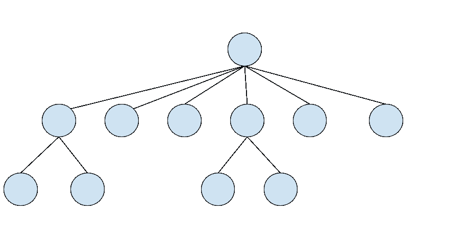
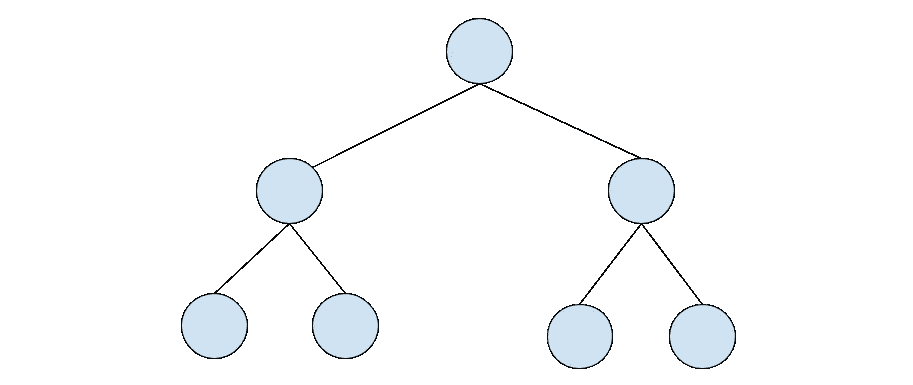
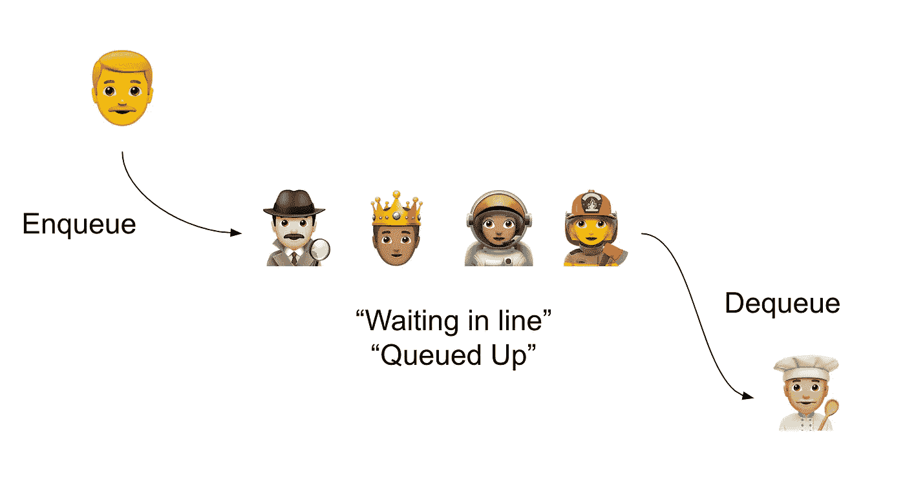

# 面包先放在树上

> 原文：<https://medium.datadriveninvestor.com/bread-first-that-tree-988bf71f9279?source=collection_archive---------26----------------------->

## 在树中搜索兄弟姐妹

Breadth First Search is an important part of a programmer’s arsenal.

## 这是怎么回事？

计算机科学的好学生可能已经知道这一点；但是树是一种组织信息的方式。在计算机科学中，这是一种非常有效的存储数据以便以后快速检索的方法。

## 什么是树？

在这种情况下，我们指的是由从其他节点继承的节点组成的数据结构，称为“父节点”因此，高于另一个节点的每个节点都是“父节点”，低于另一个节点的每个节点都是“子节点”

## 二叉树

名字说明了它是什么。二叉树是一种每两棵树最多有两个子树的树。

## 二叉查找树

这就是我们具体的地方。我们现在给出了一个条件，根据节点的值来确定节点是成为“左”子节点还是“右”子节点，而不仅仅是限制每个节点的子节点数量。

如果该值小于父节点的值，则它成为该父节点的左节点。

如果该值大于父节点的值，则它成为该父节点的右节点。

结果使查找特定值变得容易，只需遍历树即可。

# 搜索树

搜索树只是简单地遍历每个节点，将每个值与指定的值(精确搜索)或条件(模糊搜索)进行比较。

## 为什么我们需要树的？

树代表有组织的信息。它们存在于日常生活的方方面面，从你电脑上的文件系统到你现在正在阅读的网页(文档对象模型，又名 DOM)。

## 但是什么是广度优先搜索呢？

有不同的方法来搜索二分搜索法树。您可以上下搜索(宽度优先)、上下搜索(深度优先)，然后以不同的顺序反复搜索(从不同的一侧开始，等等)。

不同的方法产生不同的顺序，遍历每个节点的顺序不同，这取决于您的目标是什么(如果您知道您正在搜索的文件是新的，并且所有较新的文件都在较新的节点(也称为目录)中，深度优先是有用的)。

无论您选择哪种方法，它们都需要使用队列。

## 什么是队列？

这基本上是在你最喜欢的主题公园、电影院、签售会、车管所、超市或其他服务中为你最喜欢的乘车排队，要求你站在比你先到的每个人后面，一个接一个地等到每个人都到了队伍的前面。

## 队列如何帮助遍历

1.  您可以从定义一个新队列开始
2.  将根节点(第一个顶部节点)添加到队列中。
3.  定义一个数组来跟踪每个节点，这样您就可以返回它来查看您遍历的顺序。或许称之为“拜访”或“穿越”
4.  将根从队列中“出列”,并将其保存到一个变量中，这个变量可能叫做 currentNode。
5.  将 currentNode 的值添加到数组。
6.  添加当前节点的子节点。因为这是二进制的，只有两个，所以只有两个条件:“左”和“右”如果存在，将它们添加到队列中。
7.  现在让我们在队列中有项目时进行循环。接下来，随着我们的继续，我们将向队列中添加节点(如果它们存在的话),同时不断地将最旧的项出队，将其保存到 currentNode，将其添加到‘visited’数组，并将任何子节点添加到队列中。一旦我们到达树的末端，循环就会结束。
8.  现在，返回“已访问”数组，以获得按顺序访问过的节点的完整列表。

# 这是广度优先搜索

上面的伪代码是如何进行广度优先搜索的。当然，总有更好的方法去做一件事。不同的语言可能会提供内置的方法，使得上述内容变得不必要和琐碎。了解“如何做”和“为什么做”很重要，因为当数据变大时，这些内置方法可能会变成障碍。

如果你能创建自己的方法，那么你就能微调你的代码，使之更快更精简。