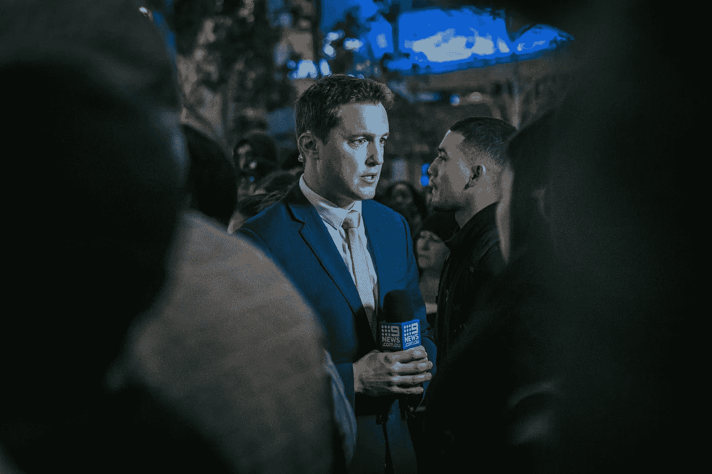

# 突发新闻:记者也想要关系

> 原文：<https://medium.datadriveninvestor.com/breaking-news-journalists-want-relationships-too-2288ebb9e22a?source=collection_archive---------17----------------------->

## Twitter 可以支持社交和数字公关策略

Photo by Fred Kearney on Unsplash

成立十多年后，Twitter 已经成为全世界新闻媒体和有影响力人士的主要社交媒体渠道。公共关系专业人士也很早就加入进来，以跟上并保持领先地位。

[莎拉·伊文斯](https://twitter.com/prsarahevans/)带领着一群追兵。Sevans Strategy 和 Sevans Digital PR 的创始人，她是数字公关策略师、顾问、全球品牌通讯员和主题演讲人。Evans 与世界各地的公司合作，创建和改进他们的社交和数字公关策略。

公共关系与市场营销密切相关，这也是 [Madalyn Sklar](https://twitter.com/MadalynSklar) 的核心所在。这位在线数字专家——特别是在 Twitter 上——与埃文斯和社交媒体管理公司的尼克·马丁一起谈论了推文如何在公关中发挥作用。

 [## 公司的成功取决于公关…不管他们是否知道这一点

### 公共关系专家传播商业信息

medium.datadriveninvestor.com](/companies-success-depends-on-pr-whether-they-know-it-or-not-bc160bb5eb3a) 

列表将会在 Twitter 未被充分利用的功能列表的顶端。

“它们提供了丰富的信息，”埃文斯说。"你可以找到或创建可信的、高度精确的名单."

她提到了 Twitter 列表的这些好处:

*   目标 Twitter 广告的逗号分隔值
*   TweetDeck 类型工具中的监视器
*   你推销的团体记者
*   您企业的员工名录

埃文斯最喜欢的另一个 Twitter 功能是高级搜索。

“如果你使用 Twitter 来建立你的公关努力，遵循并修改可能对你有益的术语，”她说。在她的例子中，她搜索诸如#source、#media、#news 和# journorequest 这样的标签。

埃文斯最好的参考之一是 Twitter 商业文章， [*“如何:Twitter 上的高级搜索”*](https://business.twitter.com/en/blog/how-to-advanced-search-on-twitter.html)

Sklar 还汇编了一份 Twitter 未被充分利用的功能列表——Media Studio、Twitter threads、Twitter Moments 和 lists——每一项都有一篇文章详细介绍:

*   [*利用鲜为人知的 Twitter 媒体工作室来改善你的视频营销*](https://madalynsklar.com/2019/07/twitter-media-studio-video-marketing/)
*   [如何使用 Twitter 线程](https://madalynsklar.com/2019/06/how-to-use-twitter-threads/)
*   [*为什么推特时刻有益于你的品牌以及使用它的 6 种简单方法*](https://madalynsklar.com/2019/03/twitter-moments/)
*   推特列表的终极指南:它们是什么，为什么它们是有益的，以及如何使用它们

# **至关重要的日历**

让新闻媒体和其他地方保持头脑清醒的一个方法是安排推特。关键因素是不要发送垃圾邮件，并准备好响应约定。

“用内容日历来计划你的推文，”马丁说。“社交媒体内容日历就像是让整理专家玛丽·近藤来管理你的社交策略。它能让你有条不紊，并能以 10 倍的速度收回设置时间。

“否则，一定要把你的推文安排在正确的时间，当你的观众在线并且可以看到你的推文的时候，”他说。"你的推特分析会告诉你什么时候你的听众有空."

有关日程安排的更多信息，请参阅 Hootsuite 的文章， [*“如何创建社交媒体内容日历:技巧和模板”*](https://blog.hootsuite.com/how-to-create-a-social-media-content-calendar/)

 [## 生动的内容日历让你的每一天都过得很好

### 灵活的计划可以让你腾出时间来提高工作效率

medium.datadriveninvestor.com](/a-lively-content-calendar-lets-your-days-work-out-right-644a006734c9) 

为了帮助增加媒体曝光率，Twitter 上专门的媒体列表将让你跟踪谁在说什么，这样你就可以在适当的时候投入你的专业知识。

“我们使用的最重要的策略之一是为我们推介的每个故事或垂直领域建立一个 Twitter 列表，”埃文斯说。“我监控他们分享的内容——推销个性化——源请求——快速响应——或一般机会。

“我越能以一种不自私的方式与记者联系，关系就越牢固，”她说。“在我所有的互动中，我努力实践*仆人式领导*和*亲切支持*。”

Sklar 认为 Twitter 列表是“帮助你倾听你想参与的对话的最佳功能之一。”

# **期待“是”之前的“否”**

有效的媒体关系来自于所有常见的参与规则:积极主动、值得信赖、随时可用。当你建立了信誉，你在媒体眼中就成了一种资源。

埃文斯说:“与媒体建立关系就像其他任何关系一样。“你必须记住，他们是在最后期限前，讲述一个不带偏见的故事，而不是你的公关团队的延伸，可能会在同意之前多次说不。”

这些是她最喜欢使用 Twitter 来识别和建立与媒体关系的方式:

*   给他们发送消息来源，即使不是你或你的客户。
*   记住头衔或工作背后的*人*。
*   关注他们，互动并分享他们的故事。
*   找到合适的人。

 [## 社会公共关系:称之为因果报应

### 网络和社交技术构建了商业社区

medium.datadriveninvestor.com](/social-public-relations-call-it-karma-1f21101ddfe5) 

不要成为垃圾邮件发送者，也不要向媒体发送垃圾邮件。不要把每一件小事都看得和皇室婚礼一样重要。在你的领域成为一个可信的来源，通过给出价值和观点来赢得尊重。

“在 Twitter 上与媒体人员互动的最佳实践包括[了解他们的角色](https://www.quora.com/What-are-the-different-positions-at-a-newspaper-like-the-Times-or-WSJ-and-what-role-does-each-play-in-producing-a-news-story)，”Evans 说。“寻找*分配台编辑* ⁣and *人才预订员*而不是不属于‘来源’或‘客人’流程的人。

她说:“在媒体过程中自学不仅对你有益，还能让你找到合适的人来推销和联系。”"电视、印刷和数字的层级和工作流程可能有所不同."

Twitter 是公共关系战略的一个关键组成部分，但不是整个战略。去你的目标受众所在的地方，这可能不会一直是 Twitter。

埃文斯说，这就是为什么 Twitter 对于一个品牌的公关策略至关重要:

*   放大和分布
*   客户服务
*   神话和谣言管理
*   约会
*   媒体关系
*   关键利益相关者关系

# **植物种子**

“一个品牌的 Twitter 公关策略会定期改变和发展，”埃文斯说。“关于媒体，如果你正在推销一个故事，你可以在伸出手之前，用超针对性的 Twitter 广告*播种可见性。*

“一旦故事播出，通过付费广告活动扩大和推动流量，”她说。

 [## 视频触及潜在客户，赢得您的业务

### Twitter 视频应该成为社交媒体战略的核心部分

medium.datadriveninvestor.com](/video-reaches-out-to-fans-for-your-business-90fcd7c5465d) 

Twitter 视频是最新、最受关注的在线工具。

“这是一种将你的品牌与公众联系起来的惊人方式，”Sklar 说。“Twitter 视频是使用最少的功能之一，但却是脱颖而出的最佳方式之一。你可以在推特上发布一个长达 2 分 20 秒的视频。

“有了 Media Studio，你可以上传视频和添加元数据，包括行动号召链接，”她说。

Evans 提到了一个来自 Promo.com[的中小企业](https://twitter.com/Promodotcom/)[视频研究](https://www.sevanspr.com/practical-tactical/study-how-smbs-use-video-marketing)来看看人们是如何创作、使用和分享视频的。她补充了这些有趣的事实:

*   Twitter [的视频广告比每次参与的费用便宜 50%](https://business.twitter.com/en/resources/agency-playbook.html?utm_medium=organic&utm_source=twitter)。
*   人们每天在 Twitter 上观看 20 亿个视频。
*   观看视频是人们使用 Twitter 的第三个原因。

# **寻找思想上的巅峰**

使用社交倾听——方便地通过 Twitter 列表——来查看谁说了什么，更重要的是，谁被引用了。通过实践，你会发现媒体思想领袖。

Sklar 说:“去你所在行业的顶级 Twitter 账户看看他们的 Twitter 列表。”"你可以在那里找到金矿。"

埃文斯指出，识别一个行业中的顶级媒体人员的方法是阅读、关注和使用手机提醒。

“我阅读了各大杂志上的大量新闻文章，”她说。“一旦我发现相关记者，我会做以下两件事之一:将他们添加到 Twitter 列表或手机提醒中。

“我也定期分享紧急的媒体询问和机会，为几家媒体提供支持，”埃文斯说。“不要只找记者，也要找公关、传播者和其他人作为故事的来源。我也分享演讲机会等等。”

 [## 清单让你的约定有目标

### Twitter 列表帮助企业家发展他们的业务

blog.markgrowth.com](https://blog.markgrowth.com/lists-keep-your-engagements-on-target-75945de7281) 

企业可以使用每个人都应该使用的可靠方法来管理他们的社交媒体沟通:列表、标签、参与——特别是回应而不是一直广播。

“我是一个工具狂热者，”埃文斯说。“我甚至专门为公关和数字媒体工具创建了一个名为[# UltimateDigitalPRToolkit](https://www.producthunt.com/posts/ultimate-pr-toolkit-and-bookmark)的资源。”

她列出的管理社交媒体沟通的工具包括[涡轮实验室](https://twitter.com/TurbineLabs/)、[垃圾架](https://twitter.com/muckrack/)、 [Agorapulse](https://twitter.com/Agorapulse/) 、[最近](https://twitter.com/trylately/)、 [Google Drive](https://twitter.com/googledrive/) 和 [Smartsheet](https://twitter.com/Smartsheet/) 。

除此之外，Sklar 还增加了她的备用工具: [Buffer](https://twitter.com/buffer) ，Hootsuite 和 [Social Jukebox](https://twitter.com/SocialJukebox) 。

**关于作者**

吉姆·卡扎曼是拉戈金融服务公司的经理，曾在空军和联邦政府的公共事务部门工作。你可以在[推特](https://twitter.com/JKatzaman)、[脸书](https://www.facebook.com/jim.katzaman)和 [LinkedIn](https://www.linkedin.com/in/jim-katzaman-33641b21/) 上和他联系。