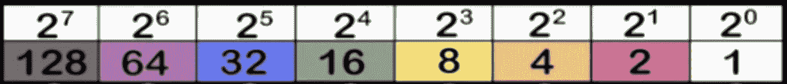
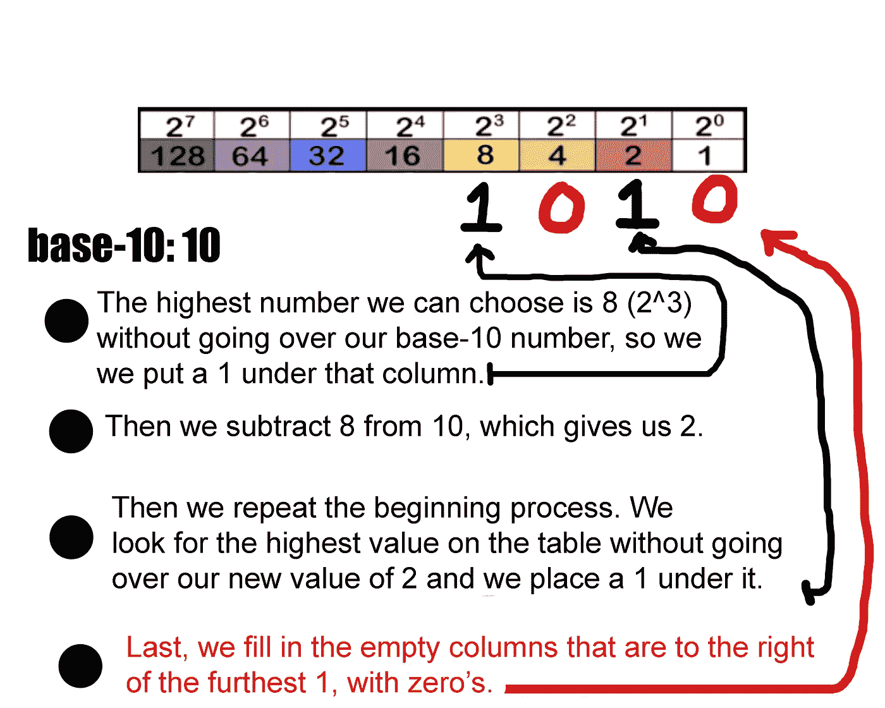
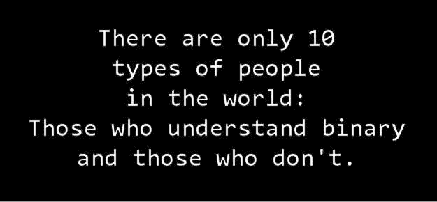

# 破解密码:二进制数

> 原文：<https://medium.datadriveninvestor.com/breaking-the-code-binary-numbers-575f4462845f?source=collection_archive---------6----------------------->

## 第一部分

作为一个孩子，我记得我总是对代码着迷。我说的不是编程*(它最终让我走上了那条人生之路)*，我说的是秘密信息。你还记得曾经给朋友或兄弟姐妹写了一条信息，然后让他们解码，以便他们可以阅读吗？这是我一直认为很有趣的事情，现在仍然如此！

当我刚开始在大学编程时，我上了一堂编程入门课，想看看这是否是我喜欢的东西。剧透警报，我做到了！我提到这一点是因为我们首先了解的是二进制。现在，起初我被它吓坏了，就像我的许多同学一样。这些 1 和 0 是什么？它们是什么意思？你怎么知道价值观？首先让我解释一下什么是二进制。

二进制是一种以 2 为基数的数字系统，只使用 0 和 1。计算机以二进制运行，这意味着它们只使用这两位数字来存储数据和执行计算。我们(人类)使用以 10 为基数的数字系统，这意味着我们使用 0-9 的值来代表我们需要的任何数字。在我看来，将二进制数相加甚至比十进制数相加更容易，因为你只需要处理两个数。

让我们看看如何用二进制表示十进制数。

Binary table

上面这张照片是我做的一个二元表，帮我解释这个话题。最上面一行代表基数为 2 的值。现在，我们将把 2 提升到 7 的次方。这些列中的每一列都被认为是所谓的位。8 位等于 1 个字节，正如您在我们的表中看到的，我们有一个字节的表示。

> 有趣的事实:如果你还不知道，2 的 0 次方是 1，大多数人认为它应该是 0。

第二行表示该特定列的值。所以黄色列的值是 8，因为 2 的 3 次方是 8 *((2 * 2 )* 2) = 8。*就像在我们的数字系统中，最高 1 右边的任何零都必须包括在内，但最高 1 左边的任何零都不是必要的。例如:如果我想用二进制形式表示值 8，我会写 **1000** 。我必须包括附加的零，以显示我的 1 离值 0 有多远。我也可以把值 8 写成这样 **00001000** ，但是这不是必需的，因为最高的 1 左边的任何值都被假定为 0。

好的，那么列下显示的值呢？如果我想用二进制形式表示数字 10 呢？轻松点。你所要做的就是找到最接近你的基数为 10 的数字的列，而不要去查看。然后，从彩色列值中减去基数为 10 的数字。得到结果后，你再次在表上寻找那个数字，重复这个过程。还在迷茫？没关系，我会告诉你。

Number 10 in the form of binary

请注意，当 1 在一个值(列)下面时，这意味着您想要表示或换句话说打开该值。当一列下面有一个零，这意味着你想忽略这个值。所以在上面的例子中，值 8 下有一个 1，值 2 下有一个 1。当你把数值 8 + 2 相加，你得到的是 10，这是我们想要用二进制表示的以 10 为基数的数。所以基数为 10: 10 等于基数为 2: 1010。

如果你仍然难以理解这个概念，请查看我制作的名为 **PowerUp** 的二进制游戏演示。它正处于最后阶段，将于 2021 年 iOS 夏季对任何有兴趣玩它的人开放。

Binary Game I created

下周我将向你展示如何用二进制写消息。一旦你理解了获取值的基本原理，你就能给其他懂二进制的人写秘密消息了！现在，我将留给你一些二元笑话以及一个秘密信息，下周我将帮助你解码！

# 秘密消息:

> 01010000 01110010 01101111 01100111 01110010 01100001 01101101 01101101 01100101 01110010 01110011 00100000 01010010 01101111 01100011 01101011