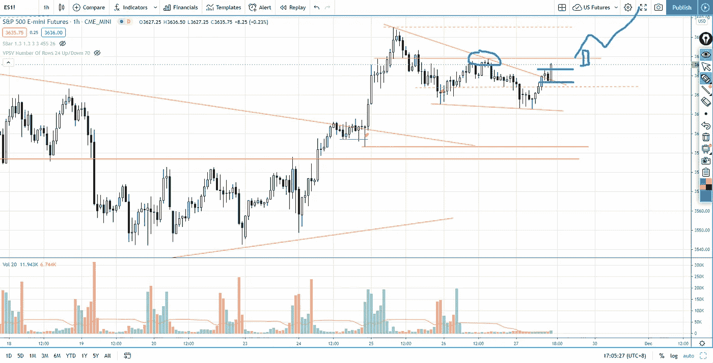
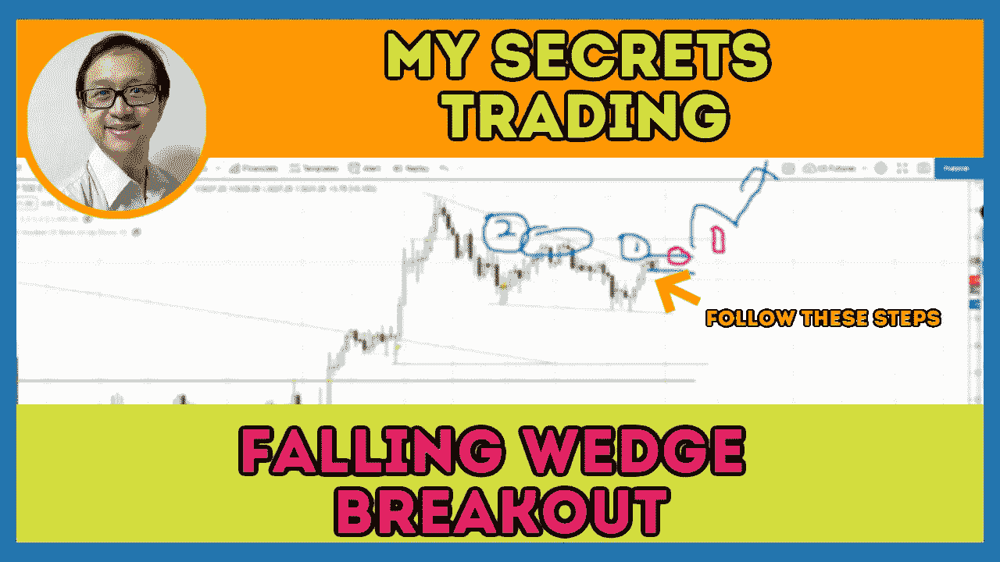

# 交易突破下跌的楔形形态，并得到确认(没人告诉你)

> 原文：<https://medium.datadriveninvestor.com/breakout-from-the-falling-wedge-to-test-all-time-high-s-p-500-day-trading-50361c31c091?source=collection_archive---------19----------------------->

标准普尔 500 期货(es)刚刚从下跌楔形形态中突破，你会发现如何确认这是否是一次成功的突破，以及如何相应地进行交易。

观看视频，了解 2020 年 11 月 27 日交易时段标准普尔 500 指数期货的**每日市场分析。在这个视频中，你将看到上一个交易日的市场回顾和三分钟的交易回顾(包括进场、出场和背后的原理)。展望未来，我将涵盖偏见，要注意的关键水平，我稍后的交易计划。**

## 时间戳

*   [1:27](https://www.youtube.com/watch?v=T-RQIkzG0ck&t=87s) 市场回顾
*   [3:28](https://www.youtube.com/watch?v=T-RQIkzG0ck&t=208s) 对称的三角形图案
*   [4:53](https://www.youtube.com/watch?v=T-RQIkzG0ck&t=293s) 行业回顾
*   [6:00](https://www.youtube.com/watch?v=T-RQIkzG0ck&t=360s) 供应增加的疲软迹象
*   [10:55](https://www.youtube.com/watch?v=T-RQIkzG0ck&t=655s) 当前股市展望
*   [12:30](https://www.youtube.com/watch?v=T-RQIkzG0ck&t=750s) 从下落楔形突破寻求确认

如果你还没有看我的[每日市场分析视频](https://www.youtube.com/watch?v=wJaXeby-gsw)，为了更好地了解市场回顾和交易回顾。

**偏向** —中性(日内交易)；看涨(长期)

**关键点位** —阻力:3640，3660；支持:3600，3587

**潜在设置** —在关键级别寻找潜在反转。

# 资源

**每周市场展望&最佳交易建议**直达您的收件箱:[https://www.tradeprecise.com/](https://www.tradeprecise.com/)

**职业免费**制图平台:创建账户→[www.TradingView.com](https://bit.ly/2U2Femd)

**非美国居民？** ( **、新加波**、澳洲、纽西兰、欧洲等……):[点击此处，存款 2000 新币](https://ji.hn/sgtiger)即可获得**免费股票(价值 100++ &美元)老虎经纪公司的欢迎礼物**

美国居民？[点击此处，当您存入 1500 美元](https://ji.hn/ustradeup)时，就有机会在 TradeUP 上获得一份**免费的 AMZN 股票(价值 3000++美元** ) & **欢迎礼物**

**无限制访问媒体文章** —加入以下:[https://priceactiontrading.medium.com/membership](https://priceactiontrading.medium.com/membership)

# 进一步阅读

 [## 凯西·伍德警告市场即将调整——标准普尔 500 价格走势分析

### 在 2020 年 12 月 18 日对彭博的采访中，方舟投资公司的首席执行官兼首席信息官凯西·伍德警告说…

medium.com](https://medium.com/datadriveninvestor/cathie-wood-warns-market-correction-soon-price-action-analysis-on-s-p-500-7e621e013310)  [## 从交易供应区获利的 3 个步骤——标准普尔 500 日交易

### 了解如何遵循这 3 个简单的步骤从供应区交易中获利(大多数交易者忽略了这些)。

medium.com](https://medium.com/datadriveninvestor/3-steps-to-profit-from-trading-supply-zone-s-p-500-day-trading-e7be0f6a3105)  [## 如何通过提前退出将损失降到最低——标准普尔 500 日交易

### 了解如何发现价格结构中的故障，并通过提前退出而不是完全退出来最小化损失

medium.com](https://medium.com/datadriveninvestor/how-to-minimize-losses-with-early-exit-s-p-500-day-trading-866dc487d4ec) 

Photo by Author — Ming Jong Tey

披露:如果您点击本文中的链接进行购买或开立账户，并将所需金额存入推荐的经纪人账户，我们将免费为您赚取佣金。

免责声明:本演示中的信息仅用于教育目的，不应作为投资建议。