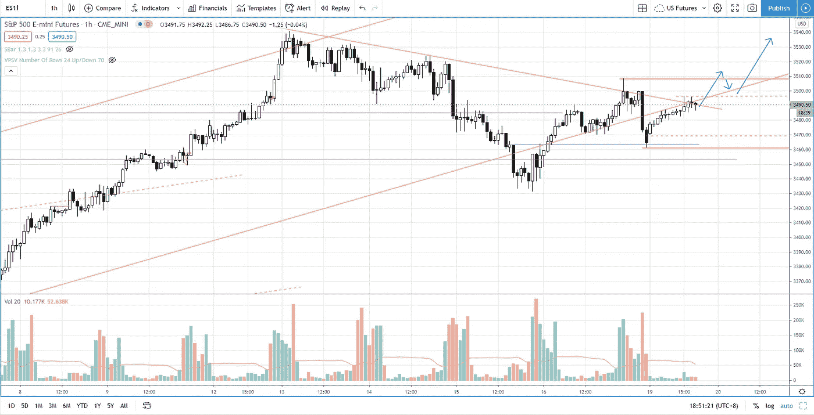

# 高胜率的突破回调反转交易系统(没人告诉你)

> 原文：<https://medium.datadriveninvestor.com/breakout-pullback-reversal-trading-s-p-500-day-trading-7ee75fe8a652?source=collection_archive---------12----------------------->

在交易回顾部分，通过这些简单的步骤，了解如何交易突破、回调和反转。

观看视频，了解 2020 年 10 月 19 日交易时段标准普尔 500 指数期货的**每日市场分析。在这个视频中，我向你展示了上一个交易日的市场回顾和三分钟内的交易回顾(包括进场、出场和背后的原理)。展望未来，我将涵盖偏见，要注意的关键水平，我稍后的交易计划。**

## 时间戳

*   [1:05](https://www.youtube.com/watch?v=lVUGo0d_vhQ&t=65s) 市场回顾
*   [4:15](https://www.youtube.com/watch?v=lVUGo0d_vhQ&t=255s) 贸易回顾
*   强势反弹突破的标志，回调后反转
*   避免第一次突破
*   [16:05](https://www.youtube.com/watch?v=lVUGo0d_vhQ&t=965s) 供应增加时的假突破
*   [17:00](https://www.youtube.com/watch?v=lVUGo0d_vhQ&t=1020s) 当前市场前景

如果你还没有看我在上一期的[每日市场分析视频](https://www.youtube.com/watch?v=dEnPN48VKZM)，以便更好地了解市场回顾和交易回顾。

**偏向** —中性(日内交易)；看涨(长期)

**关键点位** —阻力:3587，3540，3490–3500；支持:3460、3420–3430

**潜在设置** —在关键级别寻找潜在反转。

# 资源

**每周市场展望&最佳交易建议**直达您的收件箱:[https://www.tradeprecise.com/](https://www.tradeprecise.com/)

**职业免费**制图平台:创建账户→[www.TradingView.com](https://bit.ly/2U2Femd)

**非美国居民？** ( **、新加波**、澳洲、纽西兰、欧洲等……):[点击此处，存款 2000 新币](https://ji.hn/sgtiger)即可获得**免费股票(价值 100++ &美元)老虎经纪公司的欢迎礼物**

美国居民？[点击此处，当您存入 1500 美元](https://ji.hn/ustradeup)时，就有机会在 TradeUP 上获得一份**免费的 AMZN 股票(价值 3000++美元** ) & **欢迎礼物**

**无限制访问媒体文章** —加入以下:[https://priceactiontrading.medium.com/membership](https://priceactiontrading.medium.com/membership)

# 进一步阅读

 [## 被低估的高成长股——EVO、EMBRAC、FTCH、MWK、OPEN、SKLZ、UPST

### 2021 年第 2 周市场回顾

medium.com](https://medium.com/datadriveninvestor/underhyped-high-growth-stocks-evo-embrac-ftch-mwk-open-sklz-upst-5105abd20143)  [## 凯西·伍德警告市场即将调整——标准普尔 500 价格走势分析

### 在 2020 年 12 月 18 日对彭博的采访中，方舟投资公司的首席执行官兼首席信息官凯西·伍德警告说…

medium.com](https://medium.com/datadriveninvestor/cathie-wood-warns-market-correction-soon-price-action-analysis-on-s-p-500-7e621e013310)  [## 2021 年这些绿色能源股会涨 400%-1300%吗？

### 2021 年第 3 周市场回顾

medium.com](https://medium.com/datadriveninvestor/will-these-green-energy-stocks-gained-400-1300-in-2021-3f7288227c76) 

Photo by Author — Ming Jong Tey

Photo by Author — Ming Jong Tey

披露:如果您点击本文中的链接进行购买或开立账户，并将所需金额存入推荐的经纪人账户，我们将免费为您赚取佣金。

免责声明:本演示中的信息仅用于教育目的，不应作为投资建议。