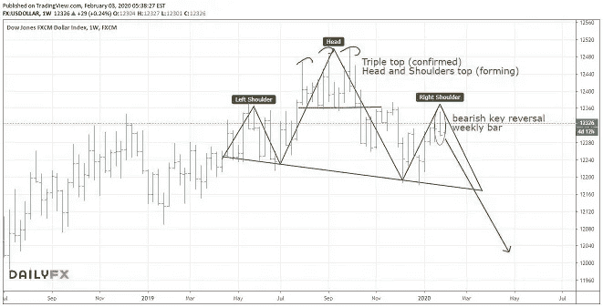
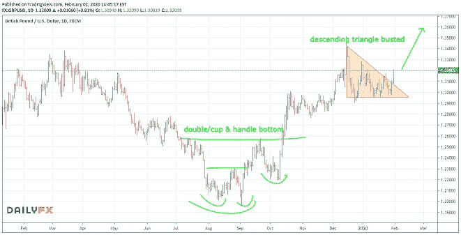

# 英镑的英国退出欧盟激增

> 原文：<https://medium.datadriveninvestor.com/brexit-surge-for-the-gbp-6894b49f8730?source=collection_archive---------28----------------------->

**本周交易周:*多头 GBPUSD***

从我本周最近的交易的快速更新开始:在我的[初始分析](http://mangrovetrading.com/upcoming-decline-in-oil-prices/)之后的几个星期里，石油价格，尤其是英国石油公司的股票，已经崩溃，英国石油公司损失了超过 10%的价值。上周的本周贸易，脸书，也下降了类似的数额…

上周，在英国完成退出欧盟后，英镑飙升。我们看到了对新西兰元和澳元的最大波动，在那里我有几笔交易获得了丰厚的利润。

有人问我，从英镑的强势中获利是否为时已晚，答案是否定的。事实上，英镑兑另一种货币——美元——的巨大机会可能正在出现。

 [## 2019 年即将改变世界的技术|数据驱动的投资者

### 很难想象一项技术会像去年的区块链一样受到如此多的关注，但是……

www.datadriveninvestor.com](https://www.datadriveninvestor.com/2019/01/17/the-technologies-poised-to-change-the-world-in-2019/) 

美元多年来一直处于上升趋势，但过去几年一直在相对狭窄的范围内交易。查看长期月度图表，并结合对影响市场的周期的分析，我认为我们很可能很快就会看到美元长期走低。

下图显示了美元指数。上周在该指数重要区域的熊市关键反转价格行动表明，这一下跌可能在近期开始。

GBPUSD 本身已经形成了一个明显的双底，随着周五的价格行动，似乎正在打破最近的下降三角形模式。这意味着，如果近期高点被突破，股市将立即走高。

因此，我将关注周五高点的任何突破。

你想学习如何从市场中获得持续的利润吗？ [*点击此处*](https://go.mangrovetrading.com/freetraining) *，我们将通过一系列免费培训视频带您一步步了解我们的整个交易策略。*

*—*

请注意，一如既往，这不是投资建议，您应该在做出任何投资决定之前咨询您的财务顾问。我不是财务顾问，提供这些信息只是为了提供信息和教育目的。