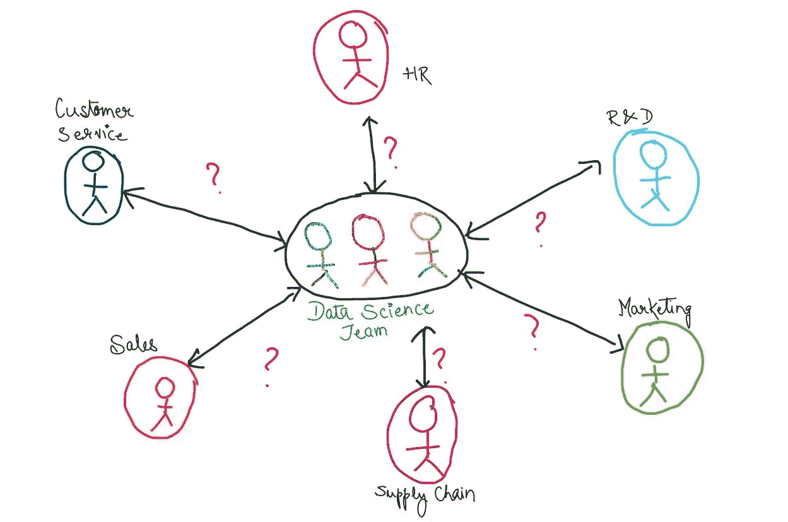

# 弥合业务和数据科学之间的差距

> 原文：<https://medium.datadriveninvestor.com/bridging-the-gap-between-business-data-science-cb3310b27741?source=collection_archive---------5----------------------->

## 了解如何让业务团队和数据科学团队协同工作

数据科学用于提供“数据驱动的解决方案”。但是在我们解决一个问题之前， ***我们需要一个问题！*** 问题来自不同业务团队的痛点。(我将使用“业务团队”这一术语来称呼每个组织中的各个团队- > *营销和销售、客户服务、研发、生产分销、IT、人力资源、财务等。)*

*在我的* [*上一篇*](https://medium.com/@kritisrivastava_63859/data-science-for-non-data-scientists-part-1-2689f422bea0?source=friends_link&sk=2973eaef32a35848dfd5c22af13913f5) *中，我试图将机器学习管道的重要阶段汇集在一起，对该领域的任何新手都有帮助。在这篇文章中，让我们试着了解业务中的问题，以及数据科学和业务团队之间的差距。*

业务团队可以与数据科学团队合作解决各种棘手问题，例如将相似的客户分组在一起、留住客户、预测销售、创建营销活动模型、向客户推荐产品、价格优化、分析客户反馈等。但是这样做总会有点犹豫。

## **那么，业务团队和数据科学团队之间是否存在差距？**

嗯，商业和数据科学可以被认为是一枚硬币的两面。他们都希望自己的公司和最终客户得到最好的。唯一的区别是，企业了解他们的产品和客户个人，而数据科学团队了解产品和客户的报告卡(数据)，并可以提供关于特定业务策略可能/可能不奏效的见解。

 [## 将定义 2020 年就业前景的五大数据科学和机器学习趋势|数据驱动…

### 数据科学和 ML 是 2019 年最受关注的趋势之一，毫无疑问，它们将继续发展…

www.datadriveninvestor.com](https://www.datadriveninvestor.com/2020/02/19/five-data-science-and-machine-learning-trends-that-will-define-job-prospects-in-2020/) 

所以让我们从双方来理解，为什么会有差距，我们能做些什么来缩小这个差距。

# 生意

这些人已经经营公司很长时间了，他们希望公司最好。在尝试数据科学的早期，当这个领域不太稳定时，每个人都在探索不同的方法，因此产生了一些问题/误解:

1.  它需要技术知识和额外的努力
2.  这需要很多钱
3.  它是一个黑盒子。没有解释“为什么？”
4.  数据收集是一个问题
5.  我了解业务和客户(我与他们交谈！)

但是日复一日，**团队正在共同努力解决这些问题，**和数据科学团队也在获得稳定性:

1.  *数据科学家愿意在所有领域参与**，以了解痛点，并将解决方案作为产品交付，即使是最不懂技术的人也能理解。*
2.  *感谢*的现收现付服务*(微软 Azure，AWS 等。)，不需要提前投入巨额。你可以在使用服务的时候付费，也可以在不需要的时候终止服务，这使得它们不贵但是非常有用。*
3.  *相信我，有时即使是数据科学家也很难理解“为什么”！但是，数据科学解决方案不再是“黑匣子”。我们有*不同的可解释性技术*，这将有助于理解，例如，为什么一些客户会离开，而其他人会留在客户流失问题中。*
4.  *大多数*组织已经将数据*存储了很长时间(例如，交易详情、产品详情、客户详情、销售信息等。).数据科学团队可以确保转储的数据对组织的未来有用。*
5.  *是的，业务团队了解他们的产品和客户。但是当公司扩大规模时，将会有不同类型的客户依附于公司，在一年的不同时间可能会有不同的产品需求，一些促销策略可能比其他的更有用，等等。为了理解这些不同的方面，数据科学团队的见解可能会有所帮助。*

# *数据科学团队*

*对于数据科学团队来说，首要任务是将业务问题转化为数据科学问题。为了实现这一点，**他们应该站在业务团队的立场上**，不断与他们互动，以了解以下方面:*

1.  *问题的背景*
2.  *他们目前是如何处理的？*
3.  *谁会受到这个问题的影响？(各级)*
4.  *该解决方案将如何为公司增加价值？*
5.  *该解决方案如何适应现有的业务框架？*
6.  *可以联系哪些其他团队来更好地理解这个问题？*
7.  *最后，各种可能影响这个问题的数据集？*

*企业需要信任数据和来自数据的洞察力，同时他们可以利用自己的领域知识成为一名优秀的批评家。数据科学团队应该先了解实际问题，然后再用数据来包装它。两个团队都需要相互合作，以获得最佳解决方案，因为两个团队都有相同的目标。*

> *企业永远是决策者，但是，在数据科学技术的帮助下，他们可以更自信、更准确地做出决策*

*我在这里写的东西来自我迄今为止在这个领域的经验，我将非常高兴从你们那里得到反馈和建议！:)*