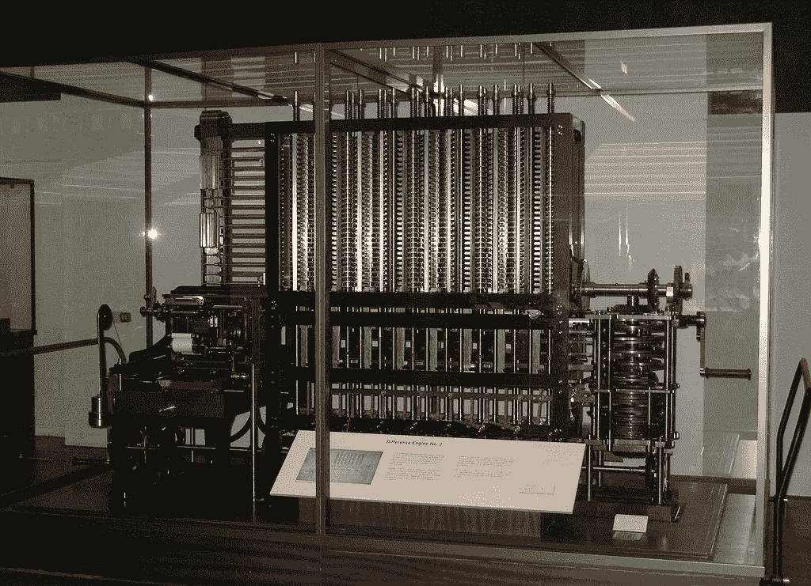
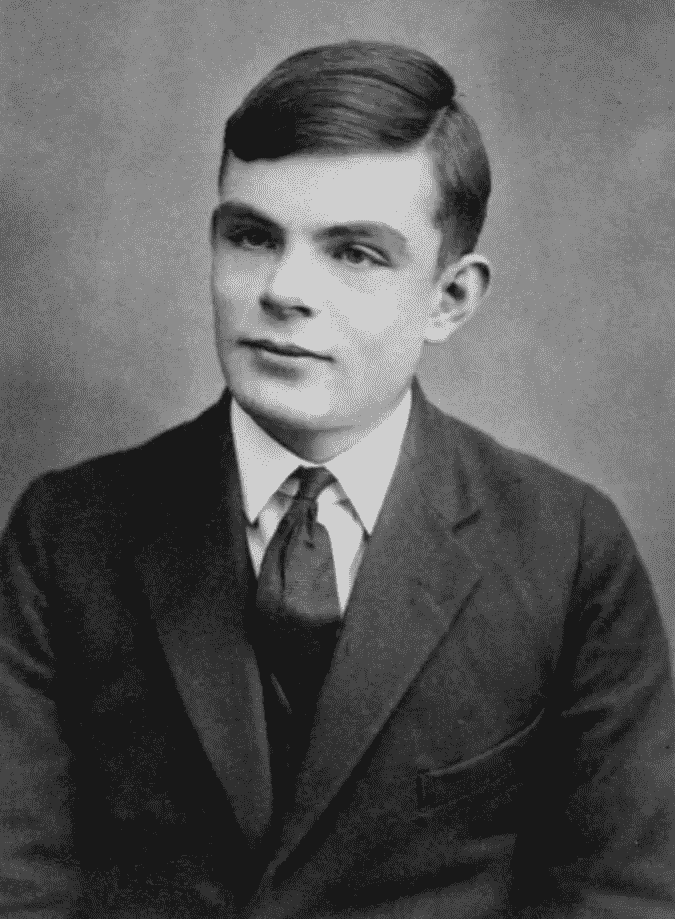
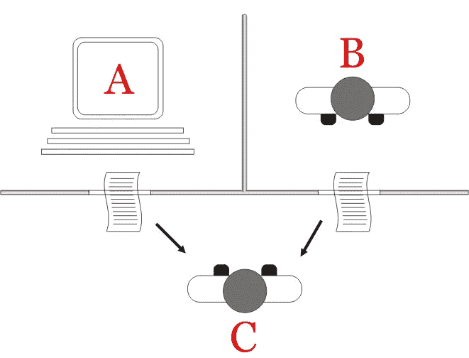
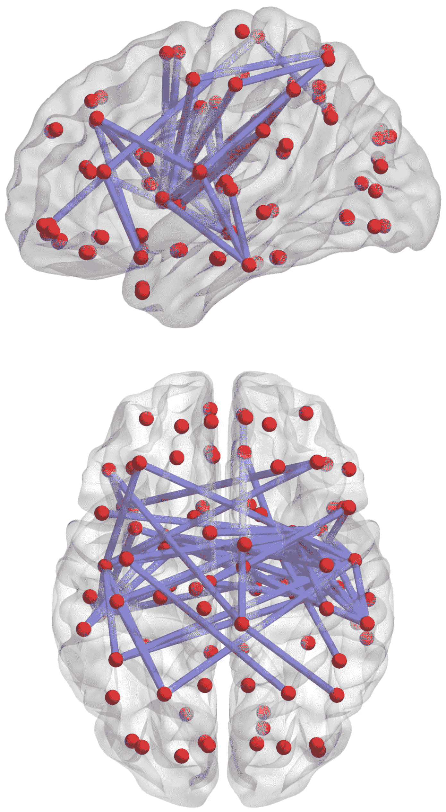
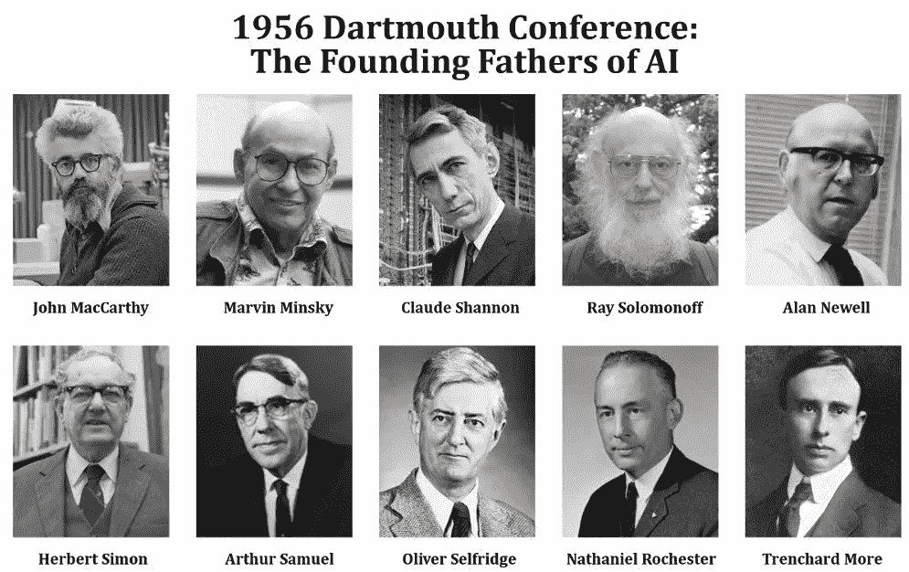
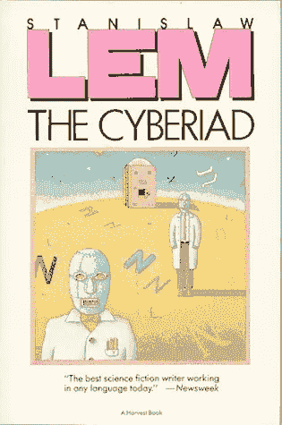
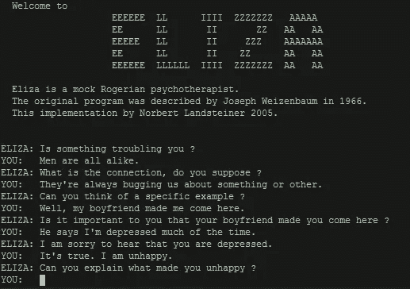
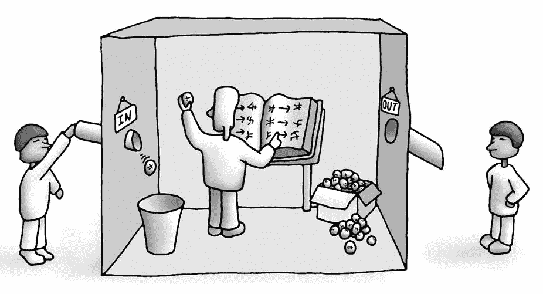
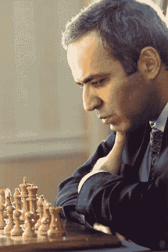

# 人工智能简史

> 原文：<https://medium.datadriveninvestor.com/brief-history-of-ai-7c1446f3c972?source=collection_archive---------6----------------------->

*这篇文章的灵感来自于我在* [*大学露天*](https://www.bklynlibrary.org/university-open-air)*2020 年 9 月学期期间教的一堂课。这个项目是由布鲁克林公共图书馆的一群优秀的人组织的。*

自古以来，人类一直试图创造能做一些智能工作的自动化机器。

source: [https://pixabay.com/illustrations/artificial-intelligence-brain-think-4111582/](https://pixabay.com/illustrations/artificial-intelligence-brain-think-4111582/)

在古希腊，他们创造了 Antikythera 机制，用来预测日食和星星的位置，以及跟踪奥运会的周期。在伊斯兰的黄金时代，发明家 Ismail al-Jazari 设计并制造了乐队音乐家机器人。

source: [https://upload.wikimedia.org/wikipedia/commons/2/2f/Al-jazari_robots.jpg](https://upload.wikimedia.org/wikipedia/commons/2/2f/Al-jazari_robots.jpg)

甚至当我们接近我们的时代时，我们也能找到智能机器的例子。戈特弗里德·莱布尼茨建造了莱布尼茨轮，它基本上是一个机械计算器。另一个例子是为将多项式函数列表而创建的查尔斯·巴贝奇差分引擎。

但是大多数研究人员同意，我们所说的人工智能始于艾伦·图灵对可计算数字的研究，以及对 Entscheidungsproblem(解决问题)(1937 年)的应用。

**原始人工智能时代**

**计算机科学**

理解图灵在人工智能这个术语存在之前写这篇论文是很重要的。他在那里描述了我们所知的图灵机。机器图灵的设计是基于对“计算机”的观察。当我说计算机时，我指的是用笔和纸计算的人。在我们的理解中，那时没有计算机，甚至没有计算器，所以当你需要计算时，你必须手动完成。“计算机”通常为军事组织工作，他们计算炮弹的轨迹等等。

source: [https://en.wikipedia.org/wiki/Alan_Turing#/media/File:Alan_Turing_Aged_16.jpg](https://en.wikipedia.org/wiki/Alan_Turing#/media/File:Alan_Turing_Aged_16.jpg)

所以图灵在观察人们如何计算，以及机器如何做同样的工作。

**图灵测试**

大约 20 年后，图灵提出了“机器能思考吗？”在这部著作中，他描述了我们现在所知的图灵测试。测试的标准设置是，一个人通过消息与另一个人和计算机进行交互，如果一个人不能识别他是在与人还是机器交谈，机器就通过了图灵测试。

source: [https://en.wikipedia.org/wiki/Turing_test#/media/File:Turing_test_diagram.png](https://en.wikipedia.org/wiki/Turing_test#/media/File:Turing_test_diagram.png)

**粉丝事实**:过去电脑很慢，人类回答问题要快得多。它们会延迟人类的反应，所以通过延迟时间很难识别你在和谁说话。在现代，有一个类似但相反的问题。计算机变得非常快，它们变慢了。

不幸的是，艾伦·图灵没有活到足以看到人工智能领域将如何发展的时候，但他提出了一个关于人工智能的非常重要的问题，并将计算机科学引上了形式逻辑的道路。

 [## 一名大学生使用语言生成人工智能工具创建了一个病毒式博客帖子|数据驱动…

### 作为作家，我们喜欢告诉自己，我们处在一个无法自动化的职业中，至少短期内不会。但是…

www.datadriveninvestor.com](https://www.datadriveninvestor.com/2020/09/15/a-college-student-used-a-language-generating-ai-tool-to-create-a-viral-blog-post/) 

**大脑建模**

还有另一种人工智能的方法，它是在人工智能存在之前构想出来的。沃尔特·皮茨和沃伦·马沙拉致力于神经元及其工作方式的研究。他们发现神经元的功能与形式逻辑法则非常相似。他们将大脑行为简化为复杂的相互关联的逻辑运算集合。他们被认为是人工智能子领域神经网络的创始人。

source: [https://upload.wikimedia.org/wikipedia/commons/0/0e/Brain_network.png](https://upload.wikimedia.org/wikipedia/commons/0/0e/Brain_network.png)

当图灵试图模拟大脑的外部行为时，马沙拉和皮茨模拟大脑的内部行为。

**进化计算**

同样值得一提的是进化计算，它是由尼尔斯·阿尔·巴里塞利开发的。这是一套受生物进化启发的算法。但是这些算法非常复杂，而且当时的计算机处理速度不够快。

**AI 的黄金时代**

**达特茅斯工厂**

人工智能的主要方法变成了形式逻辑方法。人工智能研究的中心变成了美国，因为世界的其他地方都是废墟或者缺乏技术和教育基础。

source: [https://www.scienceabc.com/wp-content/uploads/2018/01/John-maccarthy-marvin-minsky-claude-shannon-ray-solomonoff-alan-newell-herbert-simon-arthur-samuel-oliver-selfridge-nathaniel-rochester-trenchard-more-the-founding-fathers-of-ai.webp](https://www.scienceabc.com/wp-content/uploads/2018/01/John-maccarthy-marvin-minsky-claude-shannon-ray-solomonoff-alan-newell-herbert-simon-arthur-samuel-oliver-selfridge-nathaniel-rochester-trenchard-more-the-founding-fathers-of-ai.webp)

人工智能一词是由约翰·麦卡蒂在 1956 年达特茅斯研讨会上提出的。研讨会不是一个重点突出的项目，而是涉及许多主题的探索性讨论。在研讨会期间，创造了新的方法，如符号方法，早期的专家系统等等。

与此同时，计算机硬件不断进步，越来越多的数学家和哲学家开始接触它。计算机仍然主要用于军事目的，但逐渐地，在晚上或周末，非军事研究人员能够玩它。

**乐观时代**

艾的黄金时代发生在 1956 年到 1974 年之间。那是一个非常乐观的时代。企业和政府在这个领域投入了大量资源。每个人都认为我们需要再努力一点，我们将拥有真正的人工智能，可以解决人类面临的最复杂的任务。

科幻文学掀起了一股乐观情绪。像阿泽克·阿西莫夫、亚瑟·克拉克、斯坦尼斯拉夫·莱姆这样的作家创造了具有感知能力的人工智能世界。

source: [https://osimeone.wordpress.com/2019/09/03/cyberiad/](https://osimeone.wordpress.com/2019/09/03/cyberiad/)

在此期间，人工智能领域在几个主要方向上发展。

**数学逻辑和模糊逻辑**

通过数学逻辑方法，研究人员能够创建一个程序来证明一些定理。艾伦·罗伯逊提出了一种检查演绎思维的算法。

另一方面，模糊逻辑得到了发展，并广泛应用于神经网络中。模糊逻辑是多值逻辑的一种形式，其中变量的真值可以是 0 和 1 之间的任何实数，包括 0 和 1。它被用来处理部分真的概念，其中真值的范围可以在完全真和完全假之间。相比之下，在布尔逻辑中，变量的真值可能只是整数值 0 或 1。

**智能搜索**

我们可以创建所有可能组合的树，并教会机器找到最佳解决方案。例如，你可以在**井字游戏**中映射所有可能的移动，并教机器尝试所有可能的选项。

这种方法能够向公众展示一些有趣的结果。机器学习如何下棋、跳棋等等。

**自然语言处理**

与此同时，还有另一个发展中的领域，NLP。研究人员对我们能够形式化人类语言并将其翻译成代码充满希望。如果在语法方面取得了成功，人工智能也缺乏发展语言的文化背景。例如，人工智能在从一种语言翻译到另一种语言的任务上就失败了。

source: [https://en.wikipedia.org/wiki/ELIZA#/media/File:ELIZA_conversation.jpg](https://en.wikipedia.org/wiki/ELIZA#/media/File:ELIZA_conversation.jpg)

当时有趣的事件是第一个聊天机器人 ELIZA 的开发，它创建于 1966 年。是一个模拟治疗师。ELIZA 检查文本中的关键字，将值应用于所述关键字，并将输入转换为输出；ELIZA 运行的脚本确定了关键字，设置了关键字的值，并为输出设置了转换规则。

**神经网络**

弗兰克·罗森布拉特奠定了神经网络领域的基础。他创造了第一台能够识别手写文本的神经计算机(Mark1)。

source: [https://en.wikipedia.org/wiki/Perceptron#/media/File:Mark_I_perceptron.jpeg](https://en.wikipedia.org/wiki/Perceptron#/media/File:Mark_I_perceptron.jpeg)

**机器人技术**

与此同时，第一个工业机器人成为现实。然而，它们与人工智能领域没有直接联系，但它是一个与人工智能融合的领域。你需要控制机器人，让它们做你需要的事情，它们有自己的“大脑”。

**先艾冬天**

但是和任何黄金时代一样，这个时代也有结束的时候。首先人工智能冬天来了。从 1970 年开始，艾成为批评的目标。研究人员低估了需要解决的问题的复杂性。他们是如此乐观，以至于创造了神奇的期望，当然，神奇永远不会发生。

**神经网络关闭**

同时，马文·明斯基和西蒙·派珀特出版了《感知机:计算几何导论》一书。研究人员批评神经网络方法和整本书充满了对人工智能的悲观情绪。具体来说，临界点是神经元无法执行简单的逻辑运算“异或”或“异或”运算(只有在输入不同(一个为真，另一个为假)时才输出真的逻辑运算)。

此外，神经网络的计算成本很高，当时的硬件还不足以像今天这样做非常酷的大腿。

**莫拉维克悖论**

汉斯·莫拉维克表达了这样一种想法，即人工智能可以解决复杂的数学问题，但对于人脑自然会做的简单事情却无能为力。例如图像识别、空间定向和理解。

**来自学术界的批评家**

投资者的钱被烧得没有实际产出，人们逐渐停止向人工智能领域投入更多资源。英国政府要求审查人工智能领域，詹姆斯莱特希尔做了审查。他宣称人工智能领域的所有研究都是无用的，试图制造机器人是成年人的幼稚游戏。莱特希尔事件后，美国和英国政府撤回了对人工智能研究的资助。

此时，人工智能几乎毫无用处。在这份报告之后，艾的冬天变得很冷。

**中文房**

在理论层面上，约翰·塞尔提出了中国房间的论点。他以此证明，即使机器正在做一些看起来像智能工作的事情，它也缺乏符号基础，不了解它实际在做什么。

source: [https://upload.wikimedia.org/wikipedia/commons/b/b6/2-chinese-room.jpg](https://upload.wikimedia.org/wikipedia/commons/b/b6/2-chinese-room.jpg)

**复兴**

20 世纪 80 年代，由于专家系统的出现，人们对人工智能领域的兴趣有所回升。出乎意料的是，专家系统在商业上获得了成功，他们试图将其应用于医学、法学等领域。这是人工智能逻辑组合方法的第一次实际应用。

但就像早期的人工智能一样，人们对专家系统寄予了很大的希望，但这并没有成为现实。我们仍然使用专家系统，但它们不会成为图灵 AI。

神经网络能够克服明斯基和帕尔特指出的局限性。“异或”问题只是单层神经网络的问题。这个问题通过创建多层神经网络得到了解决。

此外，反向传播的方法被重新发现，允许训练神经网络更有效。

**第二个冬天**

20 世纪 80 年代中期，用于运行人工智能的专用硬件市场崩溃了。与例如 Lisp 机器相比，IBM 和 Apple 的个人计算机变得足够容易使用和强大。个人电脑的另一个优点是通用性。您可以在同一硬件上运行任何类型的软件。

早期的专家系统已被证明是成功的，但同时它们维护起来非常昂贵，难以更新，而且它们无法学习。

20 世纪 80 年代末，DARPA 大幅削减了人工智能研究的资金。到 1993 年，已有 300 多家人工智能公司破产或被收购。它正在结束第一波商业人工智能。

软件市场急剧增长。操作系统、商业软件、新编程语言、游戏。许多研究人工智能的专家开始着手这项工作。

**人工智能的现代状态**

这很有趣，但是没有政府的资助和过高的期望，人工智能继续发展并取得了许多里程碑式的成就。

1997 年，IBM 的“深蓝”击败了国际象棋世界冠军加里·卡斯帕罗夫。这是人工智能首次在如此复杂的游戏中超越人类。有很多媒体关注这场比赛。这被认为是人工智能决策的巨大进步。

source: [https://www.computerweekly.com/photostory/450423801/AI-A-brief-history-of-man-versus-machine-intelliegnce/2/DeepBlue-versus-Garry-Kasparov](https://www.computerweekly.com/photostory/450423801/AI-A-brief-history-of-man-versus-machine-intelliegnce/2/DeepBlue-versus-Garry-Kasparov)

无人驾驶汽车取得了成功。DARPA grand 和 urban challenges 已经完成，在这两种情况下，AI 都能够穿过未知的地形和城市环境。

2011 年，IBM Watson 打败了处于危险中的人。AlphaGo 在 2016 年击败围棋冠军。人工智能在 Dota 2 或星际争霸 2 等网络体育游戏中不断击败人。

**硬件和大数据**

奇怪的是，我们没有开发出任何超级智能算法，而这些算法是现代人工智能成功的原因。

那么改变的是什么呢？

与过去相比，第一硬件变得非常快。尽管摩尔定律的预测接近尾声，但它仍能在集成电路的相同空间内将晶体管数量增加一倍。即使我们达到了物理极限(远至 5 纳米)，研究人员仍在不断开发新的方法和材料，使我们能够保持不断增长的计算能力。

第二是我们拥有并能够处理的数据量。我们生活在“大数据”时代，这甚至成了一句陈词滥调。和人工智能的数据面包和黄油。为了教会 AI 识别图片上的猫，我们必须在大量的例子中进行训练(包含猫图片的巨大数据集)。我们这样做的能力正在增强。

**结论**

**技术发展展望。任何有前途的领域都会出现这种情况。最初，我们(尤其是该领域的研究人员)有非常积极的期望，我们向该领域投入资源。然后一段时间后，看不到神奇的结果而失望，放弃所有希望。泡沫破裂，冬天来临。经过一段时间的思考和不断的开发(因为热情的研究人员会不顾资金支持继续他们的工作),这项技术达到了充分开发的平台或生产力的平台。我们可以看到人工智能技术正在发生这种情况。**

## 访问专家视图— [订阅 DDI 英特尔](https://datadriveninvestor.com/ddi-intel)