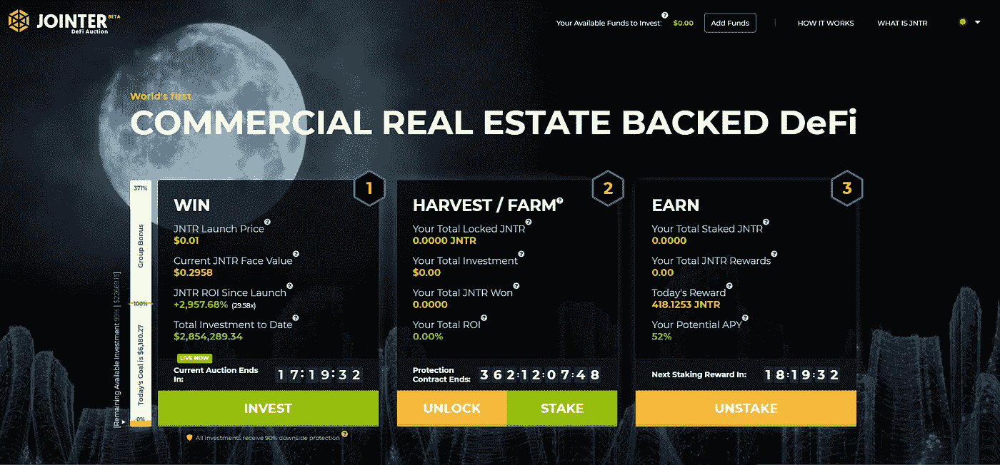
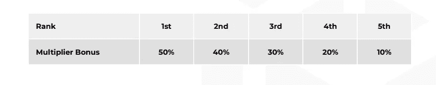

# 对联合拍卖功能的简单理解

> 原文：<https://medium.datadriveninvestor.com/brief-understanding-of-the-functionality-of-the-jointer-auction-d35f83c5b3b5?source=collection_archive---------30----------------------->

## 币安智能链平台 2 小时做 30 倍

[**DeFi**](https://jointer.io/) 或称分散式金融辛迪加(distributed finance syndication)有 Jointer 作为币安智能连锁的新模式。充分利用日常拍卖，Jointer 将有助于消除商业房地产的障碍。它还将迎合那些即时分散投资、回报不相关的投资者。你也可以充分利用高达 50%的每日折扣和无限的流动性。

要购买 JNTR 资产，您应该投资联合拍卖。这个主要渠道根据投资者在每个团体中的地位和团体的投资水平，为投资者提供个人奖金和团体折扣。分散融资智能合同决定了日复一日的铸造过程。它将计算前一天的拍卖结果，以确定当天 JNTR 的最小供应量。在每次拍卖中，投资者的投资额将达到每日限额。他们将大大受益于整个集团的购买力。最高拍卖金额上限为前一天总投资额的 150%。

# 建立每日拍卖目标

每次拍卖每天进行，在格林威治时间下午 12:00 开始，在格林威治时间上午 11:00 结束。所有参与拍卖的投资者将获得 100 日元。当一天开始时，参与的投资者可以估计 100 JNTR 的面值。

每一次拍卖都是基于提高前一天募集资金总额的目标。这将是第二天拍卖的目标。私人拍卖将为白名单社区的成员举办最初 27 天的拍卖。

在确定常规供应量时，Jointer 将采用前一天的总供货量，并除以当天结束时 JNTR 的面值。这将有助于决定拍卖的每日供应量。

 [## DeFi 正在蓬勃发展，但对这位黑仔 DApp |数据驱动的投资者有一些警告

### 加密货币可能在 DeFi(去中心化金融)找到了一个杀手 DApp。它开辟了加密货币的空间…

www.datadriveninvestor.com](https://www.datadriveninvestor.com/2020/09/22/defi-is-booming-but-there-are-caveats-to-this-killer-dapp/) 

# 每日联合拍卖的激励机制

Jointer 的双重奖金结构迎合了小投资者和大投资者的需求，无论是作为个人还是作为一个团体，他们都有机会充分利用每天的成功。在最初的 27 天私人拍卖到期后，投资者在第一天投资 100 美元，将在拍卖的最后一天赚到 3000 美元。

*   **团体折扣**

团体折扣是通过铸造额外的 JNTR 进行分配而获得的。智能合约在成功超过昨天总投资的基础上增加了 JNTR 的数量。这使得所有投资者都能从每日 50%的折扣中获益，并鼓励团队参与。

*   **个人奖金**

投资者受到激励，引领每日投资周期。奖金是基于他们在集团所有投资者中的位置。最高折扣是基于与团体相比的最高个人投资。个人投入越多，个人奖金越大。

# 募集资金的使用和分配

如果你想知道所筹集资金的用途，请放心，这将有助于保持强大的 Jointer 生态系统的功能。近 90%的资金将用于商业房地产投资，而剩余的 10%将用于主储备、备用储备和周转储备。

要参与 Jointer 拍卖，点击 Jointer.io。

作者简介:[阿萨德](https://techkrest.com/author/saadkhatri/)

阿萨德自 2012 年以来一直为 techkrest 撰写文章，担任该网站的编辑，并在世界各地参加了许多最大的智能手机和技术活动。Asad 拥有技术和 IT 背景，对 Android 和谷歌的一切都有浓厚的热情。他的专长在于各种预算的智能手机、配件、家庭自动化等等

## 获得专家观点— [订阅 DDI 英特尔](https://datadriveninvestor.com/ddi-intel)