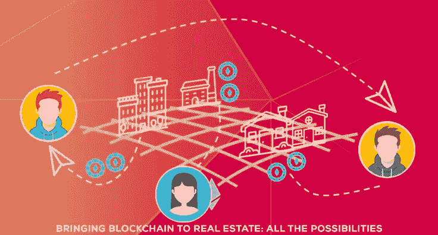

# 将区块链引入房地产:所有的可能性

> 原文：<https://medium.datadriveninvestor.com/bringing-blockchain-to-real-estate-all-the-possibilities-75901c21a4c5?source=collection_archive---------15----------------------->

加密货币行业的成功证明了区块链拥有的技术奇迹。除此之外，这种去中心化分类账平台的颠覆性能力已经在彻底改变保险和医疗保健等行业。但是现在，创新正把区块链带入一个最古老的行业，房地产。

自从土地被列为个人财产以来，人类文明就买卖土地。在我之前的文章中，我们讨论了房地产令牌化如何改变过去土地交易的方式。像我一样的区块链爱好者很高兴见证区块链和房地产的结合。出现的主要问题是这个联盟对我们意味着什么？我们都同意的一个观点是，将区块链纳入房地产的运作，必然会打破传统的方法。这将如何发生是今天讨论的中心。现在让我们深入了解一下区块链是如何影响房地产行业的:

# #降低成本

《财富》2016 年的一份报告估计，全球所有房产的价值达到惊人的 217 万亿美元。该分析包括所有住宅、商业、林业和农业用地的价值。这使得房地产行业成为经济上最富裕的行业之一，这一数字证实了潜在买家需要巨额资金支持的必要性。对大多数人来说，房产通常是他们购买的最昂贵的物品。

拥有土地的成本不仅限于支付双方同意的土地价格。该过程涉及税收、法规和许可方面的进一步支出。与此同时，双方必须向中间人支付的金额令人难以忍受。当土地交易在国际上进行时，这些费用会成倍增加。

**在区块链平台上提供的智能合约，正如在现有的加密交易中看到的那样，在这里发挥着必不可少的作用。**

它们直接消除了经纪费用。不仅如此，现行的房地产税收政策也在重新设计。通过区块链平台执行时，这些措施将大幅削减土地交易中收取的税费和利息。

 [## 数字货币、区块链和货币的未来|数据驱动的投资者

### “区块链”、“加密货币”、“令牌化”，以及现在的“央行数字货币”已经成为…

www.datadriveninvestor.com](https://www.datadriveninvestor.com/2020/02/18/digital-currencies-blockchain-and-the-future-of-money/) 

# #网络透明度和数据可访问性

从 2016 年巴拿马文件争议和 2008 年房地产泡沫衰退等事件中吸取的一个关键教训是，有必要建立一个透明的系统。换句话说:

*   一个所有相关方都知道每一个细节的系统。
*   每个人都可以访问所需数据的系统。
*   一个不能被篡改的系统。

一旦我们认识到每年有高达 1.6 万亿美元的资金通过房地产进行洗钱，房地产行业对这一系统的需求就会加剧。

区块链是这里的完美解决方案。在分散式分类账中，所有交易明细对所有现有成员和新成员都可用。成员可以访问数据并分析详细信息，以土地为中心的文档(如政府核查、征收的税收和协议详细信息)将保留在该分布式分类帐中，以供将来查看。此外，买家可以通过预先请求将所有权细节和土地细节等关键文件上传到平台本身来保护自己免受欺诈。区块链的不可改变性保护了分类帐中的数据免受任何恶意活动的影响。

# #自动化和更高效的流程

古老的房地产方法涉及大量的文书工作。经纪人欺骗买家的一个显著方式是隐瞒重要的法律细节。通过区块链进行的房地产交易需要在分布式分类账中上传所有必要的文件。这将所有文书工作转换为数字资产，是智能合同的一部分，并使流程自动化。因此，有关各方和组织受到保护，免受邪恶的中间人。同样，通过这种方式，数字化确保了高效的交易过程。

# #实时支付结算

房地产生态系统中存在的一个主要缺陷是付款程序的不规范。当事人有时需要几个月的时间来实际结算所需的金额。另一方面，区块链技术使各方能够签署合同文件，并通过同一个分布式分类账进行商定的付款。这种实时支付结算比现有系统更具优势。

# #通过令牌化获得部分所有权

土地持有的传统方法和估价过程需要大量资本投资参与。毫不奇怪，大多数全球房地产因此成为一小部分富人的游乐场。换句话说，这个部门没有民主化。没有太多的开放获取，这个领域迫切需要，因为没有更好的词，大规模采用。

在我之前的文章中，我讨论了记号化如何彻底改变房地产行业的运作。代币是现实世界中存在的可交易资产的数字表示。房地产的令牌化导致了部分所有权的出现。因此，不是一个人拥有一个特定的财产，而是多方可以购买该财产的代币，并通过区块链平台拥有其股份。维护成本和产生的收入按照拥有的百分比份额进行划分。显然，令牌化让个人能够拥有多处房产的股份，而不是将资金局限在一块土地上。另外，代币很容易被清算。这种模式将带来急需的资本，并给房地产行业注入活力。

在评论区块链对房地产的影响时， [Imbrex](https://imbrex.io/) 创始人 Stephen King 说*“有了区块链，我们现在有能力以安全、准确和可靠的方式做到这一点。一旦发生这种情况，其他一切都会水落石出。”*他进一步补充道，*“区块链的影响将是房地产行业前所未有的范式转变。”*

我非常同意这种说法。区块链和房地产的联合将把这个以前慢节奏的“纸和笔”行业转变成一个快速高度自动化的行业。随着这种改变生活的进步，如部分所有权，将帮助人们实现他们拥有土地的雄心。

与此同时，需要强调的是，区块链是一项仍在不断成熟的技术。其工作的日常升级将指导其在房地产行业的运作过程。将会有不可预见的挑战需要应对。但有一点可以放心评论。区块链影响房地产行业的方式，将为其他需要技术解放的行业铺平道路。

激动人心的时刻即将到来！