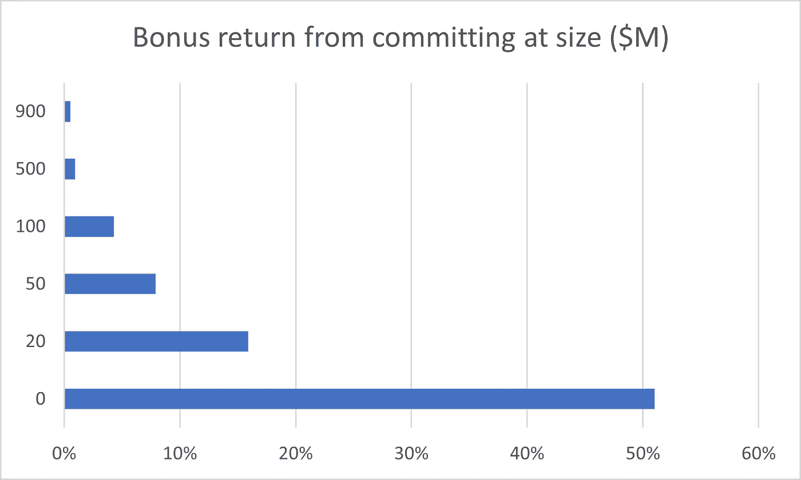

# 给私募基金带来定义速度

> 原文：<https://medium.datadriveninvestor.com/bringing-defi-speed-to-private-funds-d7fbb9daf89d?source=collection_archive---------10----------------------->

DeFi 给合作所有制的旧观念带来了新的激情。客户获得代币，赚取费用，并对决策进行投票。理论上，这改善了治理。在实践中，它加速了客户承诺和采用，并带来了巨大的忠诚度回报。我们能把这个想法应用到基金管理领域吗？

这是一个 5T 的问题。通过长期有限合伙制进行的私人市场投资取得了巨大成功。这些伙伴关系为急需的创新和基础设施提供资金。他们为专业的私人市场投资者带来了高回报。LP 基金现在拥有价值超过 5 万亿美元的资产。

那么，为什么要破坏一件好事呢？有几个原因。例如，我们可能希望通过增加一种更简单的转售投资股份的方式来扩大市场准入。私募基金要求投资者锁定资本十年或更长时间。这限制了可以参与的投资者数量，并造成买入或卖出需求的积压。这种二级交易在过去三年翻了一番。

合作基金有一个不同的目标——增加回报。我们可以通过提高筹资速度、降低成本和支持基金形成的创新来增加回报。

更快的形成将允许基金进入热门的新类别，同时它们仍能提供超额回报。它还将降低筹资成本，从而直接增加投资者的回报。

## 艰难的开始

两年前，我分享了我对令牌化基金的前景和风险的研究。接下来发生的是“危险”。我报道了第一波加密基金，标题是“[如何制作一个没人会买的糟糕的令牌化基金](https://medium.com/aboveboard-news/how-to-make-an-awful-tokenized-fund-that-nobody-will-buy-ac01ce45d9d4)”第一波报价包括一些简单的错误，比如不给投资者任何收回资金的途径。谢天谢地，他们没有卖。

这些早期的提议还包括更有趣的错误，如“奖金”红利是支付给早期投资者的额外基金份额。该理论认为，这些早期投资者正在承担风险，他们应该获得额外的风险报酬。实际上，这只是从后来的投资者手中拿走了股份，使得该基金无法出售。早期投资者每投入 1 美元可能会获得 1.20 美元的资产净值，而后期投资者可能会获得 0.80 美元。没有人会为 80 美分支付 1 美元。而且，风险分析根本就是错误的。早期投资者在扩大基金规模时，并没有降低风险。他们可能从更大的基金中获得更低的回报。他们正在降低基金经理的风险。如果他们应该得到红股，这些股票应该来自经理。

Start that snowball. Photo by [Anika Huizinga](https://unsplash.com/@iam_anih?utm_source=unsplash&utm_medium=referral&utm_content=creditCopyText) on [Unsplash](https://unsplash.com/s/photos/snowball?utm_source=unsplash&utm_medium=referral&utm_content=creditCopyText)

## 做正确的事

在合作基金中，早期基金投资者获得基金经理的股份。随着基金获得更多的承诺，后来的投资者获得的经理运营股份越来越少，同时从一个不断增长的社区支持的基金中获得全部回报。

这可以创造一个良好基金发行迅速滚雪球的动态。

*   早期投资者可以降低冒险投资新基金经理和新类型基金的风险。他们在管理基金方面获得了有意义的发言权，这有助于他们管理风险。
*   为了获得更大的股权回报，投资者有动力迅速做出承诺。然后，他们有动机推广他们是部分所有者的基金。

 [## 为私募基金带来定义速度|数据驱动的投资者

### DeFi 给合作所有制的旧观念带来了新的激情。客户获得代币，赚取费用，并投票…

www.datadriveninvestor.com](https://www.datadriveninvestor.com/2020/10/22/bringing-defi-speed-to-private-funds/) 

## 更高的回报

这个雪球可以节省时间和金钱。即使是成功的新基金经理，通常也需要大约 18 个月的时间来找到足够多的投资者来启动他们的基金。这笔钱很贵，他们从最终投资者回报中扣除。更重要的是，时间上很贵。他们创办基金是为了投资一个高回报的新机会，快速投资者会获得那些高回报。

大型老牌基金公司不需要这种动力。他们可以从现有的投资者那里筹集新的资金。2020 年，投资者正在汇集央行流动性，并希望大量投资。大型基金获得了大部分新投资。与小基金和新基金相比，大基金不太可能跑赢市场。因此，有限合伙人投资者有机会通过寻找新经理并降低其风险来增加回报。

这里有三个理论试图解释首次投资基金的优异表现。挑选你喜欢的:

*   规模较小的基金能赚更多的钱，因为每一项投资都会得到更多的关注。它们也有更高的方差，在风险/回报上有一些提升。
*   新基金带着超额回报进入新市场。
*   新基金的创始人知道他们必须尽早达成一些好的交易。因此，他们攒下一些好的交易，并把它们从以前的工作中带过来。

通过买方投资者，合作基金有可能获得好的交易。好的投资交易不是来自卖方的推销。他们来自买方投资者，他们投入自己的时间和金钱来设计能够赚钱的交易。

## 给我看看钱

公开市场对私募股权投资公司的估值约为其管理资产的 6%。一家规模较小、较新的运营公司可能价值较低。然而，开创性的合作基金可能更有价值，因为它将为一个新行业开发软件、投资者名单和基础设施。

我将设想一个场景，一只合作基金为该基金筹集了$1B，最终以$ 5000 万美元的公司运营价值(5%)结束。这似乎有些保守。我们将为运营公司创始人和基础设施投资者保留一半股份，并将一半股份(价值 2500 万美元)分配给基金投资者。

在这种情况下，投资者越早投资，获得的股份就越多。如果你在基金规模为 S 时投资，你将获得两倍于投资规模为 2S 时的运营股份。

这些分红的计算涉及积分和对数函数。我们将从一个基础值 B 开始，每一美元的新投资获得与 1/(B+S)成比例的股份。这个场景将 B 设置为 500 万美元。

*   第一笔 1000 万美元的承诺获得运营公司 17%的股份，最终价值 5183779 美元，奖金回报率为 51%。很棒的旅程！真正的投票权！
*   一名投资者在投入 1 亿美元后投入 1000 万美元，可从运营公司获得约 1%的收益，红利回报率为 4.29%。在今天的环境下，这很好。
*   一个投资者在投入 9 亿美元后投入 1000 万美元，可以获得大约 0.5%的红利回报。该基金基本上实现了目标，其他投资者正在帮助治理，红利回报也很快。

## 白给的钱

投资者在投入资金进行资本催缴之前，将获得股权价值。白给的钱！无限回报！这不会是很多钱，但在一个通常需要很长时间才能实现回报的行业中，这是一笔有意义的预订。

# 数字私人市场的进展

这个关于合作基金的提议是我们在[非捆绑基金](https://www.unbundled.fund/)一直在做的事情之一。我们正在现实地看待“数字”私人市场的组成部分。

*   旨在提高投资者回报的设计和分析
*   对于合格的专业人员
*   通过可靠的自动报告
*   使用全球采购和联合网络
*   导致一个适当的二级市场

## 获得专家视图— [订阅 DDI 英特尔](https://datadriveninvestor.com/ddi-intel)