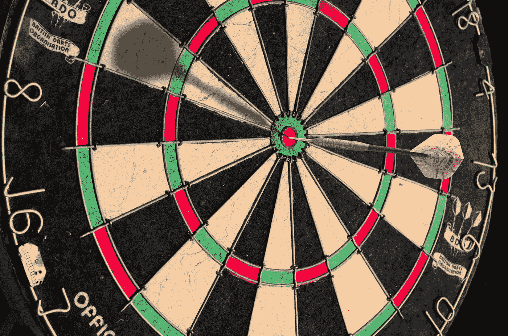

# 带来用户还是打造产品？

> 原文：<https://medium.datadriveninvestor.com/bringing-users-or-building-product-874a9b4e2e9?source=collection_archive---------26----------------------->

## 本书的主要观点——牵引力。

Photo by [Austin Distel](https://unsplash.com/@austindistel?utm_source=medium&utm_medium=referral) on [Unsplash](https://unsplash.com?utm_source=medium&utm_medium=referral)

加布里埃尔·温伯格(Gabriel Weinberg)和贾斯汀·马雷斯(Justin Mares)的《牵引力》(Traction)是理想的选择，如果你正在创办一家新企业，推出一种新产品或服务，或者如果你已经有了一家企业，只是在寻找吸引更多客户的方法。我想涵盖其中三个我最喜欢的观点。

# 从第一天开始营销

现在，这本书的第一条真知从第一天起就专注于营销。我们必须从业务一开始就花时间关注营销。

我知道作为一名企业家，尤其是当你参与创造或构思产品创意的时候。把所有的精力都集中在打造产品上，想出品牌名称，做好一切准备，然后把营销当成事后的想法，这是非常诱人的。

你在产品准备好之后做的事情。但事实是大多数企业失败的首要原因是他们未能吸引顾客。他们经常将产品推向市场，但他们无法吸引足够多的顾客。

## 产品与用户

所以，不仅从第一天开始就关注营销是非常重要的，而且我也喜欢他们在书中关注和强调的在这两项责任之间平分你的时间—

第一，专注于产品以及与构建产品和服务相关的一切。二是时刻想着营销和你的长期战略。从谁是你的理想客户，到你如何面对他们，你将使用的营销渠道，以及在过程的早期找到与潜在客户联系的方法，以获得他们的反馈，获得他们的意见，并确保你的产品朝着正确的方向发展。

因为你最不想做的事情就是花一大笔钱、一堆时间、精力和金钱去做一些东西，结果却发现要么没人感兴趣，要么产品并不像它本来应该的那样适合客户。所以重要的是不要从一开始就专注于营销，而是要把你的时间平均分配在两者之间，把营销作为你业务的一个核心基本方面，并强调这一点。

当你与早期客户交谈时，你不仅要密切关注他们喜欢产品的什么，并在你继续迭代产品时努力强调这些功能，而且你还要关注他们在谈论他们的问题、挑战、挫折或你正在帮助解决的任何问题时使用的语言。观察他们如何谈论你的产品，并向你或者其他可能参与谈话的人描述。因为最终，当需要整合你的营销时，你会想用他们的话。

你必须说他们的语言，而不是教他们如何谈论产品。

Photo by [Immo Wegmann](https://unsplash.com/@macroman?utm_source=medium&utm_medium=referral) on [Unsplash](https://unsplash.com?utm_source=medium&utm_medium=referral)

# 靶心框架

洞察力二找到最有效的营销渠道。

具体我参考牛眼框架，来源于这本书。

这是一个四步过程，你可以用它来选择和执行你的企业的最佳营销机会。这一点很重要，因为从全局来看，在所有不同的营销渠道中，可能会有少数三四个远远好于其他渠道。可能有一个渠道比两个、三个和四个渠道加起来更有效。你必须尽你所能为你的企业和牛眼框架确定最佳营销机会；这是我参考的东西。这是一个四步过程。

## 脑猝病

第一步是为你感兴趣的所有不同的营销渠道集思广益。

这本书恰好涵盖了 19 种不同的营销渠道，并且涵盖了相当多的细节。所以，如果你想了解这本书所涉及的 19 个细节，你一定会想继续阅读这本书。但是牛眼框架的第一步背后的想法是专注于这些渠道中的每一个，并假设你生活在一个替代的宇宙中，在那里你必须使用一个特定的渠道，沿着列表向下工作，并假设它是好的。如果我必须使用这一个渠道，比方说举办现场活动，你会如何利用这个渠道来推广你的业务？

花 10 到 20 分钟想出一个你将如何使用特定渠道的现实场景，然后沿着列表往下，涵盖你能想到的每一个渠道。集思广益，不是因为你要同时追求所有这些渠道，会分散你的努力，但这只是一个探索过程。你想看看如果你被迫使用这些渠道中的任何一个，你能开发什么，就像一次头脑风暴有趣想法的练习。

## 从列出的许多中挑选几个。

框架中的第二步是选择三到五个最有前景的选项，缩小列表，并专注于那些似乎最适合你的业务的选项。

> 这个游戏的名字是速度。

尤其是如果你是一家初创企业，需要找到一个对你的业务超级有效的渠道，你希望看到这个渠道能够快速吸引客户，吸引客户盈利，理想情况下有足够多的客户对你的业务产生影响。

 [## 旋转你的创业？4 种正确的方法|数据驱动的投资者

### 1)储备现金——在早期阶段，尤其是种子期，你有可能会一直转到找到…

www.datadriveninvestor.com](https://www.datadriveninvestor.com/2020/12/13/pivoting-your-startup-4-ways-to-do-it-right/) 

## 测试测试测试:便宜

因此，选择三到五个最有希望的，然后你进入第三步，这是执行廉价的测试。作为企业家，这是很容易跳过的一步。我了解我自己，看着名单，很容易说，好吧，这里有三四个看起来很有希望的。

我以后会弄清楚的。我将继续专注于产品。

> 但现实是，如果我们不测试营销渠道，第一，我们不知道他们是否会工作。如果我们要吸引顾客和 B，我们不能确定哪一个是最好的机会。

所以，这里的想法是进行廉价的测试，取决于你的项目的大小，可能是 500 美元，每个通道可能是 1000 美元。假设其中一个频道正在进行脸书广告活动。

好吧，你可以进行一个不贵的活动，测试几天。你要确定的主要问题是:A，是否有足够多的客户让事情变得令人兴奋，值得你花时间；B，如果你专注于优化它，改进你的广告文案，改进你的网站或登录页面，并优化整个营销漏斗，你是否有信心让它成为一个有利可图的营销渠道。

> 在这里，您不必纠结于优化。

你想知道，有足够的顾客吗？

如果你花更多的时间和精力来优化事情，你有可能在将这些潜在客户转化为客户的过程中获利吗？这是第三步。

## 敲定其中一个

第四步非常简单。

你看着你所有的测试，你选择最有前途的渠道，似乎最适合你的业务。这一点非常重要，因为你不能把精力分散得太分散，尤其是作为一家初创企业。你把所有的时间和精力以及团队中其他人的时间和精力都集中在真正掌握一个营销渠道上。

对于企业来说，这是一个巨大的差异。

如果你能有一个创始人，一个联合创始人，或者一个首席营销人员，那就是一个营销渠道的绝对大师；它给你的企业带来难以置信的力量和信心。所以，一旦你确定了一个有利的营销机会，你就要尽可能快地专注于这个机会，把你所有的时间和精力放在最大化这个渠道的潜力上。

最终，一旦你遇到收益递减或花费更多时间和精力不一定能给你带来更多结果的时候，你可以退出这个渠道，让你的努力保持原样，重新开始这个过程，并找到下一个营销机会来扩大你的业务。你仍然会支持原来的渠道，显然，你尽量不要耗尽它。

然而，一旦你遇到收益递减，不值得增加你的广告支出或增加你的时间来优化它，那么你会找到下一个最好的营销渠道，并重新开始这个过程。这是一个引人注目且简单明了的框架，但是我最喜欢的一个观点是我强烈推荐使用它。

# 确定你的关键路径并坚持下去。

这里的想法，基本的路径概念，是确定你今天在哪里，你需要在哪里对你的业务感到更有信心。如果你正处于创业阶段，这一点尤其重要，因为这是生死攸关的时刻；你需要弄清楚你的生意是否会成功，因为你需要明确你的牵引目标是什么？

你必须达到什么标准才能知道你的业务正朝着正确的方向发展？

Photo by [niklas_hamann](https://unsplash.com/@hamann?utm_source=medium&utm_medium=referral) on [Unsplash](https://unsplash.com?utm_source=medium&utm_medium=referral)

它可能基于收入，可能基于客户总数。如果你正在接受投资者的投资，这可能是基于达到一些指标，表明你的投资者对你的投资方向正确的信心。但在一天结束时，你要明确你的牵引目标是什么。

关键路径是从你今天所在的地方到你未来想要去的地方的最直接的路线。这里的想法是你确定你的关键路径，然后你坚持下去。

你不能偏离。我的意思是，作为企业家，特别是像我之前提到的，当我们参与并投资于创造产品时，很容易构建出一些东西，比如虚荣特征，我们想要构建的特征，我们喜欢设计的特征。

我们希望创造和增加产品，但不一定要推动我们的业务。因此，如果有这样的功能，或者如果有活动或项目或其他任何东西，业务中的任何其他浪费，正在做的事情没有带你到你需要的地方，你需要把这些东西去掉。

你不希望过分纠结于度量标准，一般来说，在商业中，这是非常正确的。尽管如此，当你是一个全新的初创企业时，这是至关重要的，因为这是一个关乎整个企业生死存亡的局面，你必须高度专注于让企业变得更加稳定。

也许是现金流中性；也许这是积极的现金流。也许你可以雇用额外的人，你迫切需要把业务提升到一个新的水平；不管是什么，你都需要非常清楚，不仅是为了你自己的领导能力，也是为了整个团队。你们需要共同让彼此负责，将所有的时间和精力集中在达到那个牵引目标上，拉近距离，达到下一个水平。

## 这一点非常重要，尤其是对于初创企业。

因此，如果这是你的情况，如果你正在开始一项新的业务，要非常清楚你需要在哪里把你的业务带到一个新的水平，并有额外的信心，然后避免任何浪费，具体的事情错过或像试图在流程上过度优化业务这样的事情，绘制它。

例如，试图为你正在完成的每一件事制定战略，并试图确保你的业务面向未来，当你只是试图弄清楚这项业务是否行得通时，这些都不重要。所以，超级重要的想法。我最喜欢的一点是，书中最喜欢的观点。

# TL；大卫:概括一下！

所以第一，从第一天开始就专注于营销。

第二，找到最有效的营销渠道，第三，确定你的关键路径并坚持下去。

这些只是我最喜欢的书中的三个观点；书里还有很多东西。我甚至没有写 19 个不同的牵引通道。

我把重点放在其他框架和概念上，因为对我来说，有了一些关于各种营销渠道的经验，我发现这些东西更有趣。尽管如此，对你来说，就本书的价值而言，19 种不同的营销渠道可能是必要的，或者更重要。

因此，如果你正在开始一项新的业务，如果你正在推出一种新产品或服务，或者如果你已经有一个现有的业务，你只是在寻找吸引更多客户的方法，请检查一下这个。

***快注意*，至少有两本不同的书采用了相同的书名。有一本吉诺·维克曼写的书。当然，还有这本书，两本都是杰出的书，但如果你想了解更多我们在这里讨论的内容，你应该看看加布里埃尔·温伯格和贾斯汀·马雷斯的书。**

## 访问专家视图— [订阅 DDI 英特尔](https://datadriveninvestor.com/ddi-intel)