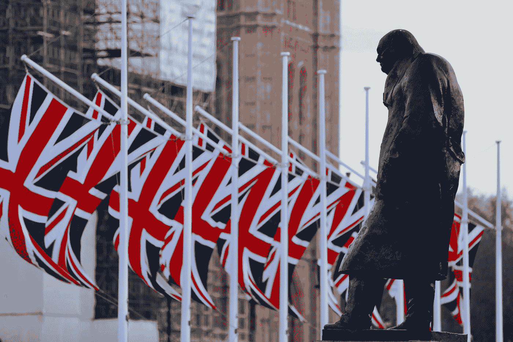
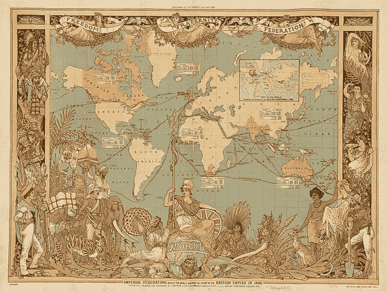

# 英国、英国退出欧盟和帝国遗产

> 原文：<https://medium.datadriveninvestor.com/britain-brexit-and-the-legacy-of-empire-468bc2eb91ea?source=collection_archive---------8----------------------->

## 英国的前帝国能给它在世界上提供一个新的位置吗？

Photo by [Kristina G.](https://unsplash.com/@photomasala?utm_source=medium&utm_medium=referral) on [Unsplash](https://unsplash.com?utm_source=medium&utm_medium=referral)

一段时间以来，英国在世界上的地位看起来非常不确定。作为一个已经失去帝国的前帝国，英国在近代历史的大部分时间里一直利用其欧盟成员资格，将欧盟作为推进其经济和外交政策野心的工具。然而，自 2016 年英国退出欧盟公投以来，英国在国际舞台上的角色一直是激烈辩论的源头。如今，与欧盟分道扬镳后，政治分歧双方的领导人都在寻求塑造英国在英国退出欧盟事件后的地缘政治地位。

问题的核心是，今天的英国在多大程度上仍然是一个欧洲地区大国或一个主要的全球参与者。对首相来说，英国在后英国退出欧盟时代的地位仍然和以往一样雄心勃勃。鲍里斯·约翰逊(Boris Johnson)一再推动他的全球英国愿景(Global British vision)——包括英国放眼欧洲邻国之外，加强与发展中国家新盟友的经济和安全联系。许多支持英国脱欧的人希望看到英国在外交事务中扮演更具开拓性的角色，释放鲍里斯·约翰逊(Boris Johnson)此前称之为英国的“全球出口精神”。

英国在地缘政治上远离欧洲的观点肯定不乏批评者。对许多人来说，约翰逊的全球英国战略缺乏实质内容——T2 皇家联合服务研究所(T3)(RUSI)，一个专门研究国防和安全的智库，强调“在过去的四年里，试图阐明一个连贯的，后英国退出欧盟时代的外交政策——应对这些更广泛的变化和英国退出欧盟本身——在很大程度上是不令人满意的”。

对 RUSI 来说，全球化的英国“没有为那些负责决定如何优先使用稀缺自然资源的人提供足够的指导”——在公投四年后的今天，后英国退出欧盟时代的英国仍在寻找一种身份。

英国作为一个全球帝国的历史，无疑仍是英国后英国退出欧盟时代角色背后的一个关键因素。英国脱欧派一直热衷于将他们对当今全球强大英国的雄心与 19 世纪横跨全球的大英帝国相提并论。对于一些人来说，英国的前帝国已经被视为英国当前身份危机的解决方案——英联邦可能取代英国在欧盟的角色。然而，尽管英国夺回其昔日的帝国地位并再次统治世界的想法似乎很有吸引力，但现实并非如此简单。

**旧帝国，新盟友？**

今天在英联邦可以看到大英帝国的残余，英联邦是一个政治组织，[的狂热分子将它吹捧为后英国退出欧盟时代英国繁荣和贸易的新源泉。政府部长们此前一直希望加强与英联邦国家的贸易联系，此举被一些人称为](https://www.politico.eu/article/commonwealth-summit-wont-be-empire-2-0-for-brexit-uk/)[“帝国 2.0”](https://www.thetimes.co.uk/article/ministers-aim-to-build-empire-2-0-with-african-commonwealth-after-brexit-v9bs6f6z9)，非洲英联邦成员国是伦敦规划者的特别目标。简而言之，全球英国的支持者将英联邦视为欧盟成员资格的潜在替代品，将该联盟作为增加英国地缘政治影响力的工具。

乍一看，英联邦无疑为试图放眼欧洲之外的英国提供了一个有利可图的市场。该协会成立于 1949 年，由 54 个主要与前大英帝国有历史联系的成员国组成(尽管它包括一些与英国没有历史联系的国家，如莫桑比克和卢旺达)。英联邦不仅包括澳大利亚、加拿大和印度等国际舞台上的主要参与者，还包括尼日利亚和喀麦隆等一些发展中国家。

 [## 全民或跨州的国营保险私人医疗保险:经济学…

### 我们目前生活在一个所有非医疗行业都痴迷于…

www.datadriveninvestor.com](https://www.datadriveninvestor.com/2020/05/21/state-run-insurance-for-all-or-across-the-state-lines-private-healthcare-coverage-economics-politics-social-mix-up/) 

作为一个政府间组织，英联邦由自己的秘书长领导，每两年举行一次英联邦政府首脑会议(CHOGM)——其首要任务是促进民主、经济发展和技术培训等问题。

从英国的角度来看，英联邦充满了经济潜力。成员国占全球人口的三分之一(24 亿人)和世界 GDP 的 14%(超过 10 万亿美元)。该组织包括一些世界上发展最快的经济体，例如印度和尼日利亚，这使得英联邦经济体在过去 40 年中以 4.4%的平均速度增长(相比之下，欧盟为 2%)。鉴于共同的语言、法律体系和历史关系，与英联邦国家关系的进一步发展为后英国退出欧盟时代的英国提供了一个良好的开端。

[用现任秘书长【Patricia Scotland 男爵夫人的话来说，“英联邦现在不仅有能力看到它如何加强和深化团结，而且为其成员国创造真正的经济优势”——一个更加外向的后英国退出欧盟时代的英国敏锐地意识到它的历史帝国今天可以为它提供一个新的身份。然而，21 世纪看起来与英国 19 世纪的帝国全盛时期非常不同，今天的英国不再是一个能够主宰全球大部分地区的全球超级大国。对于那些将英联邦视为欧盟成员资格替代者的人来说，一场突然的觉醒就在眼前。](https://geographical.co.uk/geopolitics/geopolitics/item/2680-commonwealth-on-common-ground)

首先，是地理问题。与欧盟不同的是，其成员共享一个共同的地理位置，英联邦遍布全球——成员国分布在北美、非洲和亚洲。虽然英国与其欧洲邻国的贸易通常只需要跨越英吉利海峡的短途旅行，但英国在与澳大利亚或巴基斯坦等英联邦国家进行贸易时，可能需要运输数千英里的货物。

统计数据反映了英国与前帝国贸易时面临的困难——英国与欧盟和美国的贸易联系使英联邦相形见绌。目前，仅英联邦[就代表了英国全球贸易的 10%左右](https://www.economist.com/britain/2018/04/12/is-the-commonwealth-a-plausible-substitute-for-the-eu)，而欧盟占了 50%左右。

此外，英联邦不是一个贸易集团(像欧盟一样)，而是一个由关系模糊的国家组成的松散得多的集合。该组织缺乏解决成员国之间冲突的手段，驱逐仍然是其唯一的执行机制(它主要用于制裁侵犯人权的行为——如 1995 年至 1999 年驱逐尼日利亚，或 1999 年驱逐巴基斯坦)。

其结果是，成员国之间的合作远未得到保证，英国退出欧盟事件后英国的脆弱地位使得贸易谈判成为一项艰巨的挑战。例如，澳大利亚和印度之间的贸易协定谈判自 2009 年以来一直在进行，没有理由表明未来与英国的谈判会更有利。

尽管英国一些人希望看到“帝国 2.0”的局面——伦敦能够像 19 世纪那样利用其前帝国领土——但这不是地缘政治现实。用澳大利亚前总理陆克文(Kevin Rudd)的话说，任何“英联邦有可能取代英国目前与布鲁塞尔的经济安排”的想法都是幻想。英国不再是昔日的全球超级大国，鉴于英联邦内部贸易面临巨大的地理障碍，在不久的将来，欧盟和美国将成为英国更重要的战略伙伴。

**坎祖克怎么样了？**

除了英联邦，其他以帝国为主题的政治联盟也被视为后英国退出欧盟时代英国的潜在途径。canzuk——广义上讲是加拿大、澳大利亚、新西兰和英国之间的政治联盟——最近有[一些拥护者](https://www.telegraph.co.uk/politics/2020/06/08/brexit-britain-has-much-better-alternative-eu-canzuk/)，四个国家有共同的语言、相似的文化和相对平等的财富水平，这使得一些人将其称为相当于欧盟的盎格鲁圈。

这种想法可以追溯到 19 世纪，并且经常成为英国欧洲怀疑论者反复出现的主题，他们长期以来一直希望看到英国远离欧洲，转而支持英语圈。根据坎祖克联盟，这四个国家要么加入一个政治联盟(类似于欧盟)，要么只是增加经济和安全联系——同时确保成员国之间的行动自由。

[Imperial Federation map of the world showing the extent of the British Empire in 1886](https://commons.wikimedia.org/w/index.php?curid=15847756) by [http://maps.bpl.org](https://www.flickr.com/people/24528911@N05) — licensed under [CC BY 2.0](https://creativecommons.org/licenses/by/2.0?ref=ccsearch&atype=rich)

最近，坎祖克再次出现在关于英国后英国退出欧盟时代未来的辩论中，一些人将其视为对抗中国日益增长的侵略的潜在平衡力量。上个月，英国历史学家安德鲁·罗伯茨评论说，“第二个盎格鲁圈超级大国将意味着我们共同的政治价值观将得到更好的捍卫和促进，一个繁荣的坎祖克将成为美国的好邻居、贸易和防御伙伴。”

然而，就像任何重燃“帝国 2.0”的希望一样，现实也沉重打击了坎祖克联盟的想法。[正如 Aris Roussinos](https://unherd.com/2020/08/why-canzuk-is-an-absurd-fantasy/) 最近强调的，所有四个国家都在不同的地缘政治领域运作，因此缺乏普遍共享的外交政策和经济利益。在贸易领域，澳大利亚和新西兰都牢牢扎根于亚洲，尤其是中国是两国的主要贸易伙伴。对加拿大来说，美国仍是其经济重点，而英国的大部分贸易仍来自欧洲。与优先考虑内部贸易的欧盟不同，Canzuk 成员既没有共同的经济利益，也没有类似的关键贸易伙伴，因此任何潜在的联盟从一开始就存在分裂。

除了贸易，安全问题也让潜在的坎祖克联盟不太可能成功。澳大利亚和新西兰将中国的侵略视为其主要的国家安全威胁，而英国作为一个欧洲大国则牢牢盯着俄罗斯。在地球的另一端，加拿大对北极钻探比对欧洲大陆的事件更感兴趣。

正如 Roussinos 所说，“澳大利亚会派遣战斗机保护北海免受俄罗斯入侵吗？公开反核的新西兰，一个基本上是和平主义国家，几乎没有任何武装力量可言，会要求在英国的核保护伞下获得一席之地，或者组建一支军队来捍卫加拿大在北极的石油勘探权吗？”。最终，坎祖克是一个理论上听起来不错的想法，但作为地缘政治战略缺乏实用性。正如《纽约时报》在 2018 年的[中所指出的，除了英国之外，几乎没有人对任何这样的联盟感兴趣——每个国家相互竞争的利益使得进一步的政治一体化难以为继。](https://www.nytimes.com/2018/07/13/opinion/donald-trump-uk-visit-anglosphere-brexit.html)

早在 1962 年，美国前国务卿迪安·艾奇逊[打趣说](https://www.ucl.ac.uk/european-institute/news/2017/jan/britain-has-lost-role-and-failed-find-empire)英国“失去了一个帝国，并且未能找到一个角色”，自 2016 年英国退出欧盟公投以来，许多人都希望英国退出欧盟是英国在全球舞台上找到自己位置的机会。无论是通过英联邦还是坎祖克，试图让英国回到其帝国过去的努力都回到了英国统治海洋并可以在全球投射其影响力的时代。然而，在一个由美国主导的世界里，中国和欧盟都在远处观望，重返辉煌时代的希望似乎越来越像是幻想。

今天的英国仍然受制于自己的地理位置——它无法逃脱作为欧洲强国的角色。后英国退出欧盟时代的英国不再是 19 世纪的航海超级大国，英国在英国退出欧盟之后的政治战略必须反映这一点。大英帝国不会回来了，英国作为全球超级大国的角色也不会回来了。试图将英国从欧洲大陆转向鲍里斯·约翰逊(Boris Johnson)的全球英国愿景本质上并不是一件坏事——但如果它们是由不切实际的帝国怀旧战略驱动的，英国将面临更长时间的等待，才能最终在世界上找到自己的位置。

**访问专家视图—** [**订阅 DDI 英特尔**](https://datadriveninvestor.com/ddi-intel)