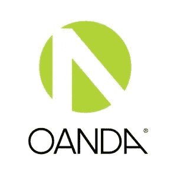
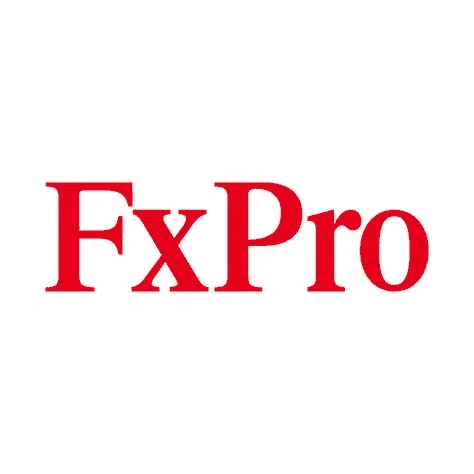
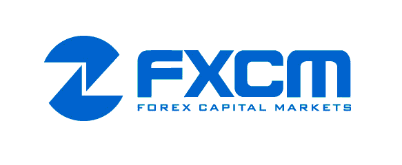
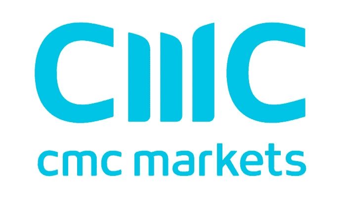

# 如果你是外汇交易员，可以选择经纪人。

> 原文：<https://medium.datadriveninvestor.com/brokers-to-choose-from-if-you-are-a-forex-trader-3c8cb3634d26?source=collection_archive---------29----------------------->

每个想成为外汇交易员的人的第一步是在一个有信誉的经纪人那里开一个账户。一个人必须检查各种变量，以便找到适合他或她的需求。经纪人必须接受声誉良好的组织的监管，以防止不法手段。它还需要支持用于交易的各种产品、交易平台，而且它还需要相对便宜。

下面你可以找到一些经纪人的选择，为每个想交易外汇市场的人提供一些事实。当然，一个人也必须做他或她自己的尽职调查，以便找到适合他或她自己的和独特的需求。我不隶属于他们中的任何人，也不提升任何人。

Oanda 是最有声望的经纪人之一。它们支持许多优秀的平台和各种工具。这将是我的首选。

我也喜欢 Forex.com，因为他们支持伟大的平台，他们有许多产品可供交易。

下面你可以找到上述经纪人以及其他一些供你选择。

# Oanda

*   **网址:**【https://www.oanda.com/ 
*   **受**监管: [NFA](https://www.nfa.futures.org/index.html) (美国) [FCA](https://www.fca.org.uk/) (英国)
*   **交易工具:**外汇，指数，商品，债券，(差价合约)
*   **成立于:** 1996 年
*   **银行牌照:**否
*   **办事处位于:**加拿大、英国、新加坡、澳大利亚、日本
*   **平台:** OANDA 交易桌面，MetaTrader 4，TradingView，MotiveWave，
*   **投资媒体评级:** 3.9/5
*   **账户最低:**否

# Forex.com

*   **网址:**[https://www.forex.com/](https://www.forex.com/)
*   **受**监管: [CFTC](https://www.cftc.gov/) (美国) [NFA](https://www.nfa.futures.org/index.html) (美国) [FCA](https://www.fca.org.uk/) (英国)
*   **交易工具:**外汇(80 对)、差价合约(220+)、商品、指数、债券、ETF、加密货币、期货、
*   **成立于:** 2001 年
*   **银行牌照:**否
*   **办事处位于:**开曼群岛、英国、美国、
*   **平台:**FOREX.com 桌面，MotiveWave，TradingView，MetaTrader 4，MetaTrader 5，
*   **投资媒体评级:** 4.2/5
*   **账户最低:** 100 单位基础货币。

# FX Pro

*   【https://www.fxpro.com/】网站:
*   **受**监管: [FCA](https://www.fca.org.uk/) (英国) [CySEC](https://www.cysec.gov.cy/en-GB/home/) (塞浦路斯) [FSCA](https://www.fsca.co.za/Pages/Default.aspx) (南非) [DFSA](https://www.dfsa.ae/) (迪拜) [SCB](https://www.scb.gov.bs/) (巴哈马)
*   **交易工具:**外汇、商品、指数、期货、差价合约、
*   **成立于:** 2006 年
*   银行牌照:否
*   英国、塞浦路斯、摩纳哥、巴哈马群岛
*   **平台:** FxPro 平台(EDGE)，MetaTrader 4，MetaTrader 5，cTrader
*   **投资媒体评级:** 3.8/5
*   **帐户最低金额:** $500

# 福汇

*   **网址:**[https://www.fxcm.com/](https://www.fxcm.com/)
*   **受**监管: [ASIC](https://www.asic.gov.au/) (澳洲) [ACPR](https://acpr.banque-france.fr/) (法国) [FCA](https://www.fca.org.uk/) (英国) [FSCA](https://www.fsca.co.za/Pages/Default.aspx) (南非)，
*   **交易工具:**外汇、差价合约、商品、指数、加密货币、
*   **成立于:** 1999 年
*   银行牌照:否
*   澳大利亚、法国、英国、南非的办事处
*   **平台:**交易站，MetaTrader 4，NinjaTrader，TradingView，Motive Wave，
*   投资媒体评级: 3/5
*   **帐户最低金额:** $50

# 海军上将市场

*   **网址:**https://admiralmarkets.com/
*   **受**监管: [FCA](https://www.fca.org.uk/) (英国)，
*   **交易工具:**外汇、差价合约、商品、指数、加密货币、债券、ETF、
*   **成立:** 2001 年
*   **银行牌照:**否
*   **办事处位于:**英国、澳大利亚、塞浦路斯
*   **平台:** MetaTrader 至尊版，MetaTrader 4，MetaTrader 5，
*   **投资媒介评级:**不适用
*   **帐户最低金额:** $100

# 集成电路市场

*   **网址:**[https://www.icmarkets.com/global/en](https://www.icmarkets.com/global/en)
*   **受**监管: [CySEC](https://www.cysec.gov.cy/en-GB/home/) (塞浦路斯) [FSA](https://www.fsa-uk.org/) (英国)
*   **交易工具:**外汇、差价合约、商品、指数、加密货币、债券、期货、
*   **成立于:** 2007 年
*   银行牌照:否
*   **办事处位于:**塞舌尔、
*   **平台:** MetaTrader 4，MetaTrader 5，cTrader
*   **投资媒体评级:**不适用
*   **帐户最低金额:** $200

# CMC 市场

*   **网址:**https://www.icmarkets.com/global/en
*   **受**调节: [FCA](https://www.fca.org.uk/) (英国)，
*   **交易工具:**外汇(330 对)、差价合约(9000)、商品(110)、指数(90)、加密货币(12)、债券(50)、
*   **成立于:** 1989 年
*   银行牌照:否
*   英国的办事处
*   **平台:** CMC 交易次世代，**meta trader 4、**
*   投资媒体评级: 4.7/5
*   **账户最低:**否

免责声明:

为了投资这些市场，你必须意识到风险并愿意接受它们。不要用你输不起的钱去交易。本文包含的信息仅用于教育目的，不作为任何特定投资的建议。在任何市场交易都有很高的风险，可能不适合所有的投资者。

**访问专家视图—** [**订阅 DDI 英特尔**](https://datadriveninvestor.com/ddi-intel)