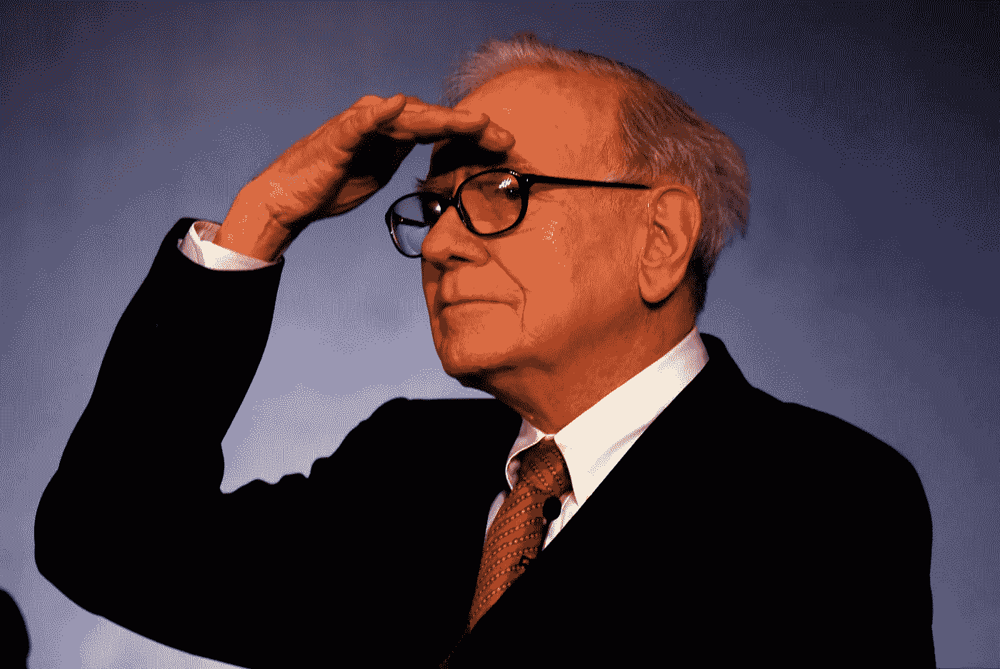
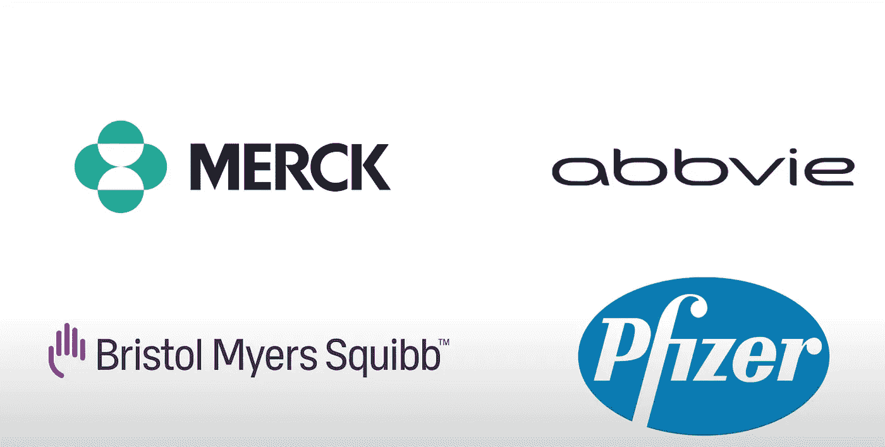
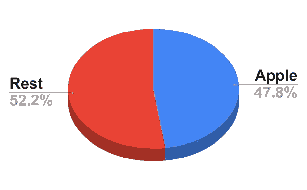

# 巴菲特正在对冲无尽的疫情

> 原文：<https://medium.datadriveninvestor.com/buffett-is-hedging-against-endless-pandemic-b437fbee2888?source=collection_archive---------12----------------------->

## 巴菲特上个季度最重要的八个举动

在疫情的无尽世界中，你会投资哪里？

**制药、5G 网络、苹果股票、云存储？**

好吧，如果你相信无止境的锁定，你可能会投资以上所有和多样化。

这正是巴菲特和他在伯克希尔·哈撒韦公司的团队所做的。

所以，让我来告诉你巴菲特在最后一个季度**的八个最重要的举措**:

# 1.抛售银行股

巴菲特延续了第二季度的趋势。他只增持了美国银行 9.2%的股票，但大幅减持了摩根大通、富国银行和 BNY 梅隆银行的股票。他看空美国金融，正如我在[上一篇文章](https://www.virtuse.com/buffett-bought-gold-and-sold-banks-and-you-should-too/)中所写的，他可能明白**“大重置”**以及数字资产和**cbdc**的出现将颠覆传统银行。

# 2.购买药品

本季度新收购的公司中有六分之四是制药公司。伯克希尔对默克、辉瑞、百时美施贵宝和艾伯维进行了新的投资。他们在每家公司都投资了大约 18 亿美元，这让我得出结论，他只是在向这个领域分散投资。

这种分配实际上是为他购买了对抗疫情的保险。这也是一部优秀的疫苗剧。

# 3.削减他在苹果的职位

巴菲特**减持苹果仓位 3.7%。这是伯克希尔第三季度投资组合中最具影响力的举措。但总的来说，他仍然非常看好苹果。这几乎占了他投资组合的一半。在全球封锁期间持有苹果股票是最明智的策略之一。**

# 4.购买 T-Mobile

T-Mobile 是最大的移动网络提供商之一，致力于推出 5G 网络。在收购了 **Sprint** 之后，它成为了**美国第二大移动网络**。因此，如果你相信延长疫情，你会想拥有一家为受限人群提供快速连接的公司的股份。

 [## 如何在不牺牲孩子或财务的情况下安全理智地离婚|数据驱动…

### 在美国，七月是以孩子为中心的离婚月。作为 cdfaⓡ的专业人士，我可以向你保证，从长远来看…

www.datadriveninvestor.com](https://www.datadriveninvestor.com/2020/07/28/how-to-divorce-safely-and-sanely-without-sacrificing-your-children-or-your-finances/) 

# 5.卖掉他的黄金

*此举令人惊讶。*先是巴菲特[买入黄金](https://www.virtuse.com/buffett-bought-gold-and-sold-banks-and-you-should-too/)震惊世界；现在，他很快卖掉了一半的头寸。这两件事都是最不像他的。如果要我推测的话，我会说他终于意识到了**比特币比黄金更好。**受欢迎的电视主持人和比特币支持者 Max Keiser 最近[在推特上](https://news.bitcoin.com/warren-buffett-gold-panic-buy-bitcoin-50k/)说*“巴菲特会像彼得·希夫一样，在 5 万美元时开始恐慌性购买比特币。”*

# 6.雪花

**Snowflake** 是为与**微软**、**亚马逊、**或 **Salesforce 等巨头进行云交易而构建的数据平台。**雪花让在家工作变得更容易。

人们可以猜测，他是在赌无止境的疫情和随之而来的基于云的数据仓库的增长。但这可能只是一次机会主义交易，因为巴菲特仅以 120 美元的价格购买了私募股权。这大约是目前市场价格的一半。

# 7.看好日本

伯克希尔收购了五家日本公司 5%多一点的股份:**伊藤忠、丸红、三菱、三井和住友。他在去年进行了这些投资，所以他可能在第三季度只购买了一小部分。**

在对待新冠肺炎和 T21 的问题上，日本是最理性的国家之一。日本从未实施过封锁，未来可能会继续这种模式。这将为日本经济提供相对于遭受严厉措施的经济体的优势。

那么这对投资者来说意味着什么呢？

在动荡时期投资时，许多投资者会借鉴巴菲特的智慧。

显然，这位奥马哈先知并不认为疫情最糟糕的时期已经过去。

就像他曾经说过的， ***“预测下雨不算，造方舟才算。”***

所以继续建造你的方舟吧。

如果你喜欢这篇文章，请在左下角“鼓掌”50 次，这样会有更多人分享。您也可以随时 [*给我发推特*](https://twitter.com/RasVasilisin) *告诉我您的想法，或者关注我*[*LinkedIn*](https://www.linkedin.com/in/rastislav-ras-vasilisin-11bb5819/)*并订阅*[*Virtuse News*](https://www.virtuse.com/)*，我们会将这些消息发送给全球 15，000 多名投资者。*

## 获得专家观点— [订阅 DDI 英特尔](https://datadriveninvestor.com/ddi-intel)