# 打造智能助手:阿里巴巴对话工作室

> 原文：<https://medium.datadriveninvestor.com/build-a-smart-assistant-alibaba-dialog-studio-3a6f0a9d6b68?source=collection_archive---------26----------------------->

*作者李永斌(水德)*

一个合适的[智能助手](https://www.alibabacloud.com/product/bot)可以帮你安排会议，处理日常办公任务，或者打电话提醒你还信用卡。作为用户和消费者，我们越来越习惯于对话机器人提供的广泛服务。然而，对于企业来说，用这些服务来构建对话机器人是困难且昂贵的。阿里巴巴 DAMO 研究院 Alime 对话式人工智能团队的高级算法专家李永斌与我们分享了他对 Dialog Studio 开发平台的想法，涉及平台的起源、设计理念、核心技术和商业应用。他还描述了这个平台如何使所有行业都能开发自己的对话机器人。

# 平台的起源

为什么有必要建立一个平台？对于这个问题，我认为应该从看一个具体的基于任务的对话例子开始。在日常工作中，我们经常要安排会议。我们的内部办公室助理是这样安排会议的:首先，我说“帮我安排一个会议”，它会问“你想哪天开会？”我回答:“后天下午三点。”然后它会问“你将会见谁？”，我列出我想参加的人。然后，助手调用后端服务来获取所有参与者的日程安排。它确保所有参与者在会议期间都有空。如果没有，它会在他们都有空的时候推荐另一个时间。因为不是每个人都在 3 点钟有空，我不得不改变会议时间。

于是我说:“上午十一点怎么样？”然后，助理会问:“会议要开多长时间？”我说，“一个小时。”接下来，它会问:“会议的主题是什么？”，我告诉它，“我们将讨论下周的发布计划。”现在，助手拥有了它需要的所有信息。最后它会给我一个总结，让我确认是否发送会议邀请。在我确认会议之后，助理将调用后端电子邮件服务来发送会议邀请。

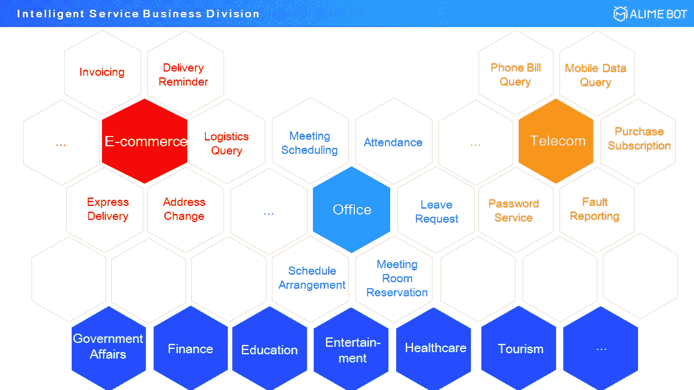

这是一个基于任务的对话的典型例子，它满足两个条件。首先，它有一个明确的目标。其次，它通过多轮对话和互动来实现这一目标。在办公室管理领域，类似的基于任务的对话框用于出勤、请假、预定会议室、安排日程以及许多其他类似的任务。

在电商行业，基于任务的对话框应用于很多场景，比如开票、发货提醒、物流查询、地址变更、快递接收等。在电信行业，此类场景包括电话账单查询、移动数据查询、订购购买、故障报告和密码更改。如果我们仔细寻找，我们可以在日常生活的各种场景中找到这种基于任务的对话，例如政府事务、金融、教育、娱乐、医疗保健和旅游等领域。基本上所有行业都需要基于任务的对话。

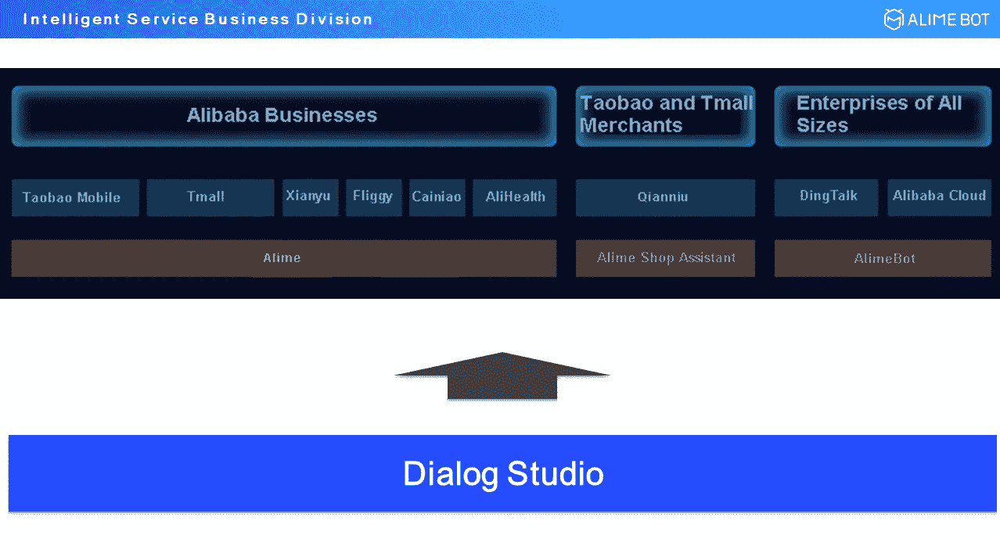

阿里巴巴智能机器人，如 Alime、Alime 店员、AlimeBot，都可以用在这些场景中。然而，由于我们不可能为每个行业的每个场景定制一个对话流程，我们采用了阿里巴巴作为平台的想法。有了这个想法，我们创建了阿里巴巴对话开发平台。在内部，我们称这个平台为对话工作室。

简而言之，我们开发了 Dialog Studio，因为我们无法为每个场景创建一个自定义的对话机器人。因此，我们想创建一个平台，开发者可以为他们自己的对话场景开发机器人。

# 设计原理

现在，我想谈谈 Dialog Studio 的核心设计理念。我觉得整体的设计理念可以总结为:“一个中心，三个原则”。“一个中心”意味着我们将对话视为平台的中心。

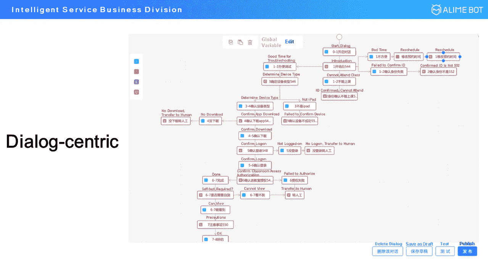

这个短语来自于过去几年的实践，世界上许多主要的对话平台都采用了以意图为中心的设计。例如，如果这些平台想要在音乐领域完成一项任务，它们实际上会查看意图列表，因此实际对话的重要性被降低到次要地位。

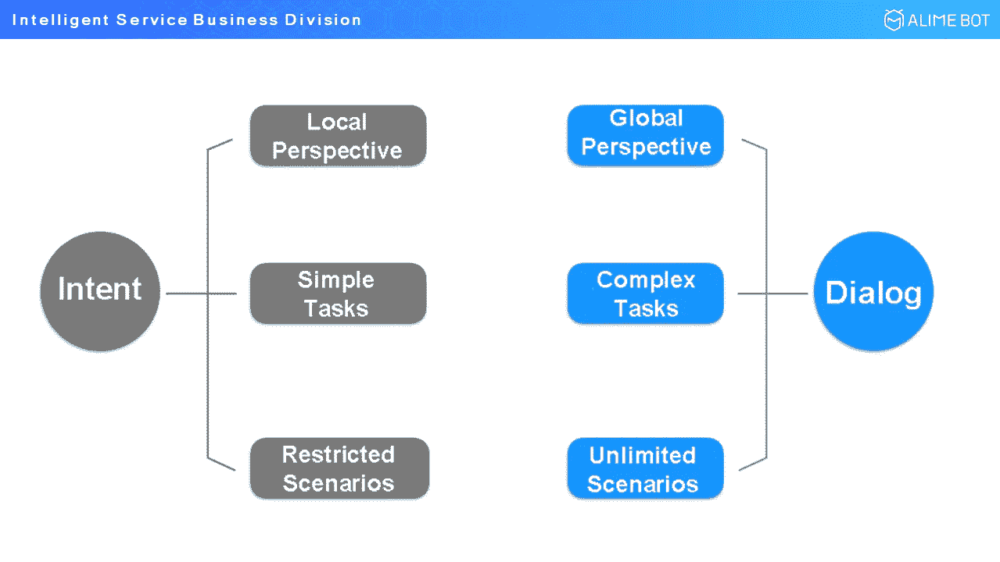

在 Dialog Studio 中，我们采取相反的方法，将对话框放在设计的中心。因此，我们的产品界面并不显示孤立的意图，而是一个与业务逻辑相关的相互联系的对话过程。在以意图为中心的设计中，你只能看到局部的视角，所以这些系统只能完成某些简单的任务，比如控制灯光、讲笑话或查看天气。当执行复杂的任务时，例如开具发票或激活中国移动的订购，以意图为中心的方法增加了使用和维护的难度。通过采取一种完全不同的方法，把对话框放回我们设计哲学的中心，我们有了一个全球视角，可以在任何场景中执行复杂的任务。

就像我刚才说的，Dialog Studio 是一个平台，而要搭建一个平台，你必须克服很多挑战。

第一个挑战是为用户提供更好的易用性。第二是允许用户为不同行业灵活定制功能。第三是允许机器人和对话系统在发布后不断改进。这是我们的平台面临的三大挑战。

为了应对这些挑战，我们制定了在平台的设计和实施过程中应遵循的三项原则。

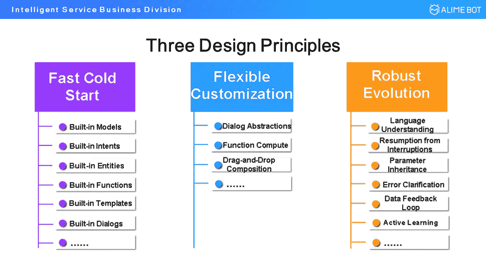

第一个原则是冷启动速度必须快，以使平台更易于使用。第二个原则是为用户提供灵活的定制能力。这样才能满足各行业各种场景的需求。第三个原则是为进化提供强大的能力。也就是说，一个模型上线后，可以不断从各种反馈数据中学习，不断提升性能。

快速的冷启动速度将用户使用的各种能力和数据转换为预设的能力。简单来说，平台做的多，用户要做的少。为了允许灵活的定制，我们必须高度抽象整个对话平台的基本元素。平台的抽象程度越高，适应性就越强。为了实现稳健的进化，我们必须深入探索模型和算法。例如，我们精心设计了语言理解模型、对话管理模型和数据反馈回路。这些是我们的设计理念和原则。接下来，我将讨论这些概念在实现过程中是如何实际应用的。

 [## 人工智能帮助你聪明理财|数据驱动的投资者

### 自动化和人工智能为创新平台提供动力，简化双方的财务流程…

www.datadriveninvestor.com](https://www.datadriveninvestor.com/2020/09/02/artificial-intelligence-helps-you-be-smart-with-money/) 

# 关键技术

在创建平台时，我们必须处理广泛的技术，包括算法、工程、前端技术和交互技术。近距离观察算法会让你对创造有更好的理解。

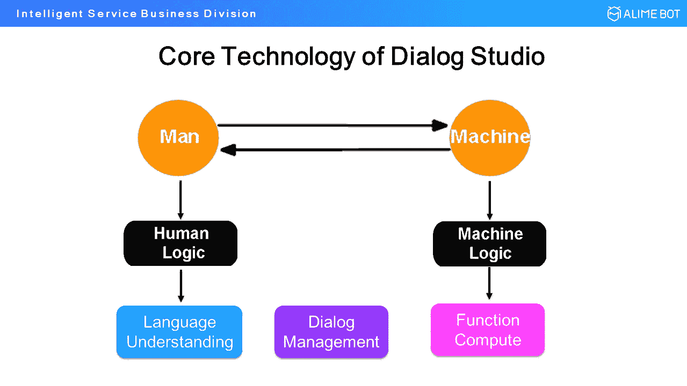

首先，Dialog Studio 用于对话框。人机对话涉及两个实体，人和机器。人类使用人类的逻辑，这就需要我们通过一种语言来表达自己的想法。因此，我们需要一个语言理解服务来处理自然语言的输入。同时，机器使用机器逻辑，将想法表达为代码。因此，需要一个函数计算服务。人和机器之间的对话过程必须得到有效的管理，因此也需要一个对话管理模块。因此，Dialog Studio 的三个核心模块是语言理解、对话管理和函数计算。

## 语言理解模块

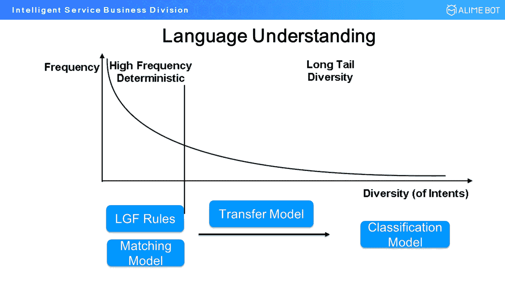

首先，让我们看一下上图。横轴表示意向的多样性，纵轴表示频率。这个有点不清楚，我们来看一个具体的例子。说我要开发票。这是一个意图。如果我们对具有相同意图的 100，000 个用户的对话输入进行采样，并测量用于表达该意图的不同单词组合的频率，则可能最常用的短语将是“开具发票”，其出现例如 20，000 次。第二个最常见的短语可能是“打印发票”，它出现了 8000 次。这两个都是高频短语。同样的意图也可以用长得多的短语来表达，如“昨天我在你的店里买了一条红裙子。能不能帮我开个发票？”这种因果关系较长的句子使用频率较低，构成了上图中的长尾。这样的短语在样本集中可能只出现一次或两次。

经过整理统计，我们可以看到，意向陈述的多样性分布是一个幂律分布。这意味着我们可以通过技术手段实现有效的目标设计。首先，我们可以对高频语句应用一些规则，比如上下文无关语法。这样可以让我们更有效的处理高频语句。然而，基于规则的方法不能一概而论。因此，我们需要使用匹配模型并计算相似度来辅助规则。这两种方法的结合使我们能够更好地处理图形的高频部分。对于低频语句组成的长尾，目前的做法是使用监督分类模型。这意味着我们必须收集或标记大量数据。在规则组件和分类模型之间，我们使用迁移学习模型。下图说明了为什么我们需要引入迁移学习模式。

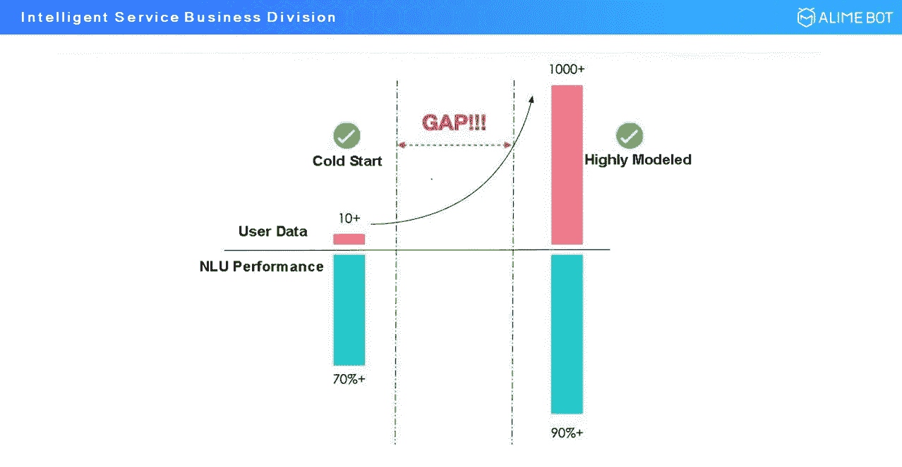

在冷启动阶段，用户输入的样本不会很多，可能是十几个到几十个样本。根据幂律分布和帕累托原理，在这个阶段可以达到略高于 70%的精度，但不会更好。但是，这个精度不够好。这种类型的模型需要能够满足提供超过 90%的精确度的需求。这就需要复杂的模型和大量的标注数据。当前绩效与预期绩效之间存在差距，这也是我们引入迁移学习模型的原因。

具体来说，我们将胶囊网络与少量学习相结合，创建了一个归纳网络。这个网络有三层:编码器、归纳和关系。

第一层，编码器层，负责将每个类的每个样本编码成一个向量。第二层，即诱导层，是三层中最重要的一层。它使用一些胶囊网络方法将同一类的多个向量归纳为一个向量。第三层，关系层，计算新输入的语句与每一类的归纳向量的关系，并输出它们的相似性得分。如果我们想要一个单一的分类结果，我们可以输出一个独热向量。如果我们不想要一个热点向量，我们可以输出一个关系分数。

在我们提出这个归纳网络结构之后，我们在学术上的少量学习数据集上测试了它。该网络显著提高了性能，目前在这些数据集上提供了最佳性能。与此同时，我们推出了网络结构，将其纳入我们的产品。

## 对话管理模块

正如我前面提到的，要赋予平台足够的适应性，它必须具有良好的抽象能力。对话管理是抽象的一部分。对话的最小单位是一轮。每一轮可以分为两部分，对话输入和对话输出。在输入和输出之间，有一个对话处理过程。这同样适用于人类的交流。当我问一个问题时，你在执行一个思考过程后回答它。如果你在回答问题之前不思考，你的答案是没有意义的。因此，这种中间对话处理过程对于真正的对话是必不可少的。

通过将对话抽象成这些组件，我们能够设计一个具有三个节点的平台:触发节点、功能节点和回复节点。

触发节点对应于对话输入，功能节点对应于对话处理过程，回复节点对应于对话输出。以这种方式抽象，您可以通过组合这三个节点来绘制您的业务工作流，而不管您的行业、场景或特定的对话过程。

让我们看一个简单的例子。说你需要查天气。过程很简单。首先，触发节点触发天气过程。该流程有两个中间功能节点。一个调用国家气象中心的 API 并返回结果。另一个节点解析并打包结果，并通过回复节点以可读格式将信息返回给用户。在这里，我还应该简单描述一下槽填充节点。在基于任务的对话场景中，几乎所有的任务都需要收集用户信息。例如，如果您想查看天气，系统必须询问所需的日期、时间和位置。这被称为槽填充。因为插槽极其常见，所以我们可以将它们预设为冷启动。为此，我们可以使用三个基本节点来构建一个槽填充模板。当我们需要填充一个槽时，我们可以拖动一个槽填充节点，并将其放在所需的位置。

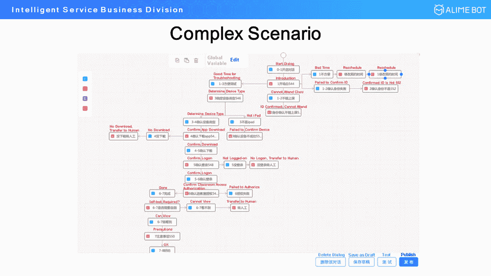

请看上图所示的复杂场景。这是一个在线教育的呼出场景。有孩子的人会知道，这是在线教育行业的普遍做法。上课前半小时，一个机器人会给用户打电话，指导他们如何下载上课 app，登录 app，进入教室。

这两个例子表明，这三个抽象节点可以用在简单和复杂的场景中。

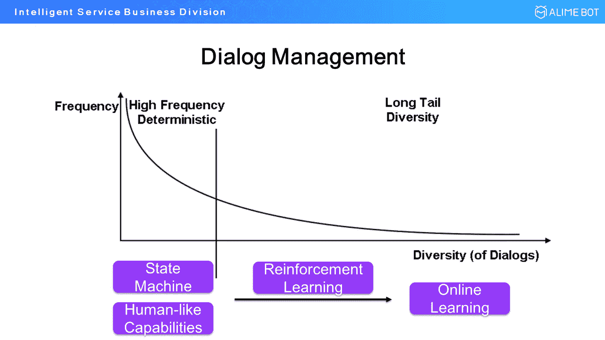

现在，让我们看看具体的对话管理技术。就实现而言，前面的图与我们在讨论语言理解时使用的图完全相同。唯一的区别是我们现在考虑对话而不是意图。

例如，如果您收集了 100，000 个天气查询对话框输入的样本，并计算了不同输入语句的频率，它们将形成一条类似上面的曲线。在一个天气查询过程中，我们必须首先填充时间段，然后填充位置时间段。然后，我们可以返回结果来完成这个过程。这可能是 100，000 个样本中的 20，000 个的过程。在其他情况下，系统可能必须提出一个问题并接收一个答案，并且可能有许多不同的答案。因此，整个对话结构本身也遵循幂律分布。

我们可以通过使用状态机来处理图形的高频部分。但是，状态机不能提供很强的容错能力。如果系统问了一个问题，但没有得到一个可理解的答案，这将导致问题。在这种情况下，有必要引入类人能力来补充状态机。在状态机中加入类似人类的能力后，我们基本上可以处理高频率的对话。长尾上的对话对于学术界和工业界的从业者来说都是一个挑战。一个好的解决方案是在发布后引入在线互动学习，这样模型可以不断地从与用户的对话中学习。但是，状态机和在线交互学习的覆盖范围存在差距。因此，我们必须使用强化学习，因为状态机本身不具备学习能力。现在，我将讨论我们在类人能力和强化学习方面正在做的工作。

我们先来看看类人能力。我们可以将用户输入分为三种类型。1)明确表达一个且仅一个意图的输入，可以被机器理解。2)未知输入，机器根本无法理解。3)模糊(不确定)输入，机器可以在一定程度上理解用户输入。例如，用户可能表达多个意图。状态机可以很好地捕获和描述明确的(确定的)输入，因此类人能力主要用于未知和不确定的输入。

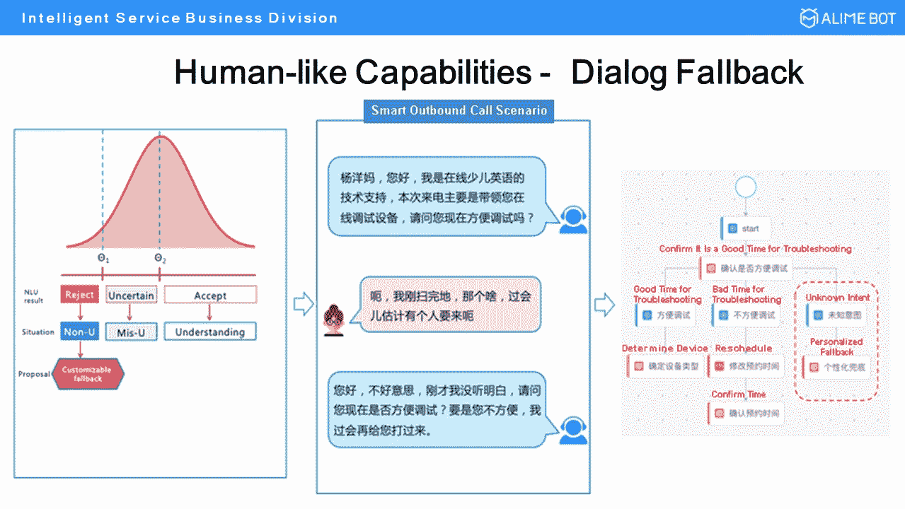

让我们考虑一个未知语句的例子。假设一个客户服务机器人打电话给一个用户，询问该用户是否可以对设备进行故障诊断。在问完这个问题后，机器人会期待一个类似于“现在是好时机”或“现在不是好时机”的回答。然而，如果机器人收到类似“我只是在这里收拾东西”的意外响应。你要的人应该一会儿就回来。”，语言模型将很难掌握语义。这时候就需要针对未知输入引入个性化的回退响应，比如“对不起，我没听懂你的响应。你现在方便排除设备故障吗？如果你不方便，我过会儿给你回电话。”这是此类系统用来处理未知输入的后备解决方案。

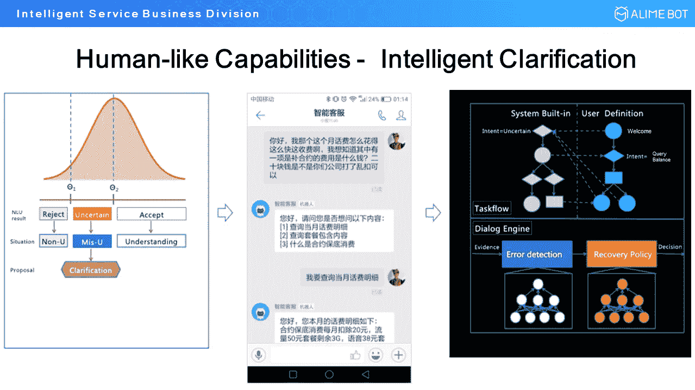

接下来，我们来看看当原始输入不明确时，机器人如何澄清用户输入。在分析了大量数据后，我们发现歧义主要发生在两种情况下。第一种是当用户在一条语句中表达多种意图时。第二种是当用户在表达意图之前给出大量的背景信息。在这些情况下，我们的语言模型可以输出一个意图概率分布，对话管理模块可以使用它在另一轮对话中要求用户澄清。例如，上图中电信领域的示例有三个意图。用户想询问他的电话账单详情，询问他的订购，并询问合同的最低金额。作为响应，系统要求用户从这三个问题中阐明他或她的意图。

图中显示了该解决方案的技术细节。开发人员必须用流程图清楚地描述对话过程，但澄清过程实际上是我们系统的内置功能。澄清过程的实现时间由两个底层引擎决定。第一个是错误检测引擎，它检测是否必须对用户输入进行澄清。如果它确定需要澄清，它将任务移交给恢复策略引擎。这第二个引擎决定了如何实现澄清以及如何生成澄清语言。这就是我们目前澄清过程的工作方式。

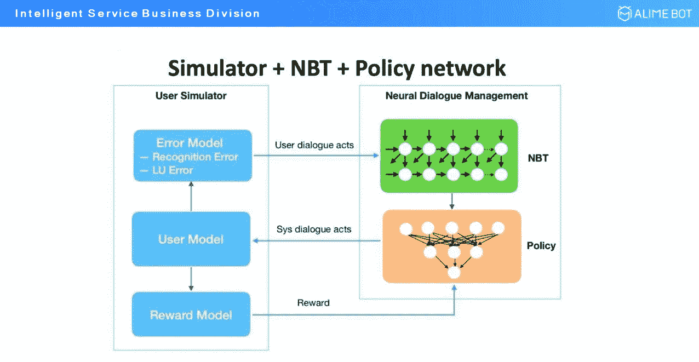

现在，让我们来看看我们在强化学习方面的进展。对话管理模型通常分为两个子模块:用于跟踪对话状态的神经信念跟踪器和用于行为决策的策略网络。从整体框架来看，我们可以用两种方法来训练这个网络。一种是端到端培训，应用强化学习。然而，这种方法的收敛速度普遍较慢，训练效果较差。第二种方法是单独的预训练。目前，通过监督学习的训练提供了良好的结果。通过使用这种方法，不需要通过强化学习来执行训练。相反，我们可以执行强化学习，通过监督学习来调整预训练的模型。

无论我们是进行一步到位的端到端训练，还是先训练再调优，只要涉及到强化学习，总是需要一个外部环境的。因此，在我们的实现架构中，我们引入了一个模拟器，即用户模拟器。这个模拟器由三个主要模型组成。一个是用户模型，用来模拟人的行为。二是误差模型。在用户模型模拟人类行为之后，误差模型引入误差扰动。用户模型只输出概率为 1 的结果，这对于网络训练是不够的。误差模型扰乱了这个结果，并引入了其他几个结果。然后，它重新计算概率分布，以提高已训练模型的可扩展性和泛化能力。第三个模块是奖励模型，它提供一个奖励值。这就是我们目前在对话管理强化学习领域所做的工作。

## 函数计算模块

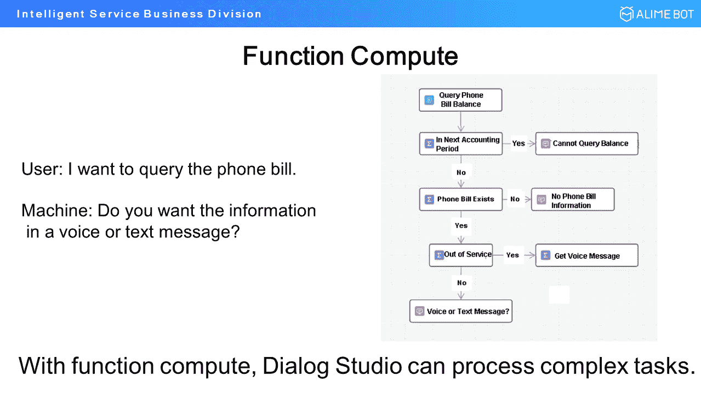

让我提供一个例子来更好地解释函数计算。假设一个中国移动用户想要查看他的电话账单。当用户接通客户服务号码时，客户服务机器人将通过文本或语音消息进行回复。从表面上看，这似乎是一个简单的一输入一输出的过程。然而，实际上，需要几轮服务查询才能获得最终结果。当用户请求电话账单细节时，函数 compute 用于获取当前日期。如果当前日期在下一个会计期间，例如当月的最后一天，则话费查询服务不可用。如果日期允许电话账单查询，系统必须首先确定用户是否确实有电话账单。如果是，系统进行第三次呼叫以检查用户的设备是否不在服务区。如果是，系统必须发送语音消息，因为用户将不能接收文本消息。如你所见，这个过程其实很复杂。目前，所有这样的进程都是通过运行代码在机器人端实现的。函数 compute 允许 Dialog Studio 处理复杂的任务。

# 商业应用

最后，让我们考虑一些 Dialog Studio 的业务应用程序。在中国浙江省，Dialog Studio 用于 114 热线。当有人非法停车并把你挡在门外时，你可以拨打这条热线，让系统自动呼叫，要求违规者把车开走。第二个例子来自贷款托收领域。此外，在刚刚过去的双 11 购物节期间，Dialog Studio 在电商领域被大规模应用。它在这个领域的主要应用是 Alime 店员和 AlimeBot。

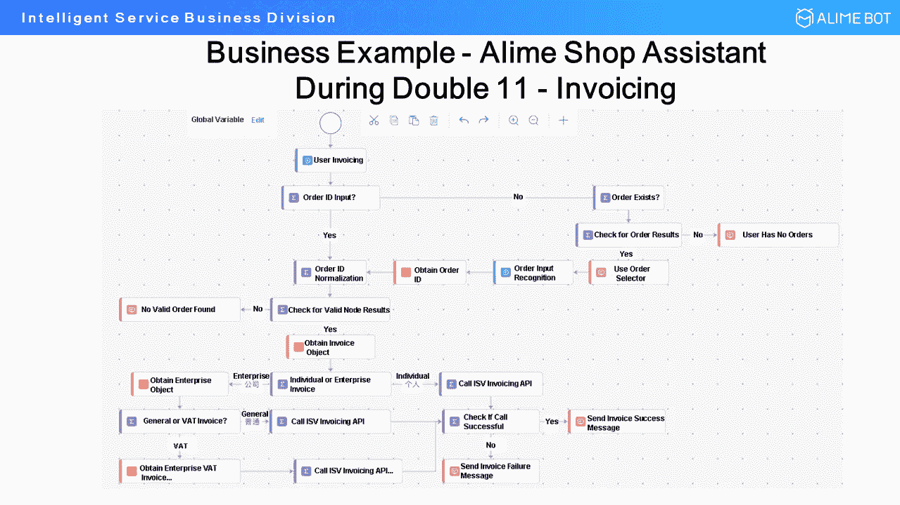

Alime 商店助理主要处理发票，送货提醒，地址更改，以及其他类似的流程。当用户请求发票时，系统必须执行复杂的过程。首先，用户可能已经提供了订单号，否则，系统必须调用后端订单查找系统，该系统使用订单选择器来选择适当的订单。接下来，系统必须确定发票是个人发票还是企业发票，因为这决定了后续的流程。接下来系统询问是普通发票还是增值税发票。如果是普通发票，流程继续。如果是增值税发票，系统必须获取企业的增值税税号。最后系统汇总信息，调用后台开票系统开具发票。这是双 11 期间使用的开票流程。

AlimeBot 主要服务于阿里巴巴集团的业务部门。对于我们最大的业务淘宝移动，在用户主页上提供了 AlimeBot 客户服务功能。就在上个月，我们为优酷推出了优酷 AlimeBot。我们最大的新零售项目星巴克也在很多场景下使用 AlimeBot。

通过 DingTalk 智能工作助手，Dialog Studio 为数百万企业提供智能考勤、智能 HR 和其他对话服务。

总之，Dialog Studio 目前为阿里巴巴经济体的所有内部业务(如淘宝、优酷和 Hema Fresh)、淘宝和天猫上的商家、数百万使用 DingTalk 的公司、使用我们的公共云的公司以及政务、电信和金融等关键行业的私有云用户提供服务。到目前为止，我们已经为世界各地的客户提供服务，包括新加坡、印度尼西亚、越南、泰国、菲律宾和马来西亚。我们允许所有行业的开发者创建他们自己的对话机器人。

# 原始来源:

 [## 打造智能助手:阿里巴巴对话工作室

### 李永斌 2020 年 9 月 17 日 358 作者:李永斌(水德)一个合适的智能助手可以帮你安排会议…

www.alibabacloud.com](https://www.alibabacloud.com/blog/build-a-smart-assistant-alibaba-dialog-studio_596646) 

## 访问专家视图— [订阅 DDI 英特尔](https://datadriveninvestor.com/ddi-intel)