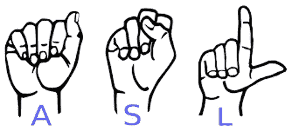
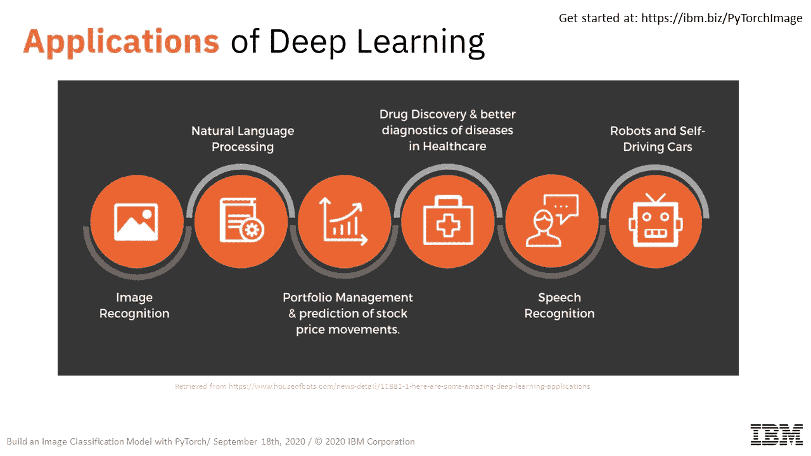
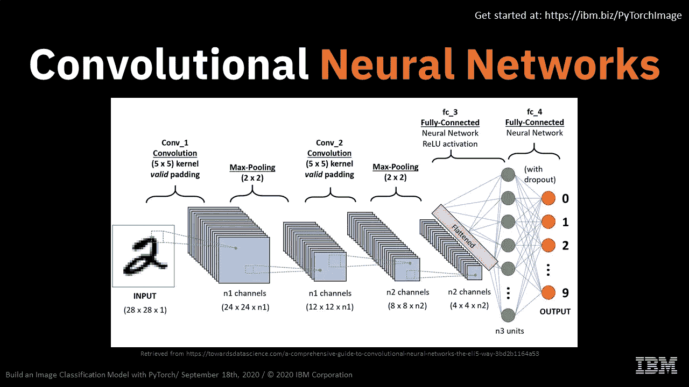
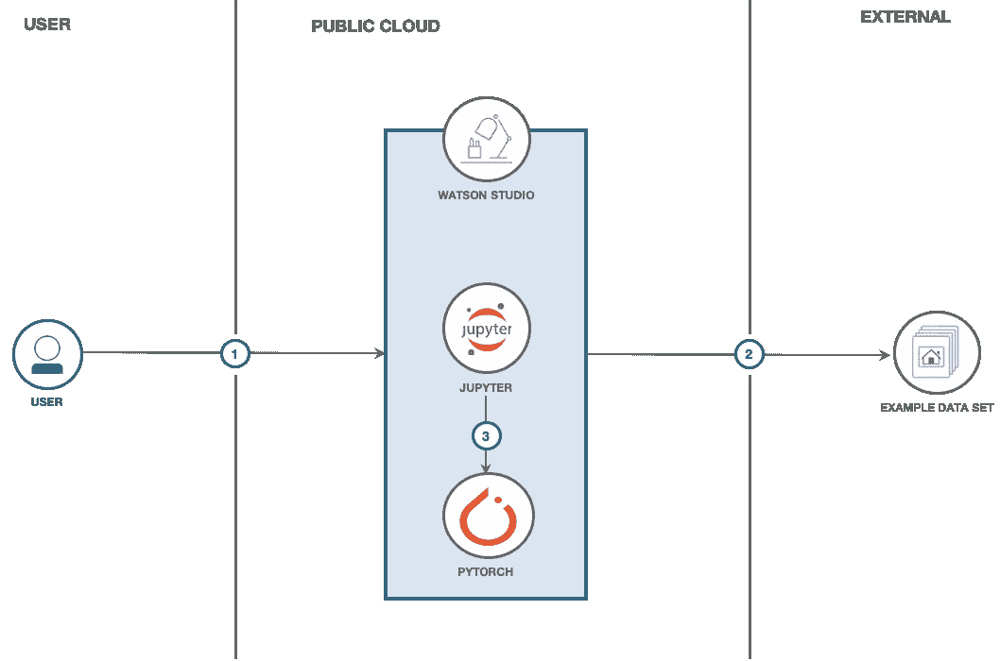

# 使用 PyTorch 构建图像分类模型

> 原文：<https://medium.datadriveninvestor.com/build-an-image-classification-model-using-pytorch-c5d00a77334e?source=collection_archive---------16----------------------->

深度学习在过去十年中获得了很大的发展势头，从语音识别到医学成像，甚至预测股票价格，都有大量的应用。像 **Pytorch** 这样的框架可以帮助我们在几秒钟内执行构建深度学习模型所涉及的所有步骤，同时让我们利用**图形电源单元(GPU)** 和其他高级功能的力量！

国家耳聋和其他交流障碍研究所(NIDCD)指出，有 200 年历史的美国手语是一种非常复杂的语言(字母手势只是其中的一部分)，但却是许多失聪的北美人的主要语言。也就是说，在 2020 年 9 月 18 日，IBM 开发人员倡导者 [Sidra Ahmed](https://medium.com/u/54c4e6d89bb7?source=post_page-----c5d00a77334e--------------------------------) 和 [Fawaz Siddiqi](https://medium.com/u/2ab32e8898e0?source=post_page-----c5d00a77334e--------------------------------) 举办了一场关于如何 ***建立和训练深度学习模型的研讨会，将美国手语(ASL)字母分为 29 类(26 个 ASL 字母、空格、del 和 nothing)，这些字母可以在以后用于帮助重听人与他人以及与计算机进行交流。***

网络研讨会分为两部分，第一部分由 Sidra 主持，她使用时间轴解释了人工智能、机器学习和深度学习背后的基本概念。她还谈到了深度学习的一些有趣的应用，包括**自然语言处理(NLP)、药物发现、语音识别**等。

此外，她为观众提供了传统神经网络架构以及**卷积神经网络架构的内部工作原理的技术逐步演示。**

最后，她通过讨论 PyTorch 的重要性结束了前半部分，py torch 是一个开源的深度学习框架和一个基于 Python 的科学机器学习包。PyTorch 的不同高级功能使其成为深度学习领域的一个引人注目的参与者，这些功能也在这半个研讨会中提出。

在研讨会的前半部分之后，Fawaz 主持了实践会议，旨在建立和培训一个深度学习模型，将美国手语(ASL)字母分为 29 类(26 个 ASL 字母、空格、del 和无)。所使用的数据集在 Kaggle 上是公开的。Fawaz 运行了笔记本单元，并对笔记本中的每个单元进行了深入的演练，从数据探索到模型构建和训练的整个过程。

以下是研讨会练习的流程和架构:

1.  登录沃森工作室。
2.  获取您的 Kaggle API 证书。
3.  在 Watson Studio 中运行 Jupyter 笔记本。

与会者遵循了代码模式，并且互动得非常好。Fawaz 和 Sidra 在整个会议过程中回答问题，保持高度参与。

在网上研讨会结束时，与会者被介绍了更多可用于构建深度学习模型的工具和框架，以及一些 [***IBM 开发人员***](https://developer.ibm.com/) 资源。许多与会者对网上研讨会表现出积极的反馈和赞赏，希望了解更多关于手边使用案例的信息。

有兴趣自己做这件事吗？

报名 IBM Cloud [**这里**](https://ibm.biz/PyTorchImage)

在这里 找到动手码模式

**您可以在 处找到 [**车间材料(幻灯片)**](https://github.com/fawazsiddiqi/ASL-Pytorch/tree/master/slides)**