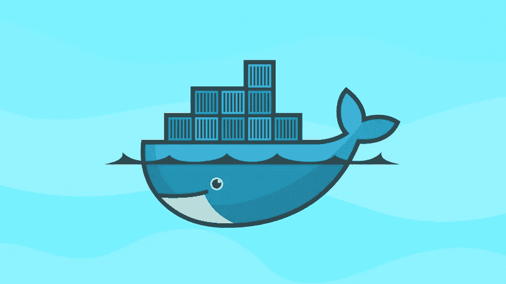
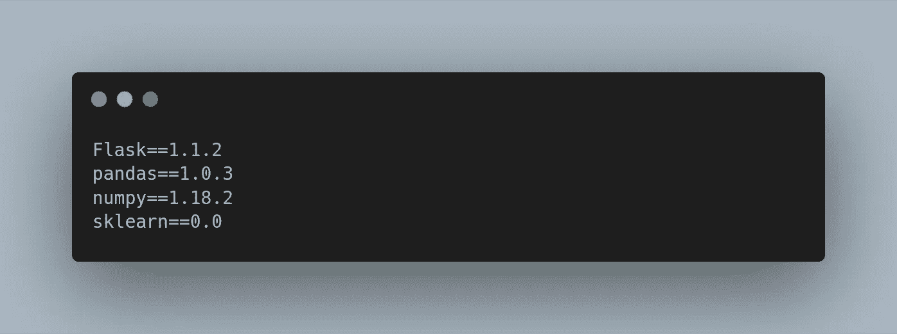
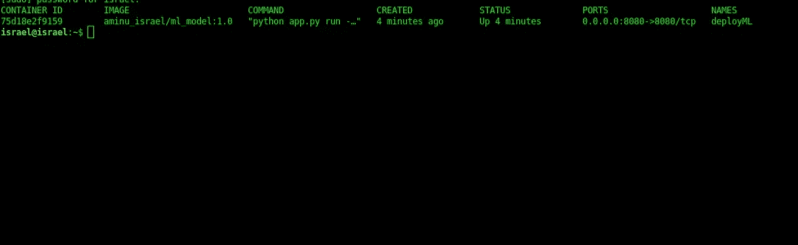

# 使用 Docker 构建和部署您的机器学习应用程序

> 原文：<https://medium.datadriveninvestor.com/build-and-deploy-your-machine-learning-application-with-docker-f6ec5acdf2ff?source=collection_archive---------1----------------------->

有没有部署过一个机器学习模型，它在你的本地计算机上运行得非常好，但是当它被部署到生产环境中时，代码在另一台机器上就崩溃了或者更糟？在这篇文章中，我将带你了解如何使用一个名为“Docker”的流行工具来运行和部署你的机器学习模型。



# 那么 Docker 是什么？

Docker 是一个工具，通过使用所谓的**容器，可以更容易地创建、部署和运行任何应用程序。**它也是一个软件平台，用于创建 **Docker 映像**，这些映像在部署后将被称为 Docker 容器。

Docker 容器是一个隔离的环境，包含了应用程序运行所需的所有依赖关系，它通常被称为 Docker 映像的运行实例。

*Docker 镜像* 是一个文件(只读)，由多个层组成，用于执行 Docker 容器中的代码。Docker 映像位于一个被称为 **Docker hub 的大型 Hub 中。**因此，您可以从中心提取图像，或者从基础图像构建自定义图像，当这些图像被执行时，它们将充当您的应用程序的容器。

[](https://www.datadriveninvestor.com/2020/03/24/encoder-decoder-sequences-how-long-is-too-long/) [## 编码器解码器序列:多长是太长？数据驱动的投资者

### 在机器学习中，很多时候我们处理的输入是序列，输出也是序列。我们称这样的一个…

www.datadriveninvestor.com](https://www.datadriveninvestor.com/2020/03/24/encoder-decoder-sequences-how-long-is-too-long/) 

因此，将这些部分结合在一起，我们可以简单地将 Docker 定义为:

> 一个软件平台，通过创建 Docker 映像使创建和部署任何应用程序变得更容易，Docker 映像将成为一个 Docker 容器，其中包含我们的应用程序在部署后工作所需的所有依赖项和软件包。

# 码头工人的好处

*   Docker 解决了在不同的开发阶段拥有相同的环境以及在您的应用程序中拥有独立环境的问题。
*   Docker 允许您从任何地方运行您的应用程序，只要您在那台机器上安装了 docker。
*   Docker 为您提供了快速扩展的自由。
*   轻松扩展您的开发团队。

# 安装 Docker

Docker 可以跨多种平台使用，无论你使用的是 Linux、Windows 还是 Mac 电脑，你都可以点击这里的安装指南[](https://docs.docker.com/)

*****

*现在我们已经了解了 Docker 的基础知识，并且您已经让 Docker 在您的机器上运行了，让我们继续使用它部署一个机器学习应用程序。*

***工作目录***

*对于我想要部署的模型，我的工作目录看起来是这样的:*

```
*.
├── app.py
├── Dockerfile
├── ML_Model
│   ├── Diabetestype.csv
│   ├── model.pkl
│   └── model.py
└── requirements.txt1 directory, 6 files*
```

***app.py***

*app.py 是一个 python 脚本，其中包含我使用 flask 为我的机器学习模型构建的 API。我定义了 API 端点和路径，我们如何从 web 接收数据，如何处理数据，以及如何将预测作为响应返回。*

***ML _ 模型***

***ML_Model** 目录包含 ML 模型，我用来训练模型的数据，以及模型被训练后生成的 pickle 文件，API 将使用这些文件。*

***requirements.txt***

*requirements.txt 文件是一个文本文件，它包含了我们的应用程序运行所需的所有 python 包。我使用的一些包是:*

**

*requirements.txt*

***Dockerfile***

*Docker 文件是定义 Docker 图像的文本文件。当您想要用于项目的基础图像不能满足您的需求时，您将使用 Docker 文件来创建您自己的自定义 Docker 图像。对于我将要部署的模型，我的 Dockefile 看起来是这样的:*

*在我的 Docker 文件中，我提取了 Docker 基础映像 python:3.7，更新了系统依赖项，在 requirements.txt 文件中安装了包，运行 ML 代码来训练模型并生成 API 将使用的 pickle 文件，最后在本地运行服务器。*

*现在，让我们使用以下命令从我们创建的 Docker 文件构建 Docker 映像:*

```
*israel@israel:~/Documents/Projects/Docker_ML$ docker build -t aminu_israel/ml_model:1.0 .*
```

*我将我的自定义图像命名为“aminu_israel/ml_model ”,并将标签设置为 1.0。请注意“.”在命令的末尾，意味着我告诉 Docker 在我的当前目录中定位 Dockerfile，这个目录是我的项目文件夹。如果它成功了，您应该会得到这样的结果:*

```
*Sending build context to Docker daemon  249.3kB
Step 1/16 : FROM python:3.7
 ---> cda8c7e31f89
Step 2/16 : MAINTAINER aminu israel <[aminuisrael2@gmail.com](mailto:aminuisrael2@gmail.com)>
 ---> Running in cea1c80b990f
Removing intermediate container cea1c80b990f
 ---> 2c82fc9c1b5a
Step 3/16 : ENV PYTHONDONTWRITEBYTECODE 1
 ---> Running in 6ee3497a7ff4
Removing intermediate container 6ee3497a7ff4
 ---> 56f5f9838610
Step 4/16 : ENV PYTHONUNBUFFERED 1
 ---> Running in 1f53b581eed7...Step 16/16 : CMD [ "app.py","run","--host","0.0.0.0"]
 ---> Running in 1f7fc05b4e12
Removing intermediate container 1f7fc05b4e12
 ---> 8636b5bc482e
Successfully built 8636b5bc482e
Successfully tagged aminu_israel/ml_model:1.0*
```

*您可以使用以下命令检查您创建的新图像:*

```
*israel@israel:~$ docker images*
```

*现在我们已经成功构建了映像，让我们使用以下命令运行 docker 映像:*

```
*israel@israel:~$ docker run --name deployML -p 8080:8080 aminu_israel/ml_model:1.0*
```

*如果成功，您应该会看到如下结果:*

```
** Serving Flask app "app" (lazy loading)
 * Environment: production
   WARNING: This is a development server. Do not use it in a production deployment.
   Use a production WSGI server instead.
 * Debug mode: off
 * Running on [http://0.0.0.0:8080/](http://0.0.0.0:8080/) (Press CTRL+C to quit)*
```

*要检查 docker 容器是否正在运行，请使用以下命令:*

```
*israel@israel:~$ docker ps*
```

*你会看到这样的结果:*

**

*这表明新容器当前正在运行。要获得完整的 docker 文档，您可以查看这里的。*

***现在，您已经使用 docker 成功地部署了您的 ML 模型。***

*你可以在这里获得这篇文章的代码*

*感谢阅读😀*

*您可以通过以下方式联系我:*

*电子邮件:aminuisrael2@gmail.com*

*推特:@aminu_israelb*