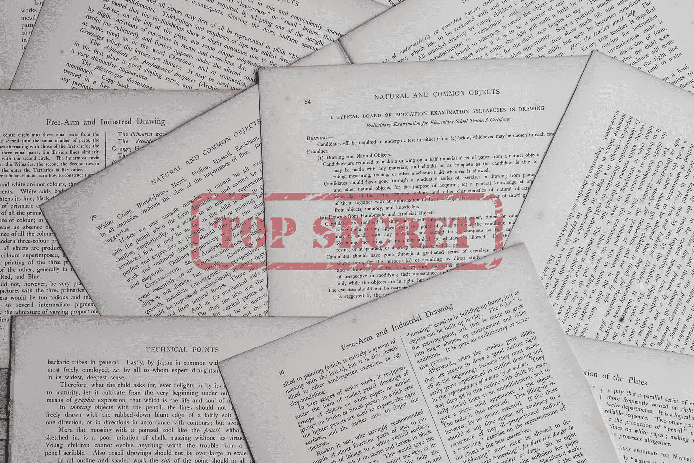
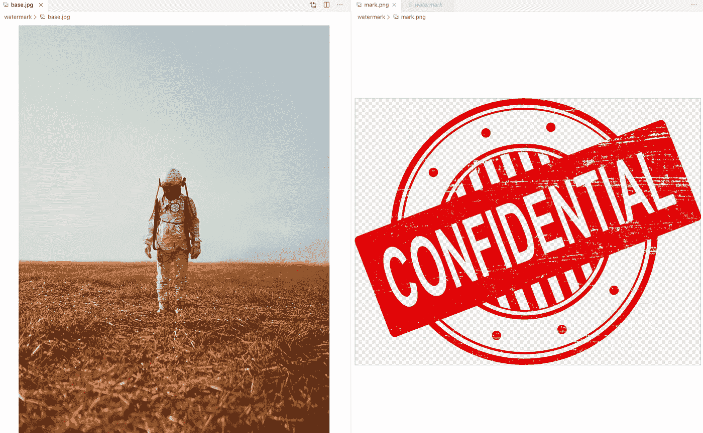
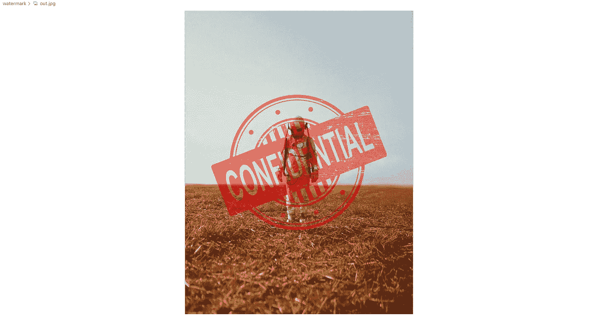

# 在 Go 中为品牌或安全目的构建图像水印应用程序

> 原文：<https://medium.datadriveninvestor.com/build-image-watermark-app-for-branding-or-security-purpose-in-go-80f7ee15003b?source=collection_archive---------18----------------------->

编写一个小的便携式 Go 应用程序，将一个徽标放在一幅图像的顶部



Watermarked documents. Original Photo by [Annie Spratt](https://unsplash.com/@anniespratt?utm_source=unsplash&utm_medium=referral&utm_content=creditCopyText) on [Unsplash](https://unsplash.com/s/photos/document?utm_source=unsplash&utm_medium=referral&utm_content=creditCopyText)

# 背景

通过放置品牌标识来保护图像格式的内容是业内称为水印的常见做法。没有人想使用带水印的图像。移除水印的努力相当高，从而使得未授权方失去了窃取内容的意图。这种尝试被证明可以改善安全措施。

[](https://www.datadriveninvestor.com/2019/01/23/which-is-more-promising-data-science-or-software-engineering/) [## 数据科学和软件工程哪个更有前途？数据驱动的投资者

### 大约一个月前，当我坐在咖啡馆里为一个客户开发网站时，我发现了这个女人…

www.datadriveninvestor.com](https://www.datadriveninvestor.com/2019/01/23/which-is-more-promising-data-science-or-software-engineering/) 

水印也可以作为审计工具。当向外部发送机密图像时，必须在其中添加包含收件人姓名和使用案例的水印。想象一下，当一张机密图像泄露时。很难确定泄漏的源头在哪里。但是如果图像包含水印，我们可以通过看水印来判断图像是从哪一方泄露的。另一方面，只有公司的内部人员能够得到没有水印的图像。如果没有水印的图像泄露，它一定是来自内部人员。

# 目标

为带有公司标签图像的图像文件创建水印

# 伪代码

1.  获取基础图像的原始图像文件
2.  获取徽标图像的原始图像文件
3.  计算徽标位置
4.  合并这两个文件
5.  写入图像文件

# 履行

该应用程序需要以下依赖项。

```
 "flag"
 "fmt"
 "image"
 "image/color"
 "image/draw"
 "image/jpeg"
 "image/png"
 "log"
 "os"
 "strings"
```

创建一个名为`readImage`的函数来读取文件并将其转换成图像对象。我们使用这个函数两次。(在伪代码中反映步骤 1 和 2)

创建另一个名为`writeImage` 的函数，将图像对象写入文件。添加水印完成后，应用程序调用函数。(在伪代码中反映步骤 6)

一旦子函数可用，就该创建名为`createWatermark`的主函数了。该函数调用`readImage`两次，然后处理步骤 3 和 4。最后，函数调用`writeImage`来编写输出文件。

步骤 3 注释的代码显示了添加水印的过程。在上面的代码示例中，应用程序将徽标居中对齐。您可以通过修改`x`和`y`值来调整位置。

```
offset := image.Pt(x, y)
x ==> distance from left
y ==> distance from topimage.Pt(0, 0) ==> watermark at the very top-left
```

此外，请注意步骤 4 注释的代码。您可以更改不透明度以符合产品要求。

```
image.NewUniform(color.Alpha{255}) ==> 100% solid
image.NewUniform(color.Alpha{128}) ==> 50% opacity
image.NewUniform(color.Alpha{64}) ==> 25% opacity
image.NewUniform(color.Alpha{0}) ==> transparant
```

功能`createWatermark`独立工作。任何包都可以导入该函数。在这个示例中，为了制作一个可移植的 Go 应用程序，我们需要创建`main`函数来读取用户输入(作为标志)并将其传递给该函数。

# 运行应用程序

使用下面的 Go 命令将代码构建到 Go 应用程序中。

```
go build -o watermark
```

为基础图像和徽标图像准备两个图像文件。将文件分别命名为`base.jpg`和`mark.png`。



The base image at the left and logo image at the right.

现在，运行 go 应用程序，将图像文件名传递给右边的标志。

```
./watermark -base=base.jpg -mark=mark.png -output=out.jpg
```

该应用程序在与 Go 应用程序相同的文件夹中创建名为`out.jpg`的输出。



Watermarked image. Astronaut with a confidential label.

# 摘要

水印的实现增加了防止内容误用的保护和优秀的审计工具。看看上面的代码——实现水印的工作非常简单。如果你的业务/产品是与其他方沟通，那么水印是必须的。

> 完整代码: [Git 库](https://github.com/purnaresa/secureme/tree/master/watermark)

本文中的示例是创建一个 Go 应用程序。但该功能本身也可以放在任何现有的 Go 应用程序中。

下一步是什么？你也有需要有水印的 PDF 吗？