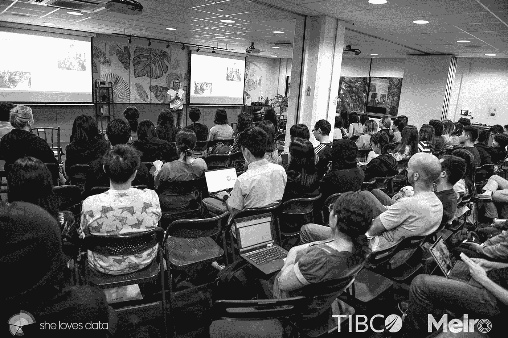
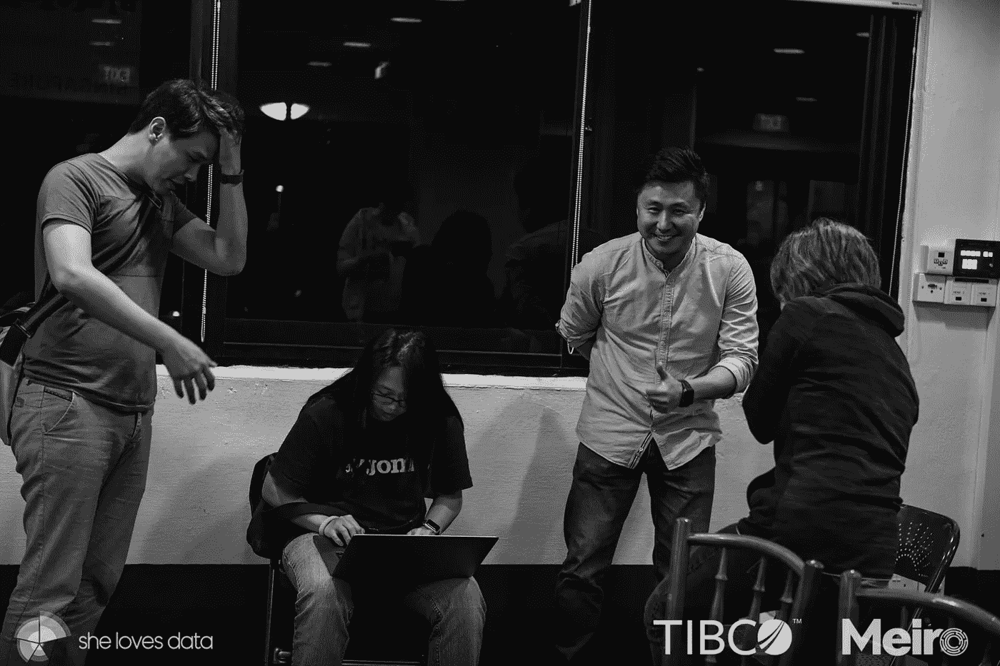
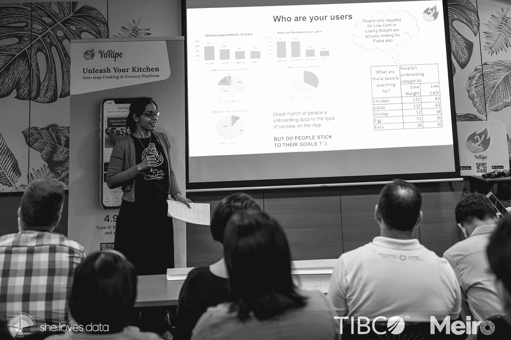
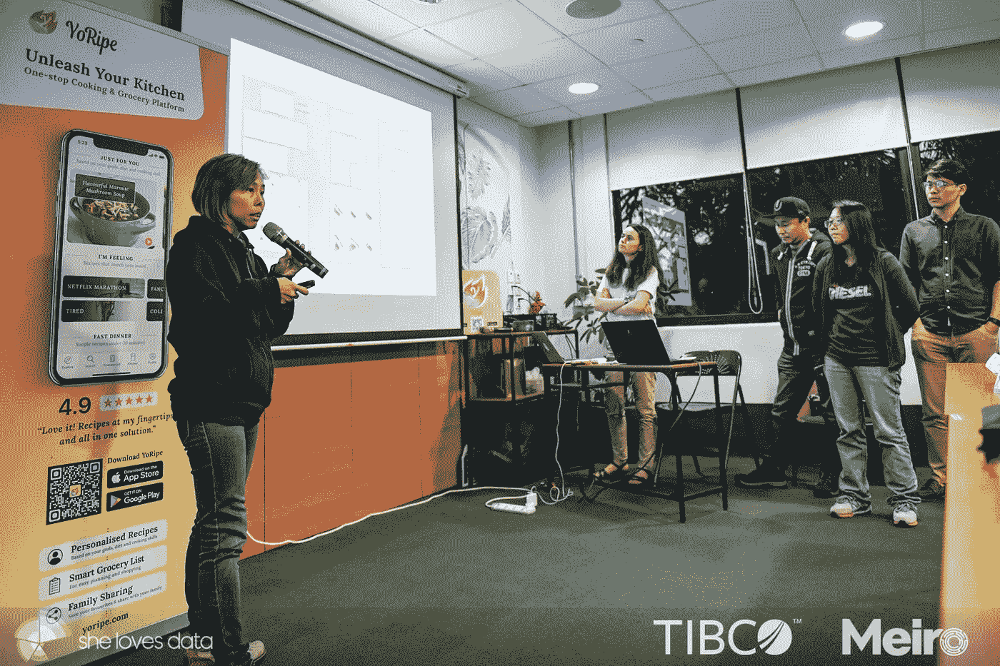
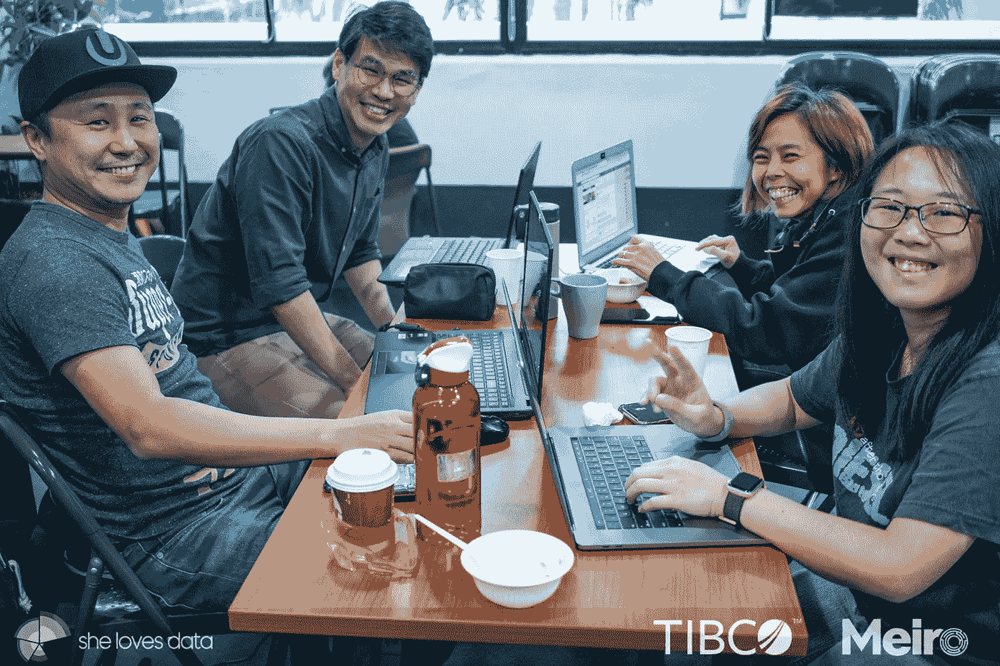
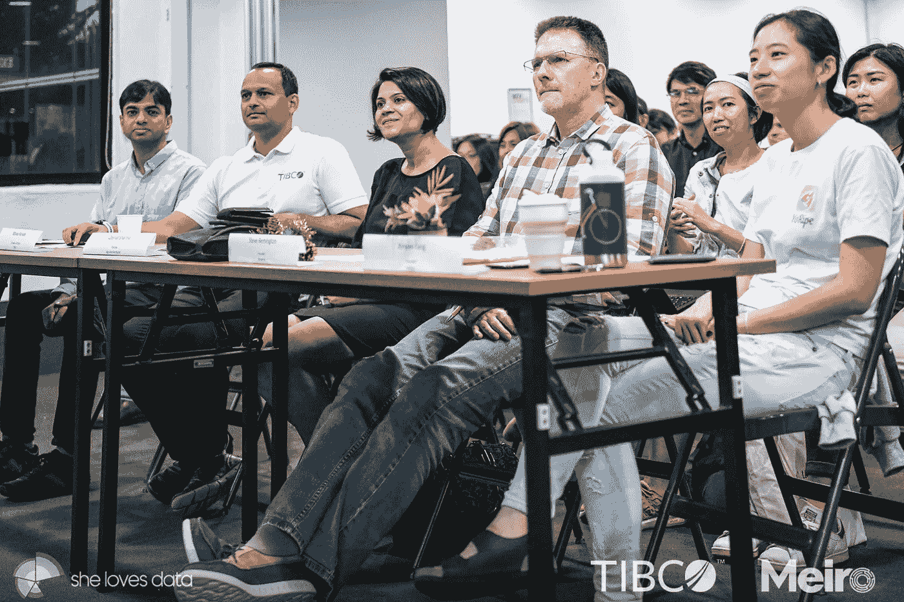
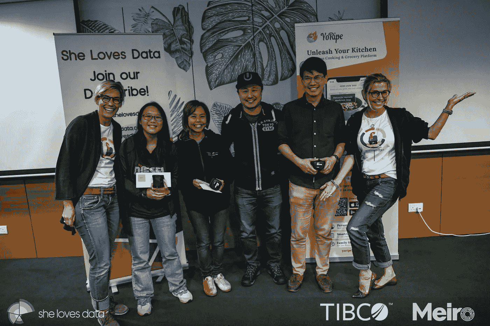

# 在数据黑客马拉松中积累您的新技能

> 原文：<https://medium.datadriveninvestor.com/build-on-your-new-skills-at-a-data-hackathon-86a2f0492a6?source=collection_archive---------17----------------------->

Photo by [David Werbrouck](https://unsplash.com/@bigkids?utm_source=medium&utm_medium=referral) on [Unsplash](https://unsplash.com?utm_source=medium&utm_medium=referral)

> 声明:这是我参加的 COVID19 之前的黑客马拉松活动，因此照片中没有面具！

作为我开始新职业的计划的一部分，我寻找机会应用和实践我所学的知识。我希望在开发产品洞察力方面有更多的经验，特别是使用数据，这种愿望促使我参加了由 [ShelovesData](https://shelovesdata.com/) 组织的第一次数据黑客马拉松。

我报名参加了这个活动，渴望了解真实世界的数据，并结识其他数据分析师或开发人员，但我不知道会发生什么！这是我第一次参加数据黑客马拉松，我很紧张，我的声音设计背景和最近接触到的数据可能没什么用。

尽管如此，我还是决定从这次活动中吸取教训，虽然我并不在乎输赢，但我的团队赢得了两项大奖！

# 该过程

我报名参加的数据黑客马拉松始于周五晚上的一系列讲座，随后是数据集演示和我们被要求解决的业务问题。然后，我们分成几个小组，一直工作到第二天，也就是周六结束，届时，各个小组将针对公司面临的业务问题提出他们的解决方案或建议。

组织者解释说，找到拥有不会对黑客攻击太无聊的数据的公司需要一些时间。这意味着数据黑客马拉松可能不会经常发生，如果你感兴趣，只要你在活动列表上看到一个就注册吧！

在观看了 15 个团队的表演后，以下是我的一些心得:

## 1.建立多元化的团队

*   认识不同背景的人
*   和你不认识的人坐在一起
*   利用每个人的力量

My team on the first day of the Hackathon

我坐在一个我刚刚认识的女孩安西娅旁边，和她一起合作。她一直在工作中进行数据清理，她渴望看到如何使用数据解决业务问题。我的一个朋友迪伦和他的朋友安东尼加入了我们，他们都在业余时间学习机器学习，但一个有工程背景，另一个有商业背景。

我们采纳了导师的建议，利用每个人的力量，这成为我们一开始就分享的第一件事。在我们开始分析数据或业务问题之前，我们就已经了解了彼此的背景、经历和优势。这有助于我们找出在解决方案中可以扮演的最佳角色。

拥有不同的背景意味着我们能够利用各自独特的技能来更好地理解问题。我们中的一些人专注于清理数据，一些人研究类似业务需求的现有解决方案，一些人着眼于更好地了解行业，而我则致力于采访问题所有者，了解她在业务问题上的经验，以及他们的业务模式所处的环境。

我们的团队很清楚，我们的每一个观点和优势都有助于构建我们提交给问题所有者和评委的最终建议。

## 2.利用数据开发洞察力

*   从数据中获得基本的洞察力
*   阐明假设和挑战
*   使用数据寻找机会

A team by [Meiro](https://meiro.io/) presenting their insights and findings

因为这是一个数据黑客马拉松，我们需要确保我们的见解和建议是从我们拥有的真实数据中发展出来的。

我们面临一些困难，因为我们收到的数据不完整，而且我们不清楚这些数据是如何收集或分组的。我们没有时间对数据进行彻底的调查，所以我们只能从基本的、可以快速开发的角度出发。我们寻求*而不是*来获得完整的图片，而是获得对数据的良好理解，并将它集中在业务问题和我们可以提供的解决方案上。

这个决定被证明是正确的！评委们喜欢我们展示我们可以用“脏”数据做什么的方式，用它来提出可以为消费者提供更好价值的建议。他们也非常喜欢我们使用我们已经拥有的东西来创建解决方案，而不是跳进一个我们没有数据的机器学习建议。

## 3.在展示见解时使用视觉叙事技巧

*   保持它的相关性和简洁
*   秀不说。使用简单的图像或图标来帮助联想
*   构建用户故事，关注解决方案的核心价值

Me! presenting our team’s recommendations

除了陈述的时间限制(每组 3 分钟)之外，我们认识到在听了这么多人的发言后，让评委保持注意力集中可能是一件很麻烦的事情。这意味着使用有效的讲故事技巧，保持叙述的简洁和相关性，对于将你的信息和建议传达给问题所有者和评委是至关重要的。

我和我的队友致力于创建简单、易于理解的图表，选择针对特定情况而非一般情况的相关图像，并使用有意义的图标快速将观众与我们推荐的用例及解决方案联系起来。

在活动结束时，我们的团队被告知，我们对视觉效果的选择以及我们构建演示文稿的能力是我们做对的一些事情。

## 4.创建一个工作原型

*   制作一个互动模型
*   创建流程的可视化
*   用真实数据测试一下

似乎显而易见的是，一个原型，尤其是一个互动的模型，将最有助于解释和推销一个想法，但没有多少团队有时间去做一个。这意味着那些展示了一个的人脱颖而出。

我在黑客马拉松上没有预料到的一个惊喜是，大多数解决方案都是相似的。尽管如此，尽管许多解决方案听起来相似，但每个团队对实际执行都有不同的看法。这意味着您所提议的实现的可视化将有助于将您与其他人区分开来。

我们因此获得了特别奖。评委们明确表示，这是因为我们展示的工作原型，以及用于执行原型的流程。我们还因使用真实数据创建原型而受到称赞，这是我们的概念验证。

## 5.有效利用时间，允许团队协作

*   给每个人留出时间来消化和理解数据和问题陈述
*   迅速找到共同点，坚持相同的使命
*   保守地使用资源，并计划一些时间缓冲

Our team on the second day of the Hackathon

在我们收到来自问题所有者的数据集后，我们分头行动，让每个人都有一些时间来建立他们对问题的看法。到第二次团队聚在一起的时候，我们可以迅速放大共同点，给自己找一个任务。几个小时后，我们准备好为我们的推介搭建平台。

在任务的不同部分工作意味着我们可以快速独立地做出决定，这有助于避免浪费时间进行冗长的讨论，以及在想法得不到执行、测试或听取的情况下进行集体思考。当其中一方特别要求反馈时，或者当我们重新召集在一起拼凑解决方案时，我们都会给出反馈。

让我们的最终解决方案对我们的团队来说足够容易，也有助于确保我们在进行更改和练习最终推介时有足够的时间进行缓冲。这对于我们来说非常关键，因为我们意识到要在 3 分钟内完成我们的推销并不容易。

# 最后的想法

Our judges along with the Problem Owner, and other teams as audience

事实证明，黑客马拉松工作中最困难的部分之一是最后的推介或演示。这也许反映了真实的商业情况，不管你的解决方案或产品有多好，如果你不能很好地解释和推销它，你就不能获得执行解决方案所需的资源。

在黑客马拉松的最后，我们很高兴获得了两个奖项！我们赢得了特别 Meiro 奖(由该活动的赞助商之一颁发)以及总亚军！我们可能不是最大的赢家，但我从这次经历中学到了很多，这是我为自己设定的最终目标。

我强烈推荐那些试图改变职业生涯或希望在产品开发中实践他们新学到的知识和技能的人也考虑参加黑客马拉松！