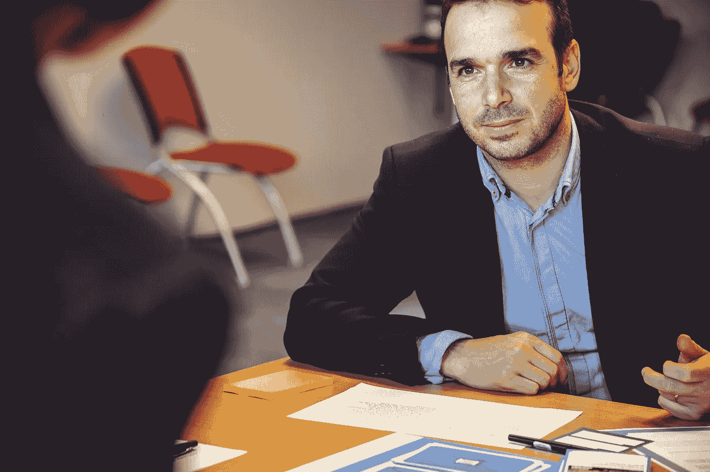

# 展示你专业的一面会给人留下好印象

> 原文：<https://medium.datadriveninvestor.com/build-relationships-like-a-pro-26b76dc68565?source=collection_archive---------19----------------------->

## 有意义的关系源于相互尊重和信任

Photo by Johanna Buguet on Unsplash

当工作很紧张，一个嘈杂的世界迫切需要关注时，冷静而理性的声音就会出现。换句话说，要表现得像个专业人士。

T2 的萨曼莎·凯利(T3)并没有因为一场全球性的危机而提醒每个人——无论是个人还是企业——如果面临职业变化，表现出最好的一面是一个好的开始。

“外面有很多噪音。凯利在世界出现焦虑症的几年前写道:“这一切都是为了脱颖而出。社交媒体专家，她的推特账号是@ TweetingGoddess。

凯利与社交媒体传道者和数字营销企业家 [Madalyn Sklar](https://twitter.com/MadalynSklar/) 谈论了如何在 Twitter 和其他在线网站上建立职业关系。

 [## 保持您的社交媒体选项开放，以吸引客户

### 带人们去旅行，让他们看到你的最新消息

blog.markgrowth.com](https://blog.markgrowth.com/customer-journeys-build-communities-c134e70de099) 

就像在离线世界一样，在 Twitter 上开始对话并不复杂。

“首先说一些有价值的东西，”凯利说。“现在，受到好评的东西是善良的行为——可能是关于别人的故事——幕后和鼓舞人心的话。

“做你自己，诚实地说出你正在发生的事情，”她说。“使用与现在相关或者与你的业务和工作相关的标签。你可以谈论别人，突出他们。”

作为一名在线主持人，Sklar 很自然地建议“跳到 Twitter 上聊天，问一个问题。”

# **冷门功能**

Twitter 的某些功能可以在商业中更有策略地使用。社交媒体管理公司 [Hootsuite](https://twitter.com/Hootsuite) 的全球参与主管尼克·马丁建议更好地利用高级搜索功能和 Twitter 列表。

“高级搜索允许你进行精确的社交监听，”马丁说。“留意特定地点的推文、特定日期范围内的推文等等。

“在推特上多听一些——更聪明地——对自己有好处，”他说。" [Twitter 列表](https://blog.markgrowth.com/lists-keep-your-engagements-on-target-75945de7281?source=friends_link&sk=14b508ea97c16c296344dcf0c94c5e6d)是监听特定人群的好方法。你可以列出客户、竞争对手、思想领袖或任何与你的业务或行业相关的人的名单。”

Hootsuite 发表了一篇相关的文章， [*“推特营销:商业完全指南”*](https://blog.hootsuite.com/twitter-marketing/)

就像在聚会上一样，你可以礼貌地加入在线对话，最好不要手里拿着虚拟名片。

Sklar 说:“打断现有的对话来分享你的意见是很常见的，但是请有礼貌地这样做。”“只要确保增加对话的价值就行。”

 [## 一次，两次，三次一个领导

### 伟大的领导者有同理心和善良——并倾听

medium.com](https://medium.com/datadriveninvestor/once-twice-three-times-a-leader-ab554765231c) 

在价值之外，加上客套话。

“当然要友好，”凯丽说。“这就是推特的可爱之处。你可以参与到你能增加价值或帮助他人回答问题的话题中。”

通过说出你是谁和你做什么，让你的个人资料在 Twitter 上脱颖而出。然后用一个链接和不超过一个标签来编辑它。

“选择一个突出的 twitter 账号，比如网络达人或视频专家，”凯利说。“很多这样的描述可能已经消失了，但你可以随意发挥。

“我选择了@ Tweetinggoddess，因为它做到了它所说的，”她说。"选择一个能展示你的品牌和你所做的事情的名字，或者使用你自己的名字."

# **向头像点头**

外表也需要一种权威的氛围。

“使用专业的头像，”凯利说。“人们从别人那里买东西，所以要确保你的照片展示了你和你的个性。

“通过填写你的简历脱颖而出，”她说。“问问你自己，我会跟着我吗？”

Sklar 强调，传记应该“清楚地说明你是什么样的人”，他补充道[让 Twitter 个人资料脱颖而出](https://madalynsklar.com/2019/12/make-your-twitter-profile-stand-out/):

*   记住你的受众，吸引合适的人。
*   确保你的简历清楚地描述了你的一切。
*   创建一个标题图像来吸引注意力并起到教育作用。

 [## 营销不是一见钟情

### 花时间真正了解你的客户

jkatzaman.medium.com](https://jkatzaman.medium.com/marketing-is-not-relationship-at-first-sight-4d0d6a3d966e) 

关系营销专家[杰西卡·菲利普](https://twitter.com/jessikaphillips) [简明扼要地指出](https://medium.com/@JKatzaman/marketing-is-not-relationship-at-first-sight-4d0d6a3d966e?source=friends_link&sk=65cfab2ffba13dea993303f600b4b7f8)“没有关系，你无法完成销售。”

为此，Sklar 引用了销售 101:“人们从他们认识、喜欢和信任的人那里购买。很管用。”

凯利认为基本等式是关系=信任=销售。

“72%的人更有可能从他们在 Twitter 上接触过的企业主那里买东西，”她说。

建立关系从 Sklar 的这些建议开始:

*   有所帮助。
*   帮助和倾听。
*   不要害怕使用心脏按钮，并显示一些爱。
*   参与。参与。参与。

“让人们进来一点，展示幕后录像，”凯利说。

“问问别人当他们转发或与你互动时，他们有多 T4，”她说。“你上一次查看 Twitter 上的某个人是什么时候？用视频真正给他们惊喜。”

为了[吸引影响者](https://www.datadriveninvestor.com/2020/01/15/influencers-perform-in-the-spotlight/)，从吸引影响者的推文开始，转发那些与你的工作或兴趣相符的推文。看看你是否得到回应。然后跟进。那叫对话。

“影响者也是人，”凯利说。“人们会永远记得你带给他们的感受。问他们怎么样，评论他们的帖子，当他们取得成就时祝贺他们。”

# **有意义的关系**

建立超越影响者的关系。不要做一个势利的影响者。影响你的可能不会影响别人。重要的是想法和关系。

凯利说:“和任何你感兴趣的人或者你觉得可以增加价值或者向他们学习的人联系。”“与所有人建立关系。

“然而，不要和那些不会给你的生活增加价值的人建立关系，比如消极的人或者对你不好的人，”她说。“你不必与任何让你感觉不好的人建立或维持关系。”

 [## 购买有影响力的产品时，买家要小心

### 他们待人接物的方式反映了影响者的真实影响力

medium.com](https://medium.com/datadriveninvestor/shopping-for-influencers-buyer-beware-632ad1b6b2fe) 

Sklar 说，通过与“各种各样的人，而不仅仅是有影响的人”联系，你会发现很多志同道合的人，而不是绝望

有影响力的人可以通过推荐帮助你获得更多的销售，这可以追溯到在进入正题之前先建立关系。此外，关系不会一夜之间发生。

“获得销售取决于你试图接触的观众，”凯利说。“如果你想接触商界女性，那么有人雇我来做这件事。你看，我已经有一个参与的社区了。任何有参与社区的人，如果是你试图接触的人，会更好。

“我确实从 Twitter 上获得了销售额，”她说。“这是一条非常微妙的线，需要努力建立信任和势头。”

Kelly 指出，从 Twitter 上获得销售通常比点击广告需要更长的时间，但有更高的价值，如导致咨询。

“如果人们喜欢你，信任你，你的品牌销量就会增加，”她说。

凯利说:“通过推特销售的一个例子是，我得到了约翰·默里的头像来拍摄我的头像。“我们在推特上认识的。我在推特上发布了这件事，他从喜欢我的头像的其他人那里获得了更多的销量。”

Sklar 正确地看待销售任务:“它们通常来自于你和我这样的‘普通’人之间建立的关系。这并不总是关于影响者。”

**关于作者**

吉姆·卡扎曼是[拉戈金融服务公司](http://largofinancialservices.com/)的经理，曾在空军和联邦政府的公共事务部门工作。你可以在[推特](https://twitter.com/JKatzaman)、[脸书](https://www.facebook.com/jim.katzaman)和 [LinkedIn](https://www.linkedin.com/in/jim-katzaman-33641b21/) 上和他联系。