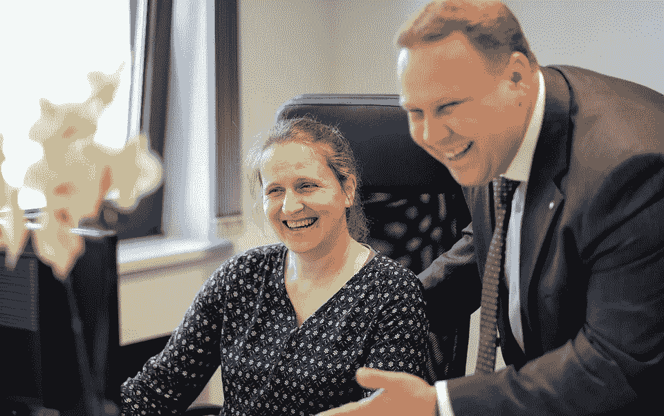

# 通过这三种社交智能方法建立牢固的利益相关者关系

> 原文：<https://medium.datadriveninvestor.com/build-strong-stakeholder-relationships-through-these-three-social-intelligence-methods-16f0057b0a31?source=collection_archive---------9----------------------->

与组织的利益相关者建立牢固的关系将有助于您预测和识别问题，以及制定和推出有效的解决方案。然而，这种关系不是一夜之间建立起来的。除了[确定你的关键利益相关者](https://disasteravoidanceexperts.com/8-powerful-questions-you-need-to-ask-before-stakeholder-engagement/)和[了解他们的真相](https://disasteravoidanceexperts.com/3-key-empathy-based-methods-to-uncover-the-truth-about-your-stakeholders/)之外，你还必须通过让他们感到被理解来保持联系。一旦你已经与你的利益相关者建立了联系，保持这种联系很大程度上取决于向他们保证，在更深的层次上，你关心他们，也考虑他们的最佳利益。为了证明这一点，你需要学习和使用特定的社交智能技能。

# 使用 3 种社交智能方法帮助你的利益相关者感到被理解

为了促进更好地交流思想和观点，无论何时你与你的关键影响者接触时，你都可以采用具体的、经过反复试验的方法。[社交智能](https://books.google.com/books/about/Social_Intelligence.html?id=anYm4ZecAWsC&source=kp_book_description)指的是评估和影响他人情绪和关系的战略能力。基于社会智能的方法将让你打破僵局，并加强你的组织和利益相关者之间的信任。由于被称为[认知偏差](https://disasteravoidanceexperts.com/how-to-evaluate-unconscious-bias-caused-by-cognitive-biases-at-work/)的危险判断错误，通常很难做到这一点，但你可以使用[基于研究的策略](https://disasteravoidanceexperts.com/wise-decision-maker-movement-manifesto/)来注意到这些盲点并[克服它们](https://disasteravoidanceexperts.com/nevergut/)。

几个月前，我遇到了史蒂夫，他是我的一个教练客户，当时他作为一名从外部聘请的新 CEO 进入了一家中型制造公司。在一次全公司范围的活动中，他已经见过当前高管层的大多数成员，但他希望通过与他们一对一的会面，尽快与他们建立牢固的关系。

史蒂夫向我寻求建议，因为他的会议进行得不顺利。虽然他试图变得亲切和亲切，但他的尝试并没有得到热烈的回应，而是得到了防御和回避的回应。他怀疑目前的首席执行官对他很警惕，因为他是从外部聘请的，而他们都在一起工作了十多年，他们更希望让一位老前辈担任领导职务。

他不确定该做什么。他是应该努力赢得他们的信任，还是应该努力摆脱目前的高管层，引入一些新面孔？

我说服史蒂夫不要妄下结论，对现任高管保持开放的心态。毕竟，他可以随时解雇他们。首先，他需要试着打破僵局，只有在那之后，他才能开始真正的沟通并赢得他们的信任。之后，他可以评估谁应该上车，谁需要下车。

我建议他使用以下方法，以便在与高管会面时营造一个真诚、友好的氛围。

# 1.移情倾听

当试图理解你的关键影响者时，不要停留在表面。这意味着当他们与你交流时，你应该听他们的意思，而不仅仅是他们说的话。你的目标是[移情](http://www.sciencedirect.com/science/article/pii/S0160289696900112)，理解他人感受的技能。不仅要关注他们的信息内容，还要关注他们的语气和肢体语言。通过这样做，你将能够理解他们的意思以及他们的感受。

在与关键影响者互动时，展示同理心的最佳方式之一是通过以下方式向他们表明，你正全神贯注地关注他们，而不是其他任何事情:

(a .)注意力的非语言信号，包括:

*   持续的眼神交流(随意，不激烈)
*   保持你的脚和肩膀指向他们
*   如果你坐着，张开双臂
*   如果你站着，站直，不要没精打采
*   微笑，点头，并在适当的时候使用手势
*   [杜氏微笑](https://www.psychologicalscience.org/observer/the-psychological-study-of-smiling)，不是假笑(微笑中包含眼神)

(b .)不间断的口头注意信号——包括说“嗯嗯”、“好的”、“继续”等。，在适当的时候。

史蒂夫决定先与首席财务官克莱尔会面，进行一次非正式的了解和叙叙旧。最初，Claire 的回答很谨慎，她没有透露太多关于自己和公司的信息。然而，当克莱尔说话时，通过点头，使用杜兴式的微笑，并使用不间断的注意的口头信号，史蒂夫能够表达温暖和真诚。渐渐地，克莱尔变得更健谈了。史蒂夫甚至发现他们的儿子都在同一所学校上学。

 [## 亚马逊冒险进入情绪化的人工智能，代价是你的隐私|数据…

### 我是一个技术迷，完全支持利用技术来改善我们的生活，但所有这些技术都有黑暗的一面…

www.datadriveninvestor.com](https://www.datadriveninvestor.com/2019/05/28/amazon-venturing-into-emotionally-savvy-artificial-intelligence-at-the-cost-of-your-privacy/) 

# 2.呼应和镜像

另一种显示你全神贯注的方式是通过[呼应和镜像](https://doi.org/10.1080/10696679.2005.11658547)，包括:

(a .)每隔一到三分钟，用你自己的话重新表述你的关键影响者所说的话的本质。例如:

*   “所以我听到你说的是 ________。是这样吗？”
*   “你是说 _ _ _ _ _ _ _ _ _ _。我有正确和完整的吗？”

如果你说对了，和你说话的人会感激你

集中注意力。如果你没有，他们会感谢你检查，并会纠正它。

(b .)使用他们的行话——注意你的关键影响者使用的与问题相关的特定词语，并将它们融入你的回应中。

从广义上反映他们的语气和姿态。例如，如果他们说话很正式，也要这么做。如果他们倾向于你，也这样做。只要注意他们的肢体语言和语气，并试着去配合，但不要试图快速反映一切。如果做得正确，这将有助于你的关键影响者感受到与你的联系，并[建立信任](https://doi.org/10.1080/10517120802484551)。

回到史蒂夫与克莱尔的会面，他决定通过模仿她的语气来保持对话的流畅，在他采用移情倾听后，这变得友好了许多。又聊了几分钟，话题从他们参加的会议到同行业的同行，Steve 轻松地询问了 Claire 可能想与他分享的任何紧迫问题。鉴于他能够建立一个没有威胁的环境，克莱尔坦率地分享了一些关键问题。

# 3.建立融洽关系

最后，你可以通过建立融洽的关系向利益相关者展示你理解他们。

你需要帮助他们感觉到你站在他们一边，你是他们部落的一员。

尽管没有明确说明，但通过以下任何一种方式，表明你理解了他们的情绪、目标、激励、价值观和障碍:

(a .)对他们的情绪表示同情(关心)

找出你和他们的目标和价值观的共同点

含蓄地表达你了解他们的障碍和动机

(d .)使用幽默来帮助降低防御，同时记住以下几点:

*   避免取笑他们或他们看重的东西
*   避免讽刺，因为它经常被误解
*   轻松地取笑自己，因为你是最安全的目标
*   最有冲击力的幽默感觉是自发的。然而，你仍然可以内置它，人们仍然会欣赏它。
*   将幽默融入你的信息中，无论是个人的还是广泛的
*   不同类型的幽默
*   如果你在做演示，不管是虚拟的还是面对面的，使用有趣的幻灯片

回到 Steve 和 Claire，Claire 分享的一个问题是管理人手不足的部门的挑战。幸运的是，史蒂夫在会议之前已经做了尽职调查，并且已经注意到克莱尔的部门缺少某些关键人员。

Claire 提出这个问题后，Steve 立即承认了这个问题，并表达了他对 Claire 的挑战的关注。为了进一步证明他理解她的遭遇，他还分享了几年前他作为一名苦苦挣扎的首席运营官的一些故事，当时由于预算限制，他不得不在人手减少的情况下兼顾多个项目。

最后，史蒂夫向克莱尔保证，他会立即调查这个问题。他们以更友好的方式结束了会议。

融洽的关系建立了你和你的利益相关者之间的信任。此外，它有助于更好地沟通和密封连接。建立融洽关系绝对是你应该投资的社交智能相关计划之一，因为如果正确执行，它会转化为短期和长期的回报。

大约在他咨询我两周后，史蒂夫打电话告诉我一些好消息:在他们谈话一周后，他与克莱尔取得了联系，并能够提出一些好的选择。Claire 很高兴与他进一步讨论这些选项，并一起达成了解决人员配备问题的方案。

Steve 还告诉我，在与 Claire 一起解决了她部门的问题后，其余与高管的会议进行得更顺利了。克莱尔似乎已经在高管层的其他人面前为他说了好话。从那时起，史蒂夫能够与他的团队成员进行更开放、更有成效的对话，他向公司新任首席执行官的过渡也很顺利。

# 结论

帮助你的利益相关者感到被理解的最好方法是向他们伸出手，目标是建立持久的联系。你可以通过使用 3 种社会智能方法来实现这一点，即移情倾听、呼应和镜像以及建立融洽关系。通过这样做，你将能够打破僵局，与对方建立联系，培养信任，并有信心在任何时候都能开诚布公地交流。

# 关键外卖

> 与利益相关者建立持久的联系，并通过使用三种社会智能方法帮助他们感到被理解，这三种方法是移情倾听、呼应和镜像以及建立融洽关系。— -> [点击发微博](https://twitter.com/intent/tweet?url=https%3A%2F%2Fdisasteravoidanceexperts.com%2Fbuild-strong-stakeholder-relationships-through-these-three-social-intelligence-methods%2F&text=Form%20lasting%20connections%20to%20stakeholders%20and%20help%20them%20feel%20understood%20by%20using%20the%20three%20social%20intelligence%20methods%20of%20empathetic%20listening%2C%20echoing%20and%20mirroring%2C%20and%20building%20rapport%20&via=dr_gleb_tsipursky&related=dr_gleb_tsipursky)

# 需要考虑的问题(请在下面分享您的答案)

*   你上一次在试图与利益相关者交流时遇到沟通困难是什么时候？
*   文章中的哪些技巧可以帮助你与利益相关者建立融洽的关系？
*   根据阅读这篇文章，你将采取哪些后续步骤？

图片来源: [Pixabay](https://pixabay.com/photos/plate-queen-signs-office-couple-4638368/)

— -

**简历** : [格莱布·齐布尔斯基博士](https://disasteravoidanceexperts.com/glebtsipursky/)是一位国际公认的思想领袖，他的使命是通过制定最有效的决策策略来保护领导者免受被称为认知偏差的危险判断错误的影响。作为一名畅销书作家，他最著名的作品是《T4》*《永远不要跟着感觉走:先锋领导者如何做出最佳决策并避免商业灾难* (职业出版社，2019 年)、《我们之间的盲点:如何克服无意识的认知偏见并建立更好的关系 (《新先驱》，2020 年)和《恢复力:适应并规划新冠肺炎冠状病毒疫情 (《变革者图书》，2020 年)他在[*Inc .*](https://www.inc.com/entrepreneurs-organization/a-behavioral-scientist-explains-why-your-swot-analysis-is-dangerously-flawed.html)[*企业家*](https://www.entrepreneur.com/article/348115)[*CBS 新闻*](https://www.cbsnews.com/video/study-says-taking-a-small-break-from-facebook-might-be-good-for-your-mental-health/)[*时代*](http://time.com/4257876/wounded-warrior-project-scandal/)[*商业内幕*](https://www.businessinsider.com/disaster-expert-companies-should-face-coronavirus-with-pessimism-2020-3)[*政府行政*](http://www.govexec.com/excellence/promising-practices/2017/03/heres-why-your-gut-instinct-wrong-work-and-how-know-when-it-isnt/136104/)[*慈善大事记中发表了超过 550 篇文章和 450 篇访谈他的专业知识来自于 20 多年的*](https://www.philanthropy.com/article/Opinion-Science-Shows/237890)*[咨询](https://disasteravoidanceexperts.com/consulting/)、[辅导](https://disasteravoidanceexperts.com/coaching/)、以及[演讲和培训](https://disasteravoidanceexperts.com/speaking/)作为[避灾专家](http://disasteravoidanceexperts.com/)的首席执行官，以及作为行为经济学家和认知神经科学家在学术界超过 15 年*的[。通过 Gleb[at]DisasterAvoidanceExperts[dot]com、Twitter](http://disasteravoidanceexperts.com/research)[@ Gleb _ tsipursky](https://twitter.com/Gleb_Tsipursky)、insta gram[@ dr _ Gleb _ tsipursky](https://www.instagram.com/dr_gleb_tsipursky/)、 [LinkedIn](https://www.linkedin.com/in/dr-gleb-tsipursky/) 联系他，注册他的免费[明智决策者课程](https://disasteravoidanceexperts.com/newsletter/)。

…

*原载于 2020 年 5 月 21 日* [*避灾专家*](https://disasteravoidanceexperts.com/build-strong-stakeholder-relationships-through-these-three-social-intelligence-methods/) *。*

**访问专家视图—** [**订阅 DDI 英特尔**](https://datadriveninvestor.com/ddi-intel)