# 使用 python 逐步构建您的数据科学项目

> 原文：<https://medium.datadriveninvestor.com/build-your-data-science-project-step-by-step-with-python-f968036bd556?source=collection_archive---------6----------------------->

## **为什么数据科学如今如此重要？**

为了高效地使用数据，公司正在从提供描述性分析以可视化“发生了什么”的传统数据分析工具转向使用数据科学工具进行预测和透视分析。
预测分析有助于确定目标事件的影响因素，并回答“为什么会发生”，最后透视分析将使用统计建模来了解“未来会发生什么”。
我写这个故事是为了帮助**的专业人士**(软件开发人员、会计、……)**数据科学爱好者**和其他打算从**职业转型**到**数据科学**的人。

这篇文章将阐明建立简单预测模型并将数据转化为商业建议的关键步骤。
数据科学用于战略营销、供应链管理、风险分析、客户流失、成本降低、差异等，预测未来销售和未来依赖。
首先，我们来回答一个常见问题:**数据工程师&数据科学家有什么区别。**

## **数据团队角色:**

**数据科学家角色:**专注于使用统计方法建立能够回答业务问题的模型。
主要关注点是实现高精度预测模型，并可由业务专家进行插值。

**数据工程师角色:**他关心将项目投入生产环境的处理性能，如内存使用、处理延迟。他开发了可维护和标准化的代码源。因此，主要关注点是构建一个架构来管理数据生命周期(接收、收集、存储&转换),并定义能够实现优化和自动化处理的技术环境。

**业务专家:**数据团队中又一个必不可少的角色。他是特定领域(项目领域)的专家，如风险分析师、营销专家、销售、消费者服务分析师等。他帮助数据科学家建模。

# ***步骤 A:定义需求&模型化***

在数据模型中，应该定义两种主要类型；

通常表示为(X)的解释变量指的是用预测模型预测解释变量(y)的一组输入数据。被解释的变量可以称为目标变量&因变量。
一般来说，说明性数据(或特征)给出关于观察到的信息的信息，如客户概况、行为、取向、产品特征等。它们与过去发生的事件有关。
鉴于目标变量不可观察；客户流失、产品故障、欺诈只有在回收的情况下才能被发现。
建立机器学习模型不仅有助于预测不可观察的商业价值，还能解释背后的因素。

> 举个例子:“产品回收”一旦从网上购买了一个产品，我们就会知道并在数据集中存储购买者的简介和产品特征。回收将分别从用户助手、社交网络、用户反馈、电子邮件等收集。
> 如果公司想知道回收是由于产品缺陷还是用户使用不当，数据科学家将通过采用显式变量(用户资料、产品特性、使用条件等)来预测回收(目标变量)，从而构建一个模型。

这些显式变量通常由业务专家(会计、风险分析师、金融等方面的专家)提供，以帮助数据科学建模。

## 监督和非监督学习

它们是两种常见的学习类型:监督学习和非监督学习。
**监督学习**旨在根据一组输入特征找到一个近似(预测)目标变量的模型。
**监督学习**当输出是分类类型(或定性类型)时可以是分类，当输出是定量类型时可以是回归。

## 数据类型

还有**量化**数据，表示资历年数、持续时间、销售额、成本、利润等数量。
第二组是**定性**数据描述了一种品质，如性别、职称、社会职业类别等。在本文中，我将通过展示每个步骤的一些例子来解释如何构建其他步骤。

我要用两个项目:信用风险分析，ATM 现金预测。

> 例 1:执行**信用风险分析**有助于贷方确定借款人履行债务的能力，以缓冲现金流的损失并降低损失的严重性。
> 例 2 : **ATM 现金预测**
> 拥有来自**ATM**的历史数据可以帮助创建基于**现金**需求**预测**的智能**现金**管理系统，这最终将有助于降低财务成本

# 步骤 B:数据清理和规范化

由于数据是从不同的系统收集的，我们可能会有一些异构性，导致不同的**格式**。
的确，由于一些与数据收集或收费相关的错误，我们可能会有一些修改，如标点符号和**重复数据**。
因此，为了使数据为模型化步骤做好准备，应该执行转换以重新规范化数据。
读取数据后，需要进行数据类型探索和格式验证的步骤。

## **数据读取&显示步骤**

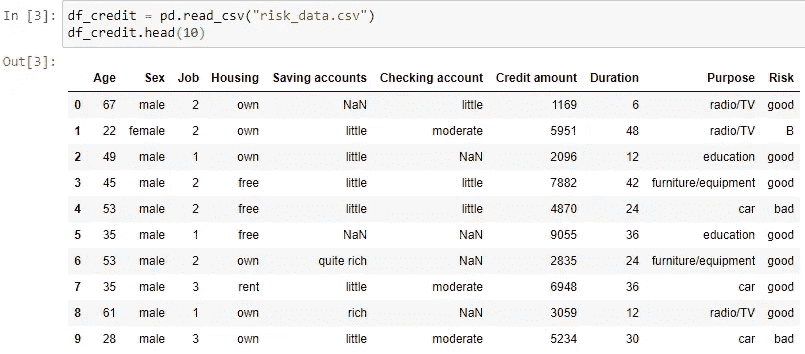

## **重复删除步骤**

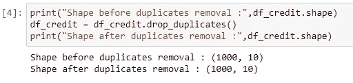

Caption for data removal with pandas

我们将定义一组定量变量，我在 num 列表中定义，定性变量列表定义为虚拟变量，然后是目标变量。

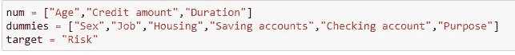

## **数据标准化步骤**

现在让我们通过检查每一列中现有的唯一值来检查不同虚拟对象的格式。

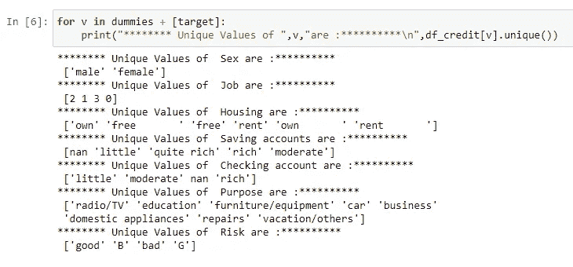

对于该样本，我们有两个值“好”和“G”来描述样本质量的风险值，以及“坏”和“G”的风险值，并且必须进行转换以映射到标准化值。
同样，我们可以在“住房”一栏看到不必要的变更；我们将“免费”和“免费”视为两个不同的值，而它们描述的是相同的值。

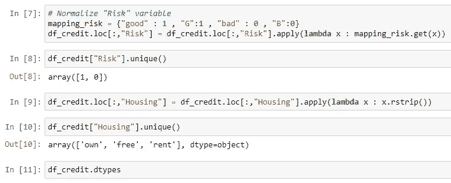

Pandas Command to normalize the content of “Housing” & “Risk” from credit dataframe

**其他标准化步骤:**

当然，标准化步骤可能因项目而异；这里我将提到一些在这个项目中不存在但应该考虑的其他规范化。

*   日期格式:在一些数据集中，我们可以有不同的日期格式，比如 **mm/dd/aaaa** 或 **mm-dd-aaaa** 或 **aaaa-mm-dd** ，然后所有这些格式都应该转换成一个标准化的格式。
*   浮点格式:根据原始数据存储，我们可以找到表示为 xxx、xxx 或 xxx.xxx 的浮点，然后应该采用标准 python 浮点类型。

## 铅字铸造步骤

数据规范化之后的一个自然步骤是类型检查；标准化之前的数据通常被认为是未定义的对象或字符串；一旦规范化，我们应该检查新的数据类型是否对应于所需的类型，以便执行下一次计算。

这里有一个 ATM 项目的例子，显示了“日期”列被定义为对象，而不是日期类型，同样的事情还有月份，我们可以开发一个转换来转换这些类型

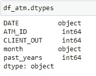

types checking on ATM dataframe

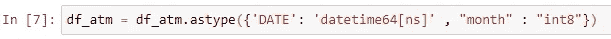

types casting on ATM dataframe

# 步骤 C:特征工程

这是最重要的，通常占整个数据科学项目的 60%-80%，因为它是定义模型准确性的必要条件。
注意，所呈现步骤的顺序不是强制性的；这些步骤可以在任何级别进行，甚至可以重复多次。

## **步骤 0:无关特征去除**

在开始开发特性之前，为了减少内存，我们可以删除一些与目标变量无关的无关特性，比如低方差列和包含客户 id 或代码的列，如果它们以后不会用于连接的话。

## 步骤 1:计算新的变量和指标

这一步包括从现有数据中计算信息指标。这是整个过程中最重要的步骤之一，因为预测模型就像人类一样，只要提供的信息是相关的，它就会做出更好的决策。

让我们来看一些 ATM 数据集的例子:
我们想介绍一些关于测量年份的信息，即给定季度 ATM 的平均需求。
我们有“日期”栏，代表取款操作的完整日期，因为日期不能生吃，让我们看看如何烹饪它们；)

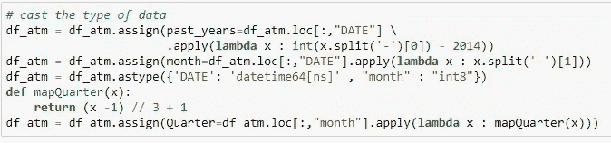

Computing past_years, month, quarter

## 步骤 2:处理缺失数据

在数据科学文献中，有两种处理数据集中缺失的方法:**缺失数据去除** & **输入缺失数据**。
pandas 的“df.info()”命令在每一列显示许多非空值。
建议横向和纵向计算 NaN 值的比率(即列比率和行比率)。

**缺失数据删除:**

*   **线删除**:如果对于给定的线，这个比率很高，建议删除整个线，因为它不会提供有价值的信息。
*   **列移除**:理论上，25%到 30%是最大的**缺失值**是允许的**，超过这个值我们可能要从分析中删除变量。但是如果商业专家认为这个变量对分析很重要，我们可以容忍更高的利率。**

****缺失数据插补**:**

**输入缺失数据包括用一些必须中立的数据填充空值，以避免导致错误的决策。对于分类数据或连续数据，有几种处理缺失数据的常用技术。**

****输入分类数据**可以通过用最大代表模式替换 NaN 来完成，但是如果 NaN 是最大的模式，则仍然不灵活。替换 nan 更一般的方式是引入新的模式来表示“未知”模式。**

**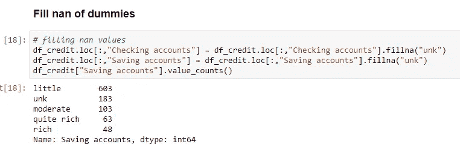**

**Filling missing categorical data with new value “unk”**

****输入定量数据**通常采用零插补、平均值插补(用列的平均值填充)或模式插补(用列数据的模式填充 nans)。
插补策略的选择主要取决于数据和任务，主要选择标准是在填充过程后保持数据的中性。**

**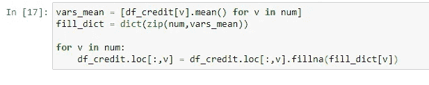**

**Example of filling numerical data with correspondant mean value**

**这种方法建议人工生成，然后它们与目标变量的相关性将是随机的；处理缺失数据的更聪明的方法是利用和利用特性的相互依赖性，并构建**预测 ML 模型来预测其他 nan 缺失**列数据的缺失值。
因此，这可以通过以递增的缺失率对列进行排序，然后使用低缺失率列来预测高缺失率列中的值来实现。**

## **步骤 3:重新分组低代表性假人**

**在一些项目中，我们可以在给定的变量中找到低出现率的模式；他们不会提供相关信息；我们将它们归入单一模式。**

**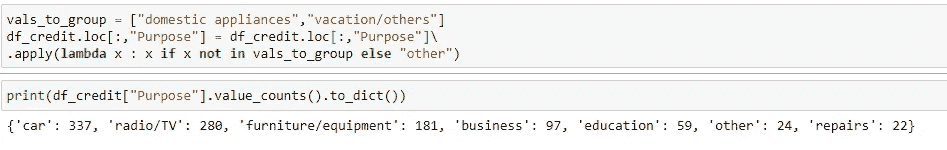**

**How to group a list of modes**

## **第 4 步:缩放和假人表现**

**在数据项目中，我们可以找到不同尺度(10、1K、10K 等)的定量数据，但这些数据不适合预测模型。
为了做出准确的预测，应该将数据重新调整到一个标准化的数值范围内。**

**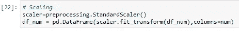**

**有两种主要的常用定标器是 StandradScaler & MinMaxSclaer 它们已经在 scikit-learn 上实现了。
当然，分类数据的虚拟表示是一个直观的步骤。**

**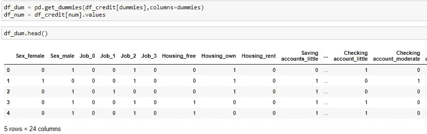**

## **步骤 5:处理高基数的分类变量**

**在一些项目中，我们可以找到一些基数很高的定性变量，例如> 70，在某些情况下可以达到 1.000 以上。**

**一次性编码是不可行的，因为输入表的大小使得预测模型变大，甚至导致模型性能下降。**

**有一些常见的方法来处理这种高基数，主要是以一种提供目标相关信息的逻辑方式对集合变量进行重新分组。**

*   **一个常见的例子是邮政编码和地区，如城市或国家；在一些数据集中，我们发现超过 500 个不同的 zip 值。
    常见的方法是从相同的数字开始重新组合代码，因为它们代表相邻的区域。**
*   **应用聚类算法通常也用于在同一聚类中形成相似项目的组。**

**为了对数据进行聚类，我们首先必须建立一个**分割标准**。**

*   **例如，描述实体(例如电影)的一组标签可以使用共现来重新分组，然后在共现矩阵(或相关矩阵)上进行聚类。**
*   **另一个例子，在一个成本预测项目中，我们有一组超过 1000 个供应商。我们可以选择交付时间统计数据或成本统计数据作为细分标准；多个分割标准的组合也是可能的。**

**让我们在数据集上试试，
我有来自 300 台位置未知的不同 ATM 的数据；如何在预测模型中包含关于 **ATM 的信息？****

**我将选择最低年度现金需求作为细分标准。
支点变换:**

**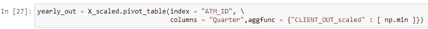**

**聚集数据透视表值:**

**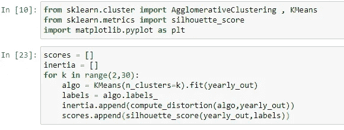**

****如何选择最优聚类数？
答**:有几个数学标准，而簇数不是一个关键参数；最重要的是集群**可解释性**和**与目标变量的相关性。
(在所呈现的图中，聚类= 3 和聚类= 13 中存在间隙****

****

**Silhouette scores**

**根据 Elbow 方法，当惯性值开始收敛时，最佳聚类数对应于第一个元素。(opt = 14)在示例中。**

**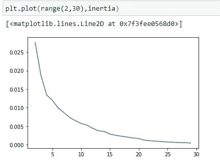**

**这两个标准并不总是出现，因为它取决于所选择的分割标准，使得重新分组数据成为一项繁重的任务。
一旦决定了最佳聚类数以及聚类算法，我们将应用该选择来将基数与相应聚类相关联。**

**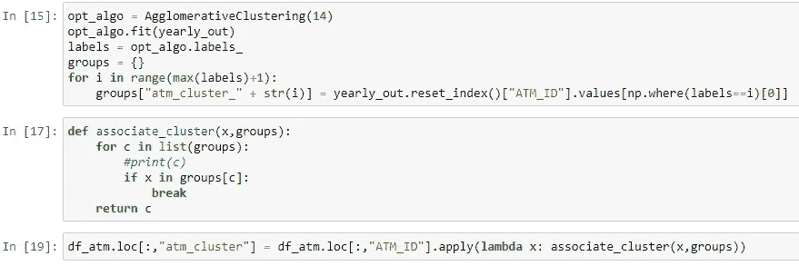**

## **步骤 6:连接数据**

**最后，如果一个数据项目是由多个表源组成的，我们将连接准备好的数据以形成要在预测模型中使用的特征数组。**

# **步骤 D:特征选择**

**在一些数据项目中，我们可能有大约 100 列。
处理高数据维度可能会导致**模型** **性能下降**除了训练时间长之外还有维度的诅咒。除此之外，一些信息冗余和相互关联也可能伴随着变量的不相关而发生。
在文献中，主要有三种特征选择方法:**过滤方法**、**包装方法**和**嵌入方法**。**

**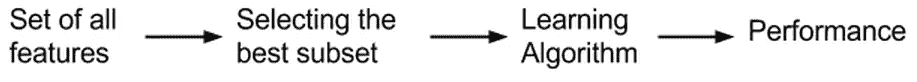**

**Filter method process for feature selection**

**过滤方法在学习算法之前使用统计工具来评估特征与目标变量的相关性；
它们主要基于对每个解释变量和目标变量之间的成对独立性分析的统计检验，例如对分类变量的卡方检验、fisher 评分等。在实践中，这些基于分数的测试无法找到合适的变量选择。**

**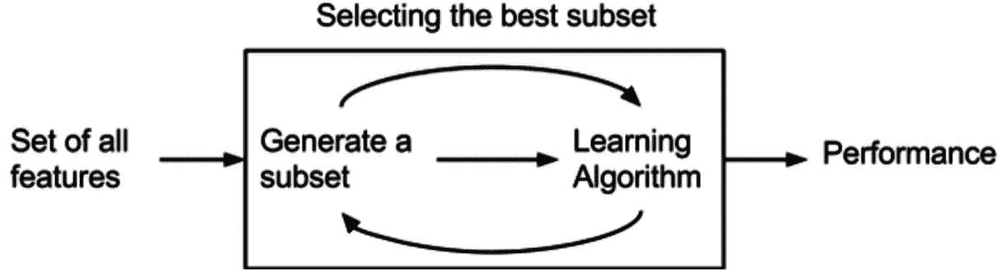**

**Wrapper method process for feature selection**

**包装器方法基于贪婪搜索算法，因为它们迭代地选择特征子集，并将选择器与机器学习算法相结合，然后基于最佳子集性能选择最佳选择。(RFE:递归特征消除)是最常用的选择器。**

**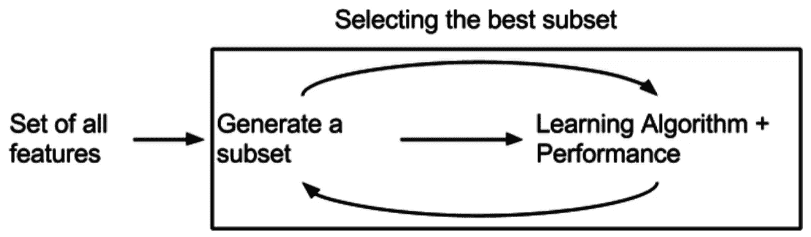**

**Embedded method process for feature selection**

**嵌入式方法使用算法本身的特征选择方法；例如线性回归的权重、基于树的算法的特征选择，如树决策、xgboost、随机森林等。
他们评估给定特征在做出算法决策时的贡献。
关于每种方法
[过滤方法](https://medium.com/analytics-vidhya/feature-selection-for-dimensionality-reduction-filter-method-201cc9eaa3b5)[包装方法](https://medium.com/analytics-vidhya/feature-selection-for-dimensionality-reduction-wrapper-method-9979fffd0166)和[嵌入方法](https://medium.com/analytics-vidhya/feature-selection-for-dimensionality-reduction-embedded-method-e05c74014aa)的优缺点，你可以参考那篇文章。
这些方法可以结合起来，以最佳算法精度执行最佳特征选择。**

****相关性研究:**
让我们看一个实际的如何检测信用风险数据集上特征之间的相关性。
我们首先在缩放数据上计算 PCA，并绘制有序特征值的累积和。**

**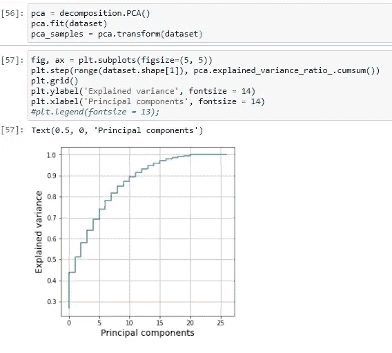**

**该曲线收敛于第 19 个值，99%的总累积和意味着信息可以减少到 19 个去相关的输入数据。**

**将 PCA 投影特征作为训练算法的输入将无助于识别关键的重要因素，并使模型不可解释。
让我们考虑另一个相关性研究概念。
关联矩阵的可视化有助于数据科学家检测成对关联。**

**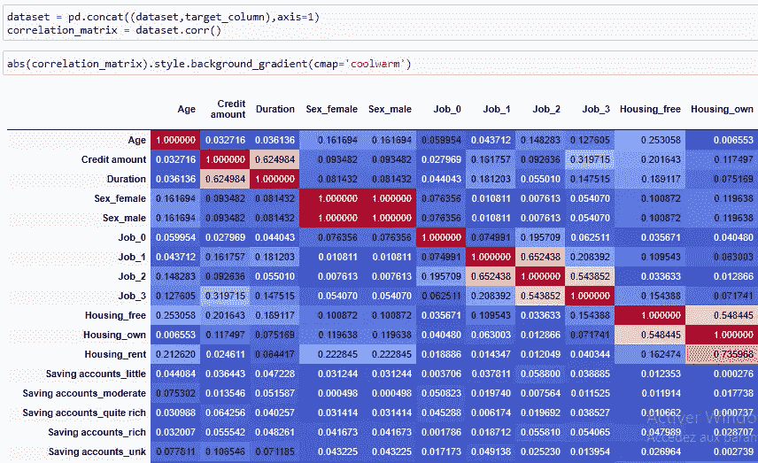**

**在以下 python 算法中，我们建议通过将 0.5 作为相关阈值来检测最相关的要素。(建议阈值为 0.8)**

**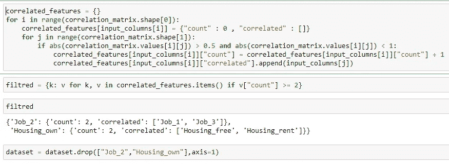**

# **步骤 E:准备培训**

**现在，我们的数据已经准备好进行训练和评分，还需要完成另外两个预训练步骤，以评估训练模型的质量和对新的未见过的数据进行归纳的能力。**

## **数据拆分:**

**因此，我们必须定义三个数据集:
- **训练数据**:用于学习模型的可用数据样本
- **验证数据**:以及用于评估模型质量及其对新数据进行概括的能力的标记数据样本
- **测试数据**:模型部署到生产环境后使用的新数据。它通常与训练数据完全不相关。
一般来说，如果大型数据集可用，我们可以将数据分成三组(训练、验证、测试)，但如果只有少量数据可用，我们只进行训练和验证。
通过对三个数据样本进行评分，最大得分将归因于模型学习现有模式时的训练数据，随后是验证得分。
如果训练分数和验证分数之间出现较大的衰减，我们就会有一个**过拟合**数据，我们必须重新建模以更好地获得更好的泛化属性。
由于它们来自相同的数据集，验证和训练数据可能具有较小的相关性(例如，它们在同一个月、同一个地区等地表征)，而测试数据通常是去相关的(因为我们在不同的月份、地区等地进行测试)，因此测试分数可能低于验证分数。**

## **数据平衡:**

**它特别适用于不平衡的分类项目；以“产品回收”为例:回收率仅占全部数据的 3%。
保持具有这种不平衡比率的训练数据将使模型偏向于
多数类，而不能检测不频繁的类。
因此，平衡在于均衡数据中存在的类别；这可以通过**下采样**(减少多数类的大小)或**上采样**(增加非频繁类的大小)来实现。
然而，另一种方法在于使用训练算法(基于树的算法)中的参数来在拟合期间进行平衡。**

**在信用风险数据中，我们有 30%的“坏”分数和 70%的“好”分数。
在实践中，以下 sklearn 用于将数据分割成训练和验证数据，其中 30%为验证大小(验证数据的百分比)
以下 python 代码平衡数据，然后应用分割:**

**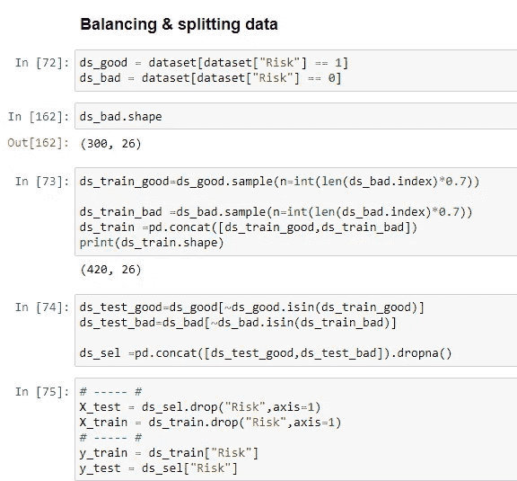**

# **步骤 F:预测模型**

**所以现在，当我们的数据准备好了，平衡好了，它们就可以被模型吃掉了。我们在训练数据集上部署训练，然后在验证数据上评估模型。有几个这样的分类算法，我不打算深入每个算法的数学细节，我只是介绍它们。**

*   **SVM:支持向量机**
*   **随机森林**
*   **TD:树形决策**
*   **MLP:多层感知**
*   **逻辑回归**
*   **NB:朴素贝叶斯**
*   **线性鉴别分析**
*   **LGBM:光梯度推进机**
*   **XGBoost:极限梯度提升**

**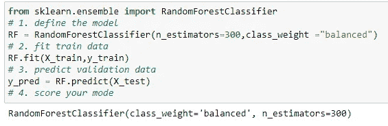**

**有一些指标用于评估验证数据的得分，即:准确性、F1 得分、召回率、**混淆矩阵**。**

**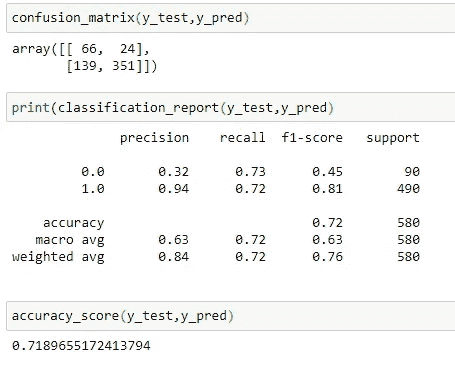**

**我使用分类报告来可视化每个类的精度。
精度不是最好的模型选择标准，因为它没有给出关于可分性容量的信息。
或者，使用 **AUC ROC** (受试者操作特征下面积)分数。然而，一旦模型提供了足够满足业务需求的逻辑互操作性，就必须由业务专家或/和研究人员进行验证。
因此，显示特征重要性将有助于做出关于模型充分性的决策。**

**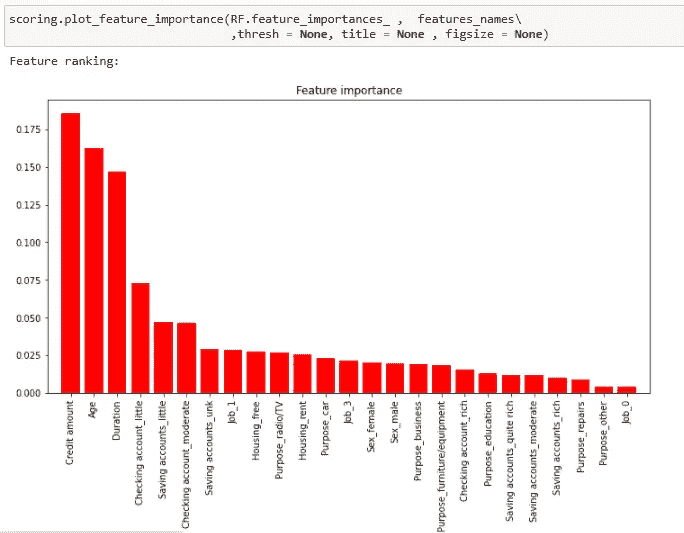**

**Feature importance given by random forest algorithm**

**我们甚至可以通过标签来可视化特性的重要性:**

****

**Feature importance given by random forest algorithm for “bad” class**

**根据该图，随着信用额度的增加，风险也随之增加，这是合乎逻辑的。另一方面，低年级学生倾向于有风险的信贷，这也是一个合理的结果，因为低年级学生比高年级学生拥有更多的资源。**

## **结束语:**

**这个故事讲述了为分类任务构建数据科学项目的主要步骤。
请注意，构建数据科学项目没有标准方法，因此项目中可能会缺少一些不需要的步骤。
此外，特征工程步骤顺序并不遵循特定的顺序，在一个项目中，所有的步骤都可以根据需要来完成。**

****增强模型是一个迭代的弯曲循环**，它可以通过对特征工程选择的审查来完成，如增加更多信息特征(更多变量将提供更好的解释变量信息)、审查数据插补、数据分段等。
另一个有助于提升性能的流程是引入历史信息，尤其是当一个值取决于过去发生的事情时。
另一个有助于获得更高准确性的技巧是按人口进行细分，并按人口执行预测模型；)**

**此处提供了 Python 代码**

# **相关主题**

> **[***强化学习基础***](/reinforcement-learning-fundamentals-469a91e40fce)**

# **阅读更多**

> **[**1 -如何设计 AWS 数据架构**](https://medium.com/swlh/a-guide-on-designing-aws-data-architectures-b331ce9dbbc1)**
> 
> **[**2 -软件管理基础**](https://medium.com/codex/fundamentals-of-software-management-in-agile-environment-31966e26f3e6)**
> 
> **[***3 -面向开发者的 Kubernetes 快速教程&数据科学家***](https://medium.com/swlh/a-quick-tutorial-onkubernetes-for-devlopers-cea97afa8d1c)**
> 
> **[***4 -友好地介绍赫尔姆***](https://narjes-karmeni.medium.com/a-friendly-intro-to-helm-4a158edecde7)**