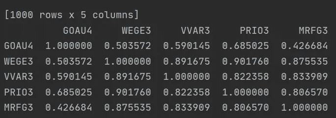

# 使用 Python 和 MetaTrader 在 5 分钟内开始构建您的交易策略

> 原文：<https://medium.datadriveninvestor.com/build-your-trading-strategies-in-5-minutes-with-python-and-metatrader-3e9fd5c62956?source=collection_archive---------1----------------------->

## 整合收集和分析金融市场数据的最快方法。


Photo by [Austin Distel](https://unsplash.com/@austindistel?utm_source=medium&utm_medium=referral) on [Unsplash](https://unsplash.com?utm_source=medium&utm_medium=referral)

在我最近的一篇文章中，我展示了如何使用 Plotly 库创建图形。为此，我们从 MetaTrader 以“原始”的方式导入数据，无需自动化。今天，我们将学习如何自动化这一过程，并用几行代码绘制不同资产相关性的热图。

[](https://towardsdatascience.com/how-to-visualize-high-frequency-financial-data-using-plotly-and-r-97171ae84be1) [## 如何使用 Plotly 和 R 可视化高频金融数据

### 在这篇文章中，我展示了如何使用 Plotly 包，以可视化的金融数据在高频率使用 r。

towardsdatascience.com](https://towardsdatascience.com/how-to-visualize-high-frequency-financial-data-using-plotly-and-r-97171ae84be1) 

如何整合 Python 和 MetaTrader？我遵循以下步骤:

*   在您的机器上安装了 MetaTrader 5 和 Python 3.8 之后
*   安装 Python 库:MetaTrader5、matplotlib 和 pandas
*   导入数据
*   绘制图表

# 安装库

如果您的计算机上已经安装了 Python，请打开终端并使用以下命令安装必要的库:

```
pip install MetaTrader5
pip install pandas
pip install matplotlib
```

请记住，您必须在您的计算机上安装了最新版本的 MetaTrader，集成才能正常工作。

# 收集数据

我们到了有趣的部分。我们将开始开发我们的小型数据收集程序。

第一步是导入必要的库:

```
import MetaTrader5 as mt5
import pandas as pd
import matplotlib.pyplot as plt
```

之后，我们用代码初始化 MetaTrader 终端:

```
mt5.initialize()
```

我们在一个数组中定义我们想要分析的资产的符号。我是巴西人，我在巴西证券交易所交易。因此，本文中描述的资产在其他代理中不起作用。

```
symbols = ['GOAU4','WEGE3','VVAR3','PRIO3','MRFG3']
data = pd.DataFrame()
```

对于数组中的每个符号，我们收集定义每个条形的时间和数量的数据。然后，我们将每个请求的收盘价输入数据框架:

```
for i in symbols:
    rates = mt5.copy_rates_from_pos(i, mt5.TIMEFRAME_D1, 0, 1000)
    data[i] = [y['close'] for y in rates]
```

我们现在将关闭与 MetaTrader 的通信，因为我们已经有了用于分析的数据。

```
mt5.shutdown()
```


Image by author — Close prices from stocks

# 计算回报

计算回报相当容易。只需调用 dataframe 的 pct_change()方法，就可以开始了。

```
retornos = data.pct_change()
```


Image by author — Stock Daily Returns

# 相关计算

像返回一样，相关性也可以通过调用 dataframe 的 corr()方法来轻松计算。

```
corr = data.corr()
```



Image by Author — Stocks Correlation

# 绘制热图

为了构建热图，我们将使用 matplotlib 库。所以:

```
plt.figure(figsize=(10,10))
plt.imshow(corr, cmap = 'RdYlGn', interpolation='none', aspect='auto')
plt.colorbar()
plt.xticks(range(len(corr)), corr.columns, rotation = 'vertical')
plt.yticks(range(len(corr)), corr.columns)
plt.suptitle('MAPA de CALOR - ATIVOS', fontsize = 15, fontweight = 'bold')
plt.show()
```


Image by Author — HeatMap Stocks Correlations

# 结论

在这篇文章中，我们看到了如何连接 Python 和 MetaTrader 5，如何导入我们想要分析的资产的数据，以及如何创建这些资产回报相关性的热图。

[](https://www.datadriveninvestor.com/2020/07/07/introduction-to-time-series-forecasting-of-stock-prices-with-python/) [## 用 Python |数据驱动投资者进行股票价格时间序列预测简介

### 在这个简单的教程中，我们将看看如何将时间序列模型应用于股票价格。更具体地说，一个…

www.datadriveninvestor.com](https://www.datadriveninvestor.com/2020/07/07/introduction-to-time-series-forecasting-of-stock-prices-with-python/) 

感谢阅读，下次见！如果你有问题，请告诉我。干杯！

**进入专家视角—** [**订阅 DDI 英特尔**](https://datadriveninvestor.com/ddi-intel)