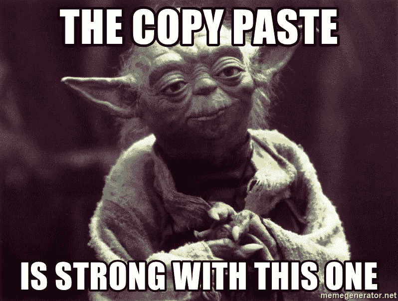
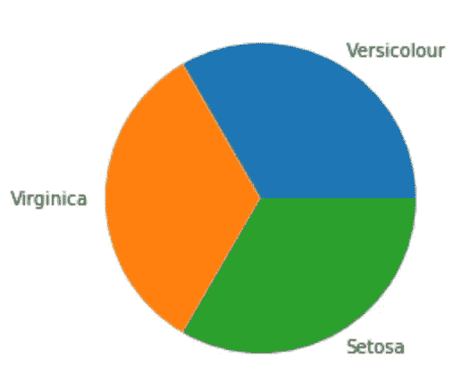
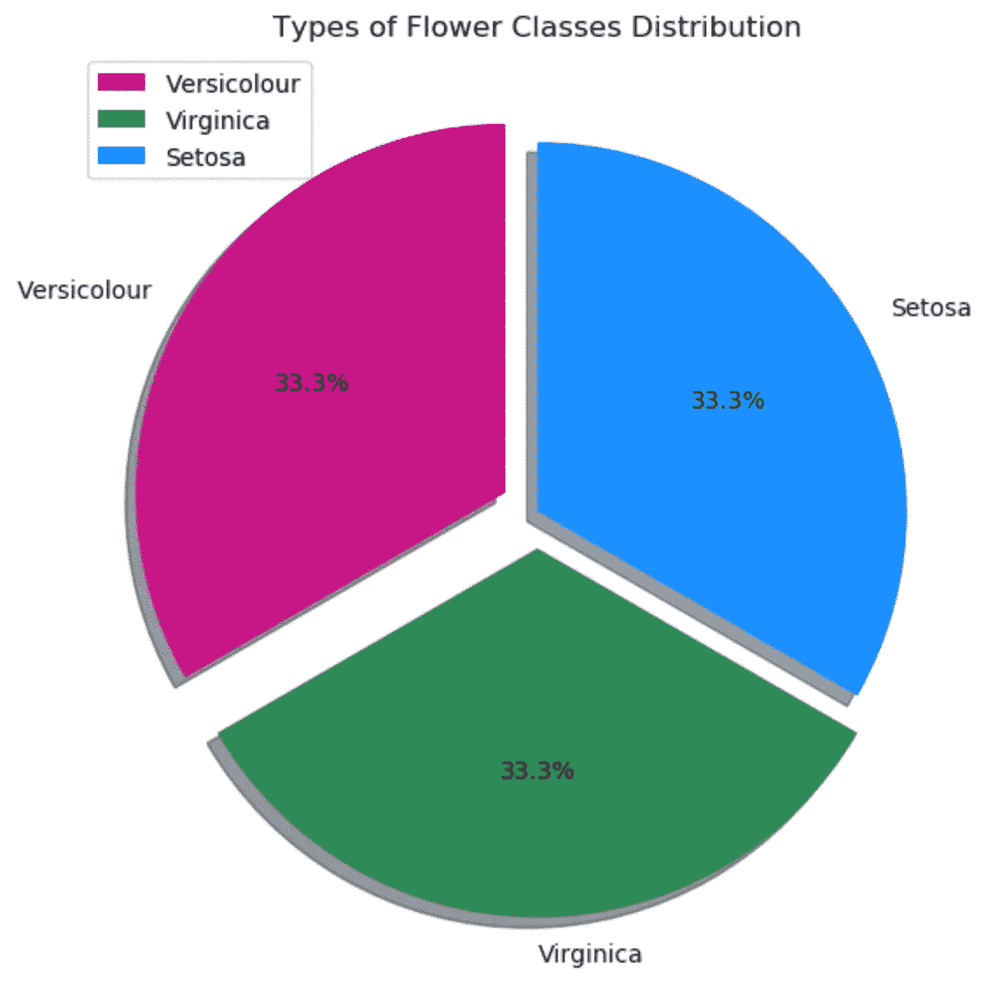

# 今天就为自己构建一个数据科学代码库！

> 原文：<https://medium.datadriveninvestor.com/build-yourself-a-data-science-codebase-today-31bb124c1e26?source=collection_archive---------7----------------------->

## 加快实验、分析和执行的秘诀


Welcome

当使用相同的工具同时处理多个项目时，例如像 Python 这样的编程语言和 Jupyter Notebooks，**大部分代码是可重用的**。这确实有助于重用大量的导入语句、笔记本设置、绘图参数等。 ***可以很容易的复制粘贴到下一个分析中，节省你很多时间*** 。嗯，有很多代码库可以创建和构建。让我们单独来看看其中的一些。

# 我应该保存什么？

> 保存特定用例、平台、分析或任务的代码块。例如-

*   **数据分析代码库**
*   **Jupyter 笔记本代码库**
*   **可视化代码库**
*   **云存储代码库中的数据加载**
*   **机器学习，深度学习代码库**

根据需要更多…..

# **数据分析代码库**

我举个例子解释一下。假设您想要为您刚刚收到的某个数据集开发**探索性数据分析**。嗯，我们肯定可以从头开始编写导入语句，**或**，我可以从我的代码库中复制粘贴这些语句。

```
# Data 
import pandas as pd
import numpy as np

# Visualisation
import matplotlib.pyplot as plt
import seaborn as sns# Helper Libraries 
from glob import glob
from datetime import datetime
import warnings
warnings.filterwarnings('ignore')# Kick Start
df = pd.read_csv('<file_name>')
print(df.shape)
print(df.describe())
print(df.info())
df.head()
```

**轰！你为自己节省了一分钟，也为自己赢得了速度上的加分。感觉不错吧？**

[](https://www.datadriveninvestor.com/2020/07/23/learn-data-science-in-a-flash/) [## 一瞬间学会数据科学！？数据驱动的投资者

### 在我之前的职业生涯中，我是一名训练有素的古典钢琴家。还记得那些声称你可以…

www.datadriveninvestor.com](https://www.datadriveninvestor.com/2020/07/23/learn-data-science-in-a-flash/) 

# Jupyter 笔记本代码库

所以在这些年里，我练习数据科学，建造了超过，我不知道，像一百万个 Jupyter 笔记本，使用 StackOverflow 来解决我的代码中最小的问题，**我最终收集了许多增强我的笔记本功能的材料**，例如-

[](https://stackoverflow.com/questions/27934885/how-to-hide-code-from-cells-in-ipython-notebook-visualized-with-nbviewer) [## 如何隐藏用 nbviewer 可视化的 ipython 笔记本中单元格的代码？

### 这可以使用 IPython ToggleButton 小部件和一点 JavaScript 来完成。下面的代码应该是…

stackoverflow.com](https://stackoverflow.com/questions/27934885/how-to-hide-code-from-cells-in-ipython-notebook-visualized-with-nbviewer) 

在上面的链接中，我发现了一些 HTML 和 JavaScript 代码，它们可以隐藏你所有的代码单元，你的笔记本被转换成一个演示文稿，只有情节、降价和基本上是系统输出的小部件，绝对没有可见的代码**。是的，很神奇。对于我已经多次做过的商业演示，我不可能解释这一点的价值。同样，**我给自己建了下面这个笔记本代码库**。**

```
**# Pushing the display limits**
pd.set_option('display.max_rows', 1000)
pd.set_option('display.max_columns', 1000)
pd.set_option('max_colwidth', 100)**# Expanding the Width of a Code Cell - Longer Lines of Code visible**
from IPython.core.display import display, HTML
display(HTML("<style>.container { width:100% !important; }</style>"))**# Hide Code Cells**
from IPython.display import HTML

HTML('''<script>
code_show=true; 
function code_toggle() {
 if (code_show){
 $('div.input').hide();
 } else {
 $('div.input').show();
 }
 code_show = !code_show
} 
$( document ).ready(code_toggle);
</script>
<form action="javascript:code_toggle()"><input type="submit" value="Click here to toggle on/off the raw code."></form>''')**# Set Data Output Formats**
pd.options.display.float_format **=** '{:, .2f}'.format
```

****

**The legendary Copy-Paste [ PC: memegenerator.com ]**

**相信我，你会感谢你在代码库中保存新东西的小小努力，因为**你只需寻找它，它就在那里**，一个为你所有项目准备的完整的、经过测试的代码库。**

# ****可视化代码库****

**如果我向您展示我的 Python 可视化的整个代码库，您可能需要向下滚动一段时间。因此，为了节省时间，让我向您展示一个小例子，展示我如何构建、开发和使用我的可视化代码库。**

**假设你想用 matplotlib**快速构建一个饼状图。你可以这样做—****

```
# Note: Import Statements are given above 
plt.pie(iris['<column>'].value_counts().values,
       labels = iris['<column>'].value_counts().index)
plt.show()
```

****

****然后得到这个—****

*   **差的 DPI(质量)**
*   **没有标题，传奇**
*   **默认颜色**
*   **默认大小**

**基本上没那么专业，不详细，最终也没那么有帮助。**

## ****或者，你可以使用你的代码库来做这件事****

```
# Add more based on your preference
colors = ['mediumvioletred','seagreen','dodgerblue']# Define Plot Size and quality
plt.figure(figsize=[7,7] , dpi = 100) 
# Add title to the top of the plot
plt.title("<ADD TITLE>" , fontsize = 12) plt.pie(df['<columnn>'].value_counts().values ,
        labels = df['<column>'].value_counts().index ,
        colors = colors, explode=(0.1,0.1,0.0) ,
        autopct='%1.1f%%', shadow=True, startangle=90 )plt.legend(loc = 2)
plt.show()
```

****

****在这里得到这种美——****

*   **颜色—您的选择**
*   **质量—您的选择**
*   **百分比—有洞察力**
*   **阴影和爆炸**
*   **传说**

*****顺便说一句，我们刚刚在不到 30 秒的时间里复制粘贴并编辑了*****

# **从云存储中加载**数据的代码库****

**现在，当处理多个项目时，数据可能来自不同的供应商，比如亚马逊 AWS、GCP、雪花等等。您希望将其加载到笔记本或脚本中。所有这些单独的平台通过 SQL 查询获取数据并将它们加载到您的 pandas 数据框架中的方式都有很大的不同。下面是我如何优化我的代码库来加快数据加载**

```
q = ''' < PASTE QUERY HERE > '''**# GCP**df = pd.read_gbq(q, *project_id=<PROJECT_ID>*, *reauth=True*,
                 *dialect='standard'*, , *credentials=<CRED>*,
                 *max_results=True*, *private_key=<KEY>*, *verbose=2)***# AWS**
from pyathena import connect
from pyathena.util import as_pandas

aws_access_key_id = '<ATHENA_ACCESS_KEY>'
aws_secret_access_key = '<ATHENA_SECRET_KEY>'
region_name = '<ATHENA_REGION_NAME>'
staging_bucket_dir = '<ATHENA_STAGING_BUCKET>'

cursor = connect(aws_access_key_id=aws_access_key_id,
                 aws_secret_access_key=aws_secret_access_key,
                 region_name=region_name,
                 s3_staging_dir=staging_bucket_dir,
                ).cursor()
cursor.execute(q)
df = as_pandas(cursor)**# Snowflake** import snowflake.connector as conct = con.connect(user='<USER>',password='<PWD>',account='<ACT>')
cur = ct.cursor()batches = []
cur.execute(q)
it = cur.fetch_pandas_batches()
for df in it:
    batches.append(df)
df = pd.concat(batches, ignore_index=True)
```

**因此，我的代码库帮助我**利用我的智慧和精力**编写准确的查询，而**而不是**继续在网上寻找代码样本，这些样本很难快速集成，可能需要我没有安装的库，在某些情况下可能一开始就很难找到。**

# **最后，一些快速提示—**

*   **尽可能保持你的代码库的通用性**
*   **确保您**存储了“常量”值**，如密钥、ID 等。在代码库中，你不想在粘贴代码后再去寻找它们**
*   **确保你没有存储“可变的”值，如列名、图名等。在你从你的代码库复制粘贴后编辑它们，以避免任何愚蠢错误的机会**
*   **最后，由于这个代码库可能包含敏感信息，请确保它的安全！**

****这个故事到此结束。如果你喜欢这个，鼓掌鼓掌！**我希望你喜欢这篇文章，现在意识到**为自己构建代码库的好处**。知道这不是一天的练习也很重要。你可能要花上几周甚至几个月的时间来持续跟踪你正在做的不同的事情，使用以及如何节省一部分，以便在未来的项目中得到最佳利用。**

****

**PATIENCE [ PC: quickmeme.com ]**

> **我希望你今天过得愉快！干杯！**

## **获得专家观点— [订阅 DDI 英特尔](https://datadriveninvestor.com/ddi-intel)**