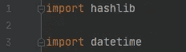
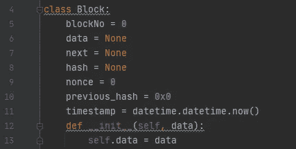
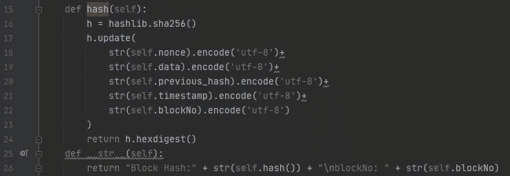
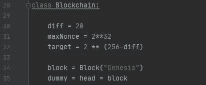
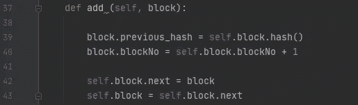
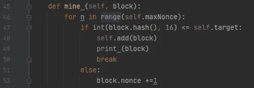
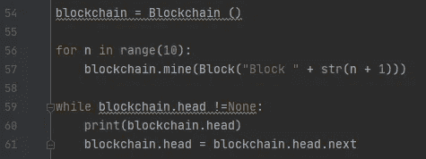

# 用 Python 构建区块链

> 原文：<https://medium.datadriveninvestor.com/building-a-blockchain-in-python-f194a26530fd?source=collection_archive---------2----------------------->

## 用挖矿！

最好的学习方法是通过做、教和示范。通过用 Python 构建一个，我巩固了我对区块链和编程的知识。

当我第一次编写区块链代码时，请跟我来，教你我所学到的，并在这个过程中了解我自己！

如果你不确定区块链是如何工作的，可以看看我为初学者写的关于区块链的文章。

选择哪种语言和哪种解释器来构建区块链的过程是这一努力中最困难的部分。我对 Python 的经验很少，希望呆在自己的舒适区内。最后，我意识到没有人能在自己的极限内完成任何事情，于是我决定勇往直前，开始用 Python 编程。Python 很棒，因为它对初学者来说很简单，同时对高级编码也很有效。

## 设置

我下载了 Python 3.9，打开它，试图打印我的名字，然后迅速关上笔记本电脑，走出房间。哦，亲爱的。我缺少一个 IDE(集成代码编辑器),并且不能用纯 Python 执行任何代码。一些研究和几个小时后，我回到了笔记本电脑。这一次，我尝试了一些翻译，直到我选择了一个我最喜欢的。是皮查姆。PyCharm 在 Python 用户中最受欢迎是有原因的。它的界面简单，适合各个层次。我尝试编写简单的命令，直到对 PyCharm 很熟悉。现在，是时候建立区块链了。

我引用了 YouTube 上的[这个](https://www.youtube.com/watch?v=b81Ib_oYbFk&t=50s)视频和[这个](https://github.com/howCodeORG/Simple-Python-Blockchain/blob/master/blockchain.py) GitHub 源代码。

如果你是第一次编程，我强烈建议你跟随视频或文章教程。它帮助我理解了我写的是什么，以及我为什么写它。

首先，我**导入了 hashlib** 和 **datetime，**来让我们分别计算散列和时间戳块。

导入是将代码从一个模块转移到另一个模块的修改。如果没有 datetime 导入，我的区块链就不能处理时间戳，如果没有 hashlib 导入，就不能创建散列。

区块链包含两个类:一个**区块**类和一个**区块链**类。使用**块**类，添加到区块链的每个块都建模相同。

## 块类

该块必须包括以下属性:

*   **块**的编号，设置为 0，因为它是链中的第一块，称为*生成块*
*   **数据，**设置为无
*   **接下来，**设置为无。这充当指向下一个块的指针，继续*链接的趋势。*
*   **哈希，**设置为无。块的散列是至关重要的，因为它是使区块链如此安全和不可改变的加密的一部分。
*   **nonce，**设置为 0。随机数是一个随机的整数，反复迭代直到找到“黄金随机数”。为了证明工作，矿工们竞相首先找到正确的哈希。nonce 会改变很多次，直到它帮助生成正确的散列。这完成了块的验证，并且该块可以被添加到链中。
*   **先前哈希，**设置为 0x0。存储前一个块的散列使得区块链不可变，因为改变块的散列会影响所有后续的块。
*   **时间、**或**时间戳、**描述交易发生的时间，用于同步网络中的所有模块。

The **Block** class, which determines the criteria for each block added to the chain

当我们创建一个块时，我们存储它的数据。构造函数 **init** 初始化类的属性。 **Self** 和 **data** 表示一个对象内将包含什么，即块。

## 混杂

下一步是添加哈希函数，该函数计算块的哈希。

将**随机数**、**数据**、**先前散列**、**时间戳**和**块号**放入一个字符串中，并通过 SHA-256 函数运行。SHA-256 是一种常用于区块链的加密哈希算法。" **h** "是使用 SHA-256 的变量。因为我在代码的开头导入了 hashlib，所以 SHA-256 是可用的。散列函数中的所有组件将创建块的散列，当创建新块时，该散列将被添加到*散列*字段中。

图中的最后一行描述了将在输出中显示的内容，或打印的内容。在这种情况下，输出将显示块的**散列**和**块号**。

## 区块链类

下一步是创建代码的第二个类:**区块链**类。区块链级包括:

*   **难度，**设置为 20。通过增加难度，我们有效地*缩小了目标范围。*减小目标范围会使挖掘块变得更加困难，这在处理有许多节点在努力寻找可接受散列的网络时非常有用。

*   **最大 nonce** ，设置为 2 的 32 次方，这是一个 32 位数字可以存储的最大数。随机数必须小于要被接受的*目标数*。
*   **目标数，**设为 2 的 256 次方减去难度。在这种情况下，难度为 20。

区块链中的第一个块是 Genesis 块，如第 34 行所示。现在，我陷入了下一行代码: **dummy = head = block。**任何链表的开始都称为**头**。因为我们的链表的头是 Genesis 块，所以我们用代码把它写成 *head = block。然而，仅仅这样还不够具体——在 Python 中，对象是通过引用传递的。*头*和*块*会指向相同的东西。在*头*变量之前必须写一个随机变量(本例中为*哑变量*，告诉计算机*头*与*块*不指向同一个对象。*

## 添加块

我们将继续区块链是 *add* 函数的链表的想法，用于向链中添加块。

区块链在哈希的帮助下以链表的形式出现。哈希将块绑定在一起，使其不可变。必须将**先前散列**(第 39 行)设置为等于当前列表顶部的块。然后，新块被设置为等于当前块加 1，如第三行代码所示。

最后两条线帮助形成了区块链的形状。如“self.block.next = block”所示，每个块都有一个指向下一个块的指针，因此将*下一个*指针设置为*块。*这将块添加到列表的末尾。下一行“self.block = self.block.next”将指针向前移动，以继续将块添加到列表末尾的趋势。

## 采矿

接下来，我添加了一个挖掘函数。我用了一个**工作证明**共识机制，像比特币。为了将块添加到链中，节点尝试不同的随机数，直到找到小于目标范围的散列。

第 46 行开始一个循环。它首先设置一些猜测准则(范围)，从 0 到最大 nonce。它在第 47 行继续检查当前块的散列值是否小于或等于目标值。在 Python 中散列必须被转换成整数，因此 *int。*如果散列低于目标，则该过程继续，并且可以添加该块(第 48 行)。接下来，打印块，最后，我们休息一下停止采矿。然而，如果散列值不小于目标数，我们将 nonce 加 1，然后重试。

## 收尾工作

我们以从第 56 行开始的循环结束代码。它计算 10 个随机块。你可以摆弄这些数字，但是它总是会停在你插入的整数上。

第 60 行提示打印 10 个块。我喜欢在代码上按下 run，然后看着它运行。一旦你完成这一行，你就正式完成了！运行几次，检查错误，欣赏你的杰作。只用 61 行代码，您就创建了一个区块链，它可以生成块、计算哈希值，并把所有这些放在一起！

这是我第一次尝试编写区块链代码并使用 Pycharm！总的来说，最难的部分是理解我为什么要写东西，而不是简单地把它抄下来然后就收工。我花了大量时间在我的笔记本电脑上，试图弄清楚各种 Python 术语的含义，以及如何以其他人也能理解的方式解释它们。这个项目无疑是一个坚实的基础。我什么都尝了一点，对区块链建筑有了更深的了解。

查看[源代码](https://github.com/howCodeORG/Simple-Python-Blockchain/blob/master/blockchain.py)，并在您自己的终端中使用它！正如他们所说，实践是最好的学习方式之一(这一点我可以担保)。

有什么我可以做得更好的吗？你发现什么错误了吗？对我有什么建议吗？告诉我！LinkedIn 和 [Medium](https://annekatracey.medium.com/) 是留下你的想法和捕捉更多类似本文的文章的好地方。

**访问专家视图—** [**订阅 DDI 英特尔**](https://datadriveninvestor.com/ddi-intel)