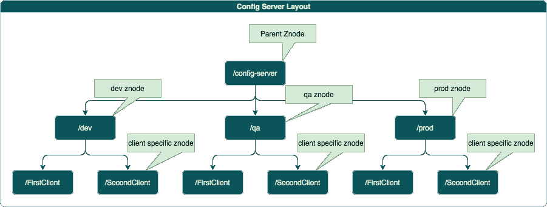

# 使用 Zookeeper 构建分布式配置服务器

> 原文：<https://medium.datadriveninvestor.com/building-a-distributed-config-server-using-zookeeper-6570363799e5?source=collection_archive---------2----------------------->

什么是动物园管理员？

Apache Zookeeper 是分布式数据存储(不是为大型数据存储而设计的)，主要用于协调目的。配置管理是一个广泛使用的目的。像 Apache Hadoop、Apache Kafka、Apache Hive、Apache Nifi 等分布式系统都在使用 zookeeper。所有这些分布式系统都使用 zookeeper 作为所有节点之间的协调器，并存储所有共享的配置、状态和元数据。存储的数据应该很小，并且不应该超过 1Mb。

**动物园管理员的建筑:**

ZooKeeper 有一个分层的名称空间，很像一个分布式文件系统(包含整个数据树的内存数据库)。命名空间中的每个节点都可以有与其关联的数据及其子节点。

**Znode-**Zookeeper 树中的每个节点都被称为 Znode，每个 Znode 都有一个关联的 stat 对象。Stat 对象包含版本、时间戳等信息。每次如果客户端想要更新它，客户端应用程序需要发送版本号，如果版本与当前版本不匹配，那么更新将失败。

节点是程序员访问的主要实体。

**访问控制列表(ACL)** -每个节点都有一个访问控制列表(ACL)，限制谁可以做什么。

守望者- 动物园管理员支持守望者。您可以使用任何读操作(如 getData()、getChildren()和 exists())注册一个*一次性*观察器。如果有任何变化，观察器将被触发。

**节点类型:**

**临时节点-** 只要创建 Znode 的会话处于活动状态，这些 Znode 就会存在。

**序列节点-** 创建这类节点时，Zookeeper 会在名称中添加一个唯一的序列号。

**分布式配置应用:**

让我们设计一个小的配置服务器应用程序。

**配置服务器设计**

**步骤 1-** 在这里下载[的 Zookeeper。](https://zookeeper.apache.org/releases.html)

**步骤 2 -** 从本地终端启动 zookeeper。我正在使用独立模式。群集中只有一个节点。默认端口将是 2181。

在 build.gradle 中添加 spring-cloud-starter-zookeeper-all，它将下载所有需要的依赖项。

**步骤 4**——编写一个 zookeeper 服务类，它包含了获取 Zookeeper 连接、创建新的 Znode、更新 Znode 数据和读取 Znode 数据的方法。

在容器启动期间，该服务为不同的环境创建一个父节点。/config_server 是一个根配置，然后它有像/dev、/qa、/prod 这样的子节点。

此服务正在注册一次性观察者。一旦 Znode 数据有任何更新，Watcher 将被解雇。

**步骤 5 -** 编写一个控制器类，外部服务将使用这些 API 来获取最新的配置信息。

Zookeeper 连接和有效负载类

启动这个应用程序后，你可以看到一个 Zookeeper 客户端连接已经注册了自定义观察。

**测试 App:**

创建第一个 Znode。它的名称是“FirstClient”，环境是“DEV”。

获取特定的 Znode 数据

更新特定的 Znode 数据。一旦检测到 Znode 数据发生变化，Watcher 就会被触发。如果您想广播或通知客户有关更改，Watcher 非常有用。

**春云动物园管理员-**

Spring cloud zookeeper 提供了与 zookeeper 的集成。它还提供自动配置和注释来实现服务发现和应用程序配置。

**服务发现-** Spring cloud zookeeper 使用 zookeeper 作为服务注册表，存储所有服务相关信息，并提供 api 用于服务发现。所有服务将在启动时注册。调用者应用程序可以使用发现客户端进行逻辑服务发现。

> build . grad le dependency-org . spring framework . cloud:spring-cloud-starter-zookeeper-discovery

应用程序配置- Spring cloud zookeeper 也可以用作配置存储。它可以根据配置文件/环境存储应用程序配置。它只是 spring config server 的一个替代品。观察器不是 spring cloud zookeeper 配置的一部分。

> build . grad le dependency-org . spring framework . cloud:spring-cloud-starter-zookeeper-config

**结论:**

当不同应用程序之间需要协调时，使用 Zookeeper 作为配置服务器。假设一个大型分布式系统运行在不同的集群中，需要共享/公共元数据进行处理。元数据信息可以存储在中央 Zookeeper 服务器中，并可以通过 api 公开。所有应用程序将实时从 api 获取元信息。

我们实现了一个定制的解决方案，而不是使用 spring zookeeper 配置，因为它可以针对任何类型的配置/元数据进行定制。

感谢阅读。如果觉得有用，请鼓掌关注我更多有趣的文章。:)