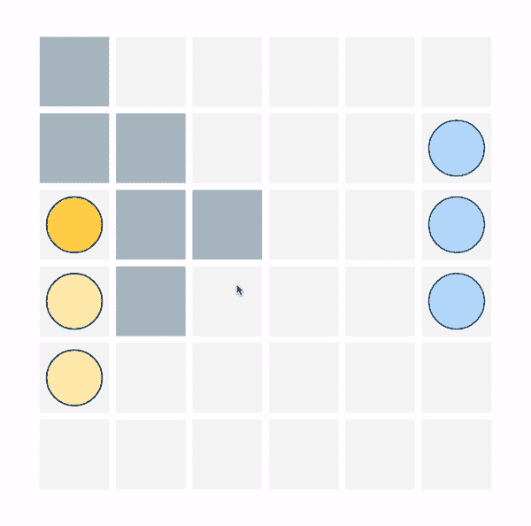
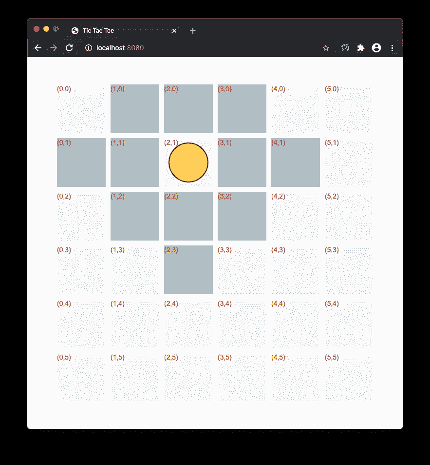
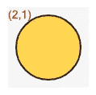
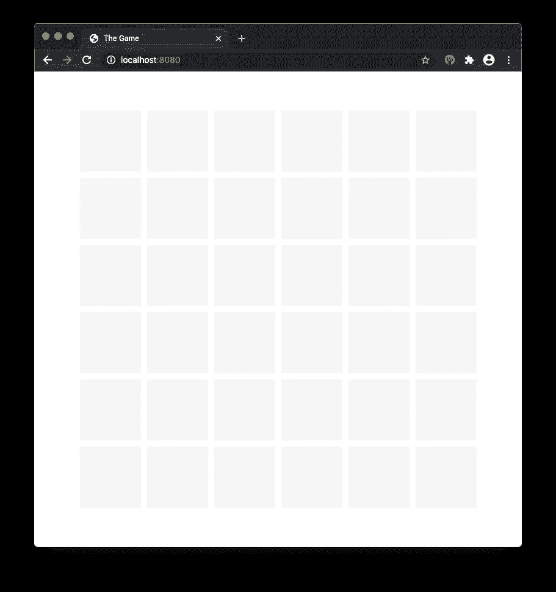
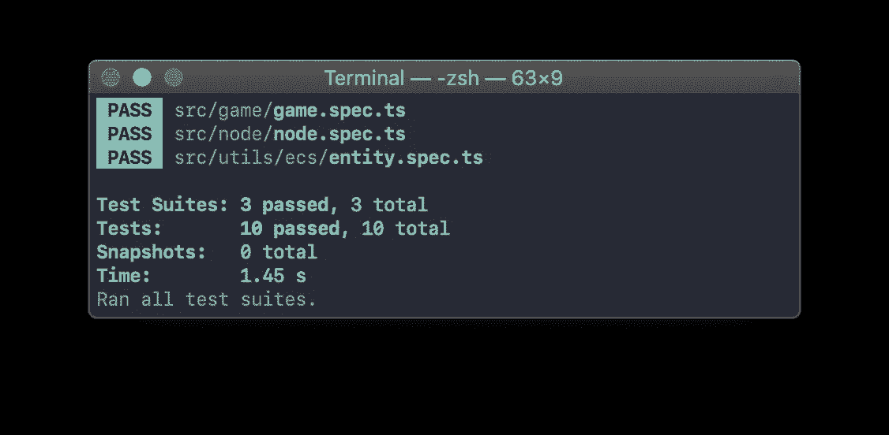
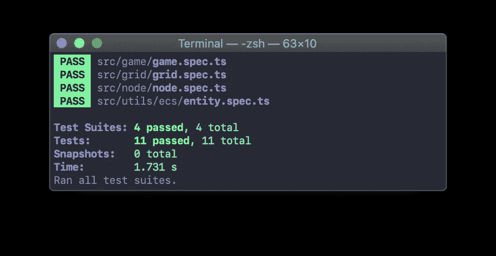

# 用 TypeScript 构建游戏。绘制网格 3/5

> 原文：<https://medium.datadriveninvestor.com/building-a-game-with-typescript-drawing-grid-3-5-1fb94211c4aa?source=collection_archive---------0----------------------->

教程[系列](https://medium.com/@gregsolo/gamedev-patterns-and-algorithms-in-action-with-typescript-d29b913858e)中的第三章讲述了如何用 TypeScript 和本地浏览器 API 从头开始构建游戏

[Background vector created by freepik](https://www.freepik.com/free-photos-vectors/background)

欢迎回来！这是我们讨论如何用 TypeScript 和本地浏览器 API 构建一个简单的回合制游戏的系列文章！第三章，“绘制网格”，致力于构建游戏的关键部分:网格。其他章节可在此处获得:

*   [简介](/@gregsolo/gamedev-patterns-and-algorithms-in-action-with-typescript-d29b913858e)
*   [第一章实体组件系统](/@gregsolo/entity-component-system-in-action-with-typescript-f498ca82a08e)
*   第二章。游戏循环([第一部分](/@gregsolo/gamedev-patterns-and-algorithms-with-typescript-game-loop-part-1-2-699919bb9b71)，[第二部分](/@gregsolo/gamedev-patterns-and-algorithms-in-action-with-typescript-game-loop-2-2-c0d57a8e5ec2))
*   第三章。绘制网格([第 1 部分](/@gregsolo/building-a-game-with-typescript-drawing-grid-1-5-aaf68797a0bb)、[第 2 部分](https://medium.com/javascript-in-plain-english/building-a-game-with-typescript-drawing-grid-2-5-206555719490)、第 3 部分[、第 4 部分](https://medium.com/@gregsolo/building-a-game-with-typescript-iii-drawing-grid-4-5-398af1dd638d)、[第 5 部分](https://medium.com/@gregsolo/building-a-game-with-typescript-drawing-grid-5-5-49454917b3af))
*   第四章。舰船([第一部分](https://medium.com/@gregsolo/building-a-game-with-typescript-colors-and-layers-337b0e4d71f)、[第二部分](https://medium.com/@gregsolo/building-a-game-with-typescript-team-and-fleet-f223d39e9248)、[第三部分](https://medium.com/@gregsolo/building-a-game-with-typescript-drawing-ship-14e6c19caa38)、[第四部分](https://gregsolo.medium.com/building-a-game-with-typescript-ship-and-locomotion-4f5969675993))
*   第五章输入系统([第一部分](https://gregsolo.medium.com/building-a-game-with-typescript-input-system-1-3-46d0b3dd7662)、[第二部分](https://gregsolo.medium.com/building-a-game-with-typescript-input-system-2-3-cd419e36027c)、[第三部分](https://gregsolo.medium.com/building-a-game-with-typescript-input-system-3-3-8492552579f1))
*   第六章。寻路和移动([部分 1](https://blog.gregsolo.me/articles/building-a-game-with-typescript-pathfinding-and-movement-17-introduction) 、[部分 2](https://blog.gregsolo.me/articles/building-a-game-with-typescript-pathfinding-and-movement-27-highlighting-locomotion-range) 、[部分 3](https://blog.gregsolo.me/articles/building-a-game-with-typescript-pathfinding-and-movement-37-graph-and-priority-queue) 、[部分 4](https://blog.gregsolo.me/articles/building-a-game-with-typescript-pathfinding-and-movement-47-pathfinder) 、[部分 5](https://blog.gregsolo.me/articles/building-a-game-with-typescript-pathfinding-and-movement-57-finding-the-path) 、[部分 6](https://blog.gregsolo.me/articles/building-a-game-with-typescript-pathfinding-and-movement-6-instant-locomotion) 、[部分 7](https://blog.gregsolo.me/articles/pathfinding-and-movement-7-animated-locomotion) )
*   第七章。玛奇纳州
*   第八章。攻击系统:生命和伤害
*   第九章。比赛的输赢
*   第十章敌人 AI

我们在[的上一篇](https://medium.com/javascript-in-plain-english/building-a-game-with-typescript-drawing-grid-2-5-206555719490)中做了很多，但是从玩家的角度来看什么都没有改变。我们仍然在用`game.ts`中的`DirtyDraw`方法绘制网格。但是我们终于准备好摆脱它了！

> 随意切换到[库](https://github.com/soloschenko-grigoriy/gamedev-patterns-ts)的`drawing-grid-2`分支。它包含了前几篇文章的工作成果，是这篇文章的一个很好的起点。

# 目录

1.  伟大的代码迁移
2.  淋巴结的解剖
3.  Vector2D 简介
4.  现在所有的都在一起了:网格、节点和绘图。
5.  测试节点实体
6.  测试网格实体
7.  结论

# 伟大的代码迁移

[Arrow vector created by freepik](https://www.freepik.com/free-photos-vectors/arrow)

我们在系统中定义了一组清晰的职责:`Grid`包含对`Nodes`的引用，这些节点可能有自己特定的逻辑。和绘图功能都封装在它们的`NodeDrawComponent`中。然而，当前的代码违反了我们的架构设计。此时，`Game`呈现所有节点，在某种程度上，它是我们系统中的“上帝对象”:

首先，我们应该将循环移动到`Grid`。根据我们的计划，`Grid`也不绘制节点，只是实例化它们:

我定义了一个私有方法`InitNodes`，它在`Grid`醒来时构造节点实体。

绘图代码被送到`NodeDrawComponent`:

TS 编译器对我们大喊缺少变量:`x`和`y`。这些变量是在网格的循环中定义的，所以我们必须以某种方式将它们传递到这里。

一个显而易见的解决方案是简单地将这些变量设置为节点的字段，并将它们传递给组件。但是在我们进入代码之前，让我们花点时间仔细考虑一下这些`x`和`y`实际上代表什么。

到目前为止，我们只使用它们来绘制矩形。然而，正如我们在以前的文章中所建立的，节点实体不仅仅是屏幕上的一个灰色矩形。`Node`是一个*实体*

This is a demo of the gameplay we are looking to achieve

通过使它成为一个实体，我们可以存储和计算大量重要的信息。例如，我们可以使用这种能力来突出显示特定的节点，以指示玩家可以将他们的船移动到哪里。要做到这一点，我们必须知道任何给定的节点离玩家的当前位置有多远。反过来，为了能够做到这一点，我们必须跟踪每个`Node`的位置。

# 淋巴结的解剖

我们可以用不同的方式思考一个位置。它可以是画布上的一个位置，由`x`和`y`坐标确定。或者可以通过网格内节点的`index`来确定:

在图像中，您可以看到带有黄色圆圈的节点具有 Index (2，1)，这意味着它位于行“2”和列“1”(从零开始计数)。

现在，坐标是一个稍微复杂一点的故事。我是说，我们到底想怎么数，有很多方法。例如，我们可以假设`Node`的坐标是它的左上角。听起来很合理，因为我们从画布的左上角开始计算位置。或者我们可以说:`Node`的坐标就是其中心的位置。

我发现对于*这款*游戏来说，根据*边界*来考虑`Node`的位置是最方便的。我把边界定义为两点:`Start`，是`Node`左上角的坐标，`End`，是右下角。在截图上，它们分别标记为红色和蓝色的点:

这些点之间的区域属于`Node`，它允许我们确定任何特定节点的边界。

每个点是两个数字的集合:`x`和`y`对应相关的轴；

但是边界不应该是`NodeDrawComponent`而不是`Node`本身的特征吗？不是绘图组件的责任吗？嗯，没有。

边界不一定与`Node`的视觉表现有关。*实际*和*可见*边界可以不同。网格中任何节点所占的实际面积是它的核心特征，而`NodeDrawComponent`可以自由地以任何方式表示它。想象我们用圆形而不是方形来绘制节点:

`Node`的实际区域将是这个灰色方块，而可见的将只是黄色圆圈。如你所见，它们是不同的。

> 正如我们将在以后的章节中看到的，许多其他节点的组件依赖于*实际的*边界，而不仅仅是绘制组件。

好了，是时候回到代码上了。由于`Start`、`End`和`Index`是`Node`的核心参数，我将其设为实例化所必需的:

你可能会注意到，我们在这里重复了几次`x: number; y: number`结构。此外，我们将在游戏中反复使用它。我们应该为它定义一个专用的类或至少一个接口。它可能是类似于`IPoint`或`ICoordinate`的东西:

就目前而言，这已经足够了，但是，正如经常发生的那样，还不止这些。我们不会定义像`Point`这样狭窄的数据结构，而是会效仿`Unity3d`，重用另一种数据结构:`Vector`。

 [## 战略或战术规划？软件工程师的未来之路|数据驱动的投资者

### outer hout(2018)在他的书《软件设计哲学》中提到了一些原则，以便更深入地挖掘…

www.datadriveninvestor.com](https://www.datadriveninvestor.com/2019/04/22/strategic-or-tactical-programming-the-road-ahead-for-software-engineers/) 

我们将从小处着手，定义一个基础，然后在需要时逐步引入更多的功能。我们不打算实现`Vector`必须提供的所有漂亮而强大的东西，而是只关注我们现在需要的部分。

> 我发现这种方法是架构软件中最强大的方法之一。除非必要，否则我不会定义功能(利用“你不会需要它”的原则)。与此同时，我确实在努力思考代码潜在的更广泛的用途，并让它对未来的扩展开放。

# Vector2D 简介

在数学中，向量是既有大小又有方向的对象。出于我们的目的，我们将使用这个结构来保存关于点或坐标的信息，暂时忽略其他所有内容。

`Vector2D`作为 ECS 或生命周期方法，是一个*实用程序*。这不取决于游戏。记住这一点，让我们把它放在`utils`模块下:

不要忘记桶:

就是这样！这就是我们现在需要`Vector`为我们做的一切。但是我们保留选项，以便在将来添加更多功能。

# 现在所有的都在一起了:网格、节点和绘图

[Business vector created by pikisuperstar](https://www.freepik.com/free-photos-vectors/business)

有了`Vector2D`，我们现在可以在`Node`内使用它:

厉害！但是现在`Grid`投诉说`Node`签名不对。有道理，`Node`要求`Start`、`End`、`Index`进行实例化。

我将使用我们在`DirtyDraw`中所做的相同计算来确定`Node`的开始和结束位置。它的索引可以使用循环变量来定义:

但是，`NodeDrawComponent`还是漏了一个变量。但是现在我们有了一个`Node`的`Start`字段，这正是医生要求的:

太好了！同样，让我们把`Node`作为它大小的唯一真实来源。我们要求实体提供以下信息，而不是直接访问组件中的设置:

首先，我定义了一个`Node`的公共*计算值*。它仅仅计算`Node`的`Size`，分析它的边界。有了这个属性，我们可以从`NodeDrawComponent`中移除大小和偏移量:

太好了！现在只有`Node`提供了关于它的边界和大小的数据。有了这些，我们终于可以(终于！)去掉`DirtyDraw`:

但是，我们的代码仍然无法编译。我们必须更新我们在单元测试中实例化`Node`的方式。此外，我们有一些新的功能，这将是很好的涵盖:`Size`计算。

# 测试节点

更新签名是相当简单的事情。我只是定义了几个伪向量:

我们可以通过简单地将`Size`与`Node`的`Start`和`End`进行比较来验证其计算是否正确:

厉害！如果您用`npm start`运行代码，它应该编译没有错误。如果您打开浏览器，它应该会再次呈现网格，但这一次，它不再是一个“肮脏”的绘制:

由`npm t`运行的所有测试也应该通过:

厉害！为了巩固我们的胜利，让我们也用测试来覆盖`Grid`实体。

# 测试网格实体

它还没有任何组件，但有许多子实体。这意味着我们应该验证网格唤醒和更新它们的能力。我们可以像对`Game`那样做:通过监视一个孩子的`prototype`。在这种情况下，它是`Node`的原型:

这里的一切应该看起来很熟悉。我开始监视 node 的`Awake`和`Update`，确保它们还没有被调用。然后，调用网格的`Awake`和`Update`，检查各自的 spy 是否确实被调用。更准确地说，我检查了这些生命周期事件被调用的次数，并将其与节点数进行了比较。

在这一点上，您的代码应该编译没有错误与`npm start`。所有测试应通过`npm t`运行:

> 你可以在[库](https://github.com/soloschenko-grigoriy/gamedev-patterns-ts)的`drawing-grid-3`分支中找到这篇文章的完整源代码。

# 结论

酷！这是一个很大的编码！在这篇文章的开始，我们将所有的绘图功能硬编码在`Game`实体中，使它几乎像一个“上帝的对象”。

我们重构了我们的代码，并将所有的绘图移动到它应该在的地方:`NodeDrawComponent`。一路上，我们识别`Node`的特征，并使用`Start`、`End`坐标和`Grid`内的`Index`位置来确定其位置。`Vector2D`，我们引入的新结构，帮助我们处理二维属性。

我们还有一些细节需要处理。例如，您可能注意到我们创建了几个画布元素，而不是一个。此外，我们的绘图在这一点上是相当静态的，不太适合频繁的变化。

我们将在本章的下一部分中讨论这一切。**如果您有任何意见、建议、问题或任何其他反馈，请随时给我发私信或在下方留言！**感谢您的阅读，我们下次再见！

*这是系列教程“* ***用 TypeScript*** *”中的第三章。其他章节可点击此处:*

*   [简介](/@gregsolo/gamedev-patterns-and-algorithms-in-action-with-typescript-d29b913858e)
*   [第一章实体组件系统](/@gregsolo/entity-component-system-in-action-with-typescript-f498ca82a08e)
*   第二章。游戏循环([第一部分](/@gregsolo/gamedev-patterns-and-algorithms-with-typescript-game-loop-part-1-2-699919bb9b71)、[第二部分](/@gregsolo/gamedev-patterns-and-algorithms-in-action-with-typescript-game-loop-2-2-c0d57a8e5ec2))
*   第三章。绘制网格([第一部分](/@gregsolo/building-a-game-with-typescript-drawing-grid-1-5-aaf68797a0bb)、[第二部分](https://medium.com/javascript-in-plain-english/building-a-game-with-typescript-drawing-grid-2-5-206555719490)、第三部分[第四部分](https://medium.com/@gregsolo/building-a-game-with-typescript-iii-drawing-grid-4-5-398af1dd638d)、[第五部分](https://medium.com/@gregsolo/building-a-game-with-typescript-drawing-grid-5-5-49454917b3af))
*   第四章。舰船([第一部分](https://medium.com/@gregsolo/building-a-game-with-typescript-colors-and-layers-337b0e4d71f)、[第二部分](https://medium.com/@gregsolo/building-a-game-with-typescript-team-and-fleet-f223d39e9248)、[第三部分](https://medium.com/@gregsolo/building-a-game-with-typescript-drawing-ship-14e6c19caa38)、[第四部分](https://gregsolo.medium.com/building-a-game-with-typescript-ship-and-locomotion-4f5969675993))
*   第五章输入系统([第一部分](https://gregsolo.medium.com/building-a-game-with-typescript-input-system-1-3-46d0b3dd7662)、[第二部分](https://gregsolo.medium.com/building-a-game-with-typescript-input-system-2-3-cd419e36027c)、[第三部分](https://gregsolo.medium.com/building-a-game-with-typescript-input-system-3-3-8492552579f1))
*   第六章。寻路和移动([第一部分](https://blog.gregsolo.me/articles/building-a-game-with-typescript-pathfinding-and-movement-17-introduction)、[第二部分](https://blog.gregsolo.me/articles/building-a-game-with-typescript-pathfinding-and-movement-27-highlighting-locomotion-range)、[第三部分](https://blog.gregsolo.me/articles/building-a-game-with-typescript-pathfinding-and-movement-37-graph-and-priority-queue)、[第四部分](https://blog.gregsolo.me/articles/building-a-game-with-typescript-pathfinding-and-movement-47-pathfinder)、[第五部分](https://blog.gregsolo.me/articles/building-a-game-with-typescript-pathfinding-and-movement-57-finding-the-path)、[第六部分](https://blog.gregsolo.me/articles/building-a-game-with-typescript-pathfinding-and-movement-6-instant-locomotion)、[第七部分](https://blog.gregsolo.me/articles/pathfinding-and-movement-7-animated-locomotion))
*   第七章。玛奇纳州
*   第八章。攻击系统:生命和伤害
*   第九章。比赛的输赢
*   第十章敌人 AI

**访问专家视图—** [**订阅 DDI 英特尔**](https://datadriveninvestor.com/ddi-intel)