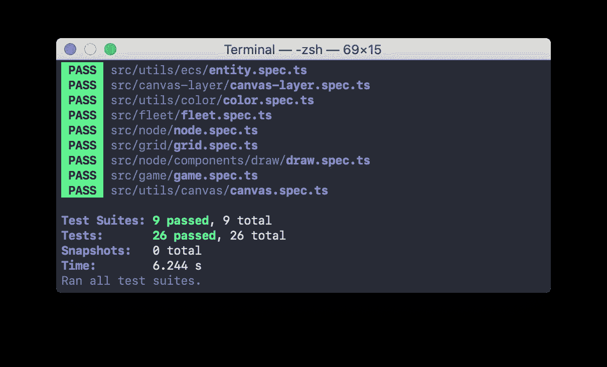

# 用 TypeScript 构建游戏。团队和车队

> 原文：<https://medium.datadriveninvestor.com/building-a-game-with-typescript-team-and-fleet-f223d39e9248?source=collection_archive---------1----------------------->

教程[系列](https://medium.com/@gregsolo/gamedev-patterns-and-algorithms-in-action-with-typescript-d29b913858e)中的第四章讲述了如何用 TypeScript 和本地浏览器 API 从头开始构建游戏

[Background vector created by freepik](https://www.freepik.com/free-photos-vectors/background)

你好。欢迎回到如何用 **TypeScript** 从头开始构建一个简单的回合制游戏的系列教程！在本教程中，我们仅使用**原生浏览器 API** 和**增量**添加新功能，这要归功于**坚实的** **原则**和常见的**模式**。

在[的前一篇文章](https://medium.com/@gregsolo/building-a-game-with-typescript-colors-and-layers-337b0e4d71f)中，我们为`Ships`准备了一个舞台:创建了`Color`工具并设置了`foreground`画布层。今天我们要谈论*友情*和*对立*并介绍我们幸福家庭的三位新成员:`Team`、`Fleet`，当然还有`Ship`。

在第四章“船”中，我们正在实现回合制游戏中最重要的令牌:我们正在抽取`Ships`。玩家会用它们来攻击其他玩家。失去所有船只意味着输掉游戏。你可以在这里找到这个系列的其他章节 *:*

*   [简介](https://medium.com/@gregsolo/gamedev-patterns-and-algorithms-in-action-with-typescript-d29b913858e)
*   [第一章实体组件系统](https://medium.com/@gregsolo/entity-component-system-in-action-with-typescript-f498ca82a08e)
*   第二章。游戏循环([第一部分](https://medium.com/@gregsolo/gamedev-patterns-and-algorithms-with-typescript-game-loop-part-1-2-699919bb9b71)，[第二部分](https://medium.com/@gregsolo/gamedev-patterns-and-algorithms-in-action-with-typescript-game-loop-2-2-c0d57a8e5ec2))
*   第三章。绘制网格([第一部分](https://medium.com/@gregsolo/building-a-game-with-typescript-drawing-grid-1-5-aaf68797a0bb)、[第二部分](https://medium.com/javascript-in-plain-english/building-a-game-with-typescript-drawing-grid-2-5-206555719490)、[第三部分](https://medium.com/@gregsolo/building-a-game-with-typescript-drawing-grid-3-5-1fb94211c4aa)、[第四部分](https://medium.com/@gregsolo/building-a-game-with-typescript-iii-drawing-grid-4-5-398af1dd638d)、[第五部分](https://medium.com/@gregsolo/building-a-game-with-typescript-drawing-grid-5-5-49454917b3af))
*   第四章。船舶([第 1 部分](https://medium.com/@gregsolo/building-a-game-with-typescript-colors-and-layers-337b0e4d71f)，第 2 部分[，第 3 部分](https://medium.com/@gregsolo/building-a-game-with-typescript-drawing-ship-14e6c19caa38)，[第 4 部分](https://gregsolo.medium.com/building-a-game-with-typescript-ship-and-locomotion-4f5969675993))
*   第五章输入系统([第一部分](https://gregsolo.medium.com/building-a-game-with-typescript-input-system-1-3-46d0b3dd7662)、[第二部分](https://gregsolo.medium.com/building-a-game-with-typescript-input-system-2-3-cd419e36027c)、[第三部分](https://gregsolo.medium.com/building-a-game-with-typescript-input-system-3-3-8492552579f1)
*   第六章。寻路与移动([第一部分](https://blog.gregsolo.me/articles/building-a-game-with-typescript-pathfinding-and-movement-17-introduction)、[第二部分](https://blog.gregsolo.me/articles/building-a-game-with-typescript-pathfinding-and-movement-27-highlighting-locomotion-range)、[第三部分](https://blog.gregsolo.me/articles/building-a-game-with-typescript-pathfinding-and-movement-37-graph-and-priority-queue)、[第四部分](https://blog.gregsolo.me/articles/building-a-game-with-typescript-pathfinding-and-movement-47-pathfinder)、[第五部分](https://blog.gregsolo.me/articles/building-a-game-with-typescript-pathfinding-and-movement-57-finding-the-path)、[第六部分](https://blog.gregsolo.me/articles/building-a-game-with-typescript-pathfinding-and-movement-6-instant-locomotion)、[第七部分](https://blog.gregsolo.me/articles/pathfinding-and-movement-7-animated-locomotion))
*   第七章。玛奇纳州
*   第八章。攻击系统:生命和伤害
*   第九章。比赛的输赢
*   第十章敌人 AI

> 随意切换到[库](https://github.com/soloschenko-grigoriy/gamedev-patterns-ts)的`ships-1`分支。它包含了前几篇文章的工作成果，是这篇文章的一个很好的起点。

# 目录

1.  介绍
2.  团队
3.  你的舰队，舰长！
4.  测试车队
5.  第一艘船
6.  结论

# 团队

许多游戏都以这样或那样的方式围绕着冲突展开。玩家努力克服障碍和挑战。玩家对抗环境障碍，与 AI 和其他玩家战斗，解决谜题和谜语。

[Background vector created by freepik — www.freepik.com](https://www.freepik.com/vectors/background)

当我们想到团队时，我们的第一个联想可能是“协作”，“一起工作”。但是“团队”概念还有另一面。是**反对派**。为什么这样不是反义词吗？嗯，是也不是。人们组织成一个团队去做一些事情。合作，一起工作。更快/更有效/更容易达到目的。当我们谈论游戏时，团队合作克服**冲突**。他们一起打*对抗*什么的，甚至可能是另一支球队。

从这个角度来看，我们可以把一个“团队”看成一个“方”:“我的一方”vs“他们的一方”。团队中实际有多少人是次要的。重要的是对抗:一个队和另一个队比赛。

[Frame vector created by dgim-studio — www.freepik.com](https://www.freepik.com/vectors/frame)

在我们这个简单的游戏中，我们有两个团队，每个团队只有一个玩家。我们可以使用“玩家”这个概念，根本不用担心“团队”。但是谁知道呢，也许将来我们会扩展并允许玩家在团队的保护伞下加入他们的势力呢？让我们*保留我们的选择*，这通常是一个好策略。

我们该如何称呼我们的团队？“蓝”队和“红”队呢？但是如果我们想要不同的颜色呢？有了这样一个名字，我们无意中将*逻辑*与*表示*联系起来。这几乎总是一个坏主意。

或许“我的”对“敌人”？其中一个玩家显然是“我的”团队中的*，对吗？嗯，这里有一个问题。如果我们在未来的迭代中引入多人游戏，并且所有的团队都属于真正的玩家，那会怎么样？他们中的哪一个应该算是“我的”？*

*我建议我们使用非常通用的命名:A 队对 B 队。这样，我们就不会将团队的命名与任何功能捆绑在一起。团队只代表一件事:反对派。*

* [## Java 14 工作开始，Java 13 即将发布|数据驱动投资者

### 随着 Java 13 准备于 2019 年 9 月 17 日上线，科技公司更令人兴奋的发展已经开始了…

www.datadriveninvestor.com](https://www.datadriveninvestor.com/2019/09/17/work-begins-on-java-14-as-java-13-set-to-launch/) 

一个实现可能有多种形式，我将使用一个简单的枚举:

和桶文件:

游戏的最终目标是击沉所有对手的船只。`Team A`会尝试击沉属于`Team B`的船只。因为我们有不止一艘船，所以建立某种集合结构来处理对它们的批量操作是有意义的。姑且称之为`Fleet`。

# 你的舰队，舰长！

Business vector created by dooder — [www.freepik.com](http://www.freepik.com)

这支舰队是又一只`Entity`:

传统上，我们不要忘记桶文件:

每个队都有自己的舰队。车队一经创建就被分配给团队，并且永远不会改变:* 

## *边注*

**如果 eslint/IDE 抱怨没有使用* `*Team*` *变量，你就成了已知 eslint 插件 bug 的受害者。要“修复”它，您可以关闭对该行的检查:**

**或者您可以使用别名:**

*我将采用第一种方法，因为当一个合适的错误修正到来时，删除这一行会更容易。*

*像任何其他实体一样，`Fleet`必须在层级中找到自己的位置。让它直接成为游戏的孩子:*

*这里我们实例化了两个车队，每个车队一个。然后我们将它们添加到游戏实体的数组中。*

# *测试车队*

**

*[Infographic vector created by katemangostar — www.freepik.com](https://www.freepik.com/vectors/infographic)*

*我们应该更新我们的测试来反映这些变化:*

*所有这些应该看起来很熟悉:我们只是简单地窥探了一下`Fleet`的原型，因为我们没有直接访问实例的权限。然后我们验证`Awake`和`Update`只有在调用了`Game`各自的方法后才被调用。*

*厉害！就像其他的`Entity`一样，我们要测试`Fleet`。现在它几乎是空的，所以让我们验证至少我们没有破坏任何父组件的功能:我们仍然正确地使用了`Awake`和`Update`组件:*

*方法与所有其他实体相同:我们创建假组件，将它们附加到`Fleet`，执行`Awake`和`Update`来查看组件是否确实被唤醒和更新:*

*不错！将来，我们可能会改变`Fleet`的签名，换句话说，改变它的构造函数。为了让生活简单一点，让我们为`Fleet`定义一个专用的`mock`:*

*并更新桶以反映该变化:*

*现在我们可以在任何需要引用`Fleet`的地方使用模拟:*

> *这种方法的好处是我们现在有了一个针对所有测试的中央模拟。如果签名改变了，我们只需在一个地方改变模拟，不管有多少测试使用它。*

*此时，我们的代码应该通过`npm start`成功编译，并且所有测试应该通过`npm t`:*

**

# *第一艘船*

**

*[Background vector created by freepik — www.freepik.com](https://www.freepik.com/vectors/background)*

*太好了！但是`Fleet`没有船就没有任何意义！是时候创造一些了！*

*每个`Ship`都应该属于某个`Fleet`:*

*太棒了。现在`Fleet`可以初始化`Ships`并管理它们。怎么会？和其他`Entity`一样！在孩子们的帮助下:*

*就像`Game`处理`Fleet`和`Grid`一样，`Fleet`处理`Ships`。首先，我定义了一个私有数组来跟踪所有船只。然后我构造并唤醒三个`Ships`。最后，我确保每个`Ship`都在`Fleet`更新时得到更新。*

*但是为什么我们要制造三艘飞船呢？这是一个合理的问题，可能我们无法回答。应该是一个**可配置的设置**，游戏设计师可以微调。让我们把它移到一个合适的地方:`Settings`！*

*不错！车队规模现在是全球配置的一部分！我在`Settings`内准备了一个专门的区域`ships`，我们以后肯定会需要大量的船只配置！*

*让我们在代码中使用这个新的车队规模设置:*

*当然，我们应该给`fleet.spec.ts`增加一些测试来反映最近的变化:*

*在这里，我们验证所有船只都已被唤醒并正确更新。此时，我们的代码应该可以用`npm start`成功编译，并且所有的测试都应该通过`npm t`:*

**

> *你可以在[库](https://github.com/soloschenko-grigoriy/gamedev-patterns-ts)的`ships-2`分支中找到这篇文章的完整源代码。*

# *结论*

*做得好！在本教程中，我们讨论了`Team`的概念，甚至在游戏中建立了两个团队。我们还创建了我们自己的`Fleet,`即`Ships`集合。我们终于完成了准备工作！本章的下一部分将致力于在屏幕上绘制`Ship`。*

*我真的很想听听你的想法！如果你有任何**的评论**、**的建议**、**的问题**，或者任何其他**的反馈**，不要犹豫给我发私信或者在下面留下评论！如果你喜欢这篇文章，请与他人分享。感谢您的阅读，我们下次再见！*

**这是系列教程* ***用 TypeScript*** *构建游戏的第四章。其他章节可点击此处:**

*   *[简介](https://medium.com/@gregsolo/gamedev-patterns-and-algorithms-in-action-with-typescript-d29b913858e)*
*   *[第一章实体组件系统](https://medium.com/@gregsolo/entity-component-system-in-action-with-typescript-f498ca82a08e)*
*   *第二章。游戏循环([第一部分](https://medium.com/@gregsolo/gamedev-patterns-and-algorithms-with-typescript-game-loop-part-1-2-699919bb9b71)，[第二部分](https://medium.com/@gregsolo/gamedev-patterns-and-algorithms-in-action-with-typescript-game-loop-2-2-c0d57a8e5ec2))*
*   *第三章。绘制网格([第一部分](https://medium.com/@gregsolo/building-a-game-with-typescript-drawing-grid-1-5-aaf68797a0bb)、[第二部分](https://medium.com/javascript-in-plain-english/building-a-game-with-typescript-drawing-grid-2-5-206555719490)、[第三部分](https://medium.com/@gregsolo/building-a-game-with-typescript-drawing-grid-3-5-1fb94211c4aa)、[第四部分](https://medium.com/@gregsolo/building-a-game-with-typescript-iii-drawing-grid-4-5-398af1dd638d)、[第五部分](https://medium.com/@gregsolo/building-a-game-with-typescript-drawing-grid-5-5-49454917b3af))*
*   *第四章。船舶([第 1 部分](https://medium.com/@gregsolo/building-a-game-with-typescript-colors-and-layers-337b0e4d71f)，第 2 部分[，第 3 部分](https://medium.com/@gregsolo/building-a-game-with-typescript-drawing-ship-14e6c19caa38)，[第 4 部分](https://gregsolo.medium.com/building-a-game-with-typescript-ship-and-locomotion-4f5969675993))*
*   *第五章输入系统([第一部分](https://gregsolo.medium.com/building-a-game-with-typescript-input-system-1-3-46d0b3dd7662)、[第二部分](https://gregsolo.medium.com/building-a-game-with-typescript-input-system-2-3-cd419e36027c)、[第三部分](https://gregsolo.medium.com/building-a-game-with-typescript-input-system-3-3-8492552579f1))*
*   *第六章。寻路与移动([第一部分](https://blog.gregsolo.me/articles/building-a-game-with-typescript-pathfinding-and-movement-17-introduction)、[第二部分](https://blog.gregsolo.me/articles/building-a-game-with-typescript-pathfinding-and-movement-27-highlighting-locomotion-range)、[第三部分](https://blog.gregsolo.me/articles/building-a-game-with-typescript-pathfinding-and-movement-37-graph-and-priority-queue)、[第四部分](https://blog.gregsolo.me/articles/building-a-game-with-typescript-pathfinding-and-movement-47-pathfinder)、[第五部分](https://blog.gregsolo.me/articles/building-a-game-with-typescript-pathfinding-and-movement-57-finding-the-path)、[第六部分](https://blog.gregsolo.me/articles/building-a-game-with-typescript-pathfinding-and-movement-6-instant-locomotion)、[第七部分](https://blog.gregsolo.me/articles/pathfinding-and-movement-7-animated-locomotion))*
*   *第七章。玛奇纳州*
*   *第八章。攻击系统:生命和伤害*
*   *第九章。比赛的输赢*
*   *第十章敌人 AI*

## *访问专家视图— [订阅 DDI 英特尔](https://datadriveninvestor.com/ddi-intel)*