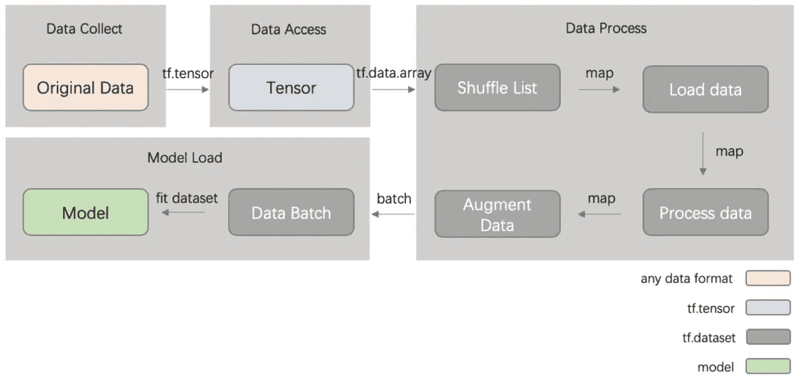
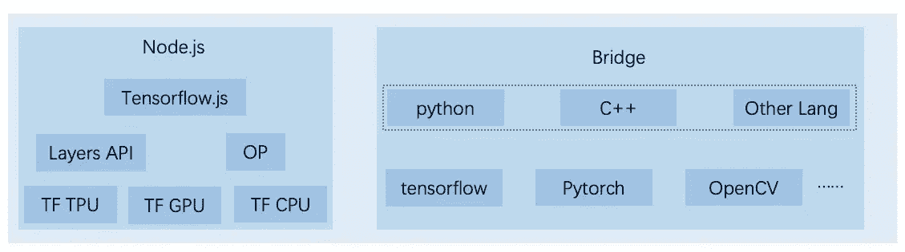

# 基于 tfjs-node 构建高级前端机器学习框架

> 原文：<https://medium.datadriveninvestor.com/building-a-high-level-frontend-machine-learning-framework-based-on-the-tfjs-node-b3cf591deaf6?source=collection_archive---------16----------------------->

*By 阙月*

随着深度学习的发展，我们生活的所有领域都在经历智能转型。作为定位最接近用户的团队，前端也希望利用 AI 能力来提高我们的效率，降低人力成本，为用户提供更好的体验。智能转型被视为前端领域未来的一个重要增长领域。

然而，以下问题阻碍了前端团队采用智能开发:

*   熟悉机器学习的算法工程师不了解前端业务或前端积累的数据及其潜在价值。因此，他们很难参与智能前端开发。
*   传统前端工程师不懂机器学习中常用的语言，比如 Python 和 C++。因此，语言学习和转换成本很高。
*   传统前端工程师不懂深度学习的算法和原理。他们很难使用现有的机器学习框架，如 TensorFlow 和 PyTorch 来训练模型。

为了解决这些问题，促进智能前端开发，我们开发了 Pipcook。Pipcook 使用前端友好的 JavaScript (JS)环境，底层算法能力采用 TensorFlow.js 框架，封装了前端业务场景的算法。这使得前端工程师可以快速轻松地使用机器学习功能。

本文描述了 Pipcook 如何与 TensorFlow.js 集成，以及如何使用 tfjs-node 的底层模型和计算能力来构建高级机器学习管道。要了解更多关于 Pipcook 的信息，请访问官方 Github 库，网址:【https://github.com/alibaba/pipcook

# 为什么使用 TensorFlow.js 作为底层算法框架

TensorFlow.js 是 Google 在 2018 年发布的基于 js 的机器学习框架。谷歌此后将相关代码开源。Pipcook 使用 tfjs-node 作为数据处理和模型训练的底层框架，在 TensorFlow.js 上开发插件，并将插件组装成管道。我们使用 TensorFlow.js 的原因如下:

*   Pipcook 是为前端工程师设计的，是用 JS 开发的。因此，我们更喜欢基于 JS 的计算框架，以防止由于桥接其他语言而导致的性能损失或错误。
*   与其他基于 JS 的机器学习框架相比，TensorFlow 通常用于 C++和 Python 中。TensorFlow.js 还重用 C++底层功能和运算符来支持大量网络层、激活函数、优化器和其他组件。此外，它提供了良好的性能，并支持 GPU。
*   提供了诸如 tfjs-converter 之类的工具来将 SavedModel 或 Keras 模型转换成 js 模型。这样就可以重用很多成熟的 Python 模型。
*   JS 没有复杂的数学能力，也没有像 NumPy 那样的科学计算库。一些类似的库很难与其他计算框架无缝集成。TensorFlow.js 提供张量封装，相当于 NumPy 数组，TensorFlow.js 模型允许高性能的张量训练。
*   TensorFlow.js 提供数据集 API 来抽象数据，封装简单高效的数据接口，支持批量数据处理。数据集 API 的数据流可以有效地与 Pipcook 管道相结合。

# TensorFlow.js 数据处理

为了进行机器学习，我们需要访问和处理大量数据。在一些数据量较小的传统场景中，我们可以一次将数据读入内存。但在深度学习场景下，数据量一般会超过内存大小。因此，我们需要根据需要访问数据源中的部分数据。TensorFlow.js 提供的 Dataset APIs 可以封装这些场景中的数据。

在标准的 Pipcook 管道中，我们将使用数据集 API 来封装和处理数据。上图显示了典型的数据流过程。

*   首先，数据收集插件将原始训练数据读入管道。原始数据可能是本地文件或存储在云中的数据。
*   然后，数据收集插件确定数据格式，并将其封装到相应的张量中。
*   数据访问插件访问数据并将张量封装到 tf.dataset 中，以便于后续的批量数据处理和训练。
*   数据处理插件处理数据，包括洗牌和增加操作。这些操作将使用用于数据集封装的运算符(如 map)来批处理数据流中的数据。
*   模型加载插件将数据批量读取到模型中进行训练。

我们可以把数据集看成一组迭代的训练数据，就像 Node.js 中的 Stream，每次从数据集中请求下一个元素时，内部实现都会根据需要访问数据，并执行预置的数据处理函数。这种抽象允许模型轻松地训练大量数据。当我们有多个数据集时，它们可以被共享并组织成一个组进行抽象。

# 模特培训

TensorFlow.js 提供低级和高级 API。低级 API 源自 deeplearn.js，包含构建模型所需的运算符。它们处理机器学习中的数学运算，比如简单的线性代数数据运算。高层 API 封装了常见的机器学习算法，并允许我们加载经过训练的模型，如 Keras 模型。

Pipcook 使用插件来开发和运行模型。每个模型加载插件加载一个特定的模型，大部分模型都是基于 TensorFlow.js 实现的，tfjs-node 还提供了加速模型训练的特性，比如 GPU 加速。由于生态系统和其他当前条件，目前在 TensorFlow.js 中实现某些模型是昂贵的。为了解决这个问题，Pipcook 提供了 Python 桥接和其他方法，允许你在 JS 运行时环境中调用 Python 来训练模型。我们将在后续文章中描述桥接细节。

# 部署

一个工业级的机器学习管道需要一个方法，在训练之后部署你的模型。这样，模型就可以服务于真实的企业。目前，Pipcook 提供了以下部署解决方案，可以使用 model deploy 插件来实现。

*   **快速验证:**您可能希望用少量数据和几个历元快速测试您的数据和模型。在这个场景中，我们不需要在将模型部署到远程端之后执行验证。Pipcook 嵌入了一个本地部署插件。模型训练完成后，Pipcook 将在本地启动一个预测服务器来提供预测服务。
*   **Docker 图片** : Pipcook 提供官方图片，包含训练和预测所需的环境。您可以将映像部署到您的部署主机，或者使用 Kubernetes 集群或其他解决方案来管理 Docker 映像。
*   **云服务整合:** Pipcook 将整合不同云服务提供商提供的机器学习部署服务。在当前阶段，谷歌云已经将 TensorFlow.js 与自动机器学习(AutoML)集成在一起。Pipcook 将在未来支持阿里云、AWS 和其他服务。

# 与 TFX 的比较

我们的最终目标是一个成熟的工业级机器学习管道，可以将优秀的模型应用到生产环境中。为了实现同样的目标，谷歌发布了基于其实践的开源产品 TensorFlow Extended (TFX)。你可能想知道皮普克和 TFX 有什么不同。Pipcook 并不是为了取代任何其他框架而设计的，尤其是基于 Python 生态系统的产品。Pipcook 旨在推动智能前端开发。因此，Pipcook 使用面向前端的技术栈和基于产品的方法。

*   TFX 使用有向无环图(DAG)方法，因为它涉及多个操作，如数据生成、统计分析、数据验证和数据转换。这些操作可以自由组合。然而，大多数前端场景不涉及复杂的组合操作。因此，Pipcook 使用管道方法将数据操作抽象为管道中的简单插件，降低了对前端工程师的要求。
*   TFX 使用 Apache Airflow 进行调度，而 Pipcook 使用前端技术栈进行此类操作。例如，我们使用响应式框架，如 Rxjs，以串行方式响应和连接不同的插件，便于前端人员理解和贡献代码。
*   此外，Pipcook 提供基于 JS 的 API，帮助前端人员降低学习和使用成本。

基于前面的设计，我们试图建立一个前端友好的机器学习环境，以满足我们的期望和目标。

# 观点

Pipcook 已经开源一个月左右了。在此期间，我们收到了一些用户反馈。我们希望利用开源社区的能力来优化 Pipcook，以便它能够促进智能前端开发。为了进一步发展 Pipcook，我们计划:

*   与云服务提供商合作，如阿里云、AWS、谷歌云，在 Pipcook 和不同云服务之间建立机器学习链接
*   优化生态系统，提供 Pipcook 试用版，让用户更容易上手
*   支持分布式培训
*   提供多样化插件，优化模型，支持更多管道。

在未来，我们希望结合阿里巴巴智能前端团队和整个开源社区的力量，不断优化 Pipcook 及其所代表的智能前端功能。这样可以为智能前端能力提供包容性的技术解决方案，积累更多有竞争力的样本和模型，提供更高准确率和可用性的智能代码生成服务，提高前端 R & D 效率。此外，前端工程师将不再需要做简单重复的工作，让他们有更多的时间专注于具有挑战性的工作。

# 原始来源:

 [## 基于 tfjs-node 构建高级前端机器学习框架

### 本文描述了 Pipcook 如何与 TensorFlow 集成，以及 tfjs-node 的底层模型如何用于…

www.alibabacloud.com](https://www.alibabacloud.com/blog/building-a-high-level-frontend-machine-learning-framework-based-on-the-tfjs-node_596990)  [## 机器学习和人工智能如何改变电子商务的面貌？|数据驱动…

### 电子商务开发公司，现在，整合先进的客户体验到一个新的水平…

www.datadriveninvestor.com](https://www.datadriveninvestor.com/2020/11/19/how-machine-learning-and-artificial-intelligence-changing-the-face-of-ecommerce/) 

**访问专家视图—** [**订阅 DDI 英特尔**](https://datadriveninvestor.com/ddi-intel)