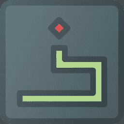

# 用 Python 构建一个贪吃蛇游戏

> 原文：<https://medium.datadriveninvestor.com/building-a-snake-game-with-python-4d9e4a8dd4ad?source=collection_archive---------1----------------------->

## 让我们使用 Python 的 PyGame 模块构建一个简单的贪吃蛇游戏。



Icon made by Those Icons from FlatIcon.com

读者你好；让我们用 Python 来构建一个游戏。是的，你没听错！我们将使用 pygame 库构建一个简单的贪吃蛇游戏。

还记得以前大家都玩标志性的贪吃蛇游戏吗？让我们重拾旧日时光，自己造一个吧！因此，在本教程中，我们将建立这一标志性的游戏。

所以，让我们开始构建我们的游戏。我们会一步一步的去做，去搞清楚游戏的每一个部分，以及它在我们游戏中有什么目的！那么，让我们开始吧:

## 导入库

首先，我们需要将库导入到我们的代码中，这些代码将用于构建游戏。我们将需要下面提到的库来构建和运行我们的游戏。

```
import pygame
import time
import random
```

这个库将帮助我们获得构建游戏的所有图形组件。

**随机:**这个库将帮助我们在游戏中的随机地点繁殖食物。

**时间:**这有助于我们在游戏中使用与时间相关的功能，比如蛇的速度。

## 开始游戏并设置图形

现在，让我们开始构建游戏的实际部分。我们将首先初始化游戏，有一个窗口，我们将在其中玩游戏。

```
pygame.init()
```

然后我们会喜欢在 RGB 符号的帮助下定义我们将在游戏中使用的颜色。从互联网上获取 RGB 代码，并将它们作为颜色变量的坐标。我们在游戏中定义了六种颜色，但是你可以自由选择使用任何颜色。确保颜色组合适合玩游戏。

```
white = (255, 255, 255)
yellow = (255, 255, 102)
black = (0, 0, 0)
red = (213, 50, 80)
green = (0, 255, 0)
blue = (50, 153, 213)
```

接下来，我们应该定义游戏运行的显示器的大小。因此，在这种情况下，我们将高度定义为 600 像素，宽度定义为 800 像素。

```
width = 800
height = 600
```

接下来，我们将使用定义的宽度和高度变量作为输入来设置我们的显示，并且我们将描述游戏的名称作为我们游戏的标题来显示。

```
dis = pygame.display.set_mode((width, height))
pygame.display.set_caption('Shubham Snake Game')
```

## 定义游戏中使用的变量

现在，我们将初始化我们的时钟变量，它将利用我们之前导入的时间包。这个变量“clock”将在我们的完整代码中处理所有与时间相关的查询。

```
clock = pygame.time.Clock()
```

现在，让我们定义我们的蛇的速度，以及蛇的块的大小，即蛇的宽度。这纯粹是基于用户的选择，我也选择了一些我觉得很适合这个游戏的数字。

```
snake_block = 10
snake_speed = 12
```

接下来，我们描述分数显示和其他信息显示的字体大小和字体样式，比如通知你输了游戏或者你想再玩一次。

```
font_style = pygame.font.SysFont("bahnschrift", 25)
score_font = pygame.font.SysFont("comicsansms", 35)
```

## 定义助手功能

这里，我们需要为以下目的定义三个助手函数:-分别用于显示分数、处理蛇和处理游戏中其他相关信息的显示。

因此，首先，我们定义函数来帮助我们显示分数。我们将定义它在游戏中显示的位置，以及它将如何渲染分数。

下面的函数将**分数**作为它显示的参数。我们将在稍后的节目中计算分数。

```
def Your_score(score):
    value = score_font.render("Your Score: " + str(score), True, yellow)
    dis.blit(value, [0, 0])
```

接下来，我们将定义我们的蛇。没有蛇，我们的游戏就没有意义。所以，让我们来制作游戏中最重要的部分，蛇。我们将定义蛇的颜色和位置及其大小，即 snake_block。

下面的函数以 **snake_block** 和 **snake_list** 为输入。我们将在程序中定义 *snake_list* 。所以，不要担心你现在没有得到任何东西。

```
def our_snake(snake_block, snake_list):
 for x in snake_list:
 pygame.draw.rect(dis, black, [x[0], x[1], snake_block, snake_block])
```

接下来，也是我们最后一个助手函数将显示我们需要向玩游戏的用户显示的任何类型的消息。

该辅助函数将**消息**和颜色作为输入参数。我们将设置字体并以所需的颜色显示消息。我们需要指定消息在游戏显示中的显示位置。

```
def message(msg, colour):
 mesg = font_style.render(msg, True, colour)
 dis.blit(mesg, [width / 6, height / 3])
```

## 构建游戏循环

现在，我们开始构建游戏的组件，这将使它运行并响应用户通过键盘的输入。

我们首先定义两个布尔变量: **game_over** 和 **game_close** 。他们会描述游戏的状态。

第一个会告诉游戏是否结束。下一个变量定义了游戏是否关闭，我们是否需要再玩一次。我们把两者都定义为假。

```
game_over = False
game_close = False
```

下一步，我们的目标是定义游戏中需要的其他变量。

我们将定义 **x1** 和 **y1** 来表示蛇在游戏中的位置。我们分别将它们初始化为 width/2 和 height/2。此外，我们将定义变量 **x1_change** 和 **y1_change，**，它们将用于表示基于用户提供的输入的蛇的位置变化。

```
x1 = width / 2
y1 = height / 2

x1_change = 0
y1_change = 0
```

同样，我们需要定义 **snake_List** 和 **snake_length** 变量来分别存储蛇的所有头部位置和蛇的长度。

```
snake_List = []
snake_length = 1
```

我们还需要初始化每次蛇吃食物时食物在游戏中产卵的位置。我们将使用**随机**库来帮助我们确定食物的位置。

```
foodx = round(random.randrange(0, width - snake_block) / 10.0) * 10.0
foody = round(random.randrange(0, height - snake_block) / 10.0) * 10.0
```

接下来，我们将开始一个循环，直到 **game_over** 变为**真**。

在这个循环中，我们将首先定义在 **game_close** 变量为 **True** 的情况下要执行的指令。

下面是当 **game_close** 等于 **True** 时帮助我们处理这种情况的代码。

```
while game_close == True:
 dis.fill(blue)
 message("Oops! Your snake died! Press P to play again or Q to quit", red)
 Your_score(snake_length - 1)
 pygame.display.update()

 for event in pygame.event.get():
   if event.type == pygame.KEYDOWN:
     if event.key == pygame.K_q:
       game_over = True
       game_close = False
     if event.key == pygame.K_p:
       gameLoop()
```

正如你在上面看到的，我们已经定义了很多东西。我们用蓝色填充显示屏(你当然可以选择自己的)。然后我们显示一条消息，显示这个人输了游戏，我们应该询问这个人是想再玩一次还是退出游戏。

我们还显示用户的分数等于蛇的长度减 1。我们的蛇每吃一次食物，分数就增加一。

现在，为了获取用户关于他是想再玩一次还是退出游戏的输入，我们定义了一个 for 循环。当我们要求用户输入他的决定时，我们定义了输入的可能性。

如果用户输入一个**‘p’**，那么我们将继续我们的游戏循环。如果用户输入**‘q’，**我们需要退出游戏。

在处理了 **game_close** 的条件后，我们接下来将定义所有需要的步骤，以允许我们的蛇根据用户的输入移动。我们将接受 W，A，S，D 和上下左右组合键来玩游戏。你可以自由选择你选择的键来玩游戏。

```
for event in pygame.event.get():
 if event.type == pygame.QUIT:
   game_over = True
 if event.type == pygame.KEYDOWN:
   if event.key == pygame.K_LEFT or event.key == pygame.K_a:
     x1_change = -snake_block
     y1_change = 0
   elif event.key == pygame.K_RIGHT or event.key == pygame.K_d:
     x1_change = snake_block
     y1_change = 0
   elif event.key == pygame.K_UP or event.key == pygame.K_w:
     y1_change = -snake_block
     x1_change = 0
   elif event.key == pygame.K_DOWN or event.key == pygame.K_s:
     y1_change = snake_block
     x1_change = 0
```

在上面的代码中，我们根据用户提供的输入改变了 **x1_change** 和 **y1_change** 的值。还有，如果用户想退出游戏，我们就退出游戏。

接下来，我们将定义输掉游戏的条件。同样，我们在 x1_change 和 y1_change 的帮助下更新 **x1** 和 **y1** 的值。我们还用蓝色填充整个显示，并通过传递蛇和食物在显示中出现的位置来绘制它们。

```
if x1 >= width or x1 < 0 or y1 >= height or y1 < 0:
    game_close = True
 x1 += x1_change
 y1 += y1_change
 dis.fill(blue)
 pygame.draw.rect(dis, green, [foodx, foody, snake_block, snake_block])
```

接下来，我们定义一个名为 **snake_Head，**的列表，它将在每次迭代后存储蛇头的值。我们将 x1 和 y1 的值附加到它上面。然后，我们将蛇头添加到**蛇列表**中。

然后我们检查条件检查 **snake_List** 的长度是否大于 **snake_length** 。如果是，**删除**snake _ List 中的第一个元素。

然后，我们检查当前的 **snake_Head** 是否等于 **snake_List** 的任何元素，除了新添加的元素，即被检查的 snake_Head。如果是，那么我们关闭游戏，玩家输了。

这是因为 snake_List 中出现 snake_Head 意味着它之前已经被添加到 snake_List 中，再次找到相同的值意味着**蛇咬了自己。**所以，玩家在那一刻应该输了。

然后我们调用函数 **our_snake** 和 **Your_score** (前面定义的)并将所需参数传递给这些函数，以显示更新后的 snake 和玩家的分数。

```
snake_Head = []
 snake_Head.append(x1)
 snake_Head.append(y1)
 snake_List.append(snake_Head)
 if len(snake_List) > snake_length:
   del snake_List[0]

 for x in snake_List[:-1]:
   if x == snake_Head:
     game_close = True

 our_snake(snake_block, snake_List)
 Your_score(snake_length - 1)

 pygame.display.update()
```

接下来，一旦蛇吃掉了前一种食物，我们将形成一种新的食物。因此，要做到这一点，我们需要在显示器中找到一个新的随机位置来产卵。此外，我们需要增加蛇的长度 1，因为它刚刚吃了食物。

接下来，我们将蛇的速度作为时钟的参数。勾选哪个是运行游戏循环。

```
if x1 == foodx and y1 == foody:
  foodx = round(random.randrange(0, width - snake_block) / 10.0) * 10.0
  foody = round(random.randrange(0, height - snake_block) / 10.0) * 10.0
  snake_length += 1

clock.tick(snake_speed)
```

我们的游戏快结束了。最后一步，我们需要退出游戏，并再次调用游戏循环。

```
 pygame.quit()
  quit()
gameLoop()
```

所以，我们已经完成了我们的蛇游戏。以下是贪吃蛇游戏的完整代码:

Snake Game Python Complete Code

所以，希望你喜欢读这篇文章。我希望你能从这篇文章中学到一些新的东西。请自行尝试，尝试修改特性并实现一个更好的模型。改进的一些例子可以是具有不同难度的不同蛇速度和宽度。可以让它变得更有互动性，更美观。

去吧，尝试一下，做点新的。请访问这个项目的 [Github 库](https://github.com/shubham1710/snake-game-python)获取更多更新。

谢谢你阅读它。希望你喜欢它！

看完这篇之后还有更多故事要读:

[](https://towardsdatascience.com/build-a-blog-website-using-django-rest-framework-overview-part-1-1f847d53753f) [## 使用 Django Rest 框架构建博客网站——概述(第 1 部分)

### 让我们使用 Django Rest 框架构建一个简单的博客网站，以了解 DRF 和 REST APIs 是如何工作的，以及我们如何添加…

towardsdatascience.com](https://towardsdatascience.com/build-a-blog-website-using-django-rest-framework-overview-part-1-1f847d53753f) [](https://medium.com/javascript-in-plain-english/build-a-rest-api-with-node-express-and-mongodb-937ff95f23a5) [## 用 Node，Express 和 MongoDB 构建一个 REST API

### 让我们使用 Node、Express 和 MongoDB 构建一个遵循 CRUD 原则的 REST API，并使用 Postman 测试它。

medium.com](https://medium.com/javascript-in-plain-english/build-a-rest-api-with-node-express-and-mongodb-937ff95f23a5) [](https://shubhamstudent5.medium.com/build-a-job-search-portal-with-django-overview-part-1-bec74d3b6f4e) [## 用 Django 构建求职门户——概述(第 1 部分)

### 让我们使用 Django 建立一个工作搜索门户，允许招聘人员发布工作和接受候选人，同时…

shubhamstudent5.medium.com](https://shubhamstudent5.medium.com/build-a-job-search-portal-with-django-overview-part-1-bec74d3b6f4e) [](https://towardsdatascience.com/build-a-social-media-website-using-django-setup-the-project-part-1-6e1932c9f221) [## 使用 Django 构建一个社交媒体网站——设置项目(第 1 部分)

### 在第一部分中，我们集中在设置我们的项目和安装所需的组件，并设置密码…

towardsdatascience.com](https://towardsdatascience.com/build-a-social-media-website-using-django-setup-the-project-part-1-6e1932c9f221)