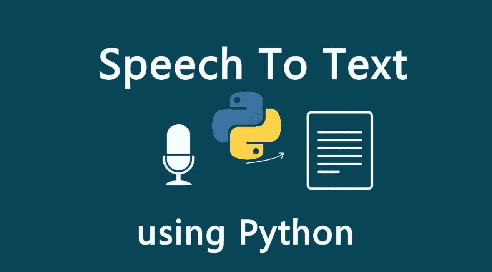
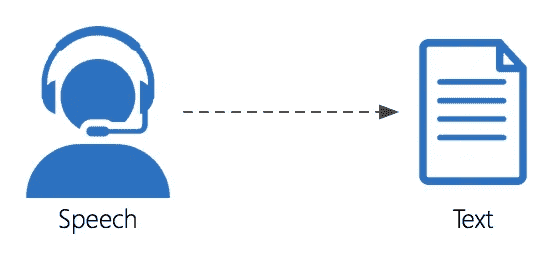

# 使用 Python 构建语音识别器

> 原文：<https://medium.datadriveninvestor.com/building-a-speech-recognizer-using-python-ec155a5bc6ce?source=collection_archive---------3----------------------->

Source: [https://morioh.com/p/339e45f0f43b](https://morioh.com/p/339e45f0f43b)

语音识别也被称为**“自动语音识别(ASR)”。**它是将人类的语音或文字转换成文本格式，以便机器能够理解人类语言的过程。语音识别正在广泛应用于各种物联网设备，如 Alexa 和 Google Home。当用户提出任何问题时，这些设备将用户的语音作为输入，并将其转换为文本，然后这些转换后的文本被用户用来给出所需的答案。

Source: [https://analyticsindiamag.com/all-the-tech-you-need-to-know-that-powers-speech-to-text-on-your-device/](https://analyticsindiamag.com/all-the-tech-you-need-to-know-that-powers-speech-to-text-on-your-device/)

# **在这篇文章中，我们将使用 python 构建我们的语音识别器**

我们将采取音频(。wav)或视频(. mp4)文件作为输入，并将其转换为文本。然后我们会在**谷歌语音识别**和 **Python 的帮助下把它存储在一个文本文件里。**

我们需要使用以下命令安装**"**[**speecher recognition**](https://pypi.org/project/SpeechRecognition/)**"****"**[**movie py**](https://pypi.org/project/moviepy/)**"**库:

1.  pip 安装语音识别
2.  pip 安装影片

**speech reconnection**库将用于创建识别音频中单词的模型，而 **movipy** 库将用于将视频(. mp4)转换为音频(。wav)格式。

Source: [https://www.c-sharpcorner.com/article/speech-to-text-recognition-using-python/](https://www.c-sharpcorner.com/article/speech-to-text-recognition-using-python/)

# 构建语音识别器的步骤

1.  导入所有库

2.创建一个将视频转换为音频的函数

3.创建语音识别功能

在这个函数中，我们提供了函数的音频文件路径。然后，我们构建识别器模型，并使用 google 语音识别来识别音频中出现的单词并显示这些单词。最后，我们将单词保存在文本文件中。

# 摘要

这是将演讲转换成文本的三个简单步骤。现在这个文本可以用来训练各种物联网设备。

# 在你走之前

*感谢阅读！如果你想和我取得联系，可以随时在*[*LinkedIn*](http://in.linkedin.com/in/praffullakumardubey)*上联系我。请到我的* [*中*](https://praffullakrdubey.medium.com/) *账号查看我的其他故事。*