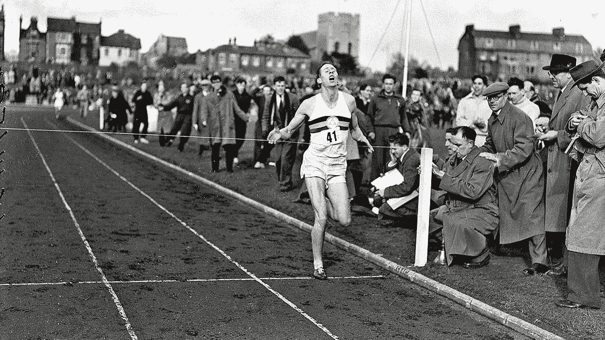

# 创建一家创业公司类似于打破“不可能的”四分钟一英里的记录。

> 原文：<https://medium.datadriveninvestor.com/building-a-startup-is-similar-to-beating-the-impossible-four-minute-mile-record-1c9a6c5430e8?source=collection_archive---------3----------------------->

经常有人问我，创业和做小生意有什么区别？

区别就像是第一个在四分钟内跑完一英里的人和第一个在四分钟内跑完一英里的人一样。

让我详细说明一下，因为从这种比较中我们可以学到很多东西。

当一个人开始创业时，有一个他或她可以模仿的模式。有人已经做了他们想做的事情，只是稍微改变了一下想法。

人们可以预测成本和潜在回报。消费者对这个想法的总体看法是可以衡量的。

有一些行业最佳实践，人们可以应用来增加他/她的成功机会。

是的，他们仍然很有可能失败，因为有许多移动的部分使建立任何业务成为一个挑战，但这是以前做过的，人们可以模仿以前的成功。

 [## 如何真正衡量一个风险投资家的业绩？数据驱动的投资者

### 安德森·霍洛维茨的回报落后于风险投资精英安杰利斯特希望提高风险投资基金的业绩与…

www.datadriveninvestor.com](https://www.datadriveninvestor.com/2020/05/17/how-to-truly-measure-a-venture-capitalists-performance/) 

就像在四分钟内跑完一英里一样，大多数人都没有能力做到。

完成这一挑战仍然需要多年的训练、高超的技术、合适的装备(如鞋子)、健康的身体、良好的水合作用、可接受的天气条件、正确的赛道等等。

别人做到了，并不意味着你也能做到。然而，这确实意味着这是可能的。

在 1954 年 5 月 6 日之前，当罗杰·班尼斯特以 3 分 59.4 秒跑完一英里时，人们不相信这是人类所能做到的。

根据传说，专家说多年来人类的身体无法跑完 4 分钟 1 英里。这不仅仅是危险。这是不可能的。

然而，尽管有健康警告，也没有明显的理由说明打破四分钟一英里对社会有什么帮助，成千上万的人已经试图打破这一纪录。

最接近的竞争者达到了 4 分 1 秒，比罗杰·班尼斯特在 1954 年打破纪录早了 9 年。

此后，超过 1400 名男性运动员打破了“四分钟障碍”。

出于许多原因，创建一家初创公司与打破 4 分钟记录非常相似。

通常，人们分成两个阵营；他们要么不认为这个想法是人类可以实现的，要么看不到实现目标将如何总体上造福社会的明显原因(以及他们将如何赚钱)。

初创公司的创始人没有可以复制的流程和模式，而且对于谁是客户以及他们愿意为解决方案支付多少钱也没有清晰的愿景。

为什么初创公司的创始人要做一些看起来对社会没有明确目标或者从一开始就不可能做的事情呢？

与罗杰·班尼斯特打破四分钟一英里赛跑的原因一样，为社会打开了一个全新的可能性世界。

虽然只有少数人跑得比罗杰·班尼斯特快一英里，但事实证明，他的训练服务于数亿人，远远超出了体育运动，改善了他们的生活。

你们中有多少人听说过，你应该在达到目标之前就想象自己已经完成了目标？

创业公司的创始人建立了一个解决方案，他们知道，如果人们选择改变他们的生活，他们就能改变他们的生活。

即使他们失败了，他们工作的基础也可以被其他人用来达到他们梦寐以求的目标。

例如，脸书并不是第一个将人们联系起来的社交媒体平台。Friendster 和 Myspace 以前也经历过，并试图成为社交媒体领域的赢家，就像罗杰·班尼斯特之前的所有运动员一样。

然而，脸书成了明显的赢家，就像罗杰·班尼斯特之后的所有其他运动员一样，还有许多其他社交媒体公司做得非常好，甚至打破了脸书获得新用户的记录，但脸书仍然是明显的赢家。

就像特斯拉将作为改变汽车世界的电动汽车制造而被人们记住，SpaceX 改变了私人太空探索。

苹果的 iPod 和 iTunes 商店改变了我们听音乐的方式。

Skype 和 Whatsapp 改变了国际通信的成本。

苹果的 iPhone 改变了我们对手机的看法。

这个清单永远在继续，而且还没有完成。

一些将改变我们生活的人甚至还没有出生，其他人只是在他们的车库和宿舍里开始他们的公司。

更传统的生意呢？

像所有打破 4 分钟 1 英里纪录的 1400 名运动员一样，创办一家已经有了可复制路线图的公司要容易得多。

你知道需要什么，怎么做。然而，失败率仍然非常高。

对于运动员来说，他们必须处于最佳状态，身体健康，训练多年，使用正确的技术，即使其他一切都很完美，湿度变化这样的小事也可能让他们偏离比赛，扼杀他们打破记录的机会。

企业经历相同的周期；一个人需要有一个伟大的商业计划，能够以良好的条件筹集资金，雇佣合适的团队，建立整个价值链，创造产品或服务，然而，完全超出他们控制的外部因素可能会削弱他们的业务。

像全球疫情或经济衰退这样没有人预料到的事情会使他们的业务在短时间内从产生数亿美元变成申请破产。

需要记住的一点是，尽管罗杰·班尼斯特、埃隆·马斯克、史蒂夫·乔布斯和许多其他创始人将在未来几个世纪被人们记住，但那些成功利用其商业模式的人可能已经创造了与他们一样多甚至更多的钱，但他们的名字将很少被人记住。

而创造遗产不应该成为通过建立没有明确路径的公司来改变世界的主要因素，这是成功和成为第一的回报之一。

我们可以从打破“不可能的”四分钟一英里记录和创建一家初创公司的比较中学习到许多其他的经验。

**首先**，想法远不如执行重要。

许多人都有一个打破记录或建立公司的梦想。

他们中很少有人能够真正成功地实现他们的梦想。

**第二个**，创始人的心态和想法一样重要。

罗杰·班尼斯特在成功之前多次想象自己的成功。

尽管没有人相信他能打破记录，但他坚持和牺牲了许多年，只有在他成功后，人们才开始相信他的梦想是可能的。

**第三个**，是牺牲，创始人必须做出的牺牲类型将远远超过大多数人为了赢得胜利而愿意放弃的:他们的健康、他们的财务未来、他们的关系、他们的骄傲和自我，以及更多。

成为一名创始人并不容易，不管一些创始人从外表上看起来有多有趣。

第四个是，要达到你的目标需要几年甚至几十年的时间。

有些人相信有一夜成名的故事，比如优步。他们看不到优步创始人特拉维斯·卡兰尼克一路走来所做的工作和牺牲。

前几天，我看了他对著名天使投资人杰森的采访，他的故事让我更加尊敬他。我强烈推荐通过访问这个 YouTube 链接来听它，点击这里。

第五，对自己的信念必须来自你的内心。

大多数人，甚至是你最亲密的朋友和家人，都不会相信你的成功，你会在很多年里充满孤独和误解。

你将不得不沉迷于你的梦想，而不是变得沮丧。

**第六**，你必须爱上你的使命而不是你的产品。

许多早期创始人会爱上他们的产品，认为这是社会有史以来最好的东西。

事实是，随着公司的成长，想法和产品也会改变；你必须专注于解决客户的痛点，而不是强迫他们使用你的产品。

你不能通过坚持不会让你到达那里的跑步技术，或者选择错误的鞋子来打破 4 英里记录。

**第七名**，需要一个团队才能赢。

你不会一个人做的。为了打破跑步记录，你需要教练和医生，让你保持最佳状态。

你需要一个制造商为你制造你需要的鞋子和绷带来治愈你通往成功的路上的创伤。

要创建一家初创公司，你需要投资者和专家来帮助你建立和扩大你的业务，同时还需要许多其他人的帮助。