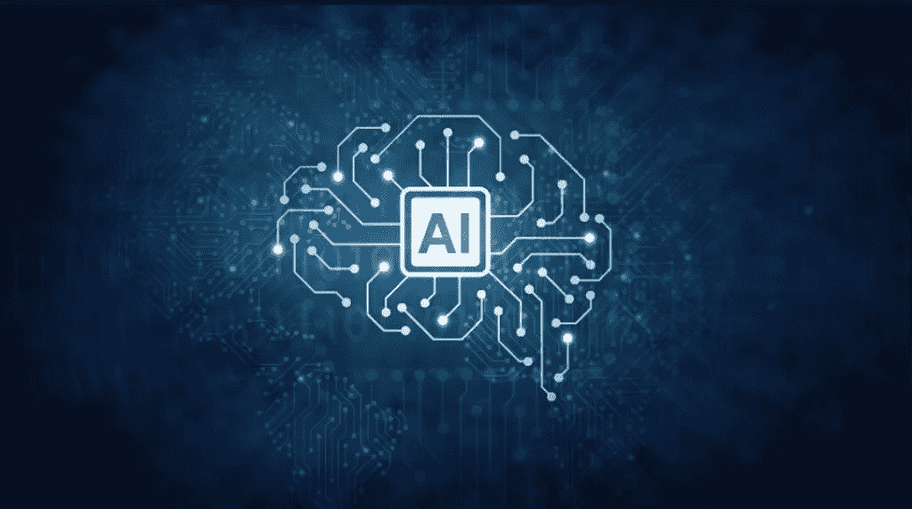
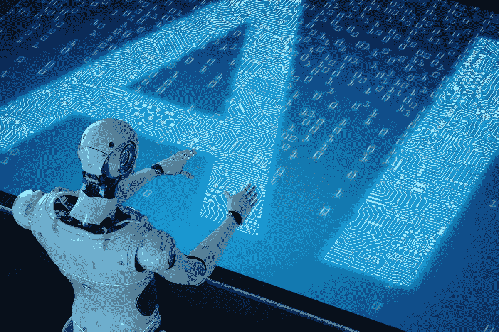
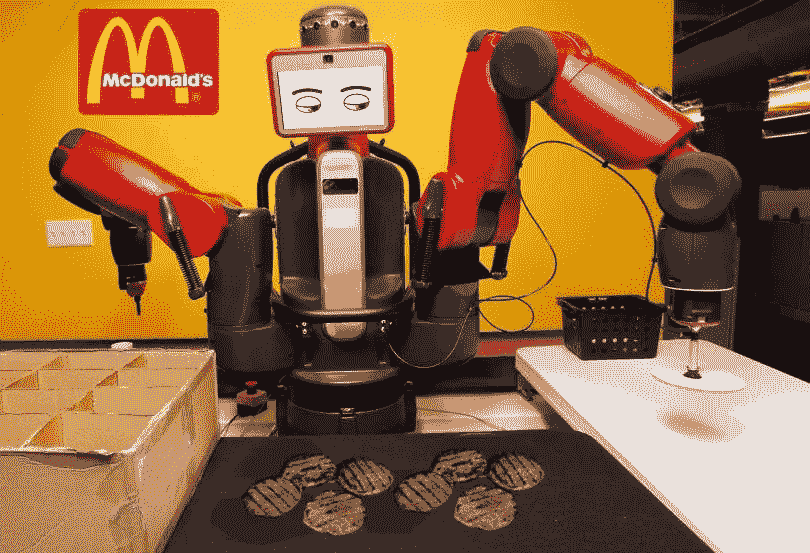

# 构建人工智能&关于人工智能你需要知道的一切

> 原文：<https://medium.datadriveninvestor.com/building-an-ai-everything-you-need-to-know-about-artificial-intelligence-90d2304f9604?source=collection_archive---------12----------------------->

[在 jare.cloud 上查看本帖原文](http://jare.cloud/2020/01/22/building-an-ai-everything-you-need-to-know-about-artificial-intelligence/)！

随着[谷歌高管就监管人工智能发出警告](https://thenextweb.com/artificial-intelligence/2020/01/20/sundar-pichai-offers-a-cryptic-warning-against-over-regulating-ai/)，智库预测人工智能将接管所有行业，以及[人工智能窃取工作对竞选活动产生影响](https://searchhrsoftware.techtarget.com/news/252477189/Impact-of-AI-on-jobs-goes-on-the-presidential-campaign-trail)——了解你需要了解的关于人工智能的一切，一如既往地重要。

AI 有哪些陷阱？他们真正适合做什么？它们是如何工作的？

人工智能——传统上——获取一组数据(训练集),并通过奖励或惩罚点数来找出解决问题的方法，这会影响模型的适用性。通过告诉人工智能我们想要什么，我们可以实现我们想要的结果。然后将它应用于新的原始数据，其想法是它可以预测结果或实现目标。

人工智能“学习”处理问题的更好方法，并修改其方法以做得更好。它自然适合于像识别图像中的人脸或[识别文本中的情感或情绪这样的事情——即使它是以讽刺的方式表达的](https://jare.cloud/2020/01/22/how-to-build-a-winning-tool-for-sentiment-analysis-of-twitter-data/)。

 [## 人工智能与创造力:梦想成真|数据驱动的投资者

### 人工智能总是让我着迷。不仅作为一套有用的工具，不断发展，而且作为一个…

www.datadriveninvestor.com](https://www.datadriveninvestor.com/2019/01/28/ai-creativity-deep-dream-comes-true/) 

它什么时候失效？人工智能可以在太大的数据集上训练，或者有太多的奖励/损害，这被称为“过度拟合”模型。这将意味着编程变得过于熟悉旧数据，这些数据在纸面上看起来更好，但在现实中，当它与新的实时数据一起被扔进狼群时，它的准确性会更低——并且它的性能会比不太“适合”的模型更差。嘘！

作为 Coindex Labs 的首席流动性官，我们正在采用一种新的和新颖的人工智能方法，这种方法对过度拟合具有天然的弹性。这是一个神经进化人工智能——这意味着它不仅在基于+1/-1 的训练集上学习，它还在一代人中拥有竞争数据集，看谁能表现得更好——当他们成功时，他们会将某些遗传特征传递给下一代群体，让他们再次竞争。我们首先将它应用于新的金融资产交易市场，然后将这些经验转移到更传统的市场，最后将利用这项研究来解决人类的基本需求。

这对你意味着什么？当人工智能变得更聪明并实现越来越多的目标时，它们将能够在越来越多的领域取代人类劳动。虽然这不一定会让你很快失业，但你肯定应该确保你的孩子知道足够多的代码，以便在新的世界经济中变得危险，在新的世界经济中，工资收入者是那些教人工智能做一些事情的人——在 2010 年代——数百万工资收入者曾经完成这些事情。一个很好的例子是自助结账，甚至是上一代的自动取款机。[甚至有整个麦当劳餐厅没有任何人类员工](https://newsexaminer.net/food/mcdonalds-to-open-restaurant-run-by-robots/)！

为了保持领先，你可以鼓励孩子参与逻辑、代码和数学。虽然这可能看起来不令人兴奋，但正确的程序会将孩子的注意力集中在代码带来的乐趣上:我在 90 年代开始接触 C++，并立即开始构建一个 RPG 供我和我的朋友玩。这是一种介绍、定位和框架，让孩子们将他们最喜欢的活动与这一新的、终身的挑战联系起来。

随着所有的变化，甚至是对许多人产生负面影响的变化，出现了新的有趣的机会。人工智能的进步以及相关的新技术，如增强现实、虚拟现实和围绕这些社区、产品和服务的艺术需求而涌现的整个生态系统，永远无法被机器完全取代。未来的某个人将能够通过创作有趣的艺术作品，在数字世界中展现出来，从而完全养活自己和家人。的确，人们已经是了！

# 一个(或两个)插头

加入我们不断发展的 Telegram 社区，获取博客更新、机器人聊天、一般乐趣和加密疯狂？【https://t.me/ManyVolumeSignalMonster 

想了解 tech 和《当疯子》的新文章？在这里订阅我的邮件列表:[http://eepurl.com/gIykNL](http://eepurl.com/gIykNL)

*原载于 2020 年 1 月 23 日*[*https://jare . cloud*](https://jare.cloud/2020/01/22/building-an-ai-everything-you-need-to-know-about-artificial-intelligence/)*。*