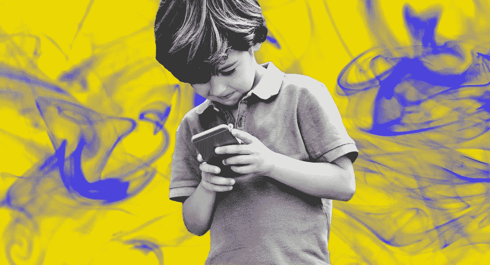
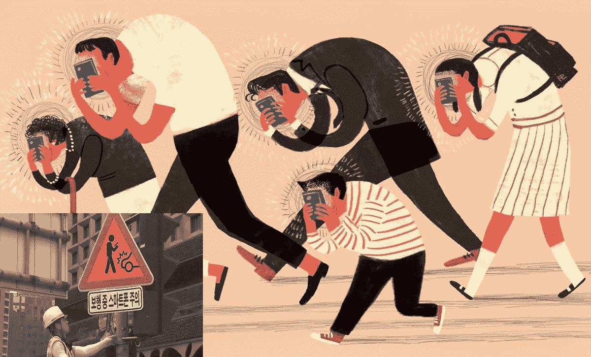
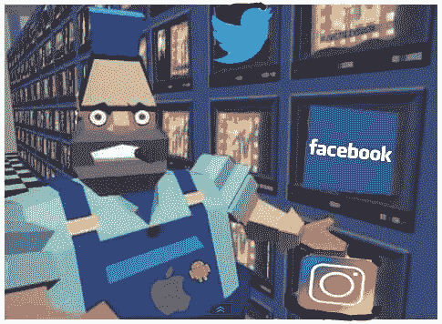
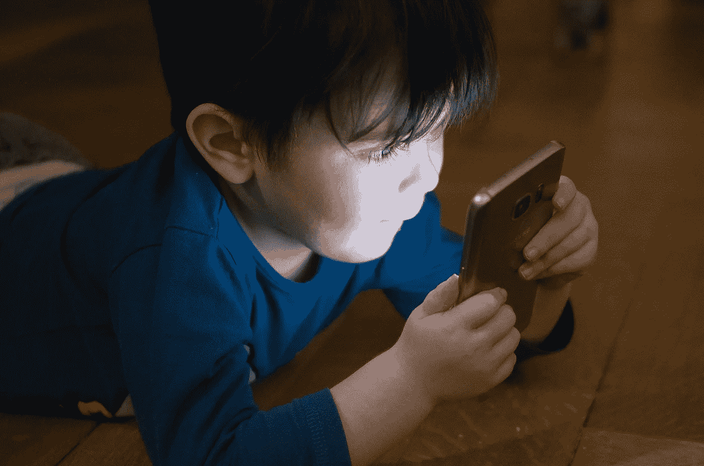
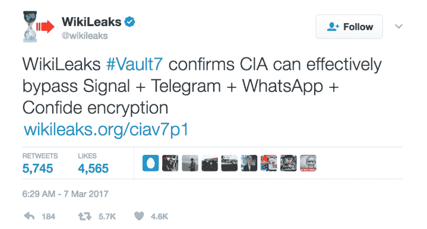
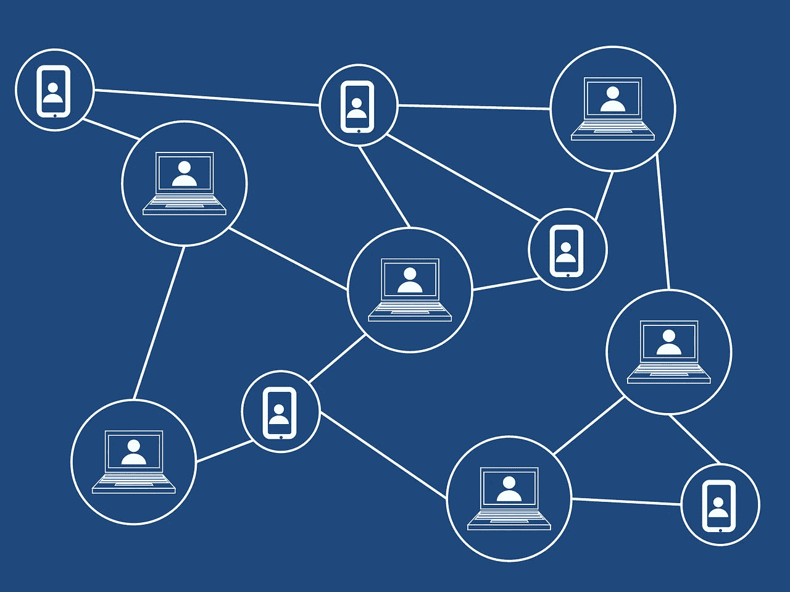

# 在多巴胺成瘾的世界里建立一个合乎道德的儿童应用程序

> 原文：<https://medium.datadriveninvestor.com/building-an-ethical-childrens-app-in-a-dopamine-addicted-world-f050c3686cd5?source=collection_archive---------9----------------------->

## 一张“米色”纸

> “谷歌设想了一个通过人工智能统治机器的时代，而你将统治你的机器，它们将作为智能的、心甘情愿的奴隶为你服务。你将成为‘先知’，规划你的生活，指挥你的工具。”乔治·吉尔德,《谷歌之后的生活》

查看[任何](https://www.imdb.com/title/tt0470752/) [现代](https://www.imdb.com/title/tt0343818/) [科学](https://www.imdb.com/title/tt2209764/) [小说](https://www.imdb.com/title/tt0133093/) [电影](https://www.imdb.com/title/tt0062622/)或[小说](http://amzn.to/2p9v0Ag) [设定在未来](https://www.imdb.com/title/tt0083658/)，[故事](https://www.imdb.com/title/tt0017136/)[通常会把](https://www.imdb.com/title/tt2317225/?ref_=ttls_li_tt)描绘成一个机器人/人工智能 [扮演重要角色的](https://www.imdb.com/title/tt0475784/)[社会](https://www.imdb.com/title/tt0070909/)，[时常](https://www.imdb.com/title/tt0088247/) [引领人类](https://www.imdb.com/title/tt0103064/)到

通过这些未来主义的描述，似乎先进技术在不久的将来的重要性和不可避免性已经在公众意识中根深蒂固。

考虑到这一点，我发现遇到那些持相反观点的人令人耳目一新，他们在公众中播下了一种替代性的、去中心化的未来的种子，与科幻小说作家预言的由机器和算法运行的冰冷、自动化的世界相比，这种未来有望更加光明、更加人性化。

我们都可以直接看到技术本身的变化有多快，也可以看到它正在以多快的速度和多深的程度改变我们以及我们与他人的互动。

例如，公平地说，我们在某种程度上都变得依赖手机。

 [## 5 行业转型区块链应用|数据驱动投资者

### 除非你一直生活在岩石下，否则我相信你现在已经听说过区块链了。而区块链…

www.datadriveninvestor.com](https://www.datadriveninvestor.com/2019/02/13/5-real-world-blockchain-applications/) 

只要在任何公共场所快速扫一眼，你肯定会看到很大一部分人埋在手机里，对周围的环境浑然不觉。

**这种趋势肯定会持续下去，很可能会产生深远的、不可预见的社会/身体/情感后果。**

除非我们重新考虑我们与技术的关系，否则我们作为一个社会可能会发现自己处于可怕的困境中。

# 免费的应用程序和免费的点击？(我要我的 A . P . P)

在本文中，我们将关注一项在这些迫在眉睫的后果中扮演重要角色的技术，一项全世界数十亿人每天都在使用的现代技术的独特产品:移动应用程序。

应用程序市场尤其特殊，因为它似乎不受大多数其他产品必须遵循的相同“规则”的约束。

纵观现代商业的历史，几乎每个行业都是如此:

*   一家公司生产一种产品或提供一种服务，顾客购买这种产品或服务以换取某种形式的货币。
*   高质量的产品(或服务)会使顾客愿意花更多的钱，而低质量的产品会产生相反的效果。

另一方面，移动应用似乎不需要遵守现代市场的规范。

如今，大多数最受欢迎的应用程序不是以某种货币形式购买的，而是以价值不那么容易衡量的东西作为交换——用户的*隐私、安全、* *时间、*和*数据。*后者被收集*，*分析，出售给第三方，并永久保存*。*

我创办公司的目标只是想开发一种方式，让孩子们在安全有趣的环境中与世界各地的人交朋友。

我注意到我在台湾的幼儿园学生非常喜欢与我在圣路易斯的侄子交流简短的视频信息，我认为所有的孩子都有类似的机会是件好事。

从彼得·泰尔的《零比一》**，*中汲取灵感，我设想开发一个简单的工具——以相对较少花里胡哨的移动应用程序的形式——来鼓励跨文化交流。*

*我不希望这个应用程序被不必要的功能和繁琐的广告所拖累。*

*从一个好朋友那里获得一些信心后，我开始工作。我租了一间便宜的办公室，在台湾成立了公司，并放弃了我的全职教学工作，冒险远离我的舒适区。*

*由于我对这个行业的了解有限，我最初认为效仿成功的现有应用程序来帮助我们开发第一个应用程序*、*是一个面向儿童的视频笔友平台是明智的。*

*我想我应该研究最流行的应用程序，然后简单地做他们做的事情。*

*我开始研究的第一件事是货币化策略。*

*只需快速浏览一下，很明显，市场上几乎所有受欢迎的应用都包含某种“免费增值模式”，即以免费下载的形式向消费者提供应用，例如，支付少量一次性或经常性费用即可解锁的附加功能。*

*这些类型的应用程序还可以通过应用程序内广告提供数字产品和虚拟服务作为一次性“微交易”，以及通过收集和出售或租赁个人数据给第三方来产生额外的收入，通常未经用户同意或知情。*

****例如，近期多项研究表明，大量流行的应用程序，无论是在*** [***安卓***](https://www.tomsguide.com/us/android-apps-secretly-recording-you,news-27557.html) ***和***[***iPhone***](https://techcrunch.com/2019/02/06/iphone-session-replay-screenshots/)***上，都在偷偷记录用户的屏幕。****

*[其他研究人员发现](https://techcrunch.com/2018/09/07/a-dozen-popular-iphone-apps-caught-quietly-sending-user-locations-to-monetization-firms/)流行的应用程序“在任何时候，不断地向货币化公司发送精确的位置和其他敏感的、可识别的数据。”*

*   ***消费者怎么能容忍这样？***
*   ***为什么*一定要*app market 这样运作？***
*   *有没有可能将力量的天平从企业科技巨头那里倾斜，重新回到消费者手中？*

*虽然这些问题给我卑微的项目增加了复杂性，但它们也改变了我的心态，坚定了我在帮助改变这个系统方面发挥小作用的决心。*

**

*Image by [Andi Graf](https://pixabay.com/users/46173-46173/?utm_source=link-attribution&utm_medium=referral&utm_campaign=image&utm_content=3360415) from [Pixabay](https://pixabay.com/?utm_source=link-attribution&utm_medium=referral&utm_campaign=image&utm_content=3360415)*

# *"把你的眼球粘在屏幕上."*

*由于我没有商业或技术背景(政治学学士，国际关系硕士)，我开始在 LinkedIn 上接触尽可能多的人，努力自学并希望获得帮助。*

*虽然我从许多好心人那里得到的许多信息都非常有益，并受到了热烈欢迎，但一个反复出现的建议开始困扰我:**找到一种尽可能长时间让眼球停留在屏幕上的方法，同时以越来越聪明的方式利用广告和技术，以最大限度地增加广告收入。***

*为此，有人建议我阅读标题为**和 [*Captivology*](https://www.amazon.com/Captivology-Science-Capturing-Peoples-Attention-ebook/dp/B00KVI9D04/ref=sr_1_1?keywords=captivology&qid=1549694999&s=gateway&sr=8-1) 的书籍，以便用尖端认知科学支持的工具“武装”我的应用程序，这些工具承诺通过利用用户的多巴胺触发器来“侵入”行为模式，最终目标是培养对应用程序的心理依赖；基本上是制造和鼓励上瘾。***

**我很快意识到我不想参与这件事。事实上，随着我对移动应用市场的总体了解越来越多，我开始意识到并关注与使用这些应用的儿童以及他们的父母和老师的健康、安全和安保相关的大量其他问题。**

**要说我开始 ***一护*** 的时候很幼稚，那是轻描淡写。像你那些典型的、日常的科技消费者一样，我很幸运地没有意识到围绕应用程序的一些问题，这些问题关系到用户的身心健康。**

**的确，大量的问题令人担忧。**

**[不言而喻](https://www.healthline.com/health-news/screen-time-hurts-more-than-kids-eyes-101215#1) [增加](https://www.engadget.com/2018/12/24/japan-smartphones-students-eyesight/) [屏幕时间](https://www.dailytelegraph.com.au/entertainment/arts/your-childs-phone-and-tablet-could-be-harming-their-eyes-expert-warns/news-story/c91174a8dcd55d0e70f0836144a403c5?nk=5987182d60732d81d5d365740c8b33af-1546318025) [会导致视力问题](https://www.rte.ie/eile/brainstorm/2018/0904/991568-what-tech-is-doing-to-your-eyesight/)和[眼疲劳](https://www.thevisioncouncil.org/content/digital-eye-strain/adults)，但是越来越多的证据表明这也会导致:**

*   **[姿势不佳](https://www.evvdc.com/cell-phones-linked-to-back-pain/)**
*   **[背部](https://www.evvdc.com/cell-phones-linked-to-back-pain/)、[颈部](https://health.clevelandclinic.org/2015/03/text-neck-is-smartphone-use-causing-your-neck-pain/)和[手部](http://www.today.com/health/smartphone-use-can-lead-hand-pain-t23161)疼痛**
*   **[头痛和偏头痛的触发](http://www.mountsinai.org/patient-care/service-areas/neurology/areas-of-care/center-for-headache-and-pain-medicine/headache-triggers)**
*   **[睡眠问题](https://edition.cnn.com/2016/11/09/health/smartphones-harm-sleep/)**
*   **[注意力持续时间更短](https://www.telegraph.co.uk/science/2016/03/12/humans-have-shorter-attention-span-than-goldfish-thanks-to-smart/)**
*   **甚至[抑郁](https://www.npr.org/2017/12/17/571443683/the-call-in-teens-and-depression)或[降低幸福感](https://www.psychologytoday.com/intl/blog/smores-and-more/201401/excess-cell-phone-usage-reduces-happiness)。**

**为了我们的身心健康，我们都需要重新评估我们与技术的关系，这一点变得越来越明显。**

## **“数字海洛因”**

****

**人们迫切需要对屏幕时间的危险有更多的认识和警惕，这对儿童来说尤其如此，他们幼小的心灵和身体仍在发育。最近的大量研究表明，尤其是屏幕，对年轻人产生了深远的负面影响，这甚至是在考虑暴力视频游戏之前，暴力视频游戏进一步“武器化”了屏幕。正如数字成瘾专家尼古拉斯·卡达拉斯在他令人大开眼界的书中解释的那样，**:****

> **脑成像研究表明，发光的屏幕——就像 iPads 的屏幕一样——对大脑的快乐中枢有刺激作用，并能像性一样增加多巴胺(主要的感觉良好的神经递质)的水平。这种大脑高潮效应使成人对屏幕如此上瘾，但对大脑仍在发育的儿童来说更是如此，因为他们没有能力处理这种程度的刺激。**

> **“没错——一个孩子在科技上的大脑看起来就像一个在药物上的大脑。”尼古拉斯·卡达拉斯，《发光的孩子》(2016)**

**而这一切甚至还没有考虑到用户承担的风险，鉴于[大规模](https://www.zdnet.com/article/uk-gov-seizes-documents-facebook-wanted-to-keep-private-in-data-breach-row/) [安全](https://www.zdnet.com/article/facebook-discloses-network-breach-affecting-50-million-user-accounts/)和[安全](https://www.breitbart.com/tech/2018/12/28/report-whatsapp-child-porn-groups-made-money-through-google-facebook-ads/) [问题](https://www.huffpost.com/entry/5-apps-every-parent-needs-to-know-about-according-to-experts_n_5a95972de4b036ab0142f50d)这些年来[有](https://www.zdnet.com/article/teen-phone-monitoring-app-leaks-thousands-of-users-data/) [困扰](https://www.zdnet.com/article/amazon-leaks-users-email-addresses-due-to-technical-error/) [看似](https://www.dailystar.co.uk/tech/news/625479/Windows-10-update-Microsoft-security-WannaCry-leak) [*每*](https://www.forbes.com/sites/geoffwhite/2018/08/21/third-party-apps-the-next-big-data-sharing-scandal/#61889b2345f8) [大科技](https://www.digitaltrends.com/computing/yahoo-hack-3-billion-users/) [公司](https://www.wsj.com/articles/google-exposed-user-data-feared-repercussions-of-disclosing-to-public-1539017194?emailToken=10e5e7280fedeeca0c8165762f7718f6gRqmhtOepEm4DkSQKEnj/EA836So7DJnFFBEixiRpN1a+WIgXHOLS3yB5HO+3tGKbORTHlOZYwx9kQgRXUEopTzJnsVOYiDQJNUkS9CMp7Y8Mq4Q25/FwZ7pJZqgKBPSDHqv5dSK8+xrw+WVn7Sjow%3D%3D&reflink=article_copyURL_share)。**

****这里还需要注意的是，美国** [**联邦政府征用技术窥探美国人**](https://www.wired.com/2017/03/cia-leak-exposes-techs-vulnerable-future/) **进一步侵蚀用户隐私。****

****

**意识到大量使用移动应用程序的身体、精神、情感和安全风险使我重新评估我们的游戏计划，简单地“做他们做的事情”**

**我们可以坚持原来的计划，选择最简单的前进道路，继续开发我们的原型，以适应大多数应用程序采用的标准广告和盈利模式。**

**然而，这种模式依赖于 a)用户在应用程序上花费的大量时间，以及 b)用户数据的大规模收集。**

**正因为如此，我很快意识到这种模式不符合我的个人价值观，所以我开始寻找替代方案。**

# **(去)中心化的未来？**

> **集中化告诉窃贼什么样的数字资产最有价值，它们在哪里。它解决了他们最困难的问题。除非电力和信息在整个系统中对等分布，否则它们很容易被操纵和窃取。乔治·吉尔德，谷歌之后的生活**

****

**Image by [Tumisu](https://pixabay.com/users/Tumisu-148124/?utm_source=link-attribution&utm_medium=referral&utm_campaign=image&utm_content=3019120) from [Pixabay](https://pixabay.com/?utm_source=link-attribution&utm_medium=referral&utm_campaign=image&utm_content=3019120)**

**数据攻击、泄露和安全漏洞如此之多和频繁的主要原因之一是大型技术网络的集中化。**

****所有数据都存储在一个中心位置，这使得访问和窃取变得更加容易。****

**为了对抗集中式网络的脆弱性，出现了采用分散式或分布式网络的大趋势。**

**区块链等新兴技术承诺通过使用由不可变的加密数据“块”组成的分布式网络来消除各方之间的信任需求。**

**为了确保最安全和最可靠的平台，我们一直在研究如何将区块链科技的元素，如[加密虚拟身份](https://www.forbes.com/sites/forbestechcouncil/2018/07/27/how-blockchain-can-solve-identity-management-problems/#4b913c5b13f5)或[分散式](https://www.adex.network/) [广告平台](https://token.ad/blog/)，融入到我们即将推出的应用中。但是还有更多的事情需要去做。如果你有什么建议，我洗耳恭听。我一直在寻找志同道合的伙伴和合作者，他们对逆大数据潮流而动感兴趣。**

**以数据为优先的现代系统、集中式网络被破坏，导致健康、关系、情感、安全和隐私被破坏；或者换句话说，一个破碎的社会。对我来说，这是不可接受的。亲爱的读者，你同意吗？我再次问:**

****为什么一定要这样？****

**面对‘大科技’和广告公司的力量，我们是不是完全无能为力？**

**也许是这样，除非我们作为一个社会(也许更重要的是，作为消费者)表明立场，停止使用他们的应用程序，并[开始](https://www.minds.com/) [开发](https://www.bitchute.com/) [分散化](https://brave.com/) [替代品](https://gab.ai/)。**

**我们必须控制我们的技术，让人们知道我们的个人数据不是他们的，他们可以随意使用。**

**感谢阅读。祝大家鼠年快乐、健康、幸福。**

****

**我很乐意收到你的来信。请发邮件给我(michael@ichigo.io ),告诉我你的任何问题、意见、批评或俏皮话。**