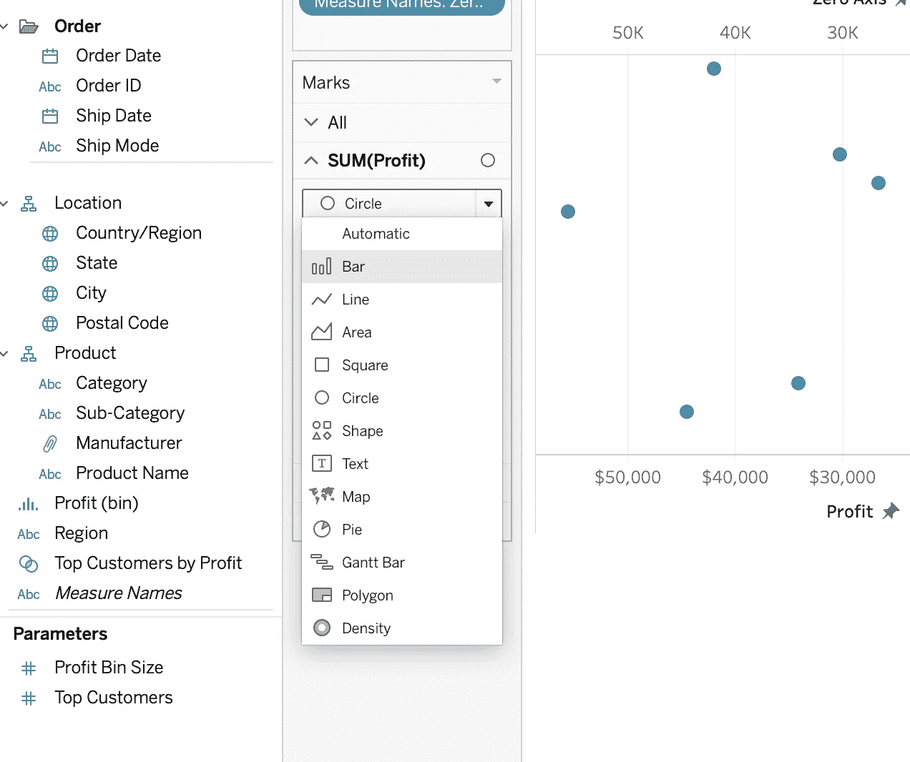

# 构建蝴蝶/龙卷风图表——用数据讲故事(下)

> 原文：<https://medium.datadriveninvestor.com/building-butterfly-tornado-charts-storytelling-with-data-part-ii-ba443648b40e?source=collection_archive---------3----------------------->

## 什么是蝴蝶/龙卷风图表以及如何在 Tableau 中创建它们

Photo by [Marlon Michelle Corado](https://unsplash.com/@marloncorado?utm_source=medium&utm_medium=referral) on [Unsplash](https://unsplash.com?utm_source=medium&utm_medium=referral)

# 什么是蝴蝶/龙卷风图表？

utterfly 图表，也称为 Tornado 或 Divergent 图表，本质上是一次比较两个不同指标的条形图。在这些图片中，数据类别垂直列出，不同指标的条水平延伸，位于所列类别的两端，类似于蝴蝶翅膀。下面是一个例子。

蝴蝶图在比较两个数据集或指标时很方便，这两个数据集或指标在本质上是相反的，如男性-女性、阳性-阴性等。

这些图表也是报告中常用的常规条形图/堆积条形图的一个很好的替代品。

# 蝴蝶/龙卷风图表示例

Image Source:[https://www.slideteam.net/business_powerpoint_diagrams/58418368-style-essentials-2-compare-2-piece-powerpoint-presentation-diagram-infographic-slide.html](https://www.slideteam.net/business_powerpoint_diagrams/58418368-style-essentials-2-compare-2-piece-powerpoint-presentation-diagram-infographic-slide.html)

Image Source: [https://vizzlo.com/create/butterfly-chart](https://vizzlo.com/create/butterfly-chart)

Image Source: [https://datavizproject.com/data-type/butterfly-chart/](https://datavizproject.com/data-type/butterfly-chart/)

# 如何在 Tableau 中制作蝴蝶/龙卷风图表

按照下面概述的步骤在 Tableau 中创建您自己的蝴蝶图(注意:我已经使用了示例超市数据来创建下面的数据可视化)

> **第一步——创建简单的条形图**

在下面的步骤中，我将公共维度“子类别”以及所需的度量、数量和销售额拖到工作表中，并创建了一个条形图。

> **步骤 2 —创建零轴计算字段**

如果您的零轴药丸已保存为尺寸，将其转换为测量。

> **步骤 3——将零轴添加到工作表中**

将零轴药丸添加到工作表，并将其标记类型转换为文本。

将你的维度，在我的例子中是“子类别”拖到你的零轴标签卡上，如下所示。

因为我们已经通过零轴标签列出了维度/标题，所以我们可以去掉最左边的标题，如下图所示。

> **步骤 4 —反转其中一个条形图**

右键单击其中一个测量的轴，并选择“反转”选项，这将反转条形图。

> **步骤 5 —转换成双轴**

右键单击零轴测量药丸，并选择“双轴”选项。

这将暂时打断你的 viz，然而，将你的主要措施的标记，在我的情况下，数量和销售，转换成酒吧和零轴的“文本”。

下面是你的视觉想要的上面的修改。

> **步骤 6 —同步轴**

右键单击零轴药丸的标题，并选择“同步轴”。

这将把维度标题移动到我们的条形图的中间，如下所示。

> **步骤 7 —重复零轴测量**

将零轴药丸拖到列架上，如下所示。

将药丸转换为双轴和同步轴。

接下来，将标记类型转换为“文本”。

最后，下面是你最终的视觉效果

> 下一步，是根据你的喜好完善颜色、标签和工具提示，并调整 viz 的格式。

您可以从 [**Tableau Public**](https://public.tableau.com/profile/aasavari.kaley#!/vizhome/ButterflyViz/Dashboard1) 找到并下载上述仪表盘。

敬请关注更多关于数据的文章！

快乐分析…

 [## 一瞬间学会数据科学！？数据驱动的投资者

### 在我之前的职业生涯中，我是一名训练有素的古典钢琴家。还记得那些声称你可以…

www.datadriveninvestor.com](https://www.datadriveninvestor.com/2020/07/23/learn-data-science-in-a-flash/) 

**访问专家视图—** [**订阅 DDI 英特尔**](https://datadriveninvestor.com/ddi-intel)