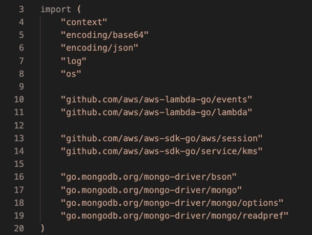

# 构建日冕追踪器:MongoDB 和 GO

> 原文：<https://medium.datadriveninvestor.com/building-coronatracker-mongodb-and-go-467b271421f3?source=collection_archive---------13----------------------->

我以前写过关于电晕跟踪器应用程序。比如这里的关于开源文化的帖子，或者关于[数据可视化](https://medium.com/@Pavel_ilin/data-visualization-with-recharts-d1de5273b6a7)和使用 [blockstack](https://medium.com/weekly-webtips/building-coronatracker-with-blockstack-authentication-e7a8fe1f9231) 的帖子。今天，我们将讨论如何使用 MongoDB。

我们使用 MongoDB 来处理短信订阅和通知。作为示例，我们将了解订阅功能的外观。我们使用 GO 来构建这个功能。

**初始化**

我们将从导入所有必需的库开始。



**MongoDB 设置**

接下来我们将配置 mongoDB 连接。在那里，我们 ping MongoDB 连接，并检查是否有任何错误返回。我们还需要设置一个 **mongo 所需的上下文。连接**。

接下来，我们将连接到数据库:

```
coronalertDB := client.Database(“Coronalert”)
```

并连接到特定集合:

```
phoneNumbersCollection := coronalertDB.Collection(“PhoneNumbers”)
```

这里是数据库配置的完整代码:


**订阅**

成功连接数据库后，我们就可以开始订阅过程了。

我们有一个用户在前端提交的电话号码。首先，我们将尝试在数据库中找到这个电话号码，并发回一个响应。


如果数据库中没有这样的号码，并且没有其他错误，我们可以在数据库中插入一个具有新号码的记录。


**结论**

我们在这里。与 MongoDB 的连接已成功建立，并创建了新记录。我们只创建了 action，但是 MongoDB 允许您执行整个 CRUD。

查看[电晕跟踪器 Github](https://github.com/COVID-19-electronic-health-system/Corona-tracker) 并加入我们！

不断学习，不断成长！

我们上 [LinkedIn](https://www.linkedin.com/in/pavel-ilin) 连线吧！