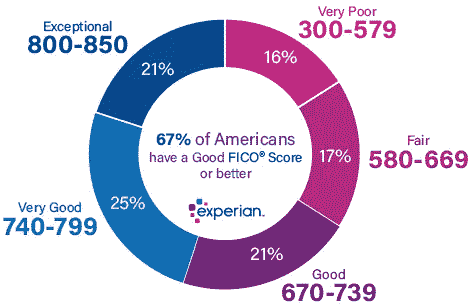

# 建立良好的信用

> 原文：<https://medium.datadriveninvestor.com/building-good-credit-421a164d834b?source=collection_archive---------12----------------------->

信用。你听说过。信用好。信用不良。但是没人告诉你它到底是什么。你不是在学校学的。现在你会知道的。什么是真正的信用？

信贷是一种信托，允许一方向另一方提供资金或资源，其中第二方不立即偿还第一方(从而产生债务)，但承诺在以后偿还或归还这些资源(或其他同等价值的材料)。*【定义来源:维基百科】*

好的，语言很复杂。简单地说，回想一下你的学生时代。我们都借给朋友一些铅笔、钢笔，也许还有些钱。总有一些人永远不会归还我们的铅笔。你借给他们吃午饭的 10 美元某天不见了。

现在，如果那个从来没有还过你 10 美元的人再次向你要钱，你不会给他。为什么？他辜负了你的信任:你不再相信他会还你钱。也许你告诉你的几个朋友他没有还你钱。现在连他们都不愿意借钱给他了。他在“信任度”上的得分很低，现在他无法从任何人那里得到钱。

这个“信任度”基本上就是你的信用评分。

Courtesy of Fair Isaac Corporation

一些基本数据。普通美国人的信用评分在 670-739 之间。这是一个很好的信用评分，但你应该以 750+为目标。现在你会问，为什么信用评分如此重要？怎么做才能开个好头，得个高分？

拥有良好的信用打开了你的财务选择。以后你想买辆好车，都要好几万块钱。你想开个企业，要几万，几十万，甚至可能几百万。买房子也一样。即使是现在，当你付大学学费的时候。这可能要花好几万，而且你身上很可能没有那么多钱。

这时你就向银行求助，向他们贷款。

回到你的朋友向你借一支铅笔或一些钱的场景。如果他从来不把你的东西还给你，你很可能以后也不会借给他东西了，对吗？他不值得信任，他不会把东西还给你。为什么你要借给他更多的东西，只是为了失去它？

银行也是如此。就像我之前说的，你的信用评分是一个“信任度表”。得分高，你是一个值得信赖的人。银行信任你。他们会愿意借钱给你，这样你就可以开始创业了。以后去个好点的研究生院。买那辆好车。买下那栋漂亮的大房子。

 [## 大数据给教育行业带来的 5 大变化|数据驱动的投资者

### 如果利用得当，大数据将对教育行业产生巨大影响。它可以提供众多新的…

www.datadriveninvestor.com](https://www.datadriveninvestor.com/2020/02/18/5-changes-to-the-education-sector-caused-by-big-data/) 

现在如果你的分数很低，你就不能做那些事情。但是建立良好的信用应该从小开始。这对于一个学生来说很难，甚至对于一个刚从学校毕业的人来说也很难。生活是昂贵的，尤其是如果你住在城市里。账单很难支付。这里有一些建议，这样你就能以高分毕业。

第一:还清你的学生贷款，如果你有的话
这可能是这个列表中最难的一个。学生贷款糟透了。美国的教育可能非常昂贵。但是你的信用评分是对你偿还债务能力的一种衡量，是一种“信任度表”。

毕业后，你可能会有一段时间的学生贷款。但不用担心。从现在开始将会减少一些债务。如果你进行固定支付(比如每月支付 x 美元)，一些贷款人甚至会降低你的利率。这不仅能帮你还清债务，还能帮你更快更容易地还清债务。到你毕业的时候，你已经有了很好的还款记录。有了良好的“信任度”评级，你可以深入真实世界。

**第二:获得信用卡资格！(适用于有担保/无担保)**

要做到这些，你需要一张信用卡！找一个联署人来帮你取得资格。

如果你不满 21 岁，你就不能获得信用卡，除非你能“证明你有独立的偿还债务的能力，或者你有一个 21 岁或 21 岁以上的联署人。”

仔细分析这种法律语言，它是说如果你去上学而不工作(这可能是你们中的许多人)，获得信用卡的资格是不可能的。如果你有一个 21 岁以上的联署人，也许是一个年长的兄弟姐妹或父母，你就有资格。

你可以从小采购开始。去杂货店一趟。给你的车加点油。每月付清这些小额购物款。对于那些没有很多钱，刚刚开始用信用卡建立信用的人来说，这是一个很好的方法(这适用于几乎所有的大学生)。

通过持续按时偿还债务，这将向潜在的贷款人和你的银行表明你是值得信赖的。

但是有一个警告。法律禁止你在一定年龄之前拥有信用卡的原因是因为拥有信用卡会带来很多责任。从技术上讲，你可以用你的信用卡进行 700 美元的购物狂欢。很容易忘乎所以，尤其是刚开始的时候。控制自己。

**第三:支付租金建立信用！**

你们中的许多人去外州上大学，你们中的许多人将选择呆在校外。找个自己的公寓。你们中的许多人开始搬出去了。你没有现金和信用(至少你们中的大多数)，你不能买房子。所以你租了。

付房租也是一种责任。你每月支付住宿费用。不按时交钱，是有费用的。如果你根本不付钱，你就被踢出去。这有点像支付你的信用卡账单，不是吗？

租金支付不会上报给征信机构，至少大部分时间是这样，但你可以让它们算数。有很多公司(PayLease、Rental Kharma 和 Rent Track 等)可以帮助你将租金添加到信用报告中。他们会建立你的付款记录，然后你就可以了。你刚刚为自己赢得了一些好名声。

希望你在这里学到了一些东西，并得到了一些关于如何建立你的信用评分的建议。现在你可以从头开始，享受成果，而不会在以后的职业生涯中遭受痛苦。

**进入专家视角—** [**订阅 DDI 英特尔**](https://datadriveninvestor.com/ddi-intel)