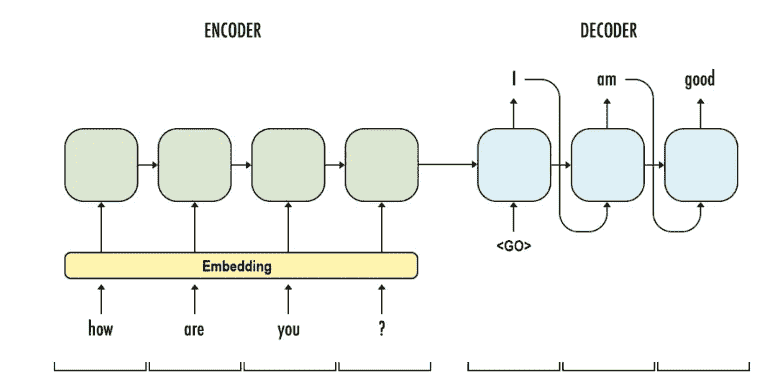
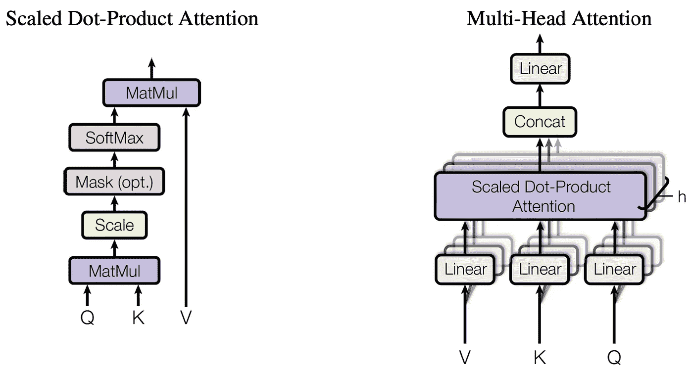

# 为变压器建立直觉—注意事项

> 原文：<https://medium.datadriveninvestor.com/building-intuitions-for-transformers-attentions-5a37700d363e?source=collection_archive---------10----------------------->

Image from [source](https://www.cio.com/article/3207764/the-powerful-link-between-focus-and-creative-output.html).

## **用于神经机器翻译的编码器-解码器 RNNs】**

用于 NMT 的基本**编码器-解码器 RNN** 的结构是这样的，编码器获取输入句子(每个单词由其相应的嵌入表示)并一次处理一步，然后向解码器输出最终向量。这个输出被称为**上下文向量**，并且被认为是源句子的一个很好的**摘要**。

 [## 2019 年最值得学习的编码语言|数据驱动的投资者

### 在我读大学的那几年，我跳过了很多次夜游去学习 Java，希望有一天它能帮助我在…

www.datadriveninvestor.com](https://www.datadriveninvestor.com/2019/02/21/best-coding-languages-to-learn-in-2019/) 

解码器用来自编码器的输出上下文向量初始化。当**训练**时，它将向右移动一步的**目标翻译句子**作为输入，当**推理**时，它将被上一步的输出单词所替代。

Image from [source](https://6chaoran.wordpress.com/2019/01/15/build-a-machine-translator-using-keras-part-1-seq2seq-with-lstm/).

尽管模型中的循环单元是**门控单元**如 LSTM 或 GRU，但性能仍然受到句子长度的限制。对于长句，当完成输入处理时，模型往往会忘记第一部分。

## **注意机制**

具有注意力的编码器-解码器 RNN 模型的结构类似于没有注意力的编码器-解码器模型的结构，但是它不是仅输出来自编码器的最后隐藏状态的一个上下文向量，而是返回它的**整个序列**。

解码器在每个时间步都可以访问该序列，除此之外，还引入了**注意机制**来决定该序列的哪一部分与当前单词的翻译相关。解码器不再处理整个序列，而是可以在给定的时间步长内将**的注意力集中在**对其重要的事情上。

这是通过**对编码**进行加权来实现的，每一个时间步长都有一组独特的注意事项。这些关注度加起来是 1，其重要部分接近 1，其余部分接近 0。因此，加权编码将仅具有与当前翻译相关的值，而其剩余部分被乘以非常小的值，因此被忽略。

Image from [source](https://blog.floydhub.com/attention-mechanism/).

**对准模型**与编码器-解码器模型的其余部分一起被训练以获得关注。它将编码序列和解码器的**先前隐藏状态**作为输入，使用串联或点积来度量它们的**相似度**，然后应用 softmax 将它们转换成**分布**。

这可以解释为编码器使用其先前的隐藏状态作为**查询**来寻找编码序列中感兴趣的部分。

## **成比例的点积关注**

根据上一节对注意力机制的基本直觉，成比例的点积注意力并不神秘。与上述注意机制不同，之前的隐藏状态现在被称为**查询**，编码序列被成对的**键**和**值**所取代。

将成对的键和值想象成一个**字典**，模型使用查询来匹配键。如果一个键被匹配，它相应的值将被获取。

Scaled Dot-Product Attention

在 softmax 中，Q 和 K 的点积用于查找匹配部分，然后对乘积进行缩放，softmax 用于获得分布。产生的注意力然后被用于加权值 v

## **变压器的注意事项**

变压器由一组链接在一起的编码器和一组链接在一起的解码器组成。要理解的最重要的组件是它的**多头注意力**子层，它只是并行工作的多个缩放的点积注意力。

Multi-Head Attention. Image from [source](https://arxiv.org/pdf/1706.03762.pdf).

编码器负责生成源句子的编码，这是模型特有的表示，其输出被提供给所有的解码器层。为了产生更好的结果，句子中给定单词的编码必须包含句子中对其重要的所有单词的信息，**包括单词本身**，因此换句话说，**句子正在关注自身**。

**查询**和这里的 pair ( **键**，**值**)都来自句子本身。当处理一个给定的单词时，注意力机制负责提取句子中对该单词有意义的所有部分。

它实际上是这样工作的:

1.  首先，用 **Wq** 、 **Wk** 、 **Wv** 将句子嵌入到三个不同的子空间中，得到句子中每个单词的 Q、K、V。
2.  计算 **matmul(Q，K)** 的 **softmax** ，用 sqrt(d)缩放以避免 **softmax** **饱和**。以句子“我已经到达”为例，有 3 个单词，点积的结果 softmax 将是 **3x3** 矩阵，每行和每列代表一个单词。并且来自矩阵的每个值将代表**其对应单词**之间的相关性。
3.  用获得的 softmax 对值 **V** 进行加权，以输出句子的正确编码。

另一方面，解码器做一些类似的事情，但是**对(K，V)来自编码器**。当翻译一个给定的单词时，它使用前一个解码器层传入的 Q 来查找 V 中使用 k 的相关信息。

 [## 为 NLP 构建 MLOps 管道:机器翻译任务[教程] - neptune.ai

### 机器学习操作通常被称为 MLOps，它使我们能够创建一个端到端的机器学习管道…

海王星. ai](https://neptune.ai/blog/mlops-pipeline-for-nlp-machine-translation) 

对**变压器**及其**注意机制**的良好理论理解只是一个起点；要加深你对题目的认识，往往需要有一些动手的经验。为此，这篇详细的教程将以简洁明了的方式，一步一步地指导你完成**神经机器翻译流水线**的**开发**和**实现**过程。除了 ML 之外，你还会在 **MLOps** 方面积累一些经验，这是文件中工程师必备的技能。试试看！