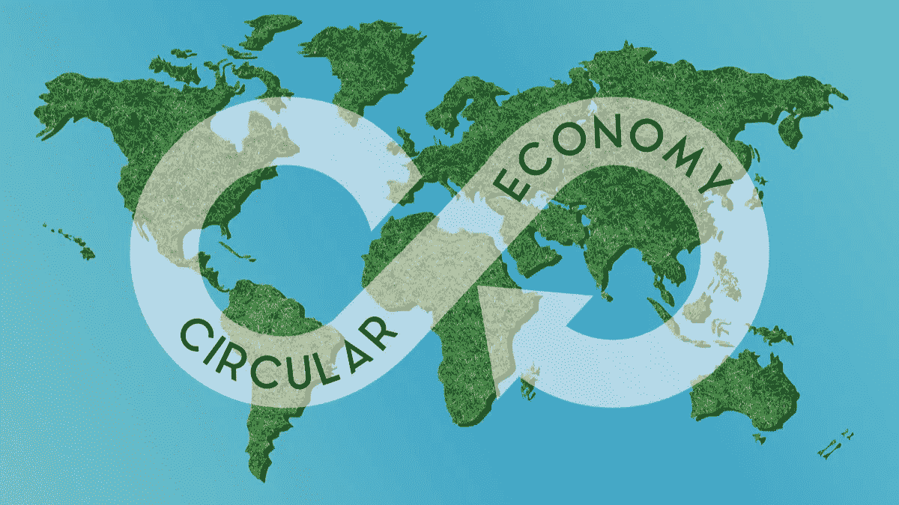

# 用区块链构建可持续循环经济

> 原文：<https://medium.datadriveninvestor.com/building-sustainable-circular-economy-with-blockchain-fba93775a040?source=collection_archive---------14----------------------->

*Source: Circular Economy via Shutterstock*

自从工业革命开始以来，全世界都关注产品的生产和消费。很少或根本没有注意到材料的来源，产品制造的条件，以及它们最终是如何处理的。然而，当前工艺对环境产生的有毒影响，加上自然资源的迅速枯竭，使得每个人都不得不转向可持续和环保的循环经济。但是，转变到一个完全不同的范式有什么障碍呢？像[区块链](https://www.datadriveninvestor.com/glossary/blockchain/) [这样的技术能解决](https://www.datadriveninvestor.com/glossary/address/)这些挑战吗？

# 为什么循环经济是时代的需要？

*Source: Linear vs. Circular Economy via Shutterstock*

# 当前的线性经济面临哪些挑战？

今天的线性经济采用的是资源消耗的“取-制造-处置”模式。原材料要么被提取(金属和矿物)，要么被收获(农产品)。然后，它们被采购并用于制造其他产品。这些成品随后由消费者购买，并在产品寿命结束时处理掉。这些产品最终被发现在一些垃圾填埋场或被焚烧。其中一些物质甚至是有毒的，将它们释放回生物圈会对气候产生可怕的影响。

这种线性系统导致用作原材料的那些自然资源的耗尽。这种枯竭导致这些资源的高价格和供应中断。所有这些因素都增加了寻找替代模式的紧迫感，并促使企业探索回收和再利用产品以及保护宝贵自然资源的方法。

# 循环经济如何应对这些挑战？

[循环经济创造了一个闭环生态系统](https://www.ellenmacarthurfoundation.org/assets/downloads/publications/Ellen-MacArthur-Foundation-Towards-the-Circular-Economy-vol.1.pdf)，扩展了当前的“拿来制造”模式。它增加了回收、再加工、转售和再利用等流程，在材料被处理掉之前要重复多次。这种模式强调使用可再生能源和减少有毒化学品的消耗。它还侧重于改进产品和系统的设计。此外，企业还致力于负责任的废物管理和工业废物最小化。

如今，越来越多的企业正在向可持续的循环经济模式过渡。[理光是这一领域的先驱之一](https://www.ricoh.com/sustainability/environment/product/resource/02_01.html)早在 1997 年，他们就推出了再生复印机和打印机 GreenLine 系列。如今，这种模式已经扩展到其他行业，如纺织、电子、轮胎和汽车。

循环经济是一个万亿美元的机会，具有创新、创造就业和经济增长的潜力。这种经济开辟了新的商业机会，也有利于环境和社会。通过过渡到绿色模式，能够减少 80%的能源、88%的水、77%的废物和大量的资本支出。根据[汽车零部件再制造协会(APRA)](https://www.aftermarketnews.com/apra-files-comments-on-green-jobs/) 的数据，仅在美国，再制造行业的数千家公司就创造了超过 50 万个工作岗位。

# 循环经济成功的基本要求是什么？

*Source: Circular Economy Via Ellen MacArthur Foundation*

## 创新产品和系统设计

[设计耐用的产品，淘汰那些不耐用的产品，对于经济的可持续发展至关重要。循环经济中的消耗品必须使用无毒材料。此外，为这一循环提供燃料所需的能量应该是自然可再生的，以减少化石燃料的消耗并增加系统的弹性。](https://www.ellenmacarthurfoundation.org/assets/downloads/publications/Ellen-MacArthur-Foundation-Towards-the-Circular-Economy-vol.1.pdf)

## 材料管理和来源

在它的生命周期中，一种特殊的材料经常改变它的形状——从原材料，它变成了成品的一个组成部分。在循环经济中，前向链的成品被回收到反向链的另一个产品中。例如，棉服装首先被转化为另一种服装，然后作为纤维填料进入家具行业，后来又被重新用于建筑中的石棉绝缘材料。

材料管理是一个非常复杂的过程。首先，材料的移动跨越多个行业和地区。第二，[并非所有材料都具有相同的回收价值](https://reports.weforum.org/toward-the-circular-economy-accelerating-the-scale-up-across-global-supply-chains/reorganize-and-streamline-pure-materials-flows/)。玻璃和纸等材料的收集率很高，但质量损失也较高。另一方面，聚合物的收集率较低，缺乏系统的再利用解决方案。第三，相应的供应链高度分散。最后，产品被多次回收。

为了可持续生态系统的成功，必须在材料从原材料到成品和回收产品直至负责任的处置的整个过程中建立一个无可辩驳的监管链。

## 管理复杂的供应链

全球价值链包括几个实体，如供应商、物流公司、政府、监管机构和消费者。供应链网络将需要与现有价值链合作伙伴和辅助链合作伙伴(如废物管理)进行强有力的合作。迄今为止，企业一直专注于内向供应链，精心策划复杂的供应链网络，包括从供应商那里采购原材料和制造产品。现在，他们需要将这种关注扩展到几个反周期伙伴。因此，一个可信、透明、可追踪和安全的信息[逆向供应链和管理用后价值链](https://reports.weforum.org/toward-the-circular-economy-accelerating-the-scale-up-across-global-supply-chains/1-the-benefits-of-a-circular-economy/) [交换](https://www.datadriveninvestor.com/glossary/exchange/)系统对于循环经济至关重要。

## 创造新的商业模式和市场

为了简化循环经济，有必要培育新的商业模式，比如共享经济。在共享模式中，终端消费者租赁产品，而不是购买产品。它将产品的所有权留给了制造商和零售商，使得这些产品在生命周期结束时的回收和再循环更加简化。

同样，如果循环经济必须成为主流，为回收产品建立值得信赖的二级市场是至关重要的。确保二级产品的质量和来源对于二级市场的成功至关重要。

## 鼓励公司和消费者走向绿色

奖励是培养良好行为的建设性手段。当企业和消费者生产和使用可持续材料或改变产品用途和回收产品时，税收优惠和折扣将刺激他们采取这种环境友好型思维。

# 区块链如何支撑循环经济？

## 在复杂的正向和反向价值链中追踪材料

区块链为追踪正向和反向价值链中的产品流动提供了一个可行的解决方案。区块链为多层供应链网络中的物流提供了可靠的追踪。除了[物联网](https://www.datadriveninvestor.com/glossary/internet-of-things/)之外，区块链还可以提供关于产品状况、位置、质量以及材料经过的所有加工的准确信息。

## 产品来源

区块链的[不可改变的](https://www.datadriveninvestor.com/glossary/immutable/)性质向消费者保证了他们从区块链获得的产品信息的[真实性。这项技术还增加了产品来源的透明度——它们是如何和从哪里获得的。这种更严格的审查将引导这些公司改变采购的内容和方式。它将推动道德采购和公平就业。所有这些功能都有助于客户做出明智的决策，从而使他们能够购买可持续的产品和服务。](https://www.forbes.com/sites/forbestechcouncil/2020/01/13/the-circular-economy-and-sustainability-powered-by-blockchain/)

## 激励

对采用环保做法的奖励将有助于推动循环经济。当客户购买回收产品或负责任地返还报废产品时，公司可以向他们发放由区块链支持的数字令牌。类似地，该技术可用于创建和管理企业因环保而获得的能源信用。

## 分散市场

在材料和能源市场使用区块链驱动的平台有几个优势。首先，区块链维护了回收产品消费者之间的信任。顾客获得关于他们所购买的商品的准确和真实的信息。第二，买卖双方可以不通过任何中介进行连接，从而降低交易成本。

最后，去中心化的能源市场可以利用区块链，以令牌的形式向自然资源发放独特的数字身份。此外，人们可以出售、购买和交易这些代币，从而为他们使用可再生资源生产的能源创造一个开放的市场。

## 跟踪能源消耗

监管机构可以使用区块链跟踪能源消耗和碳排放。然后，他们可以使用这些信息来监控企业和消费者是否符合环境目标。

## 鼓励回收利用的智能合同

[智能合约](https://www.datadriveninvestor.com/glossary/smart-contracts/)一般反映多方之间的协议。它们根据某些预定义的条件启动操作。它们可以在加速采用可持续循环生态系统方面发挥重要作用。

首先，[智能合同](https://www.datadriveninvestor.com/glossary/smart-contracts/)可以根据材料的条件和数量，自动触发对退货消费者的付款。通过自动执行智能合同，消费者可以更好地获得激励，从而鼓励他们采取回收和再利用的心态。第二，使用智能合同来计算基于产品类型的激励可以促进整体回收方法。例如，当消费者归还他们比其他人更频繁丢弃的材料时，公司可以使用智能合同给予更高的激励。

## 促进合作的竞争前环境

区块链提供了一个值得信赖的平台，所有的[参与者，包括竞争对手，都可以在这里合作](https://www.datadriveninvestor.com/2020/03/27/with-blockchain-adoption-is-collaboration-the-new-competition/)。当生态系统的所有成员都能够共同决策时，冲突和挑战就会大大减少。

循环经济为企业和终端消费者带来了诸多好处。它降低了成本，增加了新的工作岗位，并改进了现有的流程。区块链技术可以极大地促进创建一个协作、可信和安全的平台，以构建这一可持续的生态系统。

*原载于 2020 年 11 月 17 日*[*https://www.datadriveninvestor.com*](https://www.datadriveninvestor.com/2020/11/17/building-sustainable-circular-economy-with-blockchain/)*。*