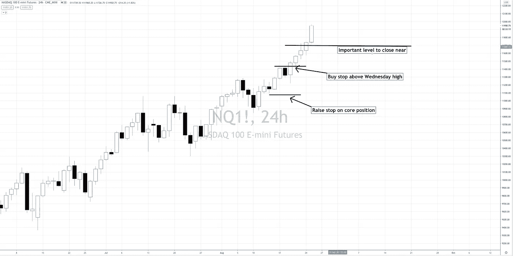
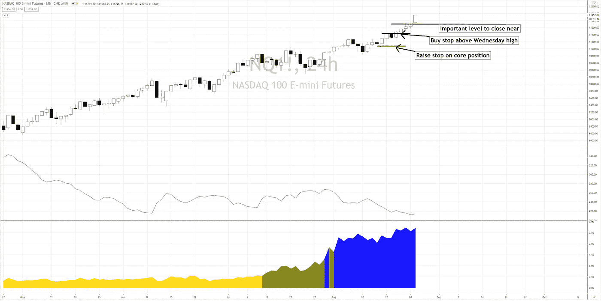

# 牛市动荡的市场机制:这就是有趣的地方

> 原文：<https://medium.datadriveninvestor.com/bull-volatile-market-regime-this-is-where-it-gets-interesting-905ab0274a68?source=collection_archive---------21----------------------->

本周早些时候，我提到我预计美元 NQ 将在 11，600 至 11，700 水平附近收盘。这仍然是一种可能性，但今天我们发现自己站在 12000 人的门槛上。

为什么这个水平如此显著？

1.  我们很少发现自己有这么多高于平均值的标准差。
2.  并不罕见的是，我们已经完成了从 2 月高点到 3 月低点的有分寸的上涨
3.  从历史上看，一个月的收盘价比月初价高出 3 个标准差以上，表明下个月会有更大的下跌。

是的，这是自(2009 年)3 月底以来，Twitter 上每一个制造永久熊市恐慌的人一直在写的东西，日复一日，周复一周。

 [## 为市场注入资金——FAANG 继续依靠永久牛市能源|数据驱动的投资者

### FAANG 股票在 FDA 对 COVID 等离子治疗紧急放行的消息下拉高了市场。经过一周的…

www.datadriveninvestor.com](https://www.datadriveninvestor.com/2020/08/24/injection-for-the-market-faang-continues-to-ride-that-perma-bull-energy/) 

但是克里斯，你是一次又一次买入的永久多头，不顾一切地取笑永久空头，为什么你突然加入了制造恐慌的空头行列？

我也是市场机制的人。

通过 SQN 指标，我们目前发现自己处于牛市波动的市场状态，尽管 ATR 另有说法。

我们所知道的牛市波动的市场机制是，它实际上并不表明市场顶部，但它是一个主要市场顶部的先决条件。

在交易实验室，我们密切关注$NQ 如何结束本月，我们希望对冲我们的多头头寸或减轻风险。

这就是事情变得有趣的地方。

交易是孤立的，很难找到一群志同道合的交易者，他们真正成功地交易市场，而不是靠头条新闻或恐惧赌博，这就是我们在[交易实验室](https://www.pollinatetrading.com/lab)所拥有的。

**访问专家视图—** [**订阅 DDI 英特尔**](https://datadriveninvestor.com/ddi-intel)