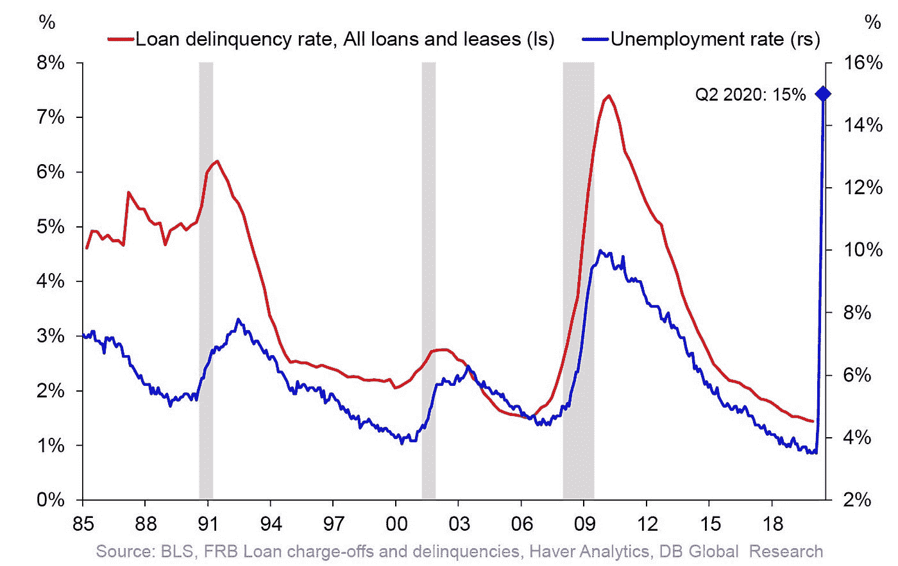
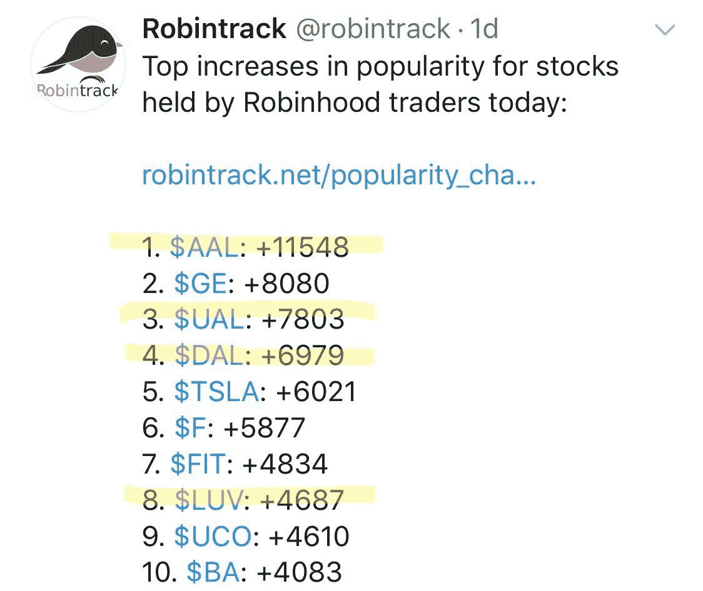
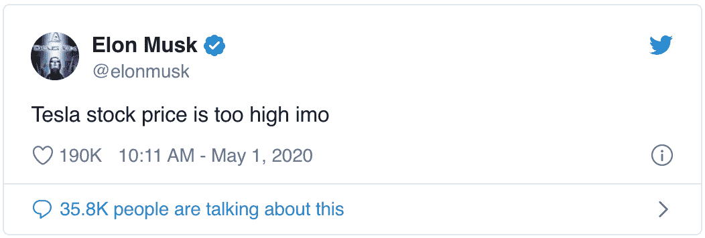

# 对股票的看涨与看跌观点——市场价格是否反映了第四季度的复苏？

> 原文：<https://medium.datadriveninvestor.com/bull-vs-bear-view-on-equities-is-the-market-pricing-in-a-q4-recovery-a11e02aca02c?source=collection_archive---------6----------------------->

## 世界慢慢重新开始做生意。奖金:本周精选股票！

Photo by Anastasiia Chepinska on Unsplash

# 摘要

*   经济复苏缓慢而令人困惑
*   看好汽车租赁，看跌公用事业
*   埃隆出轨了。

周日快乐，欢迎来到阿尔法交易分析师团队的每周股票分析，阿莫尔和费萨尔。

冠状病毒仍然是世界上最热门的话题，因为美国接近 63，000 人因该病毒死亡。《金融时报》报道称，全球所有医院另有 122，000 例死亡病例下落不明。正如大多数人所知，冠状病毒不成比例地影响老年人和患有高血压、心脏病和癌症等健康问题的人。冠状病毒可以加速这些疾病的症状，或削弱人们的免疫系统，使他们的病情变得危急，甚至导致死亡。随着死亡人数的增加，我们不得不怀疑这些数字是否已经被市场情绪所消化。新冠肺炎引发的健康危机肯定足以影响全球的股票和其他资产的价格，但在疫情的这一晚期阶段(一厢情愿)，这看起来像什么呢？

现在的关键是政府如何应对疫情的整体伤亡情况。这将对股票产生更大的影响，至少比病毒本身在后期的影响要大。从行人的角度来看，现在德克萨斯州的封锁已经放松，人们开始更频繁地外出冒险。如果大范围的重新开放导致另一波感染，政府可能会加强社会距离规则，这会在一段时间内对人们的心理产生冲击，因为一些人终于有机会恢复正常的生活方式。综上所述，让我们来分析一下晚期疫情世界经济的看涨和看跌情况。

 [## 如果资本主义失败了，那么还有什么选择呢？数据驱动的投资者

### 在当前政治领域的修辞之旅中，我们都可以面对面地接触到流行词汇，如…

www.datadriveninvestor.com](https://www.datadriveninvestor.com/2020/03/16/if-capitalism-is-a-failure-then-what-is-the-alternative/) 

# 熊案。

就业水平上周上升了 380 万，总数达到 3000 万，接近劳动力的 18%。美联储对前几周失业人数的急剧上升做出了快速而有意义的反应，人们不能否认它对市场的影响。美联储的刺激措施为市场提供了从崩盘低点推高所需的燃料，这些努力似乎已经设定了价格底部。此外，市场中大型参与者的普遍心态是“不要与美联储作对”，你可以从股市从低点反弹的方式中看出这一点。关于疫情在疫苗和治疗方面的进展也有积极的消息。

美联储已经证明，他们将[不惜一切代价](https://www.reuters.com/article/us-health-coronavirus-fed-daly/fed-will-do-whatever-it-takes-to-help-us-economy-likely-in-recession-daly-says-idUSKBN21I2Y6)为经济筑底，确保快速、持续的复苏。但是这地板到底有多结实呢？

毫无疑问，美联储的刺激措施扭曲了市场，恢复了投资者的信心，尽管过去一个月我们看到了大幅波动，但 COVID 之前的炒作似乎已经回归。如果有什么不同的话，一个积极的心理基础现在支撑着市场在最近的低点之上。当美联储宣布他们将购买投资级债券和[甚至可能是垃圾债券](https://www.bloomberg.com/news/articles/2020-04-10/u-s-junk-bonds-rally-most-in-two-decades-with-fed-now-a-buyer)(据我们所知，以前从未这样做过)，人们不得不怀疑这是否只是推迟了迫在眉睫的经济崩溃，像热黄油一样打破了美联储的价格底线。

许多公司[已经取消了年度指导](https://www.alpha-sense.com/insights/covid-guidance)，这意味着外部人士无法准确评估这些公司的当前估值。你必须预测未来两三年的情况才能做出这些评估，这是假设世界将从疫情迅速复苏，同时容忍全球主要央行大规模注入货币。有人可能会说，一场巨大的全球流动性危机将是更糟糕的选择。美联储提供流动性的快速行动避免了一场严重的经济危机，这场危机将持续新冠肺炎很长时间，现在所有行业对 2021-2022 年保持乐观的前景。

想想 2008 年，只有 870 万人失业。从 2008-2009 年金融危机结束到疫情爆发前不久，美国创造了 2240 万个就业岗位。在过去的六周里，我们目睹了 10 年创造的就业机会的消失。假设在接下来的一两个季度，三分之二失去的工作岗位可以恢复。这仍将使美国有大约 1000 万人失业，对我来说，这意味着真正的衰退至少还会持续两年。不是所有的小企业都能生存下来，因此所有依赖它们生存的员工也会破产。不是所有这些工作都将会回来，它们必须被重新创造，而这需要很长时间。

失业消息传出后，美国商业银行贷款拖欠率可能会上升。此外，在未来三个月，约 285 亿美元的垃圾债券(HYG)将到期，而本周将发行约 550 亿美元的投资级债券。

US Commercial bank loan delinquency rate is about to jump as it is highly correlated with the US unemployment rate. (Chart via DB) @Schuldensuehner

支撑大盘股的一个因素是早在 COVID 之前的商业活动中就传来的积极的收益报告，并且[由于回购和新的股息结构，积极的消息在很大程度上被夸大了](https://www.nytimes.com/2020/04/24/business/coronavirus-bailouts-buybacks-cash.html)。在过去的几年里，收入一直在下降，很多人都在讨论即将破裂的经济泡沫。再说一次，美联储的努力有多少只是通过支撑不良企业来扩大泡沫？

全世界的对冲基金经理、央行和机构都准备跟随美联储的脚步。当我们考虑实体经济时，底层由小企业组成，其中许多将不得不关闭，股票市场继续其近 8 周的攀升，没有人否认这种完全的脱节。这不再是估值的问题，这是投资者(包括散户投资者)的投机行为，也是**市场中较大参与者的跟风游戏。**

需要考虑的最后一件事是，整个世界都受到美联储对美元政策的严重影响，流动性危机的这一新发展改变了世界做生意的方式。这让美国处于强势地位，同时让所有其他全球参与者处于危险境地。稍后会详细介绍。

# 散户和投机者都很疯狂。

在另一端，人们被炒作，一般的零售商可能不知道他们在做什么。考虑一下 Robinhood 的这个数据集。沃伦·巴菲特在昨天的股东大会上说[他基本上远离市场](https://www.bloomberg.com/news/articles/2020-05-02/buffett-stays-on-the-sidelines-amid-market-tumble-as-cash-climbs)(坐拥大量现金)。你认为这些演员中哪一个在跟随典型的新闻周期，哪一个对市场走向有更细致入微的想法？

Robinhood data.

美国经济不会像我们的政治领导人[承诺的那样复苏，这有一些强有力的原因。我们还没有完成大规模测试，所以仍然存在很高的风险，仅仅是因为有太多关于病毒强度和传播的未知因素。佐治亚州的温和重开反映了缓慢的恢复，因为在取消限制后的几天里，客流量仍然很低。](https://www.nytimes.com/2020/03/24/us/politics/trump-coronavirus-easter.html)[交通数据](https://www.tomtom.com/en_gb/traffic-index/atlanta-traffic/)揭示了对病毒的偏执仍然是人们回归正常生活的强大阻碍。上海和武汉更早就报告了同样的问题，某些限制继续使小企业(尤其是餐馆)远低于潜在的运营能力。

心理习惯在变，可以看看像高乐士、耐嚼、淡定这样的股票，寻找一点线索。这些公司在病毒出现之前并不那么好，但是今天，人们正在形成新的习惯。

在这些新的消费者习惯的另一端，像梅西百货这样的公司预计会破产，但零售商店的客流量已经在下降。这是 5 年来疫情将经济的某些部分推入他们已经在挖的坟墓的众多方式之一，而其他部分(如餐饮业)将不得不进行大规模重组，以便在这个新世界中生存，并且不是所有的企业都能够赶上新的趋势。现在，来点积极的消息怎么样？我会尽力的。

# 牛市案例(有点)

或许我们根本不在泡沫中。我们不能忘记，这些公司中有许多受益于巨额股票回购，但大盘股的收入增长是积极的。[苹果的收入继续攀升](https://www.apple.com/newsroom/2020/04/apple-reports-second-quarter-results/)达到历史最高水平。大公司继续整合新技术以提高效率，这有助于平滑这些资产负债表上的数字。如果公司继续投资研发并适应新技术，那么有理由相信，虽然价格在冠状病毒崩溃之前有点过度上涨，但在 2-3 年的时间里，许多这些公司都可以被认为被低估了。

此外，万事达卡周三报告称，从他们的角度来看，消费者支出[仍然令人印象深刻的高](https://www.wsj.com/articles/mastercards-profit-falls-though-ceo-says-spending-is-stabilizing-11588164791)，这是一个总体消费习惯可能正在稳定的信号。看，没那么糟吧？

10 年期美国国债收益率看起来并不惊人。为什么这很重要？我在以前的一篇文章中指出，如果你观察比较 2008-2009 年标准普尔 500 和 10 年期国债的图表，这两种资产在危机的几个月中几乎同时触底，然后一起上涨，直到打破连续下跌趋势。这种趋势是否会在未来几年持续还有待观察，但短期内利率保持在低水平是非常积极的。我预计利率将长期保持在 1%以下，即使股市继续反弹。让我们转向欧洲。

# 与美国相比，欧洲处于水深火热之中

德国正在见证一个早期预警信号，可能会导致类似于上世纪 20 年代至 30 年代发生在那里的银行挤兑。德国人越来越多地从账户中取钱，或者不像以前那样存钱了。虽然不能保证历史会以如此丑陋的方式重演，但我会继续让我的社区了解情况，因为我们会关注这些类型的早期迹象，即政府内部以及金融系统的信心开始恶化。与此同时，[西班牙指数](https://www.investing.com/indices/spain-35) (IBEX)月度图表正在印制我所见过的最大的[头肩顶](https://www.investopedia.com/terms/h/head-shoulders.asp)图案之一。但是，我们能认为欧洲正在发生的事情是美国可能发生的事情的警示信号吗？

不，一点也不。与整个欧洲相比，美国经济的增长是天壤之别，因此两个经济体的复苏周期将完全不同。与欧洲相比，美国的整体稳定性意味着美国的发展将是未来 1-5 年全球经济复苏的关键。

# 下周。

***阅读我们的免责声明！*** *我们在这里所说的一切都是纯教育性的，基于我们自己的观点。在做出实际投资决定之前，请与您的财务顾问讨论或进行自己的投资研究。*

回顾:上周公布了几家大公司的收益，包括亚马逊、苹果和脸书。这些结果为未来几周提供了很少的明确性。医疗保健遭受打击，汽车零售大幅上涨。为了晚上睡个好觉，姑且称之为巩固期吧。

**费萨尔本周精选作品:**卡玛克斯(KMX)是目前尚未加工的钻石之一。预期收入是积极的，今年和明年的收益看起来也是积极的。与冠状病毒爆发前的水平相比，二手车市场令人惊讶地下降了 25%，二手车的最大买家是 CarMax。目前，他们正在廉价购买那种产品。在经济基本恢复后不久，汽车销售可能会恢复到病毒爆发前的水平。该公司购买的产品享受 25%的折扣，这一事实使我相信他们将享受正季度。

**费萨尔本周精选:**公用事业(XLR)又输了，原因很简单，根据本周的观察，它是我名单上最弱的板块。

# 关于特斯拉……总得有人说。

Elon Musk tweeting about Tesla, screenshot from May 3.

埃隆，你没事吧？他一写那条推文，该股就在两小时内暴跌了约 10%。我们会密切关注 TSLA，但会非常谨慎。天啊，埃隆。

# 连接更深

感谢您成为这个社区的一员。如果你对这篇文章有共鸣，请[订阅 Discord 服务器](https://bit.ly/2YDdJCL)。你可以免费进入社区频道，在那里我们每天发布大量免费有用的内容。(我们将从 2020 年 5 月 5 日开始提高 [Advantage 社区订阅](https://bit.ly/3bUdg3a)的价格)。更多细节请看下面的视频。

Bull vs. Bear view on Equities, via Alpha Trades, LLC

# 放弃

Alpha Trades，LLC 提供的信息不用于制定任何财务决策，也不是购买、持有和/或销售特定产品、数字资产或 ICO 的请求或建议。

[访问我们完整的服务条款](https://bit.ly/3faVeeV)。