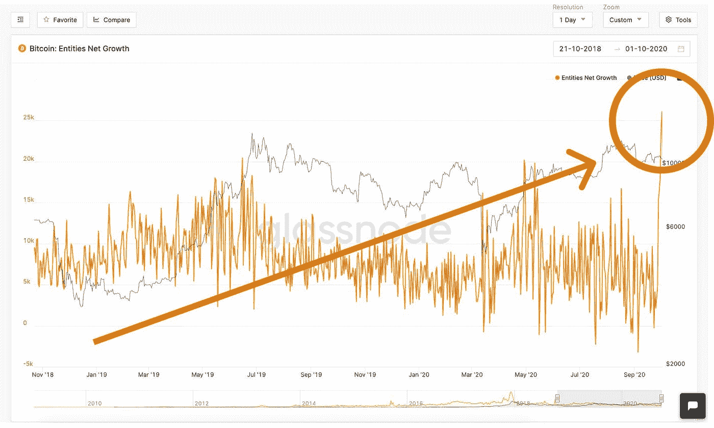

# 看涨:新比特币地址数量激增

> 原文：<https://medium.datadriveninvestor.com/bullish-the-number-of-new-bitcoin-addresses-explodes-8d9b05a89ffb?source=collection_archive---------21----------------------->

尽管价格下降，但增长迅猛

Photo by [André François McKenzie](https://unsplash.com/@silverhousehd?utm_source=medium&utm_medium=referral) on [Unsplash](https://unsplash.com?utm_source=medium&utm_medium=referral)

由于基本面趋势的相互作用，最近几周比特币的价格走势充其量也只是不冷不热。这些包括但不限于，美国 CFTC 起诉 BitMEX，KuCoin 被黑客入侵超过 2 亿美元，英国金融当局禁止加密衍生品，以及川普总统敦促国会山暂时暂停经济谈判。

这种加密货币上周下跌了几个百分点，现在比 12500 美元的夏季高点低了不到 20%。然而，尽管市场的看涨势头明显减弱，比特币网络的基本面似乎比以往任何时候都更强。

数据显示，新 BTC 地址的数量最近已经“突破图表”并呈爆炸式增长。

 [## 稳定币会危及比特币在加密领域的地位吗？数据驱动的投资者

### Stablecoin 是一种加密货币，主要用于维持稳定的市场价值。它可以通过…

www.datadriveninvestor.com](https://www.datadriveninvestor.com/2020/06/08/can-a-stablecoin-jeopardize-the-position-of-bitcoin-in-the-crypto-space/) 

# 尽管 BTC 价格停滞不前，但新的比特币地址正在爆炸式增长

如果你在过去一周一直在跟踪加密数据，你可能会注意到一个奇怪的趋势:流通中的新比特币地址数量上周急剧增加。

这一指标似乎达到了历史新高，因为上周三天内就有超过 20，000 个新地址被创建。

举例来说:通常，每天创建的新地址的正常数量在 5，000 到 10，000 之间。

比特币连锁分析师科尔·加纳(Cole Garner)试图分析这对市场意味着什么。加纳认为，底线是网络活动和交易量先于价格。这意味着这种新地址的涌入可能是实力的长期标志。

上周，新的#比特币地址绝对超出了图表。

背景故事看涨且耐人寻味——这是对新牛市催化剂的独特看法。

我要把它分解了。👇

地址的上升趋势可能与中国在电视节目中宣传比特币、以太坊和 Defi 有关——在数千万人面前。

另一种理论是，BitMEX 的收费导致数万用户撤回资金，导致网络流量增加。

## 加纳强调数据的重要性:

“一句话——这一信息非常乐观，似乎有一个基本的验证。我肯定会看到更多的市场修正和横向价格波动。但在 BTC，我基本上是看涨的。我想霍德勒夫妇会在圣诞节前咧着嘴笑。

# 其他连锁趋势是内联的

著名的链上分析师 Willy Woo 证实，尽管定价活动不温不火，比特币的链上基本面仍然强劲。

根据 Woo 的说法，来自长期零售商的购买压力“不可否认”,连锁趋势证明了这一点:

“目前，来自新霍德勒的基本购买压力是不可否认的。但对于短线交易者来说，期货和现货交易所的抛售墙表明，鲸鱼正处于价格压制模式。它可能会不加选择地突然出现，但长期博弈将会获胜。”

他还补充称，最近的价格变动不是网络趋势的结果，而是短期基本面挫折导致的看跌情绪的结果。

我在每月一期的 [**简讯中分享了更多私密的想法，你可以在这里**](https://mailchi.mp/bf8f8e8ed697/keep-in-touch-with-lukas) 查看。请在评论中告诉我，并在各种社交媒体平台上加入我:

[**推特**](https://twitter.com/WiesfleckerL)●[**insta gram**](https://www.instagram.com/lukaswiesflecker/)●[**脸书**](https://www.facebook.com/lukaswiesfleckerr)●[**Snapchat**](https://www.snapchat.com/add/luggooo)**●[**LinkedIn**](https://www.linkedin.com/in/lukas-wiesflecker-1b11251a5/)**

**无论你做什么，都要带着爱和激情去做！**

## **访问专家视图— [订阅 DDI 英特尔](https://datadriveninvestor.com/ddi-intel)**