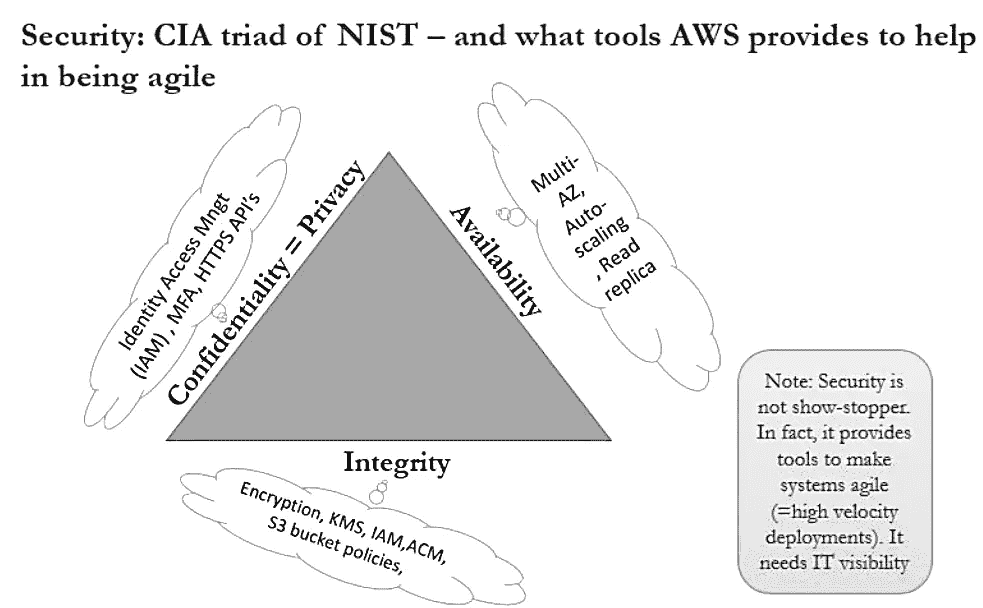
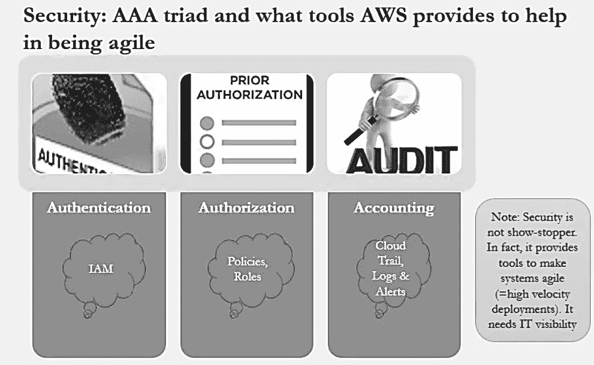
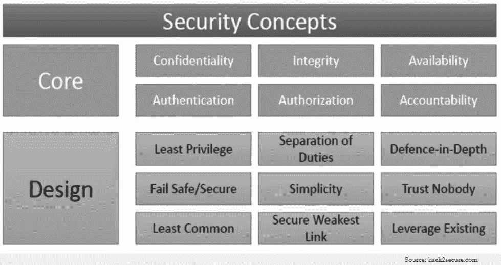

# 从官僚到零官僚——自动化是痛苦的

> 原文：<https://medium.datadriveninvestor.com/bureaucracy-to-zerocracy-automation-is-painful-cloud-adoption-perspective-ebfff36ccfd6?source=collection_archive---------6----------------------->

如果我们在 IT 组织中进行一项调查，“我们在市场上有产品 X，准备好部署—安全认证。此外，它还将节省财富——您的组织在生产中的部署速度有多快？”

调查结果将显示传统组织中流程的影响，无论其规模如何。做任务真的需要很长时间，或者组织可能处于*通知敏捷*。挑战在于当(如果)解决方案被接受时，它已经过时了。谁必须为延迟创新付出代价？当然，*组织。*

今天是技术和工具飞速发展的时代，关键的新技术正被不受欢迎的“迟到者”绑架。

> *创新不能受制于将 excel 表格从一个表格传送到另一个表格的速度*。

敏捷是要走的路之一，而不是同一套思维模式(是的，没有敏捷胖版本，或 100 步敏捷过程)。这是我的一个 IT 同事在他的电子邮件签名中正确地加上的“*我们不能用我们创造问题时所用的思维来解决问题*。

回到自动化，主要的争论和挑战是安全性。让我们看看云提供的工具的映射。“B ***e 稳妥，走快*** ”。

> ***论据:*** *行事快速是否违背安全？*

接下来，NIST 推荐了两个最著名的网络安全实践模型。好消息是，云计算已经有了解决方案。让我们仔细看看:

*中情局:保密性、完整性和可用性*

AAA:认证、授权、记账

延缓部署的是心态，而不是安全义务。在火灾发生之前，让系统对安全人员可见会有所帮助。

(注:我最初是为我在康明斯的内网博客写这个的。原始帖子中可能会有一些定制，以使其与该平台相关。

# 不要忘记给予👏

