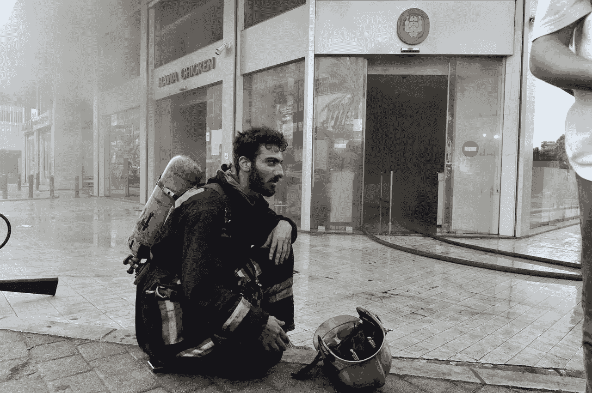
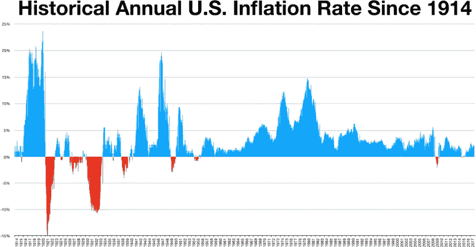

# 烧掉一个国家的现金

> 原文：<https://medium.datadriveninvestor.com/burning-a-nations-cash-a699835f317a?source=collection_archive---------4----------------------->

## 建立另一种货币体系

A firefighter catches his breath in front of the burning shop in Beirut, Lebanon [2020]. Image by [Annahar](https://www.annahar.com/arabic/section/77-%D9%85%D8%AC%D8%AA%D9%85%D8%B9/30092020071245784).

不到一个月前，一家以烤鸡闻名的黎巴嫩家禽店被大火吞噬。谣言很快浮出水面，说这是竞争对手的纵火案，因为该店能够在国家货币贬值的情况下压低价格。Hawa Chicken 确实能够保持比其他知名家禽品牌低近 30%的价格。为了避免为其产品创造黑市，该公司还对每位顾客的购买数量设定了上限。

无论最初的火花来自何方，公众的想法，以及已经超过货币贬值率的通货膨胀率，让我们对我们的货币条款有了更多的了解。最突出的是，在地中海国家货币复苏超过 20%的情况下，过高的价格得以维持的事实很能说明问题。

> 它凸显了经济体系建立过程中的一个缺陷。

这篇文章不是为了讨论一个政府的财政政策。它凸显了经济体系建立过程中的一个缺陷。按照现在商家是怎么定义的，达到目的，增加利润几乎就是“赚钱”的代名词。从政府的角度来看，“赚钱”，增加流通中的货币，使其贬值。从某种意义上说，股市并不是迫使企业进行短期思考的唯一因素。

企业总是在竞争中积累收入，以免它们变得无关紧要，或者在它们积累的东西失去价值之前。他们希望在保持利润的同时积累利润，以应对未来的贬值。黎巴嫩的货币“波动”是被当地人称为“贪婪的商人”放大的一个不起眼的例子。津巴布韦的恶性通货膨胀是一个更极端的例子。然而，例子不必如此极端。

US inflation rate (2017). Image by [Wikideas1](https://commons.wikimedia.org/wiki/File:US_inflation_rate_CPI.png).

自从货币问世以来，通货膨胀一直是现代经济体系的特征。人们想要更多。与直觉相反，我们看到过去一个世纪美国的通货膨胀率在困难时期一直是负值。除了看不见的手，美国实际上设定了目标通胀率。这可以被真诚地理解为试图让事情处于控制之下。

> 你不可能让系统既可控又可预测。

这凸显了现代经济体系的另一个方面。“现代”不是一个表示最近的过去或当前时间的通用术语。你不可能让系统既可控又可预测，因为这两者形成了冯·诺依曼创造的二分法，正如我在关于描述晶格上的经济的[的文章中指出的。](https://medium.com/discourse/economics-could-emerge-out-of-boltzmanns-beauty-25d1feaa35b)

这就是为什么，正如[姜立](https://medium.com/u/459f680056f?source=post_page-----a699835f317a--------------------------------)用他的[模型](https://medium.com/@lijiang2087/can-you-time-the-market-27d13ab98d19)所展示的，你不应该试图去把握市场时机。如果你读过[的《中观经济学》](https://medium.com/discourse/mesoeconomics-2b280d3e8017)，你会完全避开股市。当上面使用“可预测”时，它意味着描述非平凡的未来行为的能力。你能猜出这个系统是为了什么——可控的还是可预测的——而建造的吗？我们有财政政策和长期预算“赤字”——这似乎已成为新常态——以及内幕交易是一种违法行为的事实，应该是一个警示信号。

有人可能会说，商品的定价是由市场的供求动态决定的。然而，市场可能包含既不完全也不完美的信息。首先，发行的技术细节超出了金融领域。此外，参与者是理性的假设是不成立的。

> 有时候，我们只是想让飞机发生。

有时候，我们只是想让飞机发生。正如丹宁告诉我们的，这是巴菲特最臭名昭著的“错误”之一的故事。携带交易价值的金钱是一种受制于我们的突发奇想和决定的工具。可以这么说，商人有一天醒来，发现他们的商品价值下降了，也许是为了避免管理费用——油价下跌说明了这一点——或者更多，这样他们的账本就变成了黑色。

在这个框架内，人们可以更好地理解完全由供给和需求决定的完美市场，尽管供给和需求这两个概念掩盖了人类的复杂性。正如 Rybnik 指出的那样，富人终究不会买更多的卫生纸。

> 事实上，我们已经失去了平衡。

完美的市场是一个动态的均衡，一个无法达到的均衡。事实上，我们失去了平衡——直到我们死去。我们从核聚变的进步中学到的一个教训是，当你为你想要建立的未来塑造系统时，你应该接受不稳定性是一种固有的现象。我鼓励你们走出自己的舒适区，阅读一下[文图拉](https://medium.com/u/bdc2211c7d09?source=post_page-----a699835f317a--------------------------------)在[对罗伯特·布萨尔](https://medium.com/discourse/robert-bussard-on-iec-fusion-power-the-polywell-reactor-be4a59dc7318)的采访，他是核社区的一位杰出人物，以更好地理解如何应对非平衡。

商家似乎明白这一点。承认金本位已经被抛弃，他们发现为同样的产品索取更多的钱是可以接受的——甚至是更少的产品，实际上是货币贬值。然后，他们继续花掉这些现金，或者，在黎巴嫩市场的情况下，拿到美元。他们在市场感受到进一步贬值之前的短时间内这样做，有效地超越了他们作为独立代理人加剧的局部非均衡，在市场上还没有感受到他们发出的贬值浪潮。

价格上涨背后有几个原因。“贪婪”不是唯一的。在许多情况下，尤其是中小型企业，需要将额外的成本转移给客户，以真正维持运营。在其他情况下，他们资助未来的研发支出，以改善产品，更好地服务于客户，实现组织的目的。

> 货币需要被铸造。

除了显而易见的，还有一个实际的考虑。货币需要被铸造。仅在 2015 年，[美国美联储就花费了 7 . 17 亿美元印刷新钞票](https://www.mentalfloss.com/article/68650/how-much-does-it-cost-manufacture-us-paper-money#:~:text=Well%2C%20%241%20and%20%242%20bills,more%20it%20costs%20to%20produce.)，以及这一过程所需的一切。随着人口的增长和资源的发掘，对流通中货币的需求将会增加。

请考虑一下，你可以保持货币供应量不变，而不是增加供应量来满足货币需求。你限制供给，而不是铸造货币来满足预测的需求。随着越来越多的资源被发现，产品被制造出来，同样多的钱用于市场交易。

> 你会为了一个新的现实而烧钱吗？

商业产品的价值不会突然“降低”。是钱获得了更大的交易价值。比方说，如果货币是数字化的，不需要印刷，并且分散化，这样“铸造”货币的成本就可以更直接地分配给不断增长的人口和产品——有人认为是加密货币吗？—通缩和预算盈余可能成为新的现实。这样一个另类的现实需要一个信念的飞跃，需要另一篇文章来更好地描述。你会为了一个新的现实而烧钱吗？毕竟，国家货币不一定是庞氏骗局。

 [## 国家货币不一定是庞氏骗局

### 国家货币不一定是庞氏骗局，因为黎巴嫩人小心翼翼地庆祝他们的国家货币复苏…

link.medium.com](https://link.medium.com/KJnJk6H5zbb)