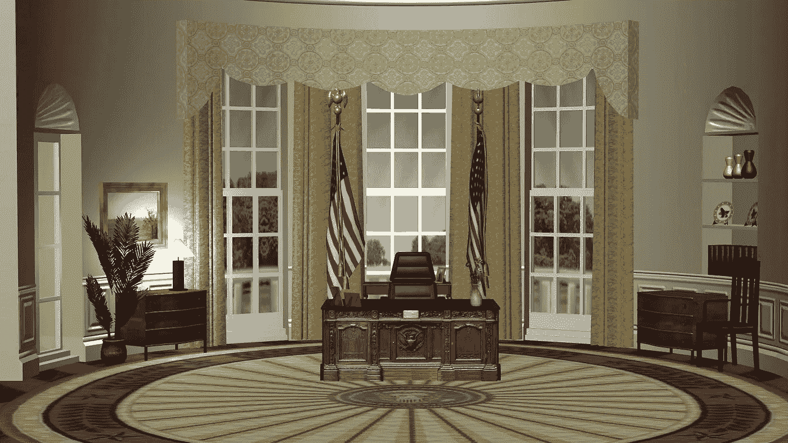

# 烧掉房子

> 原文：<https://medium.datadriveninvestor.com/burning-down-the-house-128a60411edd?source=collection_archive---------5----------------------->

Image by [Sabrina Young](https://pixabay.com/users/dalatindiva-6363720/?utm_source=link-attribution&utm_medium=referral&utm_campaign=image&utm_content=3144443) from [Pixabay](https://pixabay.com/?utm_source=link-attribution&utm_medium=referral&utm_campaign=image&utm_content=3144443)

## 是时候重新思考跛脚鸭总统的权力了

上周末，在 2021 年 1 月 20 日就职日之前，我们跨过了“还剩两个月”的门槛。现在，即使是唐纳德·特朗普也普遍认为，乔·拜登将成为美利坚合众国第 46 任总统，尽管现任总统及其亲信在鲁迪·朱利安尼的领导下，并在林赛·格雷厄姆等一些共和党高级成员的支持下，继续进行最后的绝望尝试，以破坏和推翻选举结果。

唐纳德·特朗普知道他没时间了。他的内阁也知道这一点。然而，特朗普和他最亲密的有影响力的支持者决心通过采取单边行动让拜登政府的生活变得痛苦，但他们这样做是在摧毁美国及其在国家和国际安全问题上的立场。

也许是时候讨论在选举和就职日之间的这段时间里，从宪法上改变离任总统的权力，使之类似于看守政府。是的，保留总统应对紧急情况的权利/义务，如战争行为或自然灾害，但不应该有权力单方面做出改变，否则在执政的前三年半时间里就应该做出改变。跛脚鸭月不应该带着一本空白支票。如果因为潜在的政治后果，总统在任期内害怕做一些事情，那么这可能是总统不应该做的事情。

## 影响国家安全的国际条约

一个例子是国务院宣布退出《开放天空条约》——加入的想法首先由共和党总统德怀特·艾森豪威尔在 1955 年提出，最终由共和党总统乔治 H.W 布什在 1992 年签署，然后在另一位共和党总统乔治·w·布什任期内于 2002 年生效。

《开放天空条约》允许非武装的空中侦察飞行飞越任何条约国家的领土(主要参与者是美国和俄罗斯，以及大多数欧洲国家和少数其他国家)。通过提供观察军事力量移动、活动和演习的机会，这提供了透明度、理解和相互信任的意图。它提供了一定程度的信任并降低了风险。特朗普因破坏和不信任而繁荣，因此退出了美国对该条约的参与，增加了可能导致紧张局势和战争升级的误解风险。

*建议 1:* 跛脚鸭总统不应该拥有退出国会之前批准的条约、协议或公约的执行能力。

 [## 领导力还是法西斯主义——组织的虚构故事|数据驱动的投资者

### 故事对我们人类的生存很重要，因为它们帮助我们找到生活的意义，并帮助我们找到一种方法…

www.datadriveninvestor.com](https://www.datadriveninvestor.com/2020/11/05/leadership-or-fascism-the-fictional-story-of-organization/) 

## 经济与政府资金

另一个令人担忧的领域是经济。12 月 11 日，政府目前的支出计划将到期。好消息是，众议院和参议院最近都同意两党达成一项 1.4 万亿美元的支出计划，以避免 12 月份的关闭。关于该法案中可能包括的与 covid 相关的刺激金额，仍有几个关键问题，这可能是理解总统是否会签署该法案或他是否会行使否决权的关键。白宫办公厅主任马克·梅多斯(Mark Meadows)表示，他不能“保证”政府关门可以避免，这是一个早期指标，表明特朗普在任期的最后几天之前，仍然对政府机器如何运作持有坚定的观点，并掌握实权。虽然由于现有支出计划的时机或限制，这些财政状况可能是不可避免的，但如果众议院和参议院之间已经制定了两党一揽子计划，以维持政府的官僚机构，那么就应该颁布该计划。不应该允许破坏政府效率和给即将上任的政府制造可避免的混乱。

建议 2: 跛脚鸭总统应该只行使看管权，不允许否决会影响政府行政的法案。

## 司法

但也许最卑鄙的滥用跛脚鸭权力是最近司法部宣布改变联邦死刑执行方式的规则，以便在本届政府的最后两个月内加快执行——包括增加使用行刑队！请注意，自 1976 年以来，行刑队只执行过两次死刑(都是在犹他州，而且都是应犯人的要求)。

这是常见的，也许太常见了，我们现在期待它，预测它，跛脚鸭总统将发布总统的仁慈行为，包括赦免和减刑。奥巴马总统创造了单日记录，在他任职的最后一天为 330 名囚犯减刑。人们普遍预计，特朗普总统将向朋友和前同事发布几项赦免令，但鉴于他全神贯注于选举结果，通常只关注自己，对他将发布的赦免令数量的估计可能被严重高估。尤其是考虑到司法部关于死刑的公告。无论如何，不清楚为什么如此坚定地致力于宽大处理的总统需要等到最后一刻才做出这样的决定。这有点怯懦的味道，破坏了法律和任何法理基础。换句话说，如果总统强烈地感觉到某人受到了委屈，可能被错误地定罪或判刑，那么当你意识到这一点时就采取行动，而不是等到没有个人政治后果的时候。总统也需要承担责任。

*建议 3:* 总统的赦免权可以在任职期间的任何时候使用，除非是在跛脚鸭时期。

这个以平衡总统权力和其他治理支柱(立法和司法)权力的政府体系为傲的美利坚共和国，需要在一个众所周知的过渡时期重新思考总统权力的限度。

这位总统，这个跛脚鸭领导的特殊时期，可能会给我们提供一个真正进行讨论的机会，并做出必要的改变，以防止未来系统被滥用。

## 获得专家观点— [订阅 DDI 英特尔](https://datadriveninvestor.com/ddi-intel)