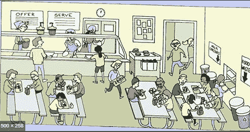

# 来自我们当地商店的商业经验

> 原文：<https://medium.datadriveninvestor.com/business-lessons-from-our-local-shops-79bc652553fb?source=collection_archive---------6----------------------->

在 LinkedIn 上关注我。

在过去的几年里，创业已经成为一个时髦的词汇。很少有人努力奋斗让自己的公司价值百万，也很少有人连一年都坚持不下来。一些人设法在游戏中呆了很长时间。我是一名雇员。因此，也许我不会总是理解企业主的观点，但我总是对他们的心态和工作方式感兴趣。不是朝九晚五。你必须 24*7*365 一直在那里。是啊，星期天也不行。在你成功之前没有周末派对。可能需要 1 年，也可能需要 10 年。

 [## 动荡迫使暴风雨中的平静|数据驱动的投资者

### 自然界中很少有东西是直线行进的，尤其是经济。当投资者和消费者希望平静时…

www.datadriveninvestor.com](https://www.datadriveninvestor.com/2019/03/25/volatility-compels-calm-amid-the-storm/) 

就业后，我很少回老家。距离和树叶总是影响我到访频率的主要因素。在这篇叙述中，我只提到了我们谈话的要点。

我的家乡 **Bhadrak** 是奥里萨邦一个大约 8 公里的小镇。这是一个沿海地区。虽然市场在正常季节不那么拥挤，但我总是觉得有很多东西要向经营企业超过 30 年的人学习。你总能在 BuzzFeed 上找到百万或十亿美元初创企业的故事。你很少会发现你隔壁商店的故事。

我从经营餐馆、杂货店、珠宝陈列室、药店、加油站老板和培训中心的人那里学到的经验。很少有人甚至没有上过高中，只有一个人毕业了。

> 我的问题是“创业的关键点是什么？”。

1.想法

2.产品

3.组

4.执行

问问你自己你的想法是什么？为什么和现有的商家不一样？就像你现在不能创建另一个 facebook 一样。做那件事没有意义。你将永远得不到一分钱的利润。如果你的工作地点已经有几家餐馆，在同一地区再开一家是没有意义的。在构思时，你必须了解你的客户群和人口统计数据。

例如，在你的位置附近有一家公司或工厂。这意味着有工作的人在下午寻找午餐。你可以在你的地区以一个体面的价格开设你的餐饮服务。

在这种情况下，食品中心老板的商店靠近我们的地区学院。大学生来吃早餐和午餐。当招待所的伙食不好时，招待所的居民也来了。大学生寻找经济实惠的饭菜。

> 接下来是，你的产品是什么？你卖的是萨莫萨还是多萨？或者你的服务是什么？你是教物理还是经济学？你至少需要一项扎实的技能。商业中销售产品或服务是最重要的。没有它，就没有生意可言。

我总是去我镇上的一个地方品尝 Dahibara Aludam。Dahibara Aludam 是奥里萨邦著名的早餐菜肴。Bara (Vada)蘸 Dahi Pani(凝乳水)和 Aludam(土豆咖喱半肉汁)混合是你准备它时的简短食谱。

Dahibara Aludam (Odisha Famous)

为什么我要去一个特定的地方？因为他的产品好。他在合理的时间内服刑。更重要的是，**他微笑着:)**给我们 Dahibara Aludam 盘子。

他们中的大多数人说，即使在一个小镇上，也很少有企业需要一个以上的人来经营。有时是你的网络支持你的生意。你不付钱让他们每天和你一起工作，但他们定期为你提供特定的服务。

例如，如果送奶员没有及时送奶，糖果店就不能准备糖果。糖果制造商必须与送奶工有良好的协调或关系网，以保证日常运作顺畅。

如果管理得当，这个团队会为你解决很多问题。你可以委派你的任务，专注于你擅长的事情。假设你擅长物理。你的搭档擅长化学。你们俩可以在市场上租一个地方来交学费。学生们可以在一个地方得到这两个，并且节省他们从一个学费跑到另一个学费的时间。

> 在 Byju 的十亿美元评估后，我们对学费业务没有任何疑问。

E执行，啊哈！！最重要也是最难的一个。无论你的想法或计划有多好，除非你去执行，否则都不会有效果。你可以与你的朋友和家人讨论你的想法和雄心勃勃的计划，讨论几个小时、几天、几周或几个月，只要你愿意。除非你全力以赴，否则一切都是徒劳。您不能随意休病假、事假或年假。电视展示了企业家奢侈的一面，但它们不会告诉你一个人为了建立一个企业所付出的努力和汗水，即使是小企业。

CONTD…
在 [LinkedIn](https://www.linkedin.com/pulse/business-lessons-from-our-local-shops-saumya-prakash-rana) 上关注我。