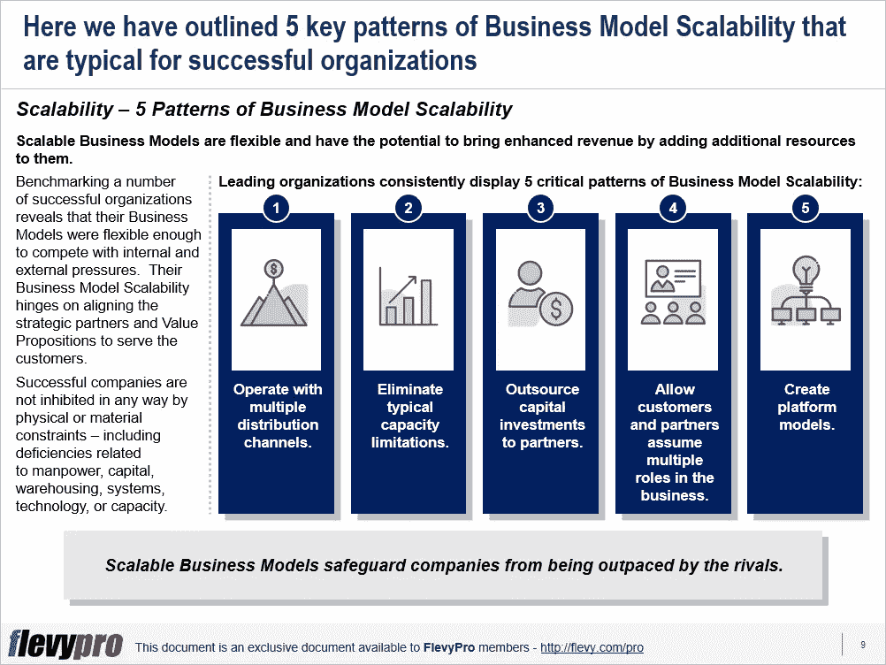

# 商业模式创新:重新定义可扩展商业模式的创建

> 原文：<https://medium.datadriveninvestor.com/business-model-innovation-creation-of-scalable-business-models-redefined-d0293159a5de?source=collection_archive---------10----------------------->

可伸缩性被描述为在数量或容量上可能发生的有意义的变化。在商业术语中，它是系统在资源增加的基础上提高生产率的能力。可扩展性为组织提供了开发极具吸引力的价值主张的能力，这是竞争对手难以模仿的，即使在外部威胁、激烈竞争、严格的法律或金融衰退的情况下也能实现盈利性增长。

当今充满挑战的商业生态系统和经济前景要求企业开发新颖的[可扩展的商业模式](https://flevy.com/browse/flevypro/business-model-innovation-bmi-scalable-business-models-5182)，能够利用积极的投资回报。为了实现这一目标，领导者需要发现并消除任何能力问题，加强与现有合作伙伴的合作，建立新的合作伙伴关系，或开发与对手合作的平台。

高管们应该只在有把握提高回报的时候投资比例期权。当规模投资回报适得其反时，他们必须迅速退出业务。

# 商业模式可扩展性的 5 种模式

[标杆管理](https://flevy.com/business-toolkit/benchmarking)许多成功的组织表明，他们的商业模式足够灵活，能够承受内部和外部的压力。[商业模式的可扩展性](https://flevy.com/browse/flevypro/business-model-innovation-bmi-scalable-business-models-5182)取决于战略合作伙伴和[价值主张](https://flevy.com/business-toolkit/value-proposition)的一致性，以服务于客户。

为了推动[商业模式创新(身体质量指数)](https://flevy.com/business-toolkit/business-model-innovation)，领先的组织始终展示商业模式可扩展性的 5 种关键模式:

1.  **与多个分销渠道合作**
2.  **消除典型的容量限制**
3.  **将资本投资外包给合作伙伴**
4.  **允许客户和合作伙伴在业务中承担多个角色**
5.  **创建平台模型**

**经营多个分销渠道**

成功的企业通过多种分销渠道销售来实现可扩展性。知名企业，如谷歌和苹果，已经广泛研究并实施了增加额外的分销渠道。通过避免现有渠道的销售分食，这使他们能够分摊间接成本，并从增加的销售中获利。其他渠道有助于企业扩大客户群并发现新的机会。

**消除典型的容量限制**

可伸缩性要求找到克服阻碍各种行业的容量限制的方法。知名公司通过克服束缚各种业务的任何限制来实现可伸缩性。成功的公司不会受到任何物理或物质限制的约束，包括人力、资本、仓储、系统、技术或能力方面的不足。例如，管理与创建 R&D 设施和创新新产品相关的成本，这往往会阻碍整个制药行业。

**将资本投资外包给合作伙伴**

顶级企业通过与合作伙伴转移或共享现金流和营运资本需求来实现可伸缩性。他们优化他们的资本和现金流限制，并优先考虑他们的关键投资。他们采用面向创建开放平台的商业模式，允许他们将这些支出转移给战略合作伙伴。

**允许客户和合作伙伴在业务中承担多个角色**

可扩展业务与其战略合作伙伴和客户协同工作。他们为自己提供多种角色，并利用共同资源促进业务增长。他们通过合资企业或非正式机制(如核心平台)相互协作，并利用这些机制共享分销方法、忠诚度计划和资源。他们“高度”关注对客户有价值的因素，并在此基础上发展(和丰富)他们的价值主张。

**创建平台模型**

顶级企业建立基于平台的商业模式，这些模式基于合作和可扩展性原则。他们利用基于平台的商业模式来培养与竞争对手的关系，并将他们转化为合作伙伴——比如，通过基准数据和“易用性”销售，让他们共享平台并创造增量收入。Visa Inc .是企业利用 Visa 信用卡平台与购物者联系的一个例子。

可扩展的商业模式更有可能产生快速回报。然而，这些业务模型要求组织、其战略伙伴和客户所拥有的能力的利用和协调。业务模型可伸缩性模式的执行包括对支持协同合作和高级产品/服务提供所需的关键资源和计划进行分类。

执行人员可以利用这三个潜在的杠杆来实现业务模型的可伸缩性，为新的或改进的业务模型提供实现路线图:

1.  确定潜在的战略合作伙伴
2.  集体讨论可扩展性计划
3.  选择可行且可扩展的商业模式选项

有兴趣了解可扩展性的 3 个潜在杠杆吗？你可以在[Flevy documents market place](https://flevy.com/browse)下载[一个关于**商业模式创新:可扩展商业模式**的可编辑幻灯片](https://flevy.com/browse/flevypro/business-model-innovation-bmi-scalable-business-models-5182)。

## 你在这个框架中找到价值了吗？

您可以从 [FlevyPro 库](https://flevy.com/pro/library)下载关于这个和数百个类似业务框架的深入介绍。FlevyPro 得到了数千名管理顾问和企业高管的信任和使用。有些人不得不说:

> “我的 FlevyPro 订阅为我提供了当今市场上最受欢迎的框架和平台。它们不仅增加了我现有的咨询和辅导产品和服务，还让我跟上了最新的趋势，为我的实践激发了新产品和服务，并以其他解决方案的一小部分时间和金钱教育了我。我强烈推荐 FlevyPro 给任何认真对待成功的顾问。”

–比尔·布兰森，战略商业建筑师事务所创始人

> “作为一家利基战略咨询公司，Flevy 和 FlevyPro 框架和文件是一个持续的参考，有助于我们为客户构建我们的调查结果和建议，并提高他们的清晰度、力度和视觉效果。对我们来说，这是增加我们影响力和价值的宝贵资源。”

–Cynertia Consulting 的咨询区域经理 David Coloma

> “作为一个小企业主，FlevyPro 提供的资源材料已被证明是非常宝贵的。根据我们的项目事件和客户要求按需搜索材料的能力对我来说很棒，并证明对我的客户非常有益。重要的是，能够针对特定目的轻松编辑和定制材料有助于我们进行演示、知识共享和工具包开发，这是整个计划宣传材料的一部分。虽然 FlevyPro 包含任何咨询、项目或交付公司都必须拥有的资源材料，但它是小公司或独立顾问工具箱中必不可少的一部分。”

–变革战略(英国)董事总经理迈克尔·达夫

> “作为一名独立的成长顾问，FlevyPro 对我来说是一个很好的资源，可以访问大量的演示知识库来支持我与客户的合作。就投资回报而言，我从下载的第一个演示文稿中获得的价值是我订阅费用的好几倍！这些资料的质量让我能够打出超出自己体重的水平，这就像是用很小一部分开销就能获得四大咨询公司的资源一样。”

–Roderick Cameron，SGFE 有限公司的创始合伙人

> “我每个月都会浏览几次 FlevyPro，寻找与我面临的工作挑战相关的演示文稿(我是一名顾问)。当主题需要时，我会进一步探索，并从 Flevy 市场购买。在所有场合，我都阅读它们，分析它们。我采纳与我的工作最相关和最适用的想法；当然，所有这些都转化为我和我的客户的利益。"

量子 SFE 公司首席执行官奥马尔·埃尔南·蒙特斯·帕拉

在 [**管理和企业咨询**](https://app.ddichat.com/category/management-and-corporate-consulting) **:** 中安排一个 DDIChat 会话

 [## 专家-管理和企业咨询- DDIChat

### DDIChat 允许个人和企业直接与主题专家交流。它使咨询变得快速…

app.ddichat.com](https://app.ddichat.com/category/management-and-corporate-consulting) 

在这里申请成为 DDIChat 专家[。
与 DDI 合作:](https://app.ddichat.com/expertsignup)[https://datadriveninvestor.com/collaborate](https://datadriveninvestor.com/collaborate)
点击此处订阅 DDIntel [。](https://ddintel.datadriveninvestor.com/)