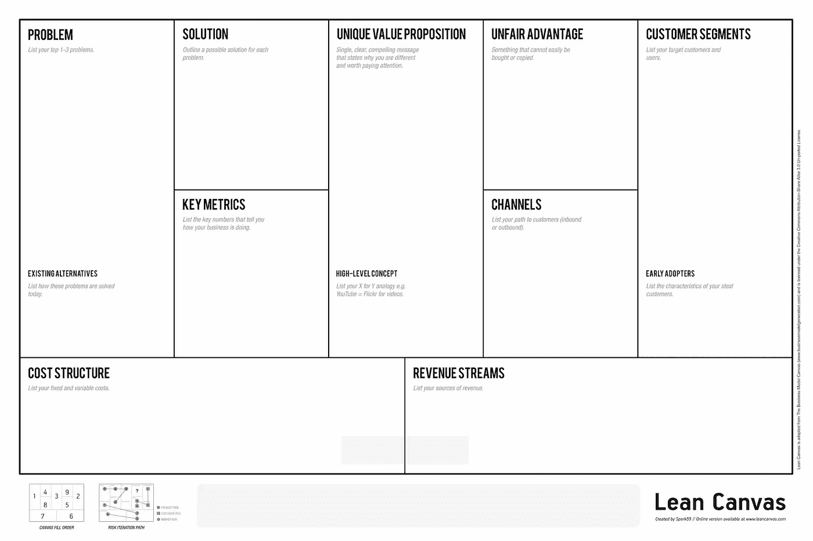

# 商业模式:走向虚拟化

> 原文：<https://medium.datadriveninvestor.com/business-models-going-virtual-5ae3eac1fe30?source=collection_archive---------11----------------------->

新冠肺炎疫情需要的不仅仅是思考业务连续性，而是让你的业务模式适应新的常态。

> 很难想象这个世界在这个疫情之后还会是什么样子—
> **大卫·纳巴罗博士，世卫组织特使**

Photo by [Kaleidico](https://unsplash.com/@kaleidico?utm_source=medium&utm_medium=referral) on [Unsplash](https://unsplash.com?utm_source=medium&utm_medium=referral)

我以前写过一些可以立即采取的措施，来解决关于日益孤立的令人震惊的消息以及对我们做生意能力的影响。这是一篇关于业务连续性的紧急“立即行动”文章([业务连续性:走向虚拟化](https://medium.com/datadriveninvestor/business-continuity-going-virtual-ba4fa23ec0fe))，其中我描述了一个 5 步恢复计划:

1.  找到合适的软件
2.  获得合适的硬件
3.  计划您的执行(针对新的在线渠道)
4.  以不同的方式做事
5.  新的机会出现了

业务连续性通常为短期危机提供了一种战术性应对措施。但是，如果危机持续时间更长，你需要在这种新的在线“虚拟”模式下运营更长时间，会发生什么呢？我们也许需要考虑第六步: ***让你的商业模式适应新常态*** 。

## 什么是商业模式？

商业模式是对你如何向客户传递价值以及如何赚钱的描述。想象你的商业模式(我将回到我们如何做这件事)允许你做出假设的改变，并理解它对你现在和将来的业务的影响。

简单地说，商业模式将帮助你探索 3 个要素:

*   您如何交付产品/服务
*   你如何销售你的产品/服务
*   你如何为你的产品/服务融资

看似简单的定义(因为业务模型很容易理解)只会因为对业务模型在整体业务架构或战略中的位置的误解而变得混乱，所以在我们继续之前，让我解释一下主要的区别。

## 业务模型不是业务架构！

简而言之，业务架构提供了业务如何运作的全面定义，它提供了能力、流程、组织设计、技术、基础设施、技能、领导力和文化等要素。

业务架构不是一件事，而是业务的不同视图的集合，这些视图共同提供了整个画面以及对不同元素之间关系的清晰理解。例如，组织设计和技术景观在总体业务架构中提供了两种视图。

业务模型只是业务架构的一个元素(或视图),缺少业务如何运作的细节，但提供了业务如何作为一个整体工作的高级视图。

## 商业模式不是战略！

商业战略是一个长期的行动计划，旨在实现一套特定的目标。它是由管理层定义的，提供了一套企业用来吸引客户、成功竞争、加强绩效和实现组织目标的竞争举措和行动。

如果我们将此与商业模式进行比较，战略确定了我们前进的方向*，而商业模式显示了我们如何*着手实施战略。**

**在我们的“走向虚拟化”目标中，您可能会发现自己处于这样一种情况:业务模式实际上不需要改变，但战略需要改变。举一个餐饮业的替代方案，他们大多以标准的商业模式运营，但可以通过瞄准特定类型的顾客来集中他们的战略(例如吸引素食顾客的格雷格)。**

## **标准商业模式**

**虽然商业模式中的细节对于每个组织来说都是独特的，但是已经存在许多“标准”方法，而且许多您可能已经听说过。**

*   **低成本(如航空公司)**
*   **订阅(如网飞)**
*   **现收现付(如电话)**
*   **租赁(如汽车)**
*   **免费增值(如游戏)**
*   **特许经营(如麦当劳)**

**你讨论的出发点是你的商业模式是否需要改变！可能你的模型保持不变，而且(按照上面的定义)你只是微调了策略和交付。**

**我的假设是，由于新冠肺炎·疫情强加给我们的前所未有的变革，你们的商业模式将会发生一些变化。大多数组织都面临着这样的情况:他们的模式不再有效，为了生存，他们需要改变。**

**对于一些行业来说，变化是巨大的，对于一些行业来说，转向在线服务交付是根本不可能的。酒店业不太可能找到一个虚拟的选择。说到这里，我已经看到了一些创造性的想法，一个会议(类似于动漫展)采用了在线形式。本文的出发点是假设在线服务交付是可行的。**

**改变商业模式不是一件容易的事，但如果你现有模式的经济学被疫情破坏了，那么你就需要彻底反思。**

**商业模式一直在变化，不仅仅是因为眼前的危机，所以这是一个你应该定期重温的练习。例如，最近的一个趋势是，越来越多的组织开始考虑采用订阅模式。**

## **将商业模式可视化(当前状态)**

**有两种非常相似的工具可以用来可视化你的商业模式，下面显示的一种叫做精益商业模式，摘自 Eric Ries 的书 [The Lean Startup](https://www.goodreads.com/book/show/10127019-the-lean-startup) 。这是基于同样有用的商业模式画布(BMC ),来自 Alexander Osterwalder 和 Yves Pigneur 的《商业模式的产生》一书[。](https://www.goodreads.com/book/show/7723797-business-model-generation)**

**这两种工具的主要区别在于，BMC 专注于成熟的业务，而精益画布是为解决问题和创业而设计的。我觉得精益画布为虚拟化的挑战提供了一个更好的模板，因为这是一个面临的新问题/机会，但这两者都是你的保留曲目中的好技术。**

**精益画布的九个部分一旦完成，就提供了你整个业务的视图(你的 ***当前状态*** )。第一次完成仍然具有挑战性，但是值得努力。**

**如果这是你第一次使用精益画布，只需与管理团队一起完成当前状态，就会引发问题并产生新的想法，记下它们，但要尽可能准确地捕捉你的当前状态:**

****

**The Lean Canvas Template**

## **走向虚拟化(未来状态)**

**开发一个未来状态的商业模式是一个测试不同假设的机会，这些假设是关于你的未来商业模式将如何变化的。你会完全消除现有模型中的一些元素吗？还是会简单的增加新的渠道？**

**使用像精益画布这样的可视化工具，你可以讨论任何改变的含义，并在投入太多的金钱、时间和精力进行实际改变之前验证你的想法。**

**进行这项练习还有助于降低业务变化带来的风险和不确定性。尤其是指标部分，让您清楚地了解如何监控所做更改的影响。**

**商业模式会给你提供一颗新的北极星；您的管理团队可以将其转化为交付路线图的行进方向。**

**以下是一些示例，说明您的业务模式可能需要如何通过转向增加虚拟工作来进行改变:**

****问题****

***本节定义了您希望解决的客户问题，以及您在这一领域最接近的竞争对手。***

**十有八九，客户问题在很大程度上与您当前的状态保持不变，但是，竞争格局将会非常不同，因为您现在面对的组织已经建立了自己的在线服务模式。**

**从已建立的业务中吸取的经验可以帮助你快速实现解决方案，但是你的客户现在将成为他们的雷达上成熟的选择，因为他们在在线媒体中表现出更多的经验。你是一条没有经验的新鱼，和鲨鱼一起游泳，时间是最重要的。**

**同样，疫情也给每个人带来了新问题，包括您的客户，了解新的客户问题将有助于您开发新的解决方案，并为您现有的客户群创造长期价值。**

****客户群****

***这部分定义了你的目标受众，你希望在这里尽可能详细，这样你就可以定制你的沟通渠道。***

**你有一个现有的受众，保护他们并确保你作为一个企业的持续生存能力是你的基本出发点。**

**一旦你有了吸引力，你将拥有以前可能会限制你的市场渗透的新能力，现在将允许你扩大你的产品。首先，现在对实际交付地点的限制更少了，这为获得新客户打开了大门。**

**事实上，你的业务是以面对面的方式开始的，这提供了比纯互联网组织更高的可信度，你能利用通过不同媒体交付的能力，或者提供一种混合选择，这对于专注于单一交付渠道的业务来说是不可能的吗？**

****独特的价值主张****

***这一部分定义了你与众不同的地方，是什么高层次的概念让你在市场中脱颖而出？***

**完成这一部分可能极具挑战性，您在为您的当前状态定义这一部分方面做得如何？你目前状态下的一切应该仍然是真实的，你毕竟是同一个人，只是在适应通过疫情强制进行的社会分离的需要。**

** [## 跑步摆脱疯狂:锻炼如何提高你的生产力|数据驱动的投资者

### 没有比锻炼更好的方式来开始一天的工作了。我试着一周至少做四天，在…

www.datadriveninvestor.com](https://www.datadriveninvestor.com/2018/10/23/running-to-get-rid-of-the-crazy-how-working-out-increases-your-productivity/) 

您正在对您的业务模式进行变革，旨在利用新的在线/虚拟受众，用几句话阐明您计划如何使您的服务与众不同(这被称为高层次概念)。

如果你仍然觉得这一部分特别麻烦，重新审视你的公司愿景、使命和价值观，以帮助阐明你的企业的独特之处。问问你自己，你是在销售一种商品(最便宜的产品)还是在销售你的业务中的知识、经验和技能。

**解决方案**

*本节定义了您的客户将获得的体验。*

你的客户的体验将会改变，但是他们也需要在这种情况下改变，这样他们才会愿意与你合作。长期抵制数字化趋势的行业现在发现自己被迫陷入一种境地，需要适应和采用新的工作方式。

将服务转移到网上可能会提供前所未有的灵活性，当差旅和生活成本不再是一个因素时，更短或定期的定期服务可能会变得更具成本效益。订阅模式可能是一种全新的销售服务方式，以前从未考虑过。

提供临时服务的第三方零工经济正在蓬勃发展，这可能为销售服务或采购资源提供新的渠道，以满足可变(或激增)的需求。BMC 包含一个“关键伙伴关系”的部分，如果你的模型开始探索这一新的途径，它可能是值得的。

**频道**

*这部分定义了与目标受众的沟通渠道。*

这一部分可能变化最大，如果你还没有通过这一途径提供产品和服务，可能会取代现有渠道或引入新的在线渠道。

你说的“在线”或“虚拟”是什么意思？这是一个非常具体的时间，你如何到达你的市场(广告)和你的客户(交货)。

在我以前的文章[业务连续性:走向虚拟](https://medium.com/datadriveninvestor/business-continuity-going-virtual-ba4fa23ec0fe)中，我简化了讨论，主要集中在单一交付媒介(在线会议解决方案)上，但是还有许多其他的要考虑。需要根据您的客户群进行一些研究，以帮助确定哪些渠道是最好的，尤其是在服务推广方面。这里举不胜举，但是脸书商务、YouTube、LinkedIn 都可以为你的客户提供途径。

有潜在的现有平台，将有助于您的在线服务的交付。培训是一种普遍的需求，像 Coursera 和 Udemy 这样的平台可以提供一种更快捷的方式来创建你的虚拟店面。

如果你是从现实世界的店面走出来，那么亚马逊、易趣和许多其他公司提供了一个市场，你可以通过这个市场销售产品。

你不是一家初创公司，所以不要错过询问现有客户定期使用哪些渠道的明显机会。

**收入流**

*这部分定义了你的预期收入。*

如果现有渠道受到限制(或完全关闭)，那么您的收入就面临风险，识别新的收入来源是整个练习的目的。

我们很快就会看到成本模型是如何变化的，但对于客户来说，他们会认为您的运营成本会更低，因此您的价格也会相应降低。你独特的价值主张将决定他们是否正确。

如果我们假设你的收入(每单位)确实因为运营成本的降低而转移到网上而减少，那也不全是坏消息。参与购买你的服务的人数可能会增加(例如，在培训或指导的情况下)。

录制在线会话也很容易，这可能提供了通过视频点播平台打包内容进行转售的机会。

总是重新审视你现在由于转向网络而面临的新风险。花时间制定风险发生的计划(应急计划)或制定风险发生时减少影响的方法(减轻)。这是一个潜在的更不稳定的环境，你可能没有选择，但你可以做好准备。

**成本结构**

*这部分定义了你的预期成本，包括固定成本(管理费用)和可变成本。*

虽然会引入新的成本(基础设施、软件等)，但其他成本会减少(差旅费、房租、生活费等)，因此全面重新评估您的成本结构是一个重要因素。

在线交付空间中也有大量经验丰富的资源可供使用，这将提供获取熟练资源的替代途径，提供增加可变费用以满足需求的选项。

转向在线交付对您的采购成本有何影响？他们是否需要增加以建立新的在线渠道或提醒现有客户您的服务仍在运行。如果你目前的状态已经被证明是一个成功的工作管道，那么在降低采购成本时要小心。

**指标**

*本节定义了及时跟踪进度所需的重要测量。*

至此，你会意识到时间是至关重要的。在很多方面，这篇文章来的有点晚。确定一些关键的衡量标准，使你能够确定你的期望是否得到满足，提供可操作的洞察力，并提供早期预警，这是至关重要的。本质上，您需要快速测试您的解决方案是否有效。

**不公平优势**

*你的客户很难复制什么？*

毫无疑问，您现有的客户关系、商业信誉和数据是让您在竞争中暂时领先的因素，请确保您快速充分利用这三者。** 

**调整您的业务模式可能具有挑战性，但有了一个燃烧的平台来激励您，精益画布提供了一种易于理解的技术来评估选项，同意新的方法并向您的团队传达变化。**

**在外面保持安全，
抢**

****

**Rob King, Change Leader, Author, Consultant and Conference Moderator**